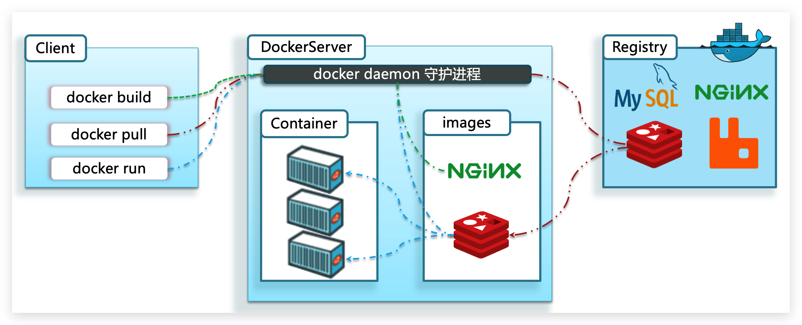
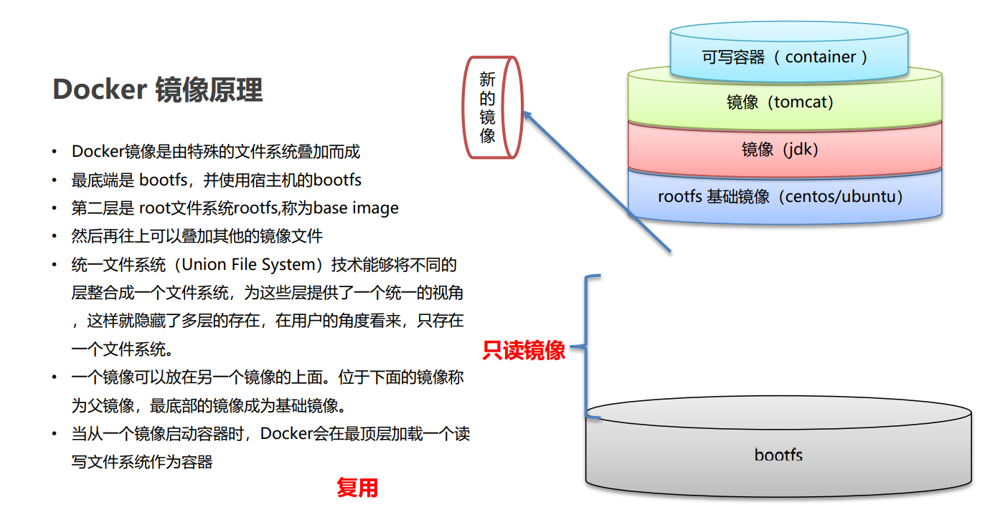
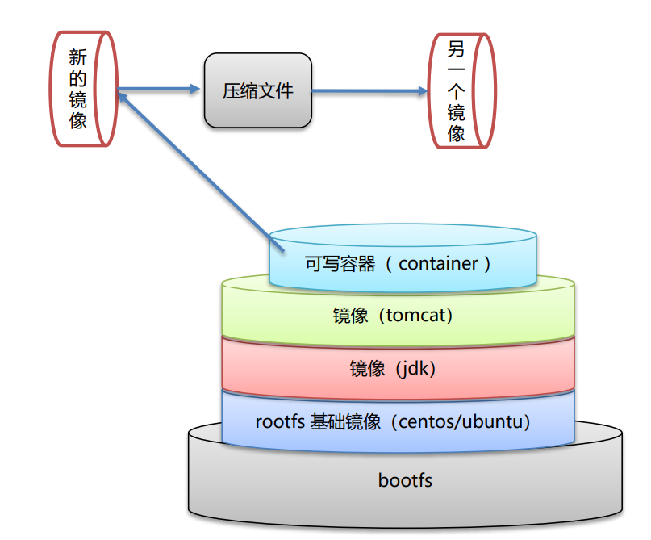

## Docker备忘录


## Docker的介绍


### 什么是Docker

微服务虽然具备各种各样的优势，但服务的拆分通用给部署带来了很大的麻烦。

- 分布式系统中，依赖的组件非常多，不同组件之间部署时往往会产生一些冲突。
- 在数百上千台服务中重复部署，环境不一定一致，会遇到各种问题


### 应用部署的环境问题

大型项目组件较多，运行环境也较为复杂，部署时会碰到一些问题：

- 依赖关系复杂，容易出现兼容性问题

- 开发、测试、生产环境有差异


### Docker解决依赖兼容问题

而Docker确巧妙的解决了这些问题，Docker是如何实现的呢？

Docker为了解决依赖的兼容问题的，采用了两个手段：

- 将应用的Libs（函数库）、Deps（依赖）、配置与应用一起打包

- 将每个应用放到一个隔离**容器**去运行，避免互相干扰


这样打包好的应用包中，既包含应用本身，也保护应用所需要的Libs、Deps，无需再操作系统上安装这些，自然就不存在不同应用之间的兼容问题了。

虽然解决了不同应用的兼容问题，但是开发、测试等环境会存在差异，操作系统版本也会有差异，怎么解决这些问题呢？


### Docker解决操作系统环境差异

要解决不同操作系统环境差异问题，必须先了解操作系统结构。以一个Ubuntu操作系统为例，结构如下：


结构包括：

- 计算机硬件：例如CPU、内存、磁盘等
- 系统内核：所有Linux发行版的内核都是Linux，例如CentOS、Ubuntu、Fedora等。内核可以与计算机硬件交互，对外提供**内核指令**，用于操作计算机硬件。
- 系统应用：操作系统本身提供的应用、函数库。这些函数库是对内核指令的封装，使用更加方便。

应用于计算机交互的流程如下：

1）应用调用操作系统应用（函数库），实现各种功能

2）系统函数库是对内核指令集的封装，会调用内核指令

3）内核指令操作计算机硬件

Ubuntu和CentOSpringBoot都是基于Linux内核，无非是系统应用不同，提供的函数库有差异：


此时，如果将一个Ubuntu版本的MySQL应用安装到CentOS系统，MySQL在调用Ubuntu函数库时，会发现找不到或者不匹配，就会报错了：


Docker如何解决不同系统环境的问题？

- Docker将用户程序与所需要调用的系统(比如Ubuntu)函数库一起打包
- Docker运行到不同操作系统时，直接基于打包的函数库，借助于操作系统的Linux内核来运行

如图：


---


### Docker和虚拟机的区别

Docker可以让一个应用在任何操作系统中非常方便的运行。而以前我们接触的虚拟机，也能在一个操作系统中，运行另外一个操作系统，保护系统中的任何应用。


两者有什么差异呢？


**虚拟机**（virtual machine）是在操作系统中**模拟**硬件设备，然后运行另一个操作系统，比如在 Windows 系统里面运行 Ubuntu 系统，这样就可以运行任意的Ubuntu应用了。

**Docker**仅仅是封装函数库，并没有模拟完整的操作系统，如图：


对比来看：


---

### 小结

Docker如何解决大型项目依赖关系复杂，不同组件依赖的兼容性问题？

- Docker允许开发中将应用、依赖、函数库、配置一起**打包**，形成可移植镜像
- Docker应用运行在容器中，使用沙箱机制，相互**隔离**


Docker如何解决开发、测试、生产环境有差异的问题？

- Docker镜像中包含完整运行环境，包括系统函数库，仅依赖系统的Linux内核，因此可以在任意Linux操作系统上运行


Docker是一个快速交付应用、运行应用的技术，具备下列优势：

- 可以将程序及其依赖、运行环境一起打包为一个镜像，可以迁移到任意Linux操作系统
- 运行时利用沙箱机制形成隔离容器，各个应用互不干扰
- 启动、移除都可以通过一行命令完成，方便快捷


Docker和虚拟机的差异：

- docker是一个系统进程；虚拟机是在操作系统中的操作系统

- docker体积小、启动速度快、性能好；虚拟机体积大、启动速度慢、性能一般


---


## Docker的架构


### Docker中有几个重要的概念：

| 名词 | 解释 |
| :--: | :--: |
| Docker 镜像(Images)    | Docker 镜像是用于创建 Docker 容器的模板，比如 Ubuntu 系统。  |
| Docker 容器(Container) | 容器是独立运行的一个或一组应用，是镜像运行时的实体。         |
| Docker 客户端(Client)  | Docker 客户端通过命令行或者其他工具使用 Docker SDK 与 Docker 的守护进程通信。 |
| Docker 主机(Host)      | 一个物理或者虚拟的机器用于执行 Docker 守护进程和容器。       |
| Docker Registry        | Docker 仓库用来保存镜像，可以理解为代码控制中的代码仓库。 |
| Docker Machine         | Docker Machine是一个简化Docker安装的命令行工具，通过一个简单的命令行即可在相应的平台上安装Docker，比如VirtualBox、 Digital Ocean、Microsoft Azure。 |

**镜像（Image）**：

Docker将应用程序及其所需的依赖、函数库、环境、配置等文件打包在一起，称为镜像。


**容器（Container）**：

镜像中的应用程序运行后形成的进程就是**容器**，只是Docker会给容器进程做隔离，对外不可见。


一切应用最终都是代码组成，都是硬盘中的一个个的字节形成的**文件**。只有运行时，才会加载到内存，形成进程。

而**镜像**，就是把一个应用在硬盘上的文件、及其运行环境、部分系统函数库文件一起打包形成的文件包。这个文件包是只读的。

**容器**呢，就是将这些文件中编写的程序、函数加载到内存中允许，形成进程，只不过要隔离起来。因此一个镜像可以启动多次，形成多个容器进程。


---

### DockerHub

开源应用程序非常多，打包这些应用往往是重复的劳动。为了避免这些重复劳动，人们就会将自己打包的应用镜像，例如Redis、MySQL镜像放到网络上，共享使用，就像GitHub的代码共享一样。

- DockerHub：DockerHub是一个官方的Docker镜像的托管平台。这样的平台称为Docker Registry。

- 国内也有类似于DockerHub 的公开服务，比如 [网易云镜像服务](https://c.163yun.com/hub)、[阿里云镜像库](https://cr.console.aliyun.com/)等。


我们一方面可以将自己的镜像共享到DockerHub，另一方面也可以从DockerHub拉取镜像：


---

### Docker架构

我们要使用Docker来操作镜像、容器，就必须要安装Docker。

Docker是一个CS架构的程序，由两部分组成：

- 服务端(server)：Docker守护进程，负责处理Docker指令，管理镜像、容器等

- 客户端(client)：通过命令或RestAPI向Docker服务端发送指令。可以在本地或远程向服务端发送指令。

如图：




## Docker的安装

企业部署一般都是采用Linux操作系统，而其中又数CentOS发行版占比最多，因此我们在CentOS下安装Docker。参考课前资料中的文档：


### 安装

[Ubuntu Docker 安装](https://www.runoob.com/docker/ubuntu-docker-install.html)

[CentOS Docker 安装](https://www.runoob.com/docker/centos-docker-install.html)

[Debian Docker 安装](https://www.runoob.com/docker/debian-docker-install.html)

[Windows Docker 安装](https://www.runoob.com/docker/windows-docker-install.html)

[MacOS Docker 安装](https://www.runoob.com/docker/macos-docker-install.html)


---

### 镜像加速

[Docker 镜像加速](https://www.runoob.com/docker/docker-mirror-acceleration.html)

[阿里云](https://cr.console.aliyun.com/cn-hangzhou/instances/mirrors)

```bash
sudo mkdir -p /etc/docker
sudo tee /etc/docker/daemon.json <<-'EOF'
{
  "registry-mirrors": ["https://xxxxxxxx.mirror.aliyuncs.com"]
}
EOF
sudo systemctl daemon-reload
sudo systemctl restart docker
```


## Docker的命令


### 镜像名称

首先来看下镜像的名称组成：

- 镜名称一般分两部分组成：[repository]:[tag]。
- 在没有指定tag时，默认是latest，代表最新版本的镜像


这里的mysql就是repository，5.7就是tag，合一起就是镜像名称，代表5.7版本的MySQL镜像。


### 镜像命令

```bash
docker images  # 查看镜像

docker search 镜像关键字  # 查询中央仓库以redis这个关键字的镜像

docker pull 镜像名:版本号 # 安装这个版本的镜像 如果不写 :版本号 默认是latest
# 在仓库中查找 https://hub.docker.com/

docker rmi 镜像/id   # 删除镜像
docker images -q     # 查询所有镜像的id
docker rmi `docker images -q` # 删除所有镜像
```

首先去镜像仓库搜索nginx镜像


### 容器命令

```bash
# 查看当前运行的容器
docker ps
# 查看所有容器
docker ps -a
# 删除容器 启动中的容器无法删除
docker rm 容器名/id
# 删除所有容器 启动中的容器无法删除
docker rm `docker ps -q`

# 创建容器 方式一
docker run -it --name=容器名称 镜像名称 进入实例的初始化指令
docker run -it --name=c1 contos:7 /bin/bash

# 创建容器 方式二
docker run -id --name=容器名称 镜像名称 进入实例的初始化指令
docker run -id --name=c1 contos:7 /bin/bash

# 启动 关闭 重启 直接kill
docker start 容器名/id
docker stop  容器名/id
docker restart 容器名/id
docker kill 容器名/id

# 进入容器 前提是要保证这个容器是开启状态
docker exec -it 容器名/id 进入实例的初始化指令
docker exec -it c1 /bin/bash
```


### 数据卷命令

**数据卷（volume）**是一个虚拟目录，指向宿主机文件系统中的某个目录。

```bash
# 挂载一个数据卷
docker run -it --name c1 -v /root/data1:/root/data_doc centos:7 /bin/bash

# 挂载多个数据卷
docker run -it --name c2 \
-v /root/data1:/root/data_doc1 \
-v /root/data2:/root/data_doc2 \
centos:7 /bin/bash

# 将一个数据卷挂载到多个容器
docker run -it --name c3 -v /root/datas:/root/data_doc centos:7 /bin/bash
docker run -it --name c4 -v /root/datas:/root/data_doc centos:7 /bin/bash
```


数据卷容器

```bash
# 创建数据卷容器
docker run -it --name c3 -v /volume centos:7 /bin/bash
 
# 将c1 绑定到 c3数据卷容器
docker run -it --name c1 --volumes-from c3 centos:7 /bin/bash
# 将c2 绑定到 c3数据卷容器
docker run -it --name c2 --volumes-from c3 centos:7 /bin/bash
```


---

### 应用部署


## Docker应用部署


**那么来尝试用Docker来部署几个应用吧**

### 一、部署MySQL

1. 搜索mysql镜像

```shell
docker search mysql
```

2. 拉取mysql镜像

```shell
docker pull mysql:5.6
```

3. 创建容器，设置端口映射、目录映射

```shell
# 在/root目录下创建mysql目录用于存储mysql数据信息
mkdir ~/mysql
cd ~/mysql
```

```shell
docker run -id \
-p 3307:3306 \
--name=c_mysql \
-v $PWD/conf:/etc/mysql/conf.d \
-v $PWD/logs:/logs \
-v $PWD/data:/var/lib/mysql \
-e MYSQL_ROOT_PASSWORD=123456 \
mysql:5.6
```

- 参数说明：
  - **-p 3307:3306**：将容器的 3306 端口映射到宿主机的 3307 端口。
  - **-v $PWD/conf:/etc/mysql/conf.d**：将主机当前目录下的 conf/my.cnf 挂载到容器的 /etc/mysql/my.cnf。配置目录
  - **-v $PWD/logs:/logs**：将主机当前目录下的 logs 目录挂载到容器的 /logs。日志目录
  - **-v $PWD/data:/var/lib/mysql** ：将主机当前目录下的data目录挂载到容器的 /var/lib/mysql 。数据目录
  - **-e MYSQL_ROOT_PASSWORD=123456：**初始化 root 用户的密码。


4. 进入容器，操作mysql

```shell
docker exec –it c_mysql /bin/bash
```

5. 使用外部机器连接容器中的mysql


### 二、部署Tomcat

1. 搜索tomcat镜像

```shell
docker search tomcat
```

2. 拉取tomcat镜像

```shell
docker pull tomcat
```

3. 创建容器，设置端口映射、目录映射·

```shell
# 在/root目录下创建tomcat目录用于存储tomcat数据信息
mkdir ~/tomcat
cd ~/tomcat
```

```shell
docker run -id --name=c_tomcat \
-p 8080:8080 \
-v $PWD:/usr/local/tomcat/webapps \
tomcat 
```

- 参数说明：
  - **-p 8080:8080：**将容器的8080端口映射到主机的8080端口
  
    **-v $PWD:/usr/local/tomcat/webapps：**将主机中当前目录挂载到容器的webapps


4. 使用外部机器访问tomcat


### 三、部署Nginx

1. 搜索nginx镜像

```shell
docker search nginx
```

2. 拉取nginx镜像

```shell
docker pull nginx
```

3. 创建容器，设置端口映射、目录映射


```shell
# 在/root目录下创建nginx目录用于存储nginx数据信息
mkdir ~/nginx
cd ~/nginx
mkdir conf
cd conf
# 在~/nginx/conf/下创建nginx.conf文件,粘贴下面内容
vim nginx.conf
```
```shell

user  nginx;
worker_processes  1;

error_log  /var/log/nginx/error.log warn;
pid        /var/run/nginx.pid;


events {
    worker_connections  1024;
}


http {
    include       /etc/nginx/mime.types;
    default_type  application/octet-stream;

    log_format  main  '$remote_addr - $remote_user [$time_local] "$request" '
                      '$status $body_bytes_sent "$http_referer" '
                      '"$http_user_agent" "$http_x_forwarded_for"';

    access_log  /var/log/nginx/access.log  main;

    sendfile        on;
    #tcp_nopush     on;

    keepalive_timeout  65;

    #gzip  on;

    include /etc/nginx/conf.d/*.conf;
}

```


```shell
docker run -id --name=c_nginx \
-p 80:80 \
-v $PWD/conf/nginx.conf:/etc/nginx/nginx.conf \
-v $PWD/logs:/var/log/nginx \
-v $PWD/html:/usr/share/nginx/html \
nginx
```

- 参数说明：
  - **-p 80:80**：将容器的 80端口映射到宿主机的 80 端口。
  - **-v $PWD/conf/nginx.conf:/etc/nginx/nginx.conf**：将主机当前目录下的 /conf/nginx.conf 挂载到容器的 :/etc/nginx/nginx.conf。配置目录
  - **-v $PWD/logs:/var/log/nginx**：将主机当前目录下的 logs 目录挂载到容器的/var/log/nginx。日志目录

4. 使用外部机器访问nginx


### 四、部署Redis

1. 搜索redis镜像

```shell
docker search redis
```

2. 拉取redis镜像

```shell
docker pull redis:5.0
```

3. 创建容器，设置端口映射

```shell
docker run -id --name=c_redis -p 6379:6379 redis:5.0
```

4. 使用外部机器连接redis

```shell
./redis-cli.exe -h 192.168.149.135 -p 6379
```


```dockerfile
docker run -id --name=redis_7003 \
-p 7003:6379 \
-v /root/redis-data/7003/redis.conf:/etc/redis/redis.conf \
-v /root/redis-data/7003/data:/data \
redis \
--requirepass "gangajiang521" \
--appendonly yes 
```


## Docker镜像


### Docker镜像原理

如图





### 镜像制作


**方式一：通过解压缩**




```bash
# 通过容器 生成 镜像文件
docker commit 容器id 镜像名称:版本号
# 压缩指定镜像文件
docker save -o 压缩文件名称 镜像名称:版本号
# 解压缩镜像文件压缩包 添加到images当中
docker load –i 压缩文件名称
```


**方式二：dockerfile文件**

Dockerfile 概念 

- Dockerfile 是一个文本文件
- 包含了一条条的指令
- 每一条指令构建一层，基于基础镜像，最终构建出一个新的镜像
- 对于开发人员：可以为开发团队提供一个完全一致的开发环境 
- 对于测试人员：可以直接拿开发时所构建的镜像或者通过Dockerfile文件 构建一个新的镜像开始工作了 
- 对于运维人员：在部署时，可以实现应用的无缝移植


```dockerfile
FROM scratch
COPY hello /
CMD ["/hello"]
```


<hr>


### Dockerfile关键字


| 关键字      | 作用                     | 备注                                                         |
| ----------- | ------------------------ | ------------------------------------------------------------ |
| FROM        | 指定父镜像               | 指定dockerfile基于那个image构建                              |
| MAINTAINER  | 作者信息                 | 用来标明这个dockerfile谁写的                                 |
| LABEL       | 标签                     | 用来标明dockerfile的标签 可以使用Label代替Maintainer 最终都是在docker image基本信息中可以查看 |
| RUN         | 执行命令                 | 执行一段命令 默认是/bin/sh 格式: RUN command 或者 RUN ["command" , "param1","param2"] |
| CMD         | 容器启动命令             | 提供启动容器时候的默认命令 和ENTRYPOINT配合使用.格式 CMD command param1 param2 或者 CMD ["command" , "param1","param2"] |
| ENTRYPOINT  | 入口                     | 一般在制作一些执行就关闭的容器中会使用                       |
| COPY        | 复制文件                 | build的时候复制文件到image中                                 |
| ADD         | 添加文件                 | build的时候添加文件到image中 不仅仅局限于当前build上下文 可以来源于远程服务 |
| ENV         | 环境变量                 | 指定build时候的环境变量 可以在启动的容器的时候 通过-e覆盖 格式ENV name=value |
| ARG         | 构建参数                 | 构建参数 只在构建的时候使用的参数 如果有ENV 那么ENV的相同名字的值始终覆盖arg的参数 |
| VOLUME      | 定义外部可以挂载的数据卷 | 指定build的image那些目录可以启动的时候挂载到文件系统中 启动容器的时候使用 -v 绑定 格式 VOLUME ["目录"] |
| EXPOSE      | 暴露端口                 | 定义容器运行的时候监听的端口 启动容器的使用-p来绑定暴露端口 格式: EXPOSE 8080 或者 EXPOSE 8080/udp |
| WORKDIR     | 工作目录                 | 指定容器内部的工作目录 如果没有创建则自动创建 如果指定/ 使用的是绝对地址 如果不是/开头那么是在上一条workdir的路径的相对路径 |
| USER        | 指定执行用户             | 指定build或者启动的时候 用户 在RUN CMD ENTRYPONT执行的时候的用户 |
| HEALTHCHECK | 健康检查                 | 指定监测当前容器的健康监测的命令 基本上没用 因为很多时候 应用本身有健康监测机制 |
| ONBUILD     | 触发器                   | 当存在ONBUILD关键字的镜像作为基础镜像的时候 当执行FROM完成之后 会执行 ONBUILD的命令 但是不影响当前镜像 用处也不怎么大 |
| STOPSIGNAL  | 发送信号量到宿主机       | 该STOPSIGNAL指令设置将发送到容器的系统调用信号以退出。       |
| SHELL       | 指定执行脚本的shell      | 指定RUN CMD ENTRYPOINT 执行命令的时候 使用的shell            |

---


### 简单的案例


**案例1：**

---

>**需求 案例：**
>
>1. 默认登录路径为 /usr
>2. 可以使用vim
>
>**实现步骤 **
>
>① 定义父镜像：FROM centos:7
>
>② 定义作者信息：MAINTAINER itheima  
>
>③ 执行安装vim命令： RUN yum install -y vim 
>
>④ 定义默认的工作目录：WORKDIR /usr 
>
>⑤ 定义容器启动执行的命令：CMD /bin/bash 
>
>⑥ 通过dockerfile构建镜像：docker bulid –f dockerfile文件路径 –t 镜像名称:版本 自定义centos7镜像。
>
>---


dockerfile

```dockerfile
FROM centos:7
MAINTAINER ganga ganga<2282514478@qq.com>
RUN yum install -y vim
WORKDIR /usr/
CMD /bin/bash
```

build

```bash
docker build -f ./centos_dockerfile -t mycentos .
```


**案例2：**

>---
>
>**需求**
>
>​	**定义dockerfile，发布springboot项目**
>
>---
>
>**实现步骤 **
>
>① 定义父镜像：FROM java:8 
>
>② 定义作者信息：MAINTAINER itheima  
>
>③ 将jar包添加到容器： ADD springboot.jar app.jar 
>
>④ 定义容器启动执行的命令：CMD java–jar app.jar 
>
>⑤ 通过dockerfile构建镜像：docker bulid –f dockerfile文件路径 –t 镜像名称:版本
>


dockerfile
```dockerfile
FROM java:8
MAINTAINER ganga ganga<2282514478@qq.com>
ADD SpringBoot-Docker-0.0.1.jar bootapp.jar
CMD java -jar bootapp.jar
```

构建镜像

```bash
docker build -f ./springboot_dockerfile -t bootapp:1.0 .
```


## 服务编排


**微服务架构的应用系统中一般包含若干个微服务，每个微服务一般都会部署多个实例，如果每个微服务都要手动启停，维护的工作量会很大。 **

- 要从Dockerfile build image 或者去dockerhub拉取image
- 要创建多个container • 要管理这些container（启动停止删除） 


服务编排： **按照一定的业务规则批量管理容器**

---


### DockerCompose介绍


### DokcerCompose安装与卸载

一、安装Docker Compose

```shell
# Compose目前已经完全支持Linux、Mac OS和Windows，在我们安装Compose之前，需要先安装Docker。下面我 们以编译好的二进制包方式安装在Linux系统中。 
curl -L https://github.com/docker/compose/releases/download/1.22.0/docker-compose-`uname -s`-`uname -m` -o /usr/local/bin/docker-compose
# 设置文件可执行权限 
chmod +x /usr/local/bin/docker-compose
# 查看版本信息 
docker-compose -version
```

二、卸载Docker Compose

```shell
# 二进制包方式安装的，删除二进制文件即可
rm /usr/local/bin/docker-compose
```


---


###  编排案例


**使用`docker compose`编排`nginx+springboot`项目**


1. 创建`docker-compose`目录

```shell
mkdir ~/docker-compose
cd ~/docker-compose
```

2. 编写`docker-compose.yml`文件

```yaml
version: '3' # 版本号
services:	 # 服务
  nginx:
   image: nginx
   ports:
    - 80:80
   links:
    - bootapp
   volumes:
    - ./nginx/conf.d:/etc/nginx/conf.d
  bootapp:
    image: bootapp:1.0
    expose:
      - "8080"
```

3. 创建`./nginx/conf.d`目录

```shell
mkdir -p ./nginx/conf.d
```

4. 在`./nginx/conf.d`目录下 编写`helloapp.conf`文件

```json
server {
    listen 80;
    access_log off;

    location / {
        proxy_pass http://bootapp:8080;
    }
   
}
```

5. 在`~/docker-compose`目录下 使用`docker-compose`启动容器

```shell
docker-compose up
```

6. 测试访问

```shell
http://192.168.149.135/hello
```


## 私有仓库


### 私有仓库搭建

```shell
# 1、拉取私有仓库镜像 
docker pull registry
# 2、启动私有仓库容器 
docker run -id --name=registry -p 5000:5000 registry
# 3、打开浏览器 输入地址http://私有仓库服务器ip:5000/v2/_catalog，看到{"repositories":[]} 表示私有仓库 搭建成功
# 4、修改daemon.json   
vim /etc/docker/daemon.json    
# 在上述文件中添加一个key，保存退出。此步用于让 docker 信任私有仓库地址；注意将私有仓库服务器ip修改为自己私有仓库服务器真实ip 
{"insecure-registries":["私有仓库服务器ip:5000"]} 
# 5、重启docker 服务 
systemctl restart docker
docker start registry

```

### 将镜像上传至私有仓库

```shell
# 1、标记镜像为私有仓库的镜像     
docker tag centos:7 私有仓库服务器IP:5000/centos:7
 
# 2、上传标记的镜像     
docker push 私有仓库服务器IP:5000/centos:7
```


### 从私有仓库拉取镜像

```shell
#拉取镜像 
docker pull 私有仓库服务器ip:5000/centos:7
```


