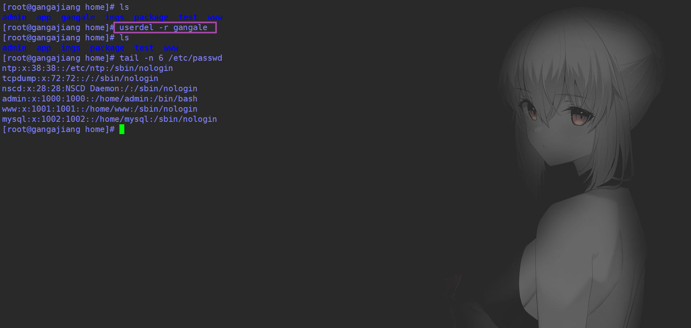

# 我的Linux学习笔记


## 目录结构

<font color="#c95863">**以下是对这些目录的解释：**</font>

-  <font color="#c95863">**/bin**</font>： bin是Binary的缩写, 这个目录存放着最经常使用的命令。

- <font color="#c95863">**/boot**</font>： 这里存放的是启动Linux时使用的一些核心文件，包括一些连接文件以及镜像文件。
- /dev ： dev是Device(设备)的缩写, 存放的是Linux的外部设备，在Linux中访问设备的方式和访问 文件的方式是相同的。
- <font color="#f7bc74">**/etc**</font>： 这个目录用来存放所有的系统管理所需要的配置文件和子目录。 
- <font color="#f7bc74">**/home**</font>：用户的主目录，在Linux中，每个用户都有一个自己的目录，一般该目录名是以用户的账 号命名的。 
- <font color="#c95863">**/lib**</font>： 这个目录里存放着系统最基本的动态连接共享库，其作用类似于Windows里的DLL文件。 
- /lost+found： 这个目录一般情况下是空的，当系统非法关机后，这里就存放了一些文件。 
- /media：linux系统会自动识别一些设备，例如U盘、光驱等等，当识别后，linux会把识别的设备 挂载到这个目录下。 
- /mnt：系统提供该目录是为了让用户临时挂载别的文件系统的，我们可以将光驱挂载在/mnt/上， 然后进入该目录就可以查看光驱里的内容了。 
- <font color="#f7bc74">**/opt**</font>：这是给主机额外安装软件所摆放的目录。比如你安装一个ORACLE数据库则就可以放到这个 目录下。默认是空的。 
- /proc： 这个目录是一个虚拟的目录，它是系统内存的映射，我们可以通过直接访问这个目录来获 取系统信息。 
- <font color="#c95863">**/root**</font>：该目录为系统管理员，也称作超级权限者的用户主目录。 
- /sbin：s就是Super User的意思，这里存放的是系统管理员使用的系统管理程序。 
- /srv：该目录存放一些服务启动之后需要提取的数据。 
- /sys：这是linux2.6内核的一个很大的变化。该目录下安装了2.6内核中新出现的一个文件系统 sysfs 。 
- <font color="#f7bc74">**/tmp**</font>：这个目录是用来存放一些临时文件的。 
- <font color="#f7bc74">**/us/usr**</font>rr：这是一个非常重要的目录，用户的很多应用程序和文件都放在这个目录下，类似于windows 下的program files目录。 
- <font color="#f7bc74">**/usr/bin**</font>： 系统用户使用的应用程序。 
- <font color="#f7bc74">**/usr/sbin**</font>： 超级用户使用的比较高级的管理程序和系统守护程序。 
- <font color="#f7bc74">**/usr/src**</font>： 内核源代码默认的放置目录。 
- /var：这个目录中存放着在不断扩充着的东西，我们习惯将那些经常被修改的目录放在这个目录 下。包括各种日志文件。 
- /run：是一个临时文件系统，存储系统启动以来的信息。当系统重启时，这个目录下的文件应该被 删掉或清除。


## 文件的属性


在Linux中第一个字符代表这个文件是目录、文件或链接文件等等： 

- 当为[ d ]则是目录 
- 当为[ - ]则是文件； 
- 若是[ l ]则表示为链接文档 ( link file )； 
- 若是[ b ]则表示为装置文件里面的可供储存的接口设备 ( 可随机存取装置 )； 
- 若是[ c ]则表示为装置文件里面的串行端口设备，例如键盘、鼠标 ( 一次性读取装置 )。

接下来的字符中，以三个为一组，且均为『rwx』 的三个参数的组合。 其中，

- [ r ]代表可读(read)
- [ w ]代表可写(write)
- [ x ]代表可执行(execute)


> 修改文件属性

1. **chgrp**: 更改文件属组

```bash
[root@iZu1zawt6ko6ujZ test]# chgrp -R root ganga
```


2. **chown**: ：更改文件属主，也可以同时更改文件属组

```bash
chown [–R] 属主名 文件名
# chown -R www ganga

chown [-R] 属主名：属组名 文件名
# chown -R root:root ganga
```


3. **chmod**：更改文件9个属性

```bash
chmod -R 751 touch.txt 

r: 4 
w: 2
x: 1

rwx: 4+2+1=7
...
```


---

---


## 文件内容查看

Linux系统中使用以下命令来查看文件的内容： 

- cat 由第一行开始显示文件内容 
  - 选项与参数： **AbEnTv**
  - -A ：相当於 -vET 的整合选项，可列出一些特殊字符而不是空白而已； 
  - -b ：列出行号，仅针对非空=白行做行号显示，空白行不标行号！ 
  - -E ：将结尾的断行字节 $ 显示出来； 
  - -n ：列印出行号，连同空白行也会有行号，与 -b 的选项不同； 
  - -T ：将 [tab] 按键以 ^I 显示出来； 
  - -v ：列出一些看不出来的特殊字符
- tac 从最后一行开始显示，可以看出 tac 是 cat 的倒著写！ 
- nl 显示的时候，顺道输出行号！ 
- more 一页一页的显示文件内容 
- less 与 more 类似，但是比 more 更好的是，他可以往前翻页！ 
  - q 退出
  - ↑  或  y 向上
  - ↓  或 enter 向下
  - 空格  下一页
  - /字串 ：向下搜寻『字串』的功能； 
  - ?字串 ：向上搜寻『字串』的功能； 
  - n ：重复前一个搜寻 (与 / 或 ? 有关！) 
  - N ：反向的重复前一个搜寻 (与 / 或 ? 有关！) 
- head 只看头几行 
  - -n 后面接数字，代表显示几行的意思！
- tail 只看尾巴几行
  - -n ：后面接数字，代表显示几行的意思


---

---


## 常用命令

**绝对路径：** 

路径的写法，由根目录 / 写起，例如： /usr/share/doc 这个目录。 

**相对路径： **

路径的写法，不是由 / 写起，例如由 /usr/share/doc 要到 /usr/share/man 底下时，可以写成： cd ../man 这就是相对路径的写法啦！

---

---

> 处理目录的常用命令

- **ls**: 列出目录 

  - -a ：全部的文件，连同隐藏文件( 开头为 . 的文件) 一起列出来(常用) 

  - -l ：长数据串列出，包含文件的属性与权限等等数据；(常用)

  - ```bash
    [root@www ~]# ls -al ~ #可以组合来用
    ```

- **cd**：切换目录 

  - cd是Change Directory的缩写

- **pwd**：显示目前的目录 

  - -P ：显示出确实的路径，而非使用连结 (link) 路径。

- **mkdir**：创建一个新的目录 

  - -m ：配置文件的权限喔！直接配置，不需要看默认权限 (umask) 的脸色～ 
  - -p ：帮助你直接将所需要的目录(包含上一级目录)递归创建起来！

- **rmdir**：删除一个空的目录 

  - -p ：连同上一级『空的』目录也一起删除
  - 注意：这个 rmdir 仅能删除空的目录

- **cp**: 复制文件或目录 

  - -a：相当于 -pdr 的意思，至于 pdr 请参考下列说明；(常用)
  - -p：**连同文件的属性一起复制过去**，而非使用默认属性(备份常用)； 
  - -d：若来源档为连结档的属性(link file)，则**复制连结档属性而非文件本身**； 
  - **-r**：**递归持续复制**，用于目录的复制行为；(常用) 
  - -f：为强制(force)的意思，若目标文件已经存在且无法开启，则移除后再尝试一次； 
  - -i：若目标档(destination)已经存在时，在覆盖时会先询问动作的进行(常用) 
  - -l：进行硬式连结(hard link)的连结档创建，而非复制文件本身。 
  - -s：复制成为符号连结档 (symbolic link)，亦即『捷径』文件； 
  - -u：若 destination 比 source 旧才升级destination ！

- **rm**: 移除文件或目录 

  - -f ：就是 force 的意思，忽略不存在的文件，不会出现警告信息； 
  - -i ：互动模式，在删除前会询问使用者是否动作 
  - -r ：递归删除啊！最常用在目录的删除了！这是非常危险的选项！！！

- **mv**: 移动文件与目录，或修改文件与目录的名称

  - -f ：force 强制的意思，如果目标文件已经存在，不会询问而直接覆盖；
  - -i ：若目标文件 (destination) 已经存在时，就会询问是否覆盖！
  - -u ：若目标文件已经存在，且 source 比较新，才会升级 (update)

- **touch:** 创建一个新文件

- **echo:**  创建一个新文件 还可以加入一些内容

  - ```bash
    echo "zhejiugangale" >> newfile.txt
    # 如果有该文件
    echo "zhejiugangale" > newfile.txt #表示将该内容覆盖该文件内容
    echo "gangale" >> newfile.txt #表示在原有内容的下一行 继续追加写入内容
    ```

- **vi / vim:** 也可以创建新文件


---

---


## Vim编辑器

Vim是从 vi 发展出来的一个文本编辑器。

代码补完、编译及错误跳转等方便编程的功能特别丰富，在程 序员中被广泛使用。 

简单的来说， vi 是老式的字处理器，不过功能已经很齐全了，但是还是有可以进步的地方。

vim 则可以说是程序开发者的一项很好用的工具。

所有的 Unix Like 系统都会内建 vi 文书编辑器，其他的文书编辑器则不一定会存在。 

连 vim 的官方网站 (http://www.vim.org) 自己也说 vim 是一个程序开发工具而不是文字处理软件。 vim 键盘图：


> Vim三种使用模式

基本上 vi/vim 共分为三种模式，分别是

- 命令模式（Command mode）
- 输入模式（Insert mode）
- 底线命令模式（Last line mode）

---

> **命令模式（Command mode）**

此状态下敲击键盘动作会被Vim识别为命令，而非输入字符。比如我们此时按下i，并不会输入一个字符，i被当作了一个命令。 

以下是**常用的**几个命令： 

- **i  切换到输入模式，以输入字符。 **
- **x  删除当前光标所在处的字符。 **
- **:  切换到底线命令模式，以在最底一行输入命令。**

若想要编辑文本：启动Vim，进入了命令模式，按下i，切换到输入模式。 命令模式只有一些最基本的命令，因此仍要依靠底线命令模式输入更多命令。

---

> **输入模式（Insert mode）**

在命令模式下按下i就进入了输入模式。 在输入模式中，可以使用以下按键： 

- **字符按键以及Shift组合，输入字符 **
- ENTER，回车键，换行 
- BACK SPACE，退格键，删除光标前一个字符 
- DEL，删除键，删除光标后一个字符 方向键，在文本中移动光标 
- HOME/END，移动光标到行首/行尾 
- Page Up/Page Down，上/下翻页 
- Insert，切换光标为输入/替换模式，光标将变成竖线/下划线 
- ESC，退出输入模式，切换到命令模式

---

> **底线命令模式（Last line mode）**

在命令模式下按下:（英文冒号）就进入了底线命令模式。 

底线命令模式可以输入单个或多个字符的命令，可用的命令非常多。 

在底线命令模式中，基本的命令有（已经省略了冒号）： 

- q  退出程序 
- w  保存文件 
- q! 或 ZQ  不保存 强制退出
- 按ESC键  可随时退出底线命令模式
- 一般 :wq 组合来使用

 简单的说，我们可以将这三个模式想成底下的图标来表示:

---

---

Vim 的 工作模式


---

---

其他命令：

[https://www.runoob.com/linux/linux-vim.html](https://www.runoob.com/linux/linux-vim.html)


---

---


## 账号管理

文件位置  /etc/passwd

---

> **添加一个账户：`useradd 选项 用户名`**

**useradd 选项 用户名**

- 选项
  - -c comment 指定一段注释性描述。 
  - -d 目录 指定用户主目录，如果此目录不存在，则同时使用-m选项，可以创建主目录。 
  - -g 用户组 指定用户所属的用户组。 
  - -G 用户组，用户组 指定用户所属的附加组。 
  - **-m 使用者目录如不存在则自动建立。 **
  - -s Shell文件 指定用户的登录Shell。 
  - -u 用户号 指定用户的用户号，如果同时有-o选项，则可以重复使用其他用户的标识号。
- 用户名
  - 指定新账号的登录名。


---

> **删除帐号: `userdel 选项 用户名`**

常用的选项是 -r，它的作用是把用户的主目录一起删除。




---

> **修改用户: `usermod 选项 用户名`**

**usermod 选项 用户名**

- 选项
  - -c comment 指定一段注释性描述。 
  - -d 目录 指定用户主目录，如果此目录不存在，则同时使用-m选项，可以创建主目录。 
  - -g 用户组 指定用户所属的用户组。 
  - -G 用户组，用户组 指定用户所属的附加组。 
  - **-m 使用者目录如不存在则自动建立。 **
  - -s Shell文件 指定用户的登录Shell。 
  - -u 用户号 指定用户的用户号，如果同时有-o选项，则可以重复使用其他用户的标识号。
- 用户名
  - 指定修改账号名。

常用的选项包括 -c, -d, -m, -g, -G, -s, -u以及-o等 ，这些选项的意义与 useradd 命令中的选项 一样，可以为用户指定新的资源值。

---

---

> **用户口令的管理： `passwd 选项 用户名`**

用户管理的一项重要内容是用户口令的管理。用户账号刚创建时没有口令，但是被系统锁定，无法使 用，必须为其指定口令后才可以使用，即使是指定空口令。 

指定和修改用户口令的Shell命令是 passwd 。超级用户可以为自己和其他用户指定口令，普通用户只 能用它修改自己的口令。

**passwd 选项 用户名**

可使用的选项： 

- -l 锁定口令，即禁用账号。
- -u 口令解锁。 
- -d 使账号无口令。 
- -f 强迫用户下次登录时修改口令。

如果默认用户名，则修改当前用户的口令。

该用户修改自己的passwd 使用： 

```bash
$ passwd
Old password:******
New password:*******
Re-enter new password:*******
```

root超级用户修改 该用户的passwd 使用：

```bash
# passwd sam
New password:*******
Re-enter new password:*******
```

root超级账号 冻结该用户

```bash
[root@gangajiang home]# passwd -l gangale
Locking password for user gangale.
passwd: Success
```

root用户可以 切入/出 该用户

```bash
su gangale #进入
exit       #切除
```


---

---


## 用户组管理

---

> **增加一个新的用户组使用groupadd命令**

**groupadd 选项 用户组**

可以使用的选项有： 

- -g GID 指定新用户组的组标识号（GID）。 
- -o 一般与-g选项同时使用，表示新用户组的GID可以与系统已有用户组的GID相同。

---

> **如果要删除一个已有的用户组，使用groupdel命令**

**groupdel 用户组**

---

> **修改用户组的属性使用groupmod命令**

**groupmod 选项 用户组**

常用的选项有： 

- -g GID 为用户组指定新的组标识号。 
- -o 与-g选项同时使用，用户组的新GID可以与系统已有用户组的GID相同。 
- -n新用户组 将用户组的名字改为新名字

```bash
groupmod -g 6666 -n ganga gangajiang 
#将用户组 gangajiang 改为 6666组标识号 并将名字改为 ganga
```

---

> 切换组

如果一个用户同时属于多个用户组，那么用户可以在用户组之间切换，以便具有其他用户组的权限。 用户可以在登录后，使用命令newgrp切换到其他用户组，这个命令的参数就是目的用户组。例如：

```bash
$ newgrp root
```

这条命令将当前用户切换到root用户组，前提条件是root用户组确实是该用户的主组或附加组。

---

> 拓展

用户组文件配置 在： /etc/group    文件下

---

---


## 磁盘管理

Linux磁盘管理好坏直接关系到整个系统的性能问题。 

Linux磁盘管理常用三个命令为 df、du 和 fdisk。

- df ：列出文件系统的整体磁盘使用量 
- du：检查磁盘空间使用量

---

> **df** 

**df [-ahikHTm] [目录或文件名]**

选项与参数： 

- -a ：列出所有的文件系统，包括系统特有的 /proc 等文件系统；
- -k ：以 KBytes 的容量显示各文件系统； 
- -m ：以 MBytes 的容量显示各文件系统； 
- -h ：以人们较易阅读的 GBytes, MBytes, KBytes 等格式自行显示； 
- -H ：以 M=1000K 取代 M=1024K 的进位方式； 
- -T ：显示文件系统类型, 连同该 partition 的 filesystem 名称 (例如 ext3) 也列出； 
- -i ：不用硬盘容量，而以 inode 的数量来显示

---

> **du**

**du [-ahskm] 文件或目录名称**

选项与参数：

- -a ：列出所有的文件与目录容量，因为默认仅统计目录底下的文件量而已。
- -h ：以人们较易读的容量格式 (G/M) 显示；
- -s ：列出总量而已，而不列出每个各别的目录占用容量； 
- -S ：不包括子目录下的总计，与 -s 有点差别。 
- -k ：以 KBytes 列出容量显示； 
- -m ：以 MBytes 列出容量显示；

---

> **磁盘挂载与卸除**

Linux 的磁盘挂载使用 **mount** 命令，卸载使用 umount 命令。

```bash
mount [-t 文件系统] [-L Label名] [-o 额外选项] [-n] 装置文件名 挂载点
# mount /dev/hdc6 /mnt/hdc6
# 将 /dev/hdc6 挂载到 /mnt/hdc6 上面！
```

umount [-fn] 装置文件名或挂载点    

选项与参数：

- -f ：强制卸除！可用在类似网络文件系统 (NFS) 无法读取到的情况下； 
- -n ：不升级 /etc/mtab 情况下卸除。

```bash
umount [-fn] 装置文件名或挂载点
# umount /dev/hdc6
```


---

---


## 进程管理

简介

1. 在LINUX中，每个执行的程序（代码）都称为一个进程。每一个进程都分配一个ID号。 
2. 每一个进程，都会对应一个父进程，而这个父进程可以复制多个子进程。 
3. 每个进程都可能以两种方式存在的。前台与后台，所谓前台进程就是用户目前的屏幕上可以进行操 作的。后台进程则是实际在操作，但由于屏幕上无法看到的进程，通常使用后台方式执行。
4. 一般系统的服务都是以后台进程的方式存在，而且都会常驻在系统中。直到关机才才结束。

---

> **ps 命令**

基本语法 ps –选项 

选项说明： 

- -a：显示当前终端的所有进程信息 

- -u：以用户的形式显示进程信息 

- -x：显示后台进程运行的参数

- ---

- -e：e 显示所有进程。

- -f：

常用组合 ps -aux       ps -ef（查看父进程）

uid：用户id

pid：进程id

---

> **查看进程树pstree**

ps -ef（查看父进程）  不够明显 可以使用  pstree -pu

基本语法： pstree [选项] ,可以更加直观的来看进程信息 

常用选项： 

- -p :显示进程的PID 
- -u :显示进程的所属用户

```bash
pstree -pu
```


---

> **加入管道**   

**grep 关键字查询**

```bash
ps -aux|grep mysql
```


```bash
pstree -pu|grep mysql
```


---

> **结束进程**

基本语法： 

- kill [选项] 进程号（功能描述：通过进程号杀死进程） 

- killall 进程名称 （功能描述：通过进程名称杀死进程，也支持通配符，这在系统因负 载过大而变得很慢 时很有用） 

- 常用选项： -9 :表示强迫进程立即停止

  ```bash
  kill -9 PID
  ```

一般不会结束进程的

但是执行的一些 java jar 可以结束掉


---

---


## 文件安装


## rpm安装方式  结合Java安装

下载.rpm包：[Java Downloads | Oracle](https://www.oracle.com/java/technologies/downloads/#java11)

先查看jdk是否安装

```bash
java -version
```

如安装过 先卸载

```bash
# 先看一下安装的jdk
[root@gangajiang]# rpm -qa|grep jdk 
jdk-11-11.0.15.1-ga.x86_64
# 卸载jdk
[root@gangajiang]# rpm -e --nodeps jdk-11-11.0.15.1-ga.x86_64
```

安装jdk

```bash
[root@gangajiang]# rpm -ivh jdk-11.0.15.1_linux-x64_bin.rpm
warning: jdk-11.0.15.1_linux-x64_bin.rpm: Header V3 RSA/SHA256 Signature, key ID ec551f03: NOKEY
Preparing...                          ################################# [100%]
Updating / installing...
   1:jdk-11-2000:11.0.15.1-ga         ################################# [100%]
   
# 再次查看一下
[root@gangajiang package]# java -version
java version "11.0.15.1" 2022-04-22 LTS
Java(TM) SE Runtime Environment 18.9 (build 11.0.15.1+2-LTS-10)
Java HotSpot(TM) 64-Bit Server VM 18.9 (build 11.0.15.1+2-LTS-10, mixed mode)

```

安装位置  默认在：/usr/java/jdk-11.0.15.1


环境变量   文件位置：/etc/profile


配置环境变量

```properties
# 指定jdk位置
JAVA_HOME=/usr/java/jdk-11.0.15.1
# 指定classpath位置  lib包 和 /jre/lib包
CLASSPATH=%JAVA_HOME%/lib;%JAVA_HOME%/jre/lib
# 指定path bin目录 和 jre/bin目录
PATH=$JAVA_HEME/bin;$JAVA_HOME/jre/bin

# 最后导出 PATH CLASSPATH JAVA_HOME 这三个属性
export PATH CLASSPATH JAVA_HOME

```


---

**启动springboot项目**


开启jar 项目对应的 port端口

查看防火墙规则

```bash
firewall-cmd --list-all   # 查看全部信息
firewall-cmd --list-ports # 只看端口信息
```

开启端口

```bash
firewall-cmd --zone=public --add-port=6789/tcp --permanent

命令含义：
--zone #作用域
--add-port=80/tcp #添加端口，格式为：端口/通讯协议
--permanent #永久生效，没有此参数重启后失效
```

重启防火墙

```bash
# 开启一个新的端口后 要重新启动一下防火墙
systemctl restart firewalld.service
```

执行 jar 包

```bash
java -jar SSMP-Server-0.0.1.jar
```


---

---


## tar解压安装 结合Tomcat

解压命令 

```bash
[root@gangajiang bin]# tar -zxvf apache-tomcat-10.0.21.tar.gz -C ../app
# 将apache-tomcat-10.0.21.tar.gz 解压到 前一级目录的app目录下
# -C 指定目录 不加 加压到当前目录下
```

启动 / 结束

Linux中 xxx.sh 是可执行文件   使用 ./xxx.sh 即可执行

Tomcat bin 目录下 

执行：startup.sh

关闭：shutdown.sh


---

---


## yum在线安装 结合Docker

1. 官网安装参考手册：https://docs.docker.com/install/linux/docker-ce/centos/

2. 确定你是CentOS7及以上版本

   ```bash
   [root@192 Desktop]# cat /etc/redhat-release
   CentOS Linux release 7.2.1511 (Core)
   ```

3. yum安装gcc相关（需要确保 虚拟机可以上外网 ）

   ```bash
   yum -y install gcc
   yum -y install gcc-c++
   ```

4. 卸载旧版本

   ```bash
   yum -y remove docker docker-common docker-selinux docker-engine
   # 官网版本
   yum remove docker \
             docker-client \
             docker-client-latest \
             docker-common \
             docker-latest \
             docker-latest-logrotate \
             docker-logrotate \
             docker-engine
   ```

5. 安装需要的软件包

   ```bash
   yum install -y yum-utils device-mapper-persistent-data lvm2
   ```

6. 设置stable镜像仓库

   ```bash
   # 错误
   yum-config-manager --add-repo https://download.docker.com/linux/centos/docker-ce.repo
   ## 报错
   [Errno 14] curl#35 - TCP connection reset by peer
   [Errno 12] curl#35 - Timeout
   
   # 正确推荐使用国内的
   yum-config-manager --add-repo http://mirrors.aliyun.com/docker-ce/linux/centos/docker-ce.repo
   ```

7. 更新yum软件包索引

   ```bash
   yum makecache fast
   ```

8. 安装Docker CE

   ```bash
   yum -y install docker-ce docker-ce-cli containerd.io
   ```

9. 启动docker

   ```bash
   systemctl start docker
   ```

10. 测试

    ```bash
    docker version
    
    docker run hello-world
    
    docker images
    ```


## TODO:


