# 我的`Redis`笔记

---

---


# Redis 相关命令


## 关于安装

### Redis安装

Redis是基于C语言编写的，因此首先需要安装Redis所需要的gcc依赖：

```bash
yum install -y gcc tcl
```

解压缩：

压缩在 `/usr/local/src`下

```bash
tar -xzf redis-6.2.6.tar.gz
```

解压后：

进入redis目录：

```bash
cd redis-6.2.6
```

运行编译命令：

```bash
make && make install
```

如果没有出错，应该就安装成功了。

默认的安装路径是在 `/usr/local/bin`目录下：

该目录以及默认配置到环境变量，因此可以在任意目录下运行这些命令。其中：

- redis-cli：是redis提供的命令行客户端
- redis-server：是redis的服务端启动脚本
- redis-sentinel：是redis的哨兵启动脚本

---

**如果没有任意目录下启动**

修改profile文件： 

```bash
vi /etc/profile 
```


在最后行添加: 

```bash
export PATH=$PATH:/usr/local/bin
```

注意：/usr/local/bin表示的是redis-server 命令存在的目录路径

重新加载/etc/profile 

```bash
source /etc/profile  
```


在任意目录执行命令

```bash
redis-server 
```


---

### **Redis配置文件**

我们先将这个配置文件备份一份：

```bash
cp redis.conf redis.conf.bck
```


然后修改redis.conf文件中的一些配置：

```properties
# 允许访问的地址，默认是127.0.0.1，会导致只能在本地访问。修改为0.0.0.0则可以在任意IP访问，生产环境不要设置为0.0.0.0
bind 0.0.0.0
# 守护进程，修改为yes后即可后台运行
daemonize yes 
# 密码，设置后访问Redis必须输入密码
requirepass 123321
```


Redis的其它常见配置：

```properties
# 监听的端口
port 6379
# 工作目录，默认是当前目录，也就是运行redis-server时的命令，日志、持久化等文件会保存在这个目录
dir .
# 数据库数量，设置为1，代表只使用1个库，默认有16个库，编号0~15
databases 1
# 设置redis能够使用的最大内存
maxmemory 512mb
# 日志文件，默认为空，不记录日志，可以指定日志文件名
logfile "redis.log"
```


启动Redis：

```sh
# 进入redis安装目录 
cd /usr/local/src/redis-6.2.6
# 启动
redis-server redis.conf
```


停止服务：

```sh
# 利用redis-cli来执行 shutdown 命令，即可停止 Redis 服务，
# 因为之前配置了密码，因此需要通过 -u 来指定密码
redis-cli -u 123321 shutdown
```


---

### 设置自启动

我们也可以通过配置来实现开机自启。

首先，新建一个系统服务文件：

```sh
vi /etc/systemd/system/redis.service
```

内容如下：

```properties
[Unit]
Description=redis-server
After=network.target

[Service]
Type=forking
ExecStart=/usr/local/bin/redis-server /usr/local/src/redis-6.2.6/redis.conf
PrivateTmp=true

[Install]
WantedBy=multi-user.target
```


然后重载系统服务：

```sh
systemctl daemon-reload
```


现在，我们可以用下面这组命令来操作redis了：

```bash
# 启动
systemctl start redis
# 停止
systemctl stop redis
# 重启
systemctl restart redis
# 查看状态
systemctl status redis
```


执行下面的命令，可以让redis开机自启：

```bash
systemctl enable redis
```


---

### 进入客户端

Redis安装完成后就自带了命令行客户端：redis-cli，使用方式如下：

```sh
redis-cli [options] [commonds]
```

其中常见的options有：

- `-h 127.0.0.1`：指定要连接的redis节点的IP地址，默认是127.0.0.1
- `-p 6379`：指定要连接的redis节点的端口，默认是6379
- `-a 123321`：指定redis的访问密码 

其中的commonds就是Redis的操作命令，例如：

- `ping`：与redis服务端做心跳测试，服务端正常会返回`pong`

不指定commond时，会进入`redis-cli`的交互控制台：


还可以这样：

```bash
[root@gangajiang ~]# redis-cli -h 127.0.0.1 -p 6379
127.0.0.1:6379> auth 密码
OK
127.0.0.1:6379> ping
PONG
```


### 可视化工具 

resp for windows

[Windows版本](https://github.com/lework/RedisDesktopManager-Windows)


---


## 通用命令

Redis通用命令

help + 关键字  ：查看该关键字用法

通用指令是部分数据类型的，都可以使用的指令，常见的有： 

- KEYS：查看符合模板的所有key 
  - *全部  / 占多个字符
  - ?占一个字符

- DEL：删除一个指定的key 

- EXISTS：判断key是否存在 

- EXPIRE：给一个key设置有效期，有效期到期时该key会被自动删除 

- TTL：查看一个KEY的剩余有效期

- RENAME: 对一个key重命名


---


## String类型的常见命令

String类型，也就是字符串类型，是Redis中最简单的存储类型。 其value是字符串，不过根据字符串的格式不同，又可以分为3类： 

- string：普通字符串 
- int：整数类型，可以做自增、自减操作
- float：浮点类型，可以做自增、自减操作


String的常见命令有： 

- SET：添加或者修改已经存在的一个String类型的键值对 
- GET：根据key获取String类型的value
- MSET：批量添加多个String类型的键值对
- MGET：根据多个key获取多个String类型的value
- INCR：让一个整型的key自增1
- INCRBY: 让一个整型的key自增并指定步长，例如：incrby num 2 让num值自增2 
- INCRBYFLOAT：让一个浮点类型的数字自增并指定步长 
- SETNX：添加一个String类型的键值对，前提是这个key不存在，否则不执行 
- SETEX：添加一个String类型的键值对，并且指定有效期


---


## key的结构


Redis的key允许有多个单词形成层级结构，多个单词之间用':'隔开，格式如下：

 **项目名:业务名:类型:id**


 这个格式并非固定，也可以根据自己的需求来删除或添加词条。 

例如我们的项目名称叫 heima，有user和product两种不同类型的数据，我们可以这样定义key： 

◆ user相关的key：heima:user:1 

◆ product相关的key：heima:product:1 


如果Value是一个Java对象，例如一个User对象，则可以将对象序列化为JSON字符串后存储：


| KEY             | VALUE                                     |
| --------------- | ----------------------------------------- |
| ganga:user:1    | {"id":1, "name": "Jack", "age": 21}       |
| ganga:product:1 | {"id":1, "name": "小米11", "price": 4999} |

```
set ganga:user:1 '{"id":1, "name": "Jack", "age": 21}'
set ganga:product:1 '{"id":1, "name": "小米11", "price": 4999}'

```


| KEY             | VALUE                                   |
| --------------- | --------------------------------------- |
| ganga:user:2    | {"id":2, "name":"Rose", "age": 18}      |
| ganga:product:2 | {"id":2, "name":"荣耀6", "price": 2999} |

```bash
set ganga:user:2 '{"id":2, "name":"Rose", "age": 18}'
set ganga:product:2 '{"id":2, "name":"荣耀6", "price": 2999}'
```


---

## Hash类型


Hash类型，也叫散列，其value是一个无序字典，类似于Java中的HashMap结构。 

String结构是将对象序列化为JSON字符串后存储，当需要修改对象某个字段时很不方便：

Hash结构可以将对象中的每个字段独立存储，可以针对单个字段做CRUD： 


Hash的常见命令有： 

- HSET key field value：添加或者修改hash类型key的field的值 
- HGET key field：获取一个hash类型key的field的值 
- HMSET：批量添加多个hash类型key的field的值 
- HMGET：批量获取多个hash类型key的field的值 
- HGETALL：获取一个hash类型的key中的所有的field和value 
- HKEYS：获取一个hash类型的key中的所有的field 
- HVALS：获取一个hash类型的key中的所有的value 
- HINCRBY:让一个hash类型key的字段值自增并指定步长 
- HSETNX：添加一个hash类型的key的field值，前提是这个field不存在，否则不执行


---


## List类型


Redis中的List类型与Java中的LinkedList类似，可以看做是一个双向链表结构。

既可以支持正向检索和也可以支持反 向检索。 

特征也与LinkedList类似： 

- 有序 

- 元素可以重复 

- 插入和删除快 

- 查询速度一般

常用来存储一个有序数据，例如：朋友圈点赞列表，评论列表等。


**List类型的常见命令**

List的常见命令有： 

- LPUSH key element ... ：向列表左侧插入一个或多个元素 
- LPOP key：移除并返回列表左侧的第一个元素，没有则返回nil  // 第一个元素是一
- RPUSH key element ... ：向列表右侧插入一个或多个元素 
- RPOP key：移除并返回列表右侧的第一个元素 
- LRANGE key star end：返回一段角标范围内的所有元素          l   // 第一个范围是零
- BLPOP和BRPOP：与LPOP和RPOP类似，只不过在没有元素时等待指定时间，而不是直接返回nil


---

 

## Set类型


Redis的Set结构与Java中的HashSet类似，可以看做是一个value为null的HashMap。

因为也是一个hash表，因此具 备与HashSet类似的特征： 

- 无序 
- 元素不可重复 
- 查找快 
- 支持交集、并集、差集等功能


**Set类型的常见命令**

String的常见命令有： 

- SADD key member ... ：向set中添加一个或多个元素  
- SREM key member ... : 移除set中的指定元素 
- SCARD key： 返回set中元素的个数 
- SISMEMBER key member：判断一个元素是否存在于set中 
- SMEMBERS：获取set中的所有元素 
- SINTER key1 key2 ... ：求key1与key2的交集
- SDIFF key1 key2 ... ：求key1与key2的差集 
- SUNION key1 key2 ..：求key1和key2的并集


---

---


## SortedSet类型

Redis的SortedSet是一个可排序的set集合，与Java中的TreeSet有些类似，但底层数据结构却差别很大。SortedSet 中的每一个元素都带有一个score属性，可以基于score属性对元素排序，底层的实现是一个**跳表（SkipList）加 hash表**。

* *SortedSet具备下列特性：** 

- 可排序 
- 元素不重复 
- 查询速度快 

因为SortedSet的可排序特性，**经常被用来实现排行榜这样的功能。**


---


**SortedSet类型的常见命令**

SortedSet的常见命令有： 

- ZADD key score member：添加一个或多个元素到sorted set ，如果已经存在则更新其score值 
- ZREM key member：删除sorted set中的一个指定元素 
- ZSCORE key member : 获取sorted set中的指定元素的score值 
- ZRANK key member：获取sorted set 中的指定元素的排名 
- ZCARD key：获取sorted set中的元素个数 
- ZCOUNT key min max：统计score值在给定范围内的所有元素的个数 
- ZINCRBY key increment member：让sorted set中的指定元素自增，步长为指定的increment值 
- ZRANGE key min max：按照score排序后，获取指定排名范围内的元素 
- ZRANGEBYSCORE key min max：按照score排序后，获取指定score范围内的元素 
- ZDIFF、ZINTER、ZUNION：求差集、交集、并集 注意：所有的排名默认都是升序，如果要降序则在命令的Z后面添加REV即可


## GEO数据结构

GEO数据结构 

GEO就是 **Geolocation** 的简写形式，代表地理坐标。

Redis在3.2版本中加入了对GEO的支持，**允许存储地理坐标信息**，帮助我们根据经纬度来检索数据。

常见的命令有： 

- GEOADD：添加一个地理空间信息，包含：经度（longitude）、纬度（latitude）、值（member） 
  - 
- GEODIST：计算指定的两个点之间的距离并返回 
  - 
- GEOHASH：将指定member的坐标转为hash字符串形式并返回 
  - 
- GEOPOS：返回指定member的坐标 
  - 
- GEORADIUS：指定圆心、半径，找到该圆内包含的所有member，并按照与圆心之间的距离排序后返回。6.2以后已废 弃 
  - 
- GEOSEARCH：在指定范围内搜索member，并按照与指定点之间的距离排序后返回。范围可以是圆形或矩形。6.2.新功 能 
  - 
- GEOSEARCHSTORE：与GEOSEARCH功能一致，不过可以把结果存储到一个指定的key。 6.2.新功能
  - 

​	


## BitMap数据结构


BitMap用法

Redis中是利用string类型数据结构实现BitMap，因此最大上限是512M，转换为bit则是 2^32个bit位。

 

BitMap的操作命令有： 

- SETBIT：向指定位置（offset）存入一个0或1 
- GETBIT ：获取指定位置（offset）的bit值 
- BITCOUNT ：统计BitMap中值为1的bit位的数量 
- BITFIELD ：操作（查询、修改、自增）BitMap中bit数组中的指定位置（offset）的值 
- BITFIELD_RO ：获取BitMap中bit数组，并以十进制形式返回 
- BITOP ：将多个BitMap的结果做位运算（与 、或、异或） 
- BITPOS ：查找bit数组中指定范围内第一个0或1出现的位置


---


# Redis 实现短信登陆功能


pom.xml  依赖文件

```xml
<dependencies>
    <dependency>
        <groupId>org.springframework.boot</groupId>
        <artifactId>spring-boot-starter-data-redis</artifactId>
    </dependency>

    <dependency>
        <groupId>org.apache.commons</groupId>
        <artifactId>commons-pool2</artifactId>
    </dependency>

    <dependency>
        <groupId>org.springframework.boot</groupId>
        <artifactId>spring-boot-starter-web</artifactId>
    </dependency>

    <dependency>
        <groupId>mysql</groupId>
        <artifactId>mysql-connector-java</artifactId>
        <scope>runtime</scope>
    </dependency>

    <dependency>
        <groupId>org.projectlombok</groupId>
        <artifactId>lombok</artifactId>
        <optional>true</optional>
    </dependency>

    <dependency>
        <groupId>org.springframework.boot</groupId>
        <artifactId>spring-boot-starter-test</artifactId>
        <scope>test</scope>
    </dependency>

    <dependency>
        <groupId>com.baomidou</groupId>
        <artifactId>mybatis-plus-boot-starter</artifactId>
        <version>3.4.3</version>
    </dependency>

    <!--hutool-->
    <dependency>
        <groupId>cn.hutool</groupId>
        <artifactId>hutool-all</artifactId>
        <version>5.8.5</version>
    </dependency>
</dependencies>
```


## 图解


 


## UserService 实现

```java
package com.hmdp.service.impl;

import cn.hutool.core.bean.BeanUtil;
import cn.hutool.core.lang.UUID;
import cn.hutool.core.util.RandomUtil;
import com.baomidou.mybatisplus.core.toolkit.ObjectUtils;
import com.baomidou.mybatisplus.extension.service.impl.ServiceImpl;
import com.hmdp.dto.LoginFormDTO;
import com.hmdp.dto.Result;
import com.hmdp.dto.UserDTO;
import com.hmdp.entity.User;
import com.hmdp.mapper.UserMapper;
import com.hmdp.service.IUserService;
import com.hmdp.utils.RedisConstants;
import com.hmdp.utils.RegexUtils;
import com.hmdp.utils.SystemConstants;
import org.springframework.data.redis.core.StringRedisTemplate;
import org.springframework.stereotype.Service;

import javax.annotation.Resource;
import javax.servlet.http.HttpSession;
import java.util.HashMap;
import java.util.Map;
import java.util.Objects;
import java.util.concurrent.TimeUnit;


@Service
public class UserServiceImpl extends ServiceImpl<UserMapper, User> implements IUserService {


    /**
     * 注入RedisTemplate
     */
    @Resource  //Resource 注入时 对象名不能瞎起
    //@Autowired
    private StringRedisTemplate stringRedisTemplate;

    /**
     * 发送手机验证码 redis
     */
    @Override
    public Result sendCode(String phone, HttpSession session) {
        //验证手机号格式是否正确
        boolean phoneInvalid = RegexUtils.isPhoneInvalid(phone);
        if (RegexUtils.isPhoneInvalid(phone)) {
            return Result.fail("手机号格式错误！");
        }

        //生成验证码
        String code = RandomUtil.randomNumbers(6);

        //将验证码发送在Redis当中
        stringRedisTemplate.opsForValue().set(
                RedisConstants.LOGIN_CODE_KEY + phone,
                code,
                RedisConstants.LOGIN_CODE_TTL, // 5分钟
                TimeUnit.MINUTES);

        //发送验证码  模拟
        log.debug("[模拟]发送验证码:" + code);
        //返回结果 ok
        return Result.ok();
    }

    /**
     * 登录功能 redis
     */
    @Override
    public Result login(LoginFormDTO loginForm, HttpSession session) {
        //验证手机号是否正确
        String phone = loginForm.getPhone();
        if (RegexUtils.isPhoneInvalid(phone)) {
            return Result.fail("手机号格式错误！");
        }
        //用户输入的验证码
        String code = loginForm.getCode();

        //取出redis中的验证码
        String codeRedis = stringRedisTemplate.opsForValue().get(RedisConstants.LOGIN_CODE_KEY + phone);

        //与redis存储的验证码进行比对
        if (!Objects.equals(codeRedis, code)) {
            return Result.fail("验证码错误！");
        }
        //当前手机号是否存在用户
        User user = query().eq("phone", phone).one();
        //不存在：通过手机号创建新用户  登录用户 保持到session当中
        if (ObjectUtils.isEmpty(user)) {
            user = createUserWithPhone(phone);
        }
        //存在：  登录用户 保持到redis当中
        //不管用户是否存在都要 登录用户 保持到reids当中

        //转成 UserDTO 对象 【增加安全】
        UserDTO userDTO = BeanUtil.copyProperties(user, UserDTO.class);

        //将 UserDTO 对象 保存在redis 使用hash结构
        // 键：token
        String token = RedisConstants.LOGIN_USER_KEY + UUID.randomUUID().toString(true);
        // 值：用户信息
        Map<String, String> userMap = new HashMap<>();
        userMap.put(UserDTO.USER_DTO_ID, userDTO.getId().toString());
        userMap.put(UserDTO.USER_DTO_NICKNAME, userDTO.getNickName());
        userMap.put(UserDTO.USER_DTO_ICON, userDTO.getIcon());
        //存储
        stringRedisTemplate.opsForHash().putAll(token, userMap);
        //设置有效时间
        stringRedisTemplate.expire(token, RedisConstants.LOGIN_USER_TTL, TimeUnit.MINUTES);

        //返回给前端用户数据 token
        return Result.ok(token);
    }

    /**
     * 通过手机号创建用户
     */
    public User createUserWithPhone(String phone) {
        //生成一个随机用户名
        String userName = SystemConstants.USER_NICK_NAME_PREFIX + RandomUtil.randomString(8);
        User user = new User();
        user.setPhone(phone);
        user.setNickName(userName);
        save(user);
        return user;
    }
}
```


## 拦截器的实现

```java
package com.hmdp.config;

import com.hmdp.interceptor.LoginInterceptor;
import com.hmdp.interceptor.RefreshTokenInterceptor;
import org.springframework.context.annotation.Configuration;
import org.springframework.data.redis.core.StringRedisTemplate;
import org.springframework.web.servlet.config.annotation.InterceptorRegistry;
import org.springframework.web.servlet.config.annotation.WebMvcConfigurer;

import javax.annotation.Resource;

@Configuration
public class MvcConfig implements WebMvcConfigurer {

    @Resource
    private StringRedisTemplate stringRedisTemplate;

    /**
     * 关于拦截器的顺序问题：
     *      当添加多个拦截器的时候，第一个添加的默认的拦截器顺序是0，后面添加的依次递增
     *          顺序的两种解决方案：
     *              1. 先过滤的过滤器 先添加 即：按过滤的顺序依次 registry.addInterceptor()
     *              2. 使用 registry.addInterceptor().order() order方法手动设置过滤顺序: 0 > 1 > 2 > ...
     * @param registry
     */
    @Override
    public void addInterceptors(InterceptorRegistry registry) {
        registry.addInterceptor(new LoginInterceptor())
                .excludePathPatterns(
                        "/shop/**",
                        "/voucher/**",
                        "/shop-type/**",
                        "/upload/**",
                        "/blog/hot",
                        "/user/code",
                        "/user/login"
                ).order(1);
        registry.addInterceptor(new RefreshTokenInterceptor(stringRedisTemplate)).order(0);
    }


}
```


---

---


# Redis解决 [缓存] [TODO]


## 什么是缓存


## 缓存作用和成本


## 缓存更新策略


### 主动更新策略


### Cache Adide Pattern


### 缓存更新策略最佳方案


## 缓存穿透


### 什么是缓存穿透


### 缓存空对象解决方案


### 缓存穿透产生的原因是什么？

- 用户请求的数据在缓存中和数据库中都不存在，不断发起这样的请 求，给数据库带来巨大压力 缓存穿透的解决方案有哪些？ 

- 被动防御

  - 缓存null值
  - 布隆过滤 

- 主动防御

  - 增强id的复杂度，避免被猜测id规律 

  - 做好数据的基础格式校验 

  - 加强用户权限校验 

  - 做好热点参数的限流


---


## 缓存雪崩


## 缓存击穿


### 什么是缓存击穿


### 缓存击穿解决方案


### 两种方案的优缺点


**一致还是性能，这是个值得思考的问题～ **


### 案例解决方案


## 缓存案例


```java
@Override
public Result queryById(Long id) {

    //使用缓存
    //Result result = queryByIdCache(id);

    //使用缓存解决 [缓存穿透] 问题
    //Result result = queryByIdCachePenetration(id);

    //使用缓存解决 [缓存击穿] 问题 方案一： [互斥锁方案]
    //Result result = queryByIdCacheMutex(id);

    //使用缓存解决 [缓存击穿] 问题 方案一： [逻辑过期方案]
    //Result result = queryByIdCacheLogicalExpire(id);

    //不存在，返回404
    return result;
}
```


### 缓存穿透  ---缓存空对象

```java
/**
 * 解决缓存穿透问题
 * 使用 缓存空对象 解决方案
 *
 * @param id
 * @return
 */
public Result queryByIdCachePenetration(Long id) {

    //1. 获取商品id的key
    String key = RedisConstants.CACHE_SHOP_KEY + id;
    //2. 通过key向redis缓存中查询数据
    String shopStr = stringRedisTemplate.opsForValue().get(key);
    //3. 如果命中，返回查询结果
    if (ObjectUtil.isNotEmpty(shopStr)) {
        Shop shop = JSONUtil.toBean(shopStr, Shop.class); //转成对象
        return Result.ok(shop);
    }

    //3.1 判断是否命中的是空值
    if (shopStr != null) {
        return null;
    }

    //4. 如果未命中，查询数据库
    //5. 通过id查询数据库
    Shop shopById = this.getById(id);
    //6. 存在，写入redis缓存，并返回查询结果
    if (ObjectUtil.isNotEmpty(shopById)) {
        stringRedisTemplate.opsForValue().set(key, JSONUtil.toJsonStr(shopById));
        return Result.ok(shopById);
    }

    //7. 不存在，向redis写入空对象
    stringRedisTemplate.opsForValue().set(
        RedisConstants.CACHE_SHOP_KEY + id, "", RedisConstants.CACHE_SHOP_NOLL_TTL, TimeUnit.SECONDS);

    //8. 向前端返回信息
    return Result.fail("查询的商品不存在");
}
```


### 缓存击穿 ---互斥锁方案

```java
/**
 * 解决缓存击穿问题
 * 使用 互斥锁解决方案
 *
 * @param id
 * @return
 */
public Result queryByIdCacheMutex(Long id) {

    //1. 获取商品id的key
    String key = RedisConstants.CACHE_SHOP_KEY + id;
    //2. 通过key向redis缓存中查询数据
    String shopStr = stringRedisTemplate.opsForValue().get(key);
    //3. 如果命中，返回查询结果
    if (ObjectUtil.isNotEmpty(shopStr)) {
        Shop shop = JSONUtil.toBean(shopStr, Shop.class); //转成对象
        return Result.ok(shop);
    }

    //3.1 判断是否命中的是空值
    if (shopStr != null) {
        return null;
    }

    //4. 如果未命中，进行缓存重建
    try {

        //4.1 获取互斥锁
        boolean lock = setShopMutex(id);

        //4.2 判断互斥锁是否获取成功 不成功，等待 + 递归
        if (!lock) {
            Thread.sleep(500); //等到500毫秒
            queryByIdCacheMutex(id); //递归
        }

        //4.3 获取互斥锁成功 通过id查询数据库
        Shop shopById = this.getById(id);

        //4.4 存在，写入redis缓存，并返回查询结果
        if (ObjectUtil.isNotEmpty(shopById)) {
            stringRedisTemplate.opsForValue().set(key, JSONUtil.toJsonStr(shopById));
            return Result.ok(shopById);
        }

        //4.5 不存在，向redis写入空对象
        stringRedisTemplate.opsForValue()
            .set
            (RedisConstants.CACHE_SHOP_KEY + id, "", RedisConstants.CACHE_SHOP_NOLL_TTL, TimeUnit.SECONDS);

    } catch (InterruptedException e) {
        throw new RuntimeException(e);
    } finally {

        //4.6 释放互斥锁
        delShopMutex(id);
    }

    //5. 向前端返回信息
    return Result.fail("查询的商品不存在");
}
```


### 互斥锁的简单构建

```java
//获取互斥锁
public boolean setShopMutex(Long id) {
    //使用 .setIfAbsent()方法
    Boolean lock = stringRedisTemplate.opsForValue().setIfAbsent(RedisConstants.LOCK_SHOP_KEY + id, "lock", RedisConstants.LOCK_SHOP_TTL, TimeUnit.SECONDS);
    return BooleanUtil.isTrue(lock);
}

//删除互斥锁
public void delShopMutex(Long id) {
    stringRedisTemplate.delete(RedisConstants.LOCK_SHOP_KEY + id);
}
```


### 缓存击穿 ---逻辑过期方案


### 数据的变动

```java
import lombok.Data;
import java.time.LocalDateTime;

/**
 * 存储 数据 + 逻辑时间
 */
@Data
public class RedisData {
    private LocalDateTime expireTime;
    private Object data;
}
```


缓存重建方法

```java
//缓存重建
public void saveShopRedis(Long id, Long expireSeconds) {

    //模拟重建时间
    System.out.println("休眠中");
    try {
        Thread.sleep(200);
    } catch (InterruptedException e) {
        throw new RuntimeException(e);
    }
    System.out.println("休眠结束");

    //查询数据库数据
    Shop shop = this.getById(id);
    //封装 数据+逻辑时间
    RedisData redisData = new RedisData();
    redisData.setData(shop); //数据
    redisData.setExpireTime(LocalDateTime.now().plusSeconds(expireSeconds)); //时间
    //序列化
    String json = JSONUtil.toJsonStr(redisData);
    //写入redis缓存当中
    stringRedisTemplate.opsForValue().set(RedisConstants.CACHE_SHOP_KEY + id, json);
}
```


业务逻辑

```java
/**
 * 解决缓存击穿问题
 * 使用 逻辑过期解决方案
 *
 * @param id
 * @return
 */
public Result queryByIdCacheLogicalExpire(Long id) {

    //1. 查询缓存是否命中
    String jsonData = stringRedisTemplate.opsForValue().get(RedisConstants.CACHE_SHOP_KEY + id);
    //2. 未命中直接返回前端信息
    if (ObjectUtil.isEmpty(jsonData)) {
        return Result.fail("查询的商品不存在！");
    }
    //3. 命中
    //4. 反序列化数据
    RedisData redisData = JSONUtil.toBean(jsonData, RedisData.class);
    JSONObject data = (JSONObject) redisData.getData(); //转成 JSONObject对象
    Shop shop = JSONUtil.toBean(data, Shop.class); //转成 Shop 对象
    LocalDateTime expireTime = redisData.getExpireTime(); //获取逻辑时间
    //5. 判断逻辑时间是否过去
    if (expireTime.isAfter(LocalDateTime.now())) { //expireTime.isAfter(LocalDateTime.now()) --> true:未过期  false：过期
        //6. 逻辑时间未过期 直接向前端返回数据
        return Result.ok(shop);
    }
    //7. 逻辑时间过期 尝试获取互斥锁
    boolean lock = setShopMutex(id);
    //8. 获取互斥成功
    if (lock) {
        //9. 开启新的线程
        CACHE_REBUILD_EXECUTOR.submit(() -> {
            try {
                //10. 重建缓存
                saveShopRedis(id, 10L);
            } finally {
                //11. 释放锁
                delShopMutex(id);
            }
        });
    }

    //12. 返回旧数据
    return Result.ok(shop);
}
```


## 缓存工具封装


**U基于StringRedisTemplate封装一个缓存工具类，满足下列需求： **

✓ 方法1：将任意Java对象序列化为json并存储在string类型的key中，并且可以设置TTL过期时间 


✓ 方法2：将任意Java对象序列化为json并存储在string类型的key中，并且可以设置逻辑过期时间，用于处理缓存 击穿问题 


✓ 方法3：根据指定的key查询缓存，并反序列化为指定类型，利用缓存空值的方式解决缓存穿透问题 


✓ 方法4：根据指定的key查询缓存，并反序列化为指定类型，需要利用逻辑过期解决缓存击穿问题


```java
package com.hmdp.utils;


import cn.hutool.core.util.BooleanUtil;
import cn.hutool.core.util.ObjectUtil;
import cn.hutool.json.JSONObject;
import cn.hutool.json.JSONUtil;
import lombok.extern.slf4j.Slf4j;
import org.springframework.data.redis.core.StringRedisTemplate;
import org.springframework.stereotype.Component;

import javax.annotation.Resource;
import java.time.LocalDateTime;
import java.util.concurrent.ExecutorService;
import java.util.concurrent.Executors;
import java.util.concurrent.TimeUnit;
import java.util.function.Function;

/**
 * 封装缓存工具类
 */
@Slf4j
@Component
public class CacheClient {

    //注入RedisTemplate
    @Resource
    private StringRedisTemplate stringRedisTemplate;


    //自定义线程池
    private static final ExecutorService CACHE_REBUILD_EXECUTOR = Executors.newFixedThreadPool(10);


    //✓ 方法1：将任意Java对象序列化为json并存储在string类型的key中，并且可以设置TTL过期时间
    public <ID> void setCache(String prefix, ID id, Object value, Long time, TimeUnit timeUnit){
        //序列化 并写入redis缓存
        String key = prefix + id;
        stringRedisTemplate.opsForValue().set(key, JSONUtil.toJsonStr(value),time,timeUnit);
    }


    //✓ 方法2：将任意Java对象序列化为json并存储在string类型的key中，并且可以设置逻辑过期时间，用于处理缓存 击穿问题
    public <ID> void setWithLogicalExpire(String prefix, ID id, Object value, Long timeSeconds){
        String key = prefix + id;
        //封装成 RedisData类型
        RedisData redisData = new RedisData();
        redisData.setExpireTime(LocalDateTime.now().plusSeconds(timeSeconds));
        redisData.setData(value);
        //序列化
        String json = JSONUtil.toJsonStr(redisData);
        //写入redis缓存
        stringRedisTemplate.opsForValue().set(key, json);
    }
    // ✓ 方法2的另一种写法，+缓存重建
    public <R,ID> R newCache(String key, ID id, Long time, TimeUnit timeUnit, Function<ID, R> sqlFunction){
        //获取数据库数据
        R rs = sqlFunction.apply(id);
        //是否存在数据 不存在
        if (ObjectUtil.isEmpty(rs)){
            return null;
        }
        //序列化 并 封装
        RedisData redisData = new RedisData();
        redisData.setExpireTime(LocalDateTime.now().plusSeconds(timeUnit.toSeconds(time)));
        redisData.setData(rs);
        String value = JSONUtil.toJsonStr(redisData);
        //写入缓存
        stringRedisTemplate.opsForValue().set(key,value);

        //将数据库中的数据返回
        return rs;
    }


    //======================================================================================


    // 缓存击穿
    //✓ 方法3：根据指定的key查询缓存，并反序列化为指定类型，利用缓存空值的方式解决缓存穿透问题
    public <R,ID> R queryWithPassThrough(
            String keyPrefix,
            ID id, Class<R> type,
            Function<ID,R> sqlFunction,
            Long time, TimeUnit timeUnit,
            Long timeNull, TimeUnit timeUnitNull){

        String key = keyPrefix + id;
        //从数据库中查询 key 数据
        String jsonStr = stringRedisTemplate.opsForValue().get(key);
        //判断是否命中 命中
        if (ObjectUtil.isNotEmpty(jsonStr)){
            //反序列化对象 并返回调用者
            return JSONUtil.toBean(jsonStr, type);
        }

        //未命中 先判断是否为空值
        if (jsonStr != null){
            //返回错误信息
            return null;
        }

        //数据库调用 日志
        log.info("数据库被调用...");

        //未命中 并且 没对象对象 重建缓存
        R sqlData = sqlFunction.apply(id);
        //判断是否存在
        if (ObjectUtil.isNotEmpty(sqlData)){
            //存在 序列化 并且写入缓存
            this.setCache(keyPrefix,id,sqlData,time,timeUnit);
            //返回调用者数据
            return sqlData;
        }
        //不存在 缓存空对象
        stringRedisTemplate.opsForValue().set(keyPrefix+id,"",timeNull,timeUnitNull);

        return null;
    }


    //缓存击穿

    //互斥锁方案
    //✓ 方法4.1：根据指定的key查询缓存，并反序列化为指定类型，需要利用逻辑过期解决缓存击穿问题
    public <R,ID> R queryWithMutex(
            String keyPrefix, String lockPrefix,
            Long keyTime, TimeUnit keyTimeUnit,
            Long nullTime, TimeUnit nullTimeUnit,
            Long lockTime, TimeUnit lockTimeUnit,
            ID id,
            Class<R> type, //返回值类型
            //函数式 sql具体实现
            Function<ID,R> sqlFunction){

        String key = keyPrefix + id;
        //通过缓存进行查询
        String jsonStr = stringRedisTemplate.opsForValue().get(key);
        //命中 反序列化并返回调用者
        if(ObjectUtil.isNotEmpty(jsonStr)){
            return JSONUtil.toBean(jsonStr,type);
        }
        //未命中 判断是否为空值
        if (jsonStr != null){
            //命中空对象 返回null
            return null;
        }

        //未命中 且 不为空对象 --> 缓存中无key-value
        //重建缓存
        //获取互斥锁
        try {
            boolean isLock = getCacheLock(lockPrefix, id, lockTime, lockTimeUnit);
            if (!isLock){

                //失败 线程等待
                Thread.sleep(600);
                //回调 递归
                this.queryWithMutex(
                        keyPrefix,lockPrefix,
                        keyTime,keyTimeUnit,
                        nullTime,nullTimeUnit,
                        lockTime,lockTimeUnit,
                        id,type,sqlFunction);
            }


            String str = stringRedisTemplate.opsForValue().get(key);
            if (ObjectUtil.isNotEmpty(str)){
                return JSONUtil.toBean(str,type);
            }

            //获取互斥锁成功 查询数据库数据
            R rd = sqlFunction.apply(id);
            if (ObjectUtil.isNotEmpty(rd)){
                //重建缓存
                //存在： 调用 this.setCache
                this.setCache(keyPrefix,id,rd,keyTime,keyTimeUnit);
                return rd;
            }

            //不存在： 写入缓存空对象
            stringRedisTemplate.opsForValue().set(key,"",nullTime,nullTimeUnit);

        } catch (Exception e) {
            throw new RuntimeException(e);
        } finally {
            //释放锁
            this.delCacheLock(lockPrefix,id);
        }

        return null;
    }


    //✓ 方法4.2：根据指定的key查询缓存，并反序列化为指定类型，需要利用逻辑过期解决缓存击穿问题
    public <R,ID> R queryWithLogicalExpire(
            String keyPrefix, String lockPrefix,
            Long time, TimeUnit timeUnit,
            Long lockTime, TimeUnit lockTimeUnit,
            ID id, R r, Class<R> type,
            Function<ID,R> sqlFunction){


        String key = keyPrefix + id;
        //通过缓存查询
        String jsonStr = stringRedisTemplate.opsForValue().get(key);
        //判断是否命中 未命中
        if (ObjectUtil.isEmpty(jsonStr)){
            //直接向前端返回null
        }
        //命中
        //反序列化 并 拆分 RedisData
        RedisData redisData = JSONUtil.toBean(jsonStr, RedisData.class);
        LocalDateTime expireTime = redisData.getExpireTime();
        JSONObject jsonObject = (JSONObject) redisData.getData();
        R rd = JSONUtil.toBean(jsonObject, type);

        //判断逻辑时间是否过期
        if (expireTime.isAfter(LocalDateTime.now())){
            //未过期 直接返回数据
            return rd;
        }
        //逻辑时间过期 获取互斥锁
        boolean cacheLock = this.getCacheLock(lockPrefix, id, lockTime, lockTimeUnit);
        //获取互斥锁成功
        if (cacheLock){
            //获取新线程
            CACHE_REBUILD_EXECUTOR.submit(()->{
                try {
                    //重建缓存
                    this.newCache(key,id,time,timeUnit,sqlFunction);
                } finally {
                    //释放锁
                    this.delCacheLock(lockPrefix,id);
                }
            });
        }

        //先将旧数据返回给调用者  失去的一致性 但提高了性能！
        return rd;
    }


    //另外的 ： 互斥锁 Redis简单的实现

    //获取互斥锁
    public <ID> boolean getCacheLock(String prefix, ID id, Long time, TimeUnit timeUnit){
        String key = prefix + id;
        //创建Mutex
        Boolean ifs = stringRedisTemplate.opsForValue().setIfAbsent(key, RedisConstants.CACHE_LOCK_VALUE, time, timeUnit );
        //log.info("互斥锁已 [创建] ...");
        return BooleanUtil.isTrue(ifs); //为了防止自动拆箱 使用了工具类
    }

    //释放锁
    public <ID> void delCacheLock(String prefix, ID id){
        String key = prefix + id;
        // 删除Mutex
        stringRedisTemplate.delete(key);
        //log.info("互斥锁已 [删除] ...");
    }


}
```


# Redis解决 [生成全局ID方案]


## 解决方案：

```java
package com.hmdp.utils;

import org.springframework.data.redis.core.StringRedisTemplate;
import org.springframework.stereotype.Component;

import java.time.LocalDateTime;
import java.time.ZoneOffset;
import java.time.format.DateTimeFormatter;

@Component
public class RedisIdWorker {

    /**
     * 开始时间戳
     */
    public static final long BEGIN_TIMESTAMP = 1640995200L; //2022,1,1,0,0

    /**
     * 时间戳移动的位数
     */
    public static final int COUNT_BITS = 32;

    /**
     * StringRedisTemplate对象
     */
    public StringRedisTemplate stringRedisTemplate;
    public RedisIdWorker(StringRedisTemplate stringRedisTemplate) {
        this.stringRedisTemplate = stringRedisTemplate;
    }

    /**
     * 生成全局id
     * @param keyPrefix
     * @return
     */
    public long nextId(String keyPrefix) {

        //当前时间戳
        LocalDateTime now = LocalDateTime.now();
        long nowTimestamp = now.toEpochSecond(ZoneOffset.UTC);
        long timestamp = nowTimestamp - BEGIN_TIMESTAMP;

        //获取自增
        //1.获取当前日期
        String format = now.format(DateTimeFormatter.ofPattern("yyyy:MM:dd"));
        //2.获取自增
        long count = stringRedisTemplate.opsForValue().increment("icr:" + keyPrefix + format);

        //计算并返回
        return timestamp << COUNT_BITS | count;
    }


/*
public static void main(String[] args) {
        LocalDateTime time = LocalDateTime.of(2022, 1, 1, 0, 0);
        long times = time.toEpochSecond(ZoneOffset.UTC);
        System.out.println(times);
}
*/

}
```


## 测试代码

```java
package com.hmdp;

import com.hmdp.utils.RedisIdWorker;
import org.junit.jupiter.api.Test;
import org.springframework.boot.test.context.SpringBootTest;
import org.springframework.test.context.ContextConfiguration;

import javax.annotation.Resource;
import java.time.LocalDateTime;
import java.time.ZoneOffset;
import java.util.concurrent.CountDownLatch;
import java.util.concurrent.ExecutorService;
import java.util.concurrent.Executors;

@SpringBootTest
@ContextConfiguration(classes = RedisIdWorkerApp.class)
class RedisIdWorkerTests {

    @Resource
    private RedisIdWorker redisIdWorker;

    public ExecutorService es= Executors.newFixedThreadPool(500);

    @Test
    void gitIdTest() throws InterruptedException {

        CountDownLatch countDownLatch = new CountDownLatch(300);

        //开始时间戳
        long startTimestamp = LocalDateTime.now().toEpochSecond(ZoneOffset.UTC);

        Runnable task = ()->{
            //一个任务生成100个id
            for (int i = 0; i < 100; i++) {
                long id = redisIdWorker.nextId("order");
                System.out.println(id);
            }
            countDownLatch.countDown();
        };

        //300个任务
        for (int i = 0; i < 300; i++) {
            es.submit(task);
        }

        countDownLatch.await();
        long stopTimestamp = LocalDateTime.now().toEpochSecond(ZoneOffset.UTC);
        System.out.println(stopTimestamp - startTimestamp);
    }


}
```


---


# Redis解决 [秒杀] [秒杀优惠卷]


## 秒杀卷库表设计


**tb_voucher** 优惠卷的基本信息


**tb_seckill_voucher** 特价/秒杀 优惠卷的拓展信息


**SQL**

```MYSQL
# tb_voucher
CREATE TABLE `tb_voucher` (
  `id` bigint(20) unsigned NOT NULL AUTO_INCREMENT COMMENT '主键',
  `shop_id` bigint(20) unsigned DEFAULT NULL COMMENT '商铺id',
  `title` varchar(255) NOT NULL COMMENT '代金券标题',
  `sub_title` varchar(255) DEFAULT NULL COMMENT '副标题',
  `rules` varchar(1024) DEFAULT NULL COMMENT '使用规则',
  `pay_value` bigint(10) unsigned NOT NULL COMMENT '支付金额，单位是分。例如200代表2元',
  `actual_value` bigint(10) NOT NULL COMMENT '抵扣金额，单位是分。例如200代表2元',
  `type` tinyint(1) unsigned NOT NULL DEFAULT '0' COMMENT '0,普通券；1,秒杀券',
  `status` tinyint(1) unsigned NOT NULL DEFAULT '1' COMMENT '1,上架; 2,下架; 3,过期',
  `create_time` timestamp NOT NULL DEFAULT CURRENT_TIMESTAMP COMMENT '创建时间',
  `update_time` timestamp NOT NULL DEFAULT CURRENT_TIMESTAMP ON UPDATE CURRENT_TIMESTAMP COMMENT '更新时间',
  PRIMARY KEY (`id`) USING BTREE
) ENGINE=InnoDB AUTO_INCREMENT=10 DEFAULT CHARSET=utf8mb4 ROW_FORMAT=COMPACT;

# tb_seckill_voucher
CREATE TABLE `tb_seckill_voucher` (
  `voucher_id` bigint(20) unsigned NOT NULL COMMENT '关联的优惠券的id',
  `stock` int(8) NOT NULL COMMENT '库存',
  `create_time` timestamp NOT NULL DEFAULT CURRENT_TIMESTAMP COMMENT '创建时间',
  `begin_time` timestamp NOT NULL DEFAULT CURRENT_TIMESTAMP COMMENT '生效时间',
  `end_time` timestamp NOT NULL DEFAULT CURRENT_TIMESTAMP COMMENT '失效时间',
  `update_time` timestamp NOT NULL DEFAULT CURRENT_TIMESTAMP ON UPDATE CURRENT_TIMESTAMP COMMENT '更新时间',
  PRIMARY KEY (`voucher_id`) USING BTREE
) ENGINE=InnoDB DEFAULT CHARSET=utf8mb4 ROW_FORMAT=COMPACT COMMENT='秒杀优惠券表，与优惠券是一对一关系';
```


---


## 添加秒杀卷

VoucherController

```java
/**
 * 新增秒杀券
 * @param voucher 优惠券信息，包含秒杀信息
 * @return 优惠券id
 */
@PostMapping("seckill")
public Result addSeckillVoucher(@RequestBody Voucher voucher) {
    voucherService.addSeckillVoucher(voucher);
    return Result.ok(voucher.getId());
}
```

VoucherServiceImpl

```java
//也就是说 秒杀卷 也包含的普通卷的创建 
//这里调用的seckillVoucherService业务
@Override
@Transactional
public void addSeckillVoucher(Voucher voucher) {
    // 保存优惠券
    save(voucher);
    // 保存秒杀信息
    SeckillVoucher seckillVoucher = new SeckillVoucher();
    seckillVoucher.setVoucherId(voucher.getId());
    seckillVoucher.setStock(voucher.getStock());
    seckillVoucher.setBeginTime(voucher.getBeginTime());
    seckillVoucher.setEndTime(voucher.getEndTime());
    seckillVoucherService.save(seckillVoucher);
}
```


也就是说 秒杀卷 也包含的普通卷的创建


```http
POST	http://localhost:8081/voucher/seckill

{
    "shopId":1,
    "title":"100元代金券",
    "subTitle":"周一至周五均可使用",
    "rules":"全场通用\\n无需预约\n可无限叠加\\不兑现、不找零\\n仅限堂食",
    "payValue":8000,
    "actualValue":10000,
    "type":1,
    "stock":100,
    "beginTime":"2022-10-26T10:01:00",
    "endTime":"2022-10-31T23:01:00"
}
```


## 秒杀卷下单


库表设计：**tb_voucher_order** 


```mysql
# tb_vouche_order
CREATE TABLE `tb_voucher_order` (
  `id` bigint(20) NOT NULL COMMENT '主键',
  `user_id` bigint(20) unsigned NOT NULL COMMENT '下单的用户id',
  `voucher_id` bigint(20) unsigned NOT NULL COMMENT '购买的代金券id',
  `pay_type` tinyint(1) unsigned NOT NULL DEFAULT '1' COMMENT '支付方式 1：余额支付；2：支付宝；3：微信',
  `status` tinyint(1) unsigned NOT NULL DEFAULT '1' COMMENT '订单状态，1：未支付；2：已支付；3：已核销；4：已取消；5：退款中；6：已退款',
  `create_time` timestamp NOT NULL DEFAULT CURRENT_TIMESTAMP COMMENT '下单时间',
  `pay_time` timestamp NULL DEFAULT NULL COMMENT '支付时间',
  `use_time` timestamp NULL DEFAULT NULL COMMENT '核销时间',
  `refund_time` timestamp NULL DEFAULT NULL COMMENT '退款时间',
  `update_time` timestamp NOT NULL DEFAULT CURRENT_TIMESTAMP ON UPDATE CURRENT_TIMESTAMP COMMENT '更新时间',
  PRIMARY KEY (`id`) USING BTREE
) ENGINE=InnoDB DEFAULT CHARSET=utf8mb4 ROW_FORMAT=COMPACT;
```


实体类：Voucher

```java
@Data
@EqualsAndHashCode(callSuper = false)
@Accessors(chain = true)
@TableName("tb_voucher")
public class Voucher implements Serializable {

    private static final long serialVersionUID = 1L;

    /**
     * 主键
     */
    @TableId(value = "id", type = IdType.AUTO)
    private Long id;

    /**
     * 商铺id
     */
    private Long shopId;

    /**
     * 代金券标题
     */
    private String title;

    /**
     * 副标题
     */
    private String subTitle;

    /**
     * 使用规则
     */
    private String rules;

    /**
     * 支付金额
     */
    private Long payValue;

    /**
     * 抵扣金额
     */
    private Long actualValue;

    /**
     * 优惠券类型
     */
    private Integer type;

    /**
     * 优惠券类型
     */
    private Integer status;
    /**
     * 库存
     */
    @TableField(exist = false)
    private Integer stock;

    /**
     * 生效时间
     */
    @TableField(exist = false)
    private LocalDateTime beginTime;

    /**
     * 失效时间
     */
    @TableField(exist = false)
    private LocalDateTime endTime;

    /**
     * 创建时间
     */
    private LocalDateTime createTime;


    /**
     * 更新时间
     */
    private LocalDateTime updateTime;


}
```


下单流程：

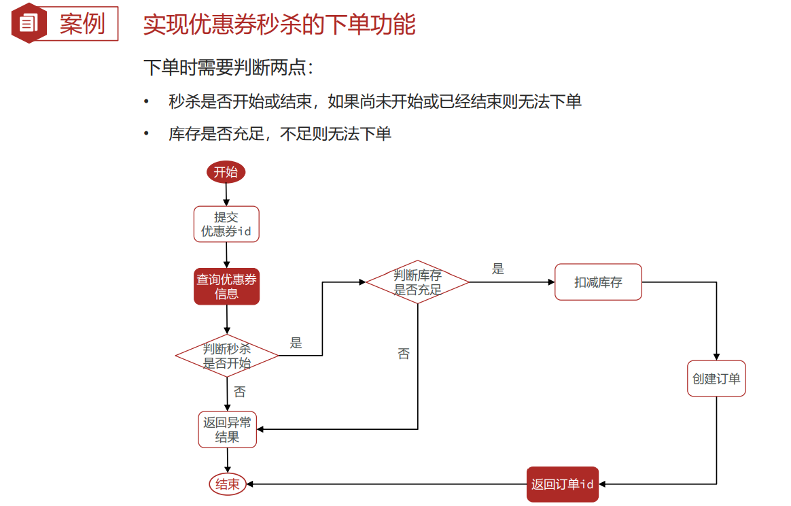


业务代码：

```java
package com.hmdp.service.impl;

import com.hmdp.dto.Result;
import com.hmdp.entity.SeckillVoucher;
import com.hmdp.entity.Voucher;
import com.hmdp.entity.VoucherOrder;
import com.hmdp.mapper.VoucherOrderMapper;
import com.hmdp.service.ISeckillVoucherService;
import com.hmdp.service.IVoucherOrderService;
import com.baomidou.mybatisplus.extension.service.impl.ServiceImpl;
import com.hmdp.service.IVoucherService;
import com.hmdp.utils.RedisIdWorker;
import com.hmdp.utils.UserHolder;
import org.springframework.stereotype.Service;
import org.springframework.transaction.annotation.Transactional;

import javax.annotation.Resource;
import java.time.LocalDateTime;


/**
 * <p>
 *  服务实现类
 * </p>
 *
 */
@Service
public class VoucherOrderServiceImpl extends ServiceImpl<VoucherOrderMapper, VoucherOrder> implements IVoucherOrderService {

    @Resource
    private ISeckillVoucherService iSeckillVoucherService;

    @Resource
    private RedisIdWorker redisIdWorker;

    /**
     * 实现订单秒杀业务
     * @param voucherId
     * @return
     */
    @Override
    @Transactional //添加上事务
    public Result seckillVoucher(Long voucherId) {
        //1.查询优惠卷信息
        SeckillVoucher voucher = iSeckillVoucherService.getById(voucherId);
        Integer stock = voucher.getStock();
        System.out.println(voucher);
        //2.判断优惠卷是否开始
        if (voucher.getBeginTime().isAfter(LocalDateTime.now())){
            //尚未开始，返回异常给前端
            return Result.fail("秒杀尚未开始！");
        }
        //3.判断优惠卷是否过期
        if (voucher.getEndTime().isBefore(LocalDateTime.now())){
            //秒杀已结束，返回前端异常信息
            return Result.fail("秒杀已结束！");
        }
        //4.判断优惠卷库存是否充足
        if (stock < 1){
            //秒杀卷库存不足，返回给前端异常信息
            return Result.fail("库存不足！");
        }
        //5.扣减库存
        boolean isOK = iSeckillVoucherService
                .update()
                .setSql("stock =stock - 1")
                .eq("voucher_id", voucherId)
                .update();
        if (!isOK){
            //秒杀失败，返回给前端异常信息
            return Result.fail("库存不足！");
        }
        //6.创建订单
        VoucherOrder voucherOrder = new VoucherOrder();
        //6.1.生成订单id
        long orderId = redisIdWorker.nextId("order");
        voucherOrder.setId(orderId);
        //6.2.设置用户id
        voucherOrder.setUserId(UserHolder.getUser().getId());
        //6.3.设置代金卷id
        voucherOrder.setVoucherId(voucherId);
        //6.4.当生产的订单id写入数据库
        this.save(voucherOrder);

        //7.返回订单ID
        return Result.ok(orderId);
    }

}
```

存在问题：

1. 【超卖问题】 并发情况下，会出现线程安全问题  【超卖问题】
2. 【一人一单】 一人可以下多单，应该是一人只能抢一个秒杀卷  【一人一单】


---


## 问题--超卖问题


解决方案 ： 加锁

锁的选择：


乐观锁：

版本号法

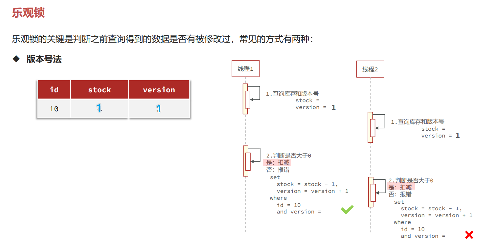

CAS法


超卖这样的线程安全问题，解决方案有哪些？ 

1. 悲观锁：添加同步锁，让线程串行执行

   • 优点：简单粗暴 

   • 缺点：性能一般 

2. 乐观锁：不加锁，在更新时判断是否有其它线程在修改 

   • 优点：性能好 

   • 缺点：存在成功率低的问题


解决问题：


```java
package com.hmdp.service.impl;

import com.hmdp.dto.Result;
import com.hmdp.entity.SeckillVoucher;
import com.hmdp.entity.Voucher;
import com.hmdp.entity.VoucherOrder;
import com.hmdp.mapper.VoucherOrderMapper;
import com.hmdp.service.ISeckillVoucherService;
import com.hmdp.service.IVoucherOrderService;
import com.baomidou.mybatisplus.extension.service.impl.ServiceImpl;
import com.hmdp.service.IVoucherService;
import com.hmdp.utils.RedisIdWorker;
import com.hmdp.utils.UserHolder;
import org.springframework.stereotype.Service;
import org.springframework.transaction.annotation.Transactional;

import javax.annotation.Resource;
import java.time.LocalDateTime;


/**
 * <p>
 *  服务实现类
 * </p>
 *
 */
@Service
public class VoucherOrderServiceImpl extends ServiceImpl<VoucherOrderMapper, VoucherOrder> implements IVoucherOrderService {

    @Resource
    private ISeckillVoucherService iSeckillVoucherService;

    @Resource
    private RedisIdWorker redisIdWorker;

    /**
     * 实现订单秒杀业务
     * @param voucherId
     * @return
     */
    @Override
    @Transactional //添加上事务
    public Result seckillVoucher(Long voucherId) {
        //1.查询优惠卷信息
        SeckillVoucher voucher = iSeckillVoucherService.getById(voucherId);
        Integer stock = voucher.getStock();
        System.out.println(voucher);
        //2.判断优惠卷是否开始
        if (voucher.getBeginTime().isAfter(LocalDateTime.now())){
            //尚未开始，返回异常给前端
            return Result.fail("秒杀尚未开始！");
        }
        //3.判断优惠卷是否过期
        if (voucher.getEndTime().isBefore(LocalDateTime.now())){
            //秒杀已结束，返回前端异常信息
            return Result.fail("秒杀已结束！");
        }
        //4.判断优惠卷库存是否充足
        if (stock < 1){
            //秒杀卷库存不足，返回给前端异常信息
            return Result.fail("库存不足！");
        }
        //5.扣减库存
        boolean isOK = iSeckillVoucherService
                .update()
                .setSql("stock =stock - 1")
                .eq("voucher_id", voucherId)
                //.eq("stock",stock) // CAS乐观锁
                .gt("stock",0) 
            	// CAS乐观锁改进  stock > 0 就可以执行下单业务
                .update();
        if (!isOK){
            //秒杀失败，返回给前端异常信息
            return Result.fail("库存不足！");
        }
        //6.创建订单
        VoucherOrder voucherOrder = new VoucherOrder();
        //6.1.生成订单id
        long orderId = redisIdWorker.nextId("order");
        voucherOrder.setId(orderId);
        //6.2.设置用户id
        voucherOrder.setUserId(UserHolder.getUser().getId());
        //6.3.设置代金卷id
        voucherOrder.setVoucherId(voucherId);
        //6.4.当生产的订单id写入数据库
        this.save(voucherOrder);

        //7.返回订单ID
        return Result.ok(orderId);
    }

}
```


## 问题--一人一单


重点！！！！！！！

```Java
/**
几个重点：
1. 一人一单问题使用 悲观锁 还是 乐观锁？
     使用悲观锁
2. 使用悲观锁 synchronized 加载 方法上 还是 内部？
     内部，如果加载方法上，那整个订单业务都是串行，那刚刚解决的 超卖问题[乐观锁]也没意义了
3. synchronized 的锁对象是什么
     userId.toString().intern()
         而不是 userId.toString()
         Long的 toString() 底层是：
         return new String(buf, UTF16);
         .intern()方法是：返回字符串对象的规范表示。
4. 对于事务的添加 是 锁释放完了再提交 还是 提交完了再释放锁
     提交完了再释放锁
     具体操作：
         1.在方法上加上@Transactional
         2.在调用者 调用语句外加上 synchronized
            synchronized (userId.toString().intern()) {
                return queryOrderVoucherSave(voucherId);
            }
5. 事务失效问题
     spring的事务是 AOP动态代理的
         this.queryOrderVoucherSave(voucherId) //并非是代理对象
     解决方法
         这里使用 获取动态代理的方式 :
             //获取动态代理对象
             IVoucherOrderService proxy = (IVoucherOrderService) AopContext.currentProxy();
             //通过代理对象调用
             proxy.queryOrderVoucherSave(voucherId);
         注意: 使用AopContext.currentProxy()
                 导入aspectjweaver依赖
                 开启 @EnableAspectJAutoProxy(exposeProxy = true) 暴露代理对象
                 
*/
```


业务的实现

```java
@Override
public Result seckillVoucher(Long voucherId) {
    //1.查询优惠卷信息
    SeckillVoucher voucher = iSeckillVoucherService.getById(voucherId);
    Integer stock = voucher.getStock();
    System.out.println(voucher);
    //2.判断优惠卷是否开始
    if (voucher.getBeginTime().isAfter(LocalDateTime.now())) {
        //尚未开始，返回异常给前端
        return Result.fail("秒杀尚未开始！");
    }
    //3.判断优惠卷是否过期
    if (voucher.getEndTime().isBefore(LocalDateTime.now())) {
        //秒杀已结束，返回前端异常信息
        return Result.fail("秒杀已结束！");
    }
    //4.判断优惠卷库存是否充足
    if (stock < 1) {
        //秒杀卷库存不足，返回给前端异常信息
        return Result.fail("库存不足！");
    }


    //一人一单问题
    //获取用户id
    Long userId = UserHolder.getUser().getId();

    //缩小悲观锁范围
    synchronized (userId.toString().intern()) {
        //获取当前代理对象
        IVoucherOrderService proxy = (IVoucherOrderService) AopContext.currentProxy();
        //通过代理对象调用 保证事务的正常
        return proxy.queryOrderVoucherSave(voucherId);
    }

}


@Transactional
public Result queryOrderVoucherSave(Long voucherId) {

    //获取用户id
    Long userId = UserHolder.getUser().getId();

    //判断订单表中是否已经存在
    int count = query()
            .eq("user_id", userId)
            .eq("voucher_id", voucherId)
            .count();
    if (count > 0) {
        //存在，返回前端信息
        return Result.fail("你已领取，每人只能领取一份！");
    }

    //以上都满足 施行扣减下单业务
    //5.扣减库存
    boolean isOK = iSeckillVoucherService
            .update()
            .setSql("stock =stock - 1")
            .eq("voucher_id", voucherId)
            //.eq("stock",stock) // CAS乐观锁
            // CAS乐观锁改进  stock > 0 就可以执行下单业务
            .gt("stock", 0)
            .update();
    if (!isOK) {
        //秒杀失败，返回给前端异常信息
        return Result.fail("库存不足！");
    }
    //6.创建订单
    VoucherOrder voucherOrder = new VoucherOrder();
    //6.1.生成订单id
    long orderId = redisIdWorker.nextId("order");
    voucherOrder.setId(orderId);
    //6.2.设置用户id
    voucherOrder.setUserId(userId);
    //6.3.设置代金卷id
    voucherOrder.setVoucherId(voucherId);
    //6.4.当生产的订单id写入数据库
    this.save(voucherOrder);

    //7.返回订单ID
    return Result.ok(orderId);


}
```

暴露代理对象

```xml
<dependency>
    <groupId>org.aspectj</groupId>
    <artifactId>aspectjweaver</artifactId>
    <version>1.9.9.1</version>
</dependency>
```

```java
//暴露动态代理
@EnableAspectJAutoProxy(exposeProxy = true)
@MapperScan("com.hmdp.mapper")
@SpringBootApplication
public class SeckillVouchersApp {
    public static void main(String[] args) {
        SpringApplication.run(SeckillVouchersApp.class, args);
    }
}
```


## 以上依然存在问题！


在集群 或 分布式系统下 ， 每个JVM的锁监视器是独立的，就会出现并发安全问题

解决方案：使用 分布式锁

下面👇


---

# Redis解决 [分布式锁]


## 分布式锁

什么是分布式锁


分布式锁的实现


## 基于Redis的分布式锁


### 一个简单的实现：

```java
/**
 * 基于Redis的分布式锁
 */
public interface ILock {

    /**
     * 尝试获取锁
     * @param timeoutSec 兜底过期时间
     * @return 获取是否成功 true成功
     */
    boolean tryLock(long timeoutSec);

    /**
     * 释放锁
     */
    void unLock();

}
```

impl

```java
package com.hmdp.utils;

import cn.hutool.core.lang.UUID;
import cn.hutool.core.util.BooleanUtil;
import org.springframework.data.redis.core.StringRedisTemplate;

import java.util.concurrent.TimeUnit;

public class LockImpl implements ILock{

    /**
     * redis
     */
    private StringRedisTemplate stringRedisTemplate;
    /**
     * 锁名称
     */
    private String name;
    public LockImpl(StringRedisTemplate stringRedisTemplate, String name) {
        this.stringRedisTemplate = stringRedisTemplate;
        this.name = name;
    }

    /**
     * 锁前缀
     */
    private static final String KEY_PREFIX = "lock:";

    /**
     * 锁的唯一标识
     */
    private String ID_PREFIX = UUID.randomUUID().toString(true);

    /**
     * 尝试获取锁
     * @param timeoutSec 兜底过期时间
     * @return 获取是否成功 true成功
     */
    @Override
    public boolean tryLock(long timeoutSec) {
        // 锁的唯一标识：这里用 UUID + 线程id
        String value = ID_PREFIX + Thread.currentThread().getId();
        // 获取锁的 key
        String key = KEY_PREFIX + name;

        //尝试获取锁
        Boolean isLock = stringRedisTemplate
                .opsForValue()
                .setIfAbsent(key, value, timeoutSec, TimeUnit.SECONDS);

        //返回结果
        //return Boolean.TRUE.equals(isLock); //或者 👇
        return BooleanUtil.isTrue(isLock);
    }


    /**
     * 释放锁
     */
    @Override
    public void unLock() {
        //释放锁
        Boolean delete = stringRedisTemplate.delete(KEY_PREFIX + name);
    }

}
```

业务：

```java
package com.hmdp.service.impl;

import com.hmdp.dto.Result;
import com.hmdp.entity.SeckillVoucher;
import com.hmdp.entity.VoucherOrder;
import com.hmdp.mapper.VoucherOrderMapper;
import com.hmdp.service.ISeckillVoucherService;
import com.hmdp.service.IVoucherOrderService;
import com.baomidou.mybatisplus.extension.service.impl.ServiceImpl;
import com.hmdp.utils.LockImpl;
import com.hmdp.utils.RedisIdWorker;
import com.hmdp.utils.UserHolder;
import org.springframework.aop.framework.AopContext;
import org.springframework.data.redis.core.StringRedisTemplate;
import org.springframework.stereotype.Service;
import org.springframework.transaction.annotation.Transactional;

import javax.annotation.Resource;
import java.time.LocalDateTime;


/**
 * <p>
 * 服务实现类
 * </p>
 */
@Service
public class VoucherOrderServiceImpl extends ServiceImpl<VoucherOrderMapper, VoucherOrder> implements IVoucherOrderService {

    @Resource
    private ISeckillVoucherService iSeckillVoucherService;

    @Resource
    private RedisIdWorker redisIdWorker;

    @Resource
    private StringRedisTemplate stringRedisTemplate;

    /**
     * 实现订单秒杀业务
     *
     * @param voucherId
     * @return
     */
    @Override
    public Result seckillVoucher(Long voucherId) {
        //1.查询优惠卷信息
        SeckillVoucher voucher = iSeckillVoucherService.getById(voucherId);
        Integer stock = voucher.getStock();
        System.out.println(voucher);
        //2.判断优惠卷是否开始
        if (voucher.getBeginTime().isAfter(LocalDateTime.now())) {
            //尚未开始，返回异常给前端
            return Result.fail("秒杀尚未开始！");
        }
        //3.判断优惠卷是否过期
        if (voucher.getEndTime().isBefore(LocalDateTime.now())) {
            //秒杀已结束，返回前端异常信息
            return Result.fail("秒杀已结束！");
        }
        //4.判断优惠卷库存是否充足
        if (stock < 1) {
            //秒杀卷库存不足，返回给前端异常信息
            return Result.fail("库存不足！");
        }


        //一人一单问题
        //获取用户id
        Long userId = UserHolder.getUser().getId();

        //缩小悲观锁范围
        /*synchronized (userId.toString().intern()) {
            //获取当前代理对象
            IVoucherOrderService proxy = (IVoucherOrderService) AopContext.currentProxy();
            //通过代理对象调用 保证事务的正常
            return proxy.queryOrderVoucherSave(voucherId);
        }*/

        //获取分布式锁对象
        LockImpl lock = new LockImpl(stringRedisTemplate,"order:" + userId);
        //尝试获取锁
        boolean isLock = lock.tryLock(1200);
        //判断是否获取成功
        if (!isLock){
            //获取锁失败
            return Result.fail("不能重复下单！");
        }
        //成功 执行业务
        try{
            //获取当前代理对象
            IVoucherOrderService proxy = (IVoucherOrderService) AopContext.currentProxy();
            //通过代理对象调用 保证事务的正常
            return proxy.queryOrderVoucherSave(voucherId);
        }finally{
            //确保锁的释放
            lock.unLock();
        }


    }


    /**
     *<br> 几个重点：
     *<br> 1. 一人一单问题使用 悲观锁 还是 乐观锁？
     *<br>      使用悲观锁
     *<br> 2. 使用悲观锁 synchronized 加载 方法上 还是 内部？
     *<br>      内部，如果加载方法上，那整个订单业务都是串行，那刚刚解决的 超卖问题[乐观锁]也没意义了
     *<br> 3. synchronized 的锁对象是什么
     *<br>      userId.toString().intern()
     *<br>          而不是 userId.toString()
     *<br>          Long的 toString() 底层是：
     *<br>          return new String(buf, UTF16);
     *<br>          .intern()方法是：返回字符串对象的规范表示。
     *<br> 4. 对于事务的添加 是 锁释放完了再提交 还是 提交完了再释放锁
     *<br>      提交完了再释放锁
     *<br>      具体操作：
     *<br>          1.在方法上加上@Transactional
     *<br>          2.在调用者 调用语句外加上 synchronized
     *<br>             synchronized (userId.toString().intern()) {
     *<br>                 return queryOrderVoucherSave(voucherId);
     *<br>             }
     *<br> 5. 事务失效问题
     *<br>      spring的事务是 AOP动态代理的
     *<br>          this.queryOrderVoucherSave(voucherId) //并非是代理对象
     *<br>      解决方法
     *<br>          这里使用 获取动态代理的方式 :
     *<br>              //获取动态代理对象
     *<br>              IVoucherOrderService proxy = (IVoucherOrderService) AopContext.currentProxy();
     *<br>              //通过代理对象调用
     *<br>              proxy.queryOrderVoucherSave(voucherId);
     *<br>          注意: 使用AopContext.currentProxy()
     *<br>                  导入aspectjweaver依赖
     *<br>                  开启 @EnableAspectJAutoProxy(exposeProxy = true) 暴露代理对象
     *<br>
     *<br> @param voucherId
     *<br> @return
     */
    @Transactional
    public Result queryOrderVoucherSave(Long voucherId) {

        //获取用户id
        Long userId = UserHolder.getUser().getId();

        //判断订单表中是否已经存在
        int count = query()
                .eq("user_id", userId)
                .eq("voucher_id", voucherId)
                .count();
        if (count > 0) {
            //存在，返回前端信息
            return Result.fail("你已领取，每人只能领取一份！");
        }

        //以上都满足 施行扣减下单业务
        //5.扣减库存
        boolean isOK = iSeckillVoucherService
                .update()
                .setSql("stock =stock - 1")
                .eq("voucher_id", voucherId)
                //.eq("stock",stock) // CAS乐观锁
                // CAS乐观锁改进  stock > 0 就可以执行下单业务
                .gt("stock", 0)
                .update();
        if (!isOK) {
            //秒杀失败，返回给前端异常信息
            return Result.fail("库存不足！");
        }
        //6.创建订单
        VoucherOrder voucherOrder = new VoucherOrder();
        //6.1.生成订单id
        long orderId = redisIdWorker.nextId("order");
        voucherOrder.setId(orderId);
        //6.2.设置用户id
        voucherOrder.setUserId(userId);
        //6.3.设置代金卷id
        voucherOrder.setVoucherId(voucherId);
        //6.4.当生产的订单id写入数据库
        this.save(voucherOrder);

        //7.返回订单ID
        return Result.ok(orderId);

    }


}
```


### 存在的问题：误删问题

上面的简单实现

在正常情况下：

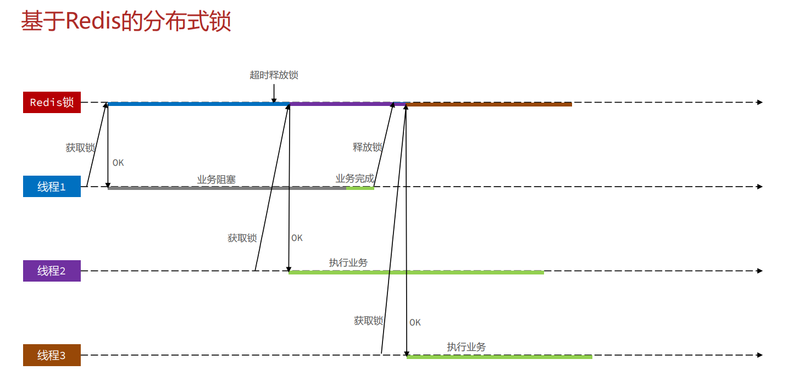

极端情况下：


解决方案：


对 上面代码优化：

impl

```java
package com.hmdp.utils;

import cn.hutool.core.lang.UUID;
import cn.hutool.core.util.BooleanUtil;
import org.springframework.data.redis.core.StringRedisTemplate;

import java.util.concurrent.TimeUnit;

public class LockImpl implements ILock{

    /**
     * redis
     */
    private StringRedisTemplate stringRedisTemplate;
    /**
     * 锁名称
     */
    private String name;
    public LockImpl(StringRedisTemplate stringRedisTemplate, String name) {
        this.stringRedisTemplate = stringRedisTemplate;
        this.name = name;
    }

    /**
     * 锁前缀
     */
    private static final String KEY_PREFIX = "lock:";

    /**
     * 锁的唯一标识
     */
    private String ID_PREFIX = UUID.randomUUID().toString(true);

    /**
     * 尝试获取锁
     * @param timeoutSec 兜底过期时间
     * @return 获取是否成功 true成功
     */
    @Override
    public boolean tryLock(long timeoutSec) {
        // 锁的唯一标识：这里用 UUID + 线程id
        String value = ID_PREFIX + Thread.currentThread().getId();
        // 获取锁的 key
        String key = KEY_PREFIX + name;

        //尝试获取锁
        Boolean isLock = stringRedisTemplate
                .opsForValue()
                .setIfAbsent(key, value, timeoutSec, TimeUnit.SECONDS);

        //返回结果
        //return Boolean.TRUE.equals(isLock); //或者 👇
        return BooleanUtil.isTrue(isLock);
    }


    /**
     * 释放锁
     */
    @Override
    public void unLock() {

        //判断将要释放的锁 的 线程表示是否一致 解决分布式锁误删问题

        //锁的唯一标识：这里用 UUID + 线程id
        String value = ID_PREFIX + Thread.currentThread().getId();
        //获取锁的 key
        String key = KEY_PREFIX + name;
        //获取锁的标识
        String value2 = stringRedisTemplate.opsForValue().get(key);

        //判断将要释放的锁 的 线程表示是否一致 解决分布式锁误删问题
        if (value.equals(value2)){
            //释放锁
            stringRedisTemplate.delete(key);
        }
        //否则 不释放锁
    }

}

```


### 依然存在问题：原子性

删除锁时 判断锁的标识 和 释放锁 并发问题

极端情况下：

判断锁的标识 后 发生阻塞，超时释放了锁，此时其它线程获取锁，那么这个线程释放的锁 就是 其他线程的锁了


改进方案：

1. Redis的事务功能：麻烦不用
2. Redis的Lua脚本


**Redis的Lua脚本**

> Redis提供了Lua脚本功能，在一个脚本中编写多条Redis命令，确保多条命令执行时的原子性。Lua是一种 编程语言，它的基本语法大家可以参考网站：https://www.runoob.com/lua/lua-tutorial.html 这里重点介绍Redis提供的调用函数，语法如下：
>
> ```LUA
> # 执行redis命令
> redis.call('命令名称', 'key', '其它参数', ...)
> ```
>
> 例如，我们要执行set name jack，则脚本是这样：
>
> ```LUA
> # 执行 set name jack
> redis.call('set', 'name', 'jack')
> ```
>
> 例如，我们要先执行set name Rose，再执行get name，则脚本如下：
>
> ```LUA
> 先执行 set name jack
> redis.call('set', 'name', 'jack')
> # 再执行 get name
> local name = redis.call('get', 'name')
> # 返回
> return name
> ```
>
> 


**Redis的Lua脚本的执行**


释放锁的业务流程是这样的： 

1. 获取锁中的线程标示 

2. 判断是否与指定的标示（当前线程标示）一致 

3. 如果一致则释放锁（删除） 

4. 如果不一致则什么都不做 如果用Lua脚本来表示则是这样的：

   ```lua
   -- 这里的 KEYS[1] 就是锁的key，这里的ARGV[1] 就是当前线程标示
   -- 获取锁中的标示，判断是否与当前线程标示一致
   if (redis.call('GET', KEYS[1]) == ARGV[1]) then
   -- 一致，则删除锁
   return redis.call('DEL', KEYS[1])
   end
   -- 不一致，则直接返回
   return 0
   ```


对之前的impl进行优化：

resources/unlock.lua

```lua
-- 这里的 KEYS[1] 就是锁的key，这里的ARGV[1] 就是当前线程标示
-- 获取锁中的标示，判断是否与当前线程标示一致

if (redis.call('GET', KEYS[1]) == ARGV[1]) then
    -- 一致，则删除锁
    return redis.call('DEL', KEYS[1])
end

-- 不一致，则直接返回
return 0
```

impl

```java
package com.hmdp.utils;

import cn.hutool.core.lang.UUID;
import cn.hutool.core.util.BooleanUtil;
import org.springframework.core.io.ClassPathResource;
import org.springframework.data.redis.core.RedisCallback;
import org.springframework.data.redis.core.StringRedisTemplate;
import org.springframework.data.redis.core.script.DefaultRedisScript;

import java.util.Collections;
import java.util.concurrent.TimeUnit;

public class LockImpl implements ILock{

    /**
     * redis
     */
    private StringRedisTemplate stringRedisTemplate;
    /**
     * 锁名称
     */
    private String name;
    public LockImpl(StringRedisTemplate stringRedisTemplate, String name) {
        this.stringRedisTemplate = stringRedisTemplate;
        this.name = name;
    }

    /**
     * 锁前缀
     */
    private static final String KEY_PREFIX = "lock:";

    /**
     * 锁的唯一标识
     */
    private String ID_PREFIX = UUID.randomUUID().toString(true);

    /**
     * 初始化Lua脚本对象   RedisScript的实现类
     */
    private static final  DefaultRedisScript<Long> UNLOCK_SCRIPT;
    static {
        //创建 RedisScript的实现类 DefaultRedisScript
        UNLOCK_SCRIPT = new DefaultRedisScript<Long>();
        //设置Lua脚本位置
        UNLOCK_SCRIPT.setLocation(new ClassPathResource("unlock.lua"));
        //设置脚本执行后的返回值类型
        UNLOCK_SCRIPT.setResultType(Long.class);
    }


    /**
     * 尝试获取锁
     * @param timeoutSec 兜底过期时间
     * @return 获取是否成功 true成功
     */
    @Override
    public boolean tryLock(long timeoutSec) {
        // 锁的唯一标识：这里用 UUID + 线程id
        String value = ID_PREFIX + Thread.currentThread().getId();
        // 获取锁的 key
        String key = KEY_PREFIX + name;

        //尝试获取锁
        Boolean isLock = stringRedisTemplate
                .opsForValue()
                .setIfAbsent(key, value, timeoutSec, TimeUnit.SECONDS);

        //返回结果
        //return Boolean.TRUE.equals(isLock); //或者 👇
        return BooleanUtil.isTrue(isLock);
    }


    /**
     * 释放锁
     */
    @Override
    public void unLock() {

        //判断将要释放的锁 的 线程表示是否一致 解决分布式锁误删问题

        //锁的唯一标识：这里用 UUID + 线程id
        String value = ID_PREFIX + Thread.currentThread().getId();
        //获取锁的 key
        String key = KEY_PREFIX + name;

        //判断将要释放的锁 的 线程表示是否一致 解决分布式锁误删问题
        //使用Lua脚本 确保 [判断标识] 和 [释放锁] 的 原子性
        stringRedisTemplate
                .execute(UNLOCK_SCRIPT, //Lua脚本对象
                         Collections.singletonList(key), //KEYS[1] list
                         value); //ARGV[1] object

        //否则 不释放锁
    }


}

```


到此 实现了一个较为完善的 基于Redis的分布式锁

但是.......在某些场景下 依然需要优化.......


---


### 基于Redis的分布式锁优化

---

还有些问题可以进一步优化：

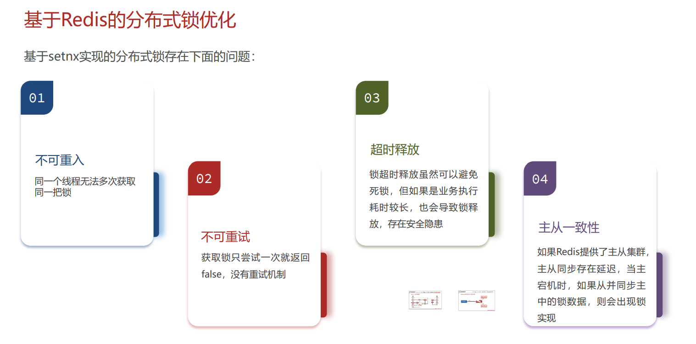


这些实现起来比较繁琐

可以使用开源框架去解决：

**使用 Redisson **👇

---


## Redisson解决Redis分布式锁


### Redisson介绍

---


Redisson Redisson是一个在Redis的基础上实现的Java驻内存数据网格（In-Memory Data Grid）。

它不仅提供了一系列的分布 式的Java常用对象，还提供了许多分布式服务，其中就包含了各种分布式锁的实现。


官网地址： https://redisson.org 

GitHub地址： https://github.com/redisson/redisson


简单的使用

```java
package com.hmdp.config;

import org.redisson.Redisson;
import org.redisson.api.RedissonClient;
import org.redisson.config.Config;
import org.springframework.context.annotation.Bean;
import org.springframework.context.annotation.Configuration;


/**
 * Redisson 初始化配置
 */
@Configuration
public class RedissonConfig {

    @Bean
    public RedissonClient redissonClient1() {

        Config config = new Config();
        //链接Redis
        config.useSingleServer()
                .setAddress("redis://ayaka520:6379")
                .setPassword("gangajiang521");
	    //解耦合 可以使用yaml的方式 解耦合
        //通过Redisson.create(config) 指定配置文件 创建RedissonClient
        return Redisson.create(config);
    }

    //@Bean
    public RedissonClient redissonClient2() {
        Config config = new Config();
        config.useSingleServer().setAddress("redis://ayaka521:6380");
        return Redisson.create(config);
    }

    //@Bean
    public RedissonClient redissonClient3() {
        Config config = new Config();
        config.useSingleServer()
                .setAddress("redis://ayaka521:6381");
        return Redisson.create(config);
    }

}
```

业务改造

```java
package com.hmdp.service.impl;

import com.hmdp.dto.Result;
import com.hmdp.entity.SeckillVoucher;
import com.hmdp.entity.VoucherOrder;
import com.hmdp.mapper.VoucherOrderMapper;
import com.hmdp.service.ISeckillVoucherService;
import com.hmdp.service.IVoucherOrderService;
import com.baomidou.mybatisplus.extension.service.impl.ServiceImpl;
import com.hmdp.utils.RedisIdWorker;
import com.hmdp.utils.UserHolder;
import org.redisson.api.RLock;
import org.redisson.api.RedissonClient;
import org.springframework.aop.framework.AopContext;
import org.springframework.stereotype.Service;
import org.springframework.transaction.annotation.Transactional;

import javax.annotation.Resource;
import java.time.LocalDateTime;


/**
 * <p>
 * 服务实现类
 * </p>
 */
@Service
public class VoucherOrderServiceImpl extends ServiceImpl<VoucherOrderMapper, VoucherOrder> implements IVoucherOrderService {

    @Resource
    private ISeckillVoucherService iSeckillVoucherService;

    @Resource
    private RedisIdWorker redisIdWorker;

    //@Resource
    //private StringRedisTemplate stringRedisTemplate;

    /**
     * Redisson
     */
    @Resource
    private RedissonClient redissonClient;

    /**
     * 实现订单秒杀业务
     *
     * @param voucherId
     * @return
     */
    @Override
    public Result seckillVoucher(Long voucherId) {
        //1.查询优惠卷信息
        SeckillVoucher voucher = iSeckillVoucherService.getById(voucherId);
        Integer stock = voucher.getStock();
        //2.判断优惠卷是否开始
        if (voucher.getBeginTime().isAfter(LocalDateTime.now())) {
            //尚未开始，返回异常给前端
            return Result.fail("秒杀尚未开始！");
        }
        //3.判断优惠卷是否过期
        if (voucher.getEndTime().isBefore(LocalDateTime.now())) {
            //秒杀已结束，返回前端异常信息
            return Result.fail("秒杀已结束！");
        }
        //4.判断优惠卷库存是否充足
        if (stock < 1) {
            //秒杀卷库存不足，返回给前端异常信息
            return Result.fail("库存不足！");
        }


        //一人一单问题
        //获取用户id
        Long userId = UserHolder.getUser().getId();

        //缩小悲观锁范围
        /*synchronized (userId.toString().intern()) {
            //获取当前代理对象
            IVoucherOrderService proxy = (IVoucherOrderService) AopContext.currentProxy();
            //通过代理对象调用 保证事务的正常
            return proxy.queryOrderVoucherSave(voucherId);
        }*/

        //获取分布式锁对象
        //LockImpl lock = new LockImpl(stringRedisTemplate,"order:" + userId);

        //从Redisson中获取锁
        RLock lock = redissonClient.getLock("lock:order:" + userId);

        //尝试获取锁
        boolean isLock = lock.tryLock();

        //判断是否获取成功
        if (!isLock){
            //获取锁失败
            return Result.fail("不能重复下单！");
        }
        //成功 执行业务
        try{
            //获取当前代理对象
            IVoucherOrderService proxy = (IVoucherOrderService) AopContext.currentProxy();
            //通过代理对象调用 保证事务的正常
            return proxy.queryOrderVoucherSave(voucherId);
        }finally{
            //确保锁的释放
            lock.unlock();
        }
    }

    @Transactional
    public Result queryOrderVoucherSave(Long voucherId) {

        //获取用户id
        Long userId = UserHolder.getUser().getId();

        //判断订单表中是否已经存在
        int count = query()
                .eq("user_id", userId)
                .eq("voucher_id", voucherId)
                .count();
        if (count > 0) {
            //存在，返回前端信息
            return Result.fail("你已领取，每人只能领取一份！");
        }

        //以上都满足 施行扣减下单业务
        //5.扣减库存
        boolean isOK = iSeckillVoucherService
                .update()
                .setSql("stock =stock - 1")
                .eq("voucher_id", voucherId)
                //.eq("stock",stock) // CAS乐观锁
                // CAS乐观锁改进  stock > 0 就可以执行下单业务
                .gt("stock", 0)
                .update();
        if (!isOK) {
            //秒杀失败，返回给前端异常信息
            return Result.fail("库存不足！");
        }
        //6.创建订单
        VoucherOrder voucherOrder = new VoucherOrder();
        //6.1.生成订单id
        long orderId = redisIdWorker.nextId("order");
        voucherOrder.setId(orderId);
        //6.2.设置用户id
        voucherOrder.setUserId(userId);
        //6.3.设置代金卷id
        voucherOrder.setVoucherId(voucherId);
        //6.4.当生产的订单id写入数据库
        this.save(voucherOrder);

        //7.返回订单ID
        return Result.ok(orderId);

    }


}
```


### Redisson可重入锁问题


**原理：**


---

**使用Lua脚本实现 --- 获取锁**


源码：

```java
<T> RFuture<T> tryLockInnerAsync(long waitTime, long leaseTime, TimeUnit unit, long threadId, RedisStrictCommand<T> command) {
    return evalWriteAsync(getRawName(), LongCodec.INSTANCE, command,
            "if (redis.call('exists', KEYS[1]) == 0) then " +
                    "redis.call('hincrby', KEYS[1], ARGV[2], 1); " +
                    "redis.call('pexpire', KEYS[1], ARGV[1]); " +
                    "return nil; " +
                    "end; " +
                    "if (redis.call('hexists', KEYS[1], ARGV[2]) == 1) then " +
                    "redis.call('hincrby', KEYS[1], ARGV[2], 1); " +
                    "redis.call('pexpire', KEYS[1], ARGV[1]); " +
                    "return nil; " +
                    "end; " +
                    "return redis.call('pttl', KEYS[1]);",
            Collections.singletonList(getRawName()), unit.toMillis(leaseTime), getLockName(threadId));
}
```


---

**使用Lua脚本实现 --- 释放锁**


源码：

```java
protected RFuture<Boolean> unlockInnerAsync(long threadId) {
    return evalWriteAsync(getRawName(), LongCodec.INSTANCE, RedisCommands.EVAL_BOOLEAN,
            "if (redis.call('hexists', KEYS[1], ARGV[3]) == 0) then " +
                    "return nil;" +
                    "end; " +
                    "local counter = redis.call('hincrby', KEYS[1], ARGV[3], -1); " +
                    "if (counter > 0) then " +
                    "redis.call('pexpire', KEYS[1], ARGV[2]); " +
                    "return 0; " +
                    "else " +
                    "redis.call('del', KEYS[1]); " +
                    "redis.call('publish', KEYS[2], ARGV[1]); " +
                    "return 1; " +
                    "end; " +
                    "return nil;",
            Arrays.asList(getRawName(), getChannelName()), LockPubSub.UNLOCK_MESSAGE, internalLockLeaseTime, getLockName(threadId));
}
```


### 可重试--WatchDog机制

---

源码jiji看 jiji分析


### 超时释放--发布订阅/信号量

---

源码jiji看 jiji分析


### Redisson分布式锁的原理


Redisson分布式锁原理： 

- 可重入：利用hash结构记录线程id和重入次数
- 可重试：利用信号量和PubSub功能实现等待、唤醒，获取 锁失败的重试机制 
- 超时续约：利用watchDog，每隔一段时间（releaseTime  / 3），重置超时时间


---

---


### Redisson主从一致性问题

---


**使用:**

RedissonConfig

```java
package com.hmdp.config;

import org.redisson.Redisson;
import org.redisson.api.RedissonClient;
import org.redisson.config.Config;
import org.springframework.context.annotation.Bean;
import org.springframework.context.annotation.Configuration;

import java.io.IOException;

/**
 * Redisson 初始化配置
 */
@Configuration
public class RedissonConfig {

    @Bean
    public RedissonClient redissonClient1() throws IOException {

        Config config = new Config();
        //链接Redis
        config.useSingleServer()
                .setAddress("redis://ayaka520:6379")
                .setPassword("gangajiang521");

        //通过Redisson.create(config) 指定配置文件 创建RedissonClient
        return Redisson.create(config);
    }

    @Bean
    public RedissonClient redissonClient2() throws IOException {
        Config config = new Config();
        config.useSingleServer().setAddress("redis://ayaka521:6380");
        return Redisson.create(config);
    }

    @Bean
    public RedissonClient redissonClient3() throws IOException {
        Config config = new Config();
        config.useSingleServer()
                .setAddress("redis://ayaka521:6381");
        return Redisson.create(config);
    }


}
```

RedissonTests

```java
package com.hmdp;

import lombok.extern.slf4j.Slf4j;
import org.junit.jupiter.api.BeforeEach;
import org.junit.jupiter.api.Test;
import org.redisson.api.RLock;
import org.redisson.api.RedissonClient;
import org.springframework.boot.test.context.SpringBootTest;

import javax.annotation.Resource;
import java.util.concurrent.TimeUnit;

@Slf4j
@SpringBootTest
class RedissonTest {

    @Resource
    private RedissonClient redissonClient1;

    @Resource
    private RedissonClient redissonClient2;

    @Resource
    private RedissonClient redissonClient3;

    
    private RLock lock;
    //创建连锁
    @BeforeEach
    void setUp() {
        //获取 RLock对象
        RLock lock1 = redissonClient1.getLock("lock:test");
        RLock lock2 = redissonClient2.getLock("lock:test");
        RLock lock3 = redissonClient3.getLock("lock:test");
        //创建连锁
        lock = redissonClient1.getMultiLock(lock1,lock2,lock3);
    }


    @Test
    void method1() throws InterruptedException {
        // 尝试获取锁
        boolean isLock = lock.tryLock(1L, TimeUnit.SECONDS);
        if (!isLock) {
            log.error("获取锁失败 .... 1");
            return;
        }
        try {
            log.info("获取锁成功 .... 1");
            method2();
            log.info("开始执行业务 ... 1");
        } finally {
            log.warn("准备释放锁 .... 1");
            lock.unlock();
        }
    }
    void method2() {
        // 尝试获取锁
        boolean isLock = lock.tryLock();
        if (!isLock) {
            log.error("获取锁失败 .... 2");
            return;
        }
        try {
            log.info("获取锁成功 .... 2");
            log.info("开始执行业务 ... 2");
        } finally {
            log.warn("准备释放锁 .... 2");
            lock.unlock();
        }
    }
}
```


---


### 总结

---

> ## 总结
>
> 1）不可重入Redis分布式锁： 
>
> - 原理：利用setnx的互斥性；利用ex避免死锁；释放锁时判 断线程标示 
>
> - 缺陷：不可重入、无法重试、锁超时失效 
>
> 
>
> 2）可重入的Redis分布式锁： 
>
> - 原理：利用hash结构，记录线程标示和重入次数；利用 watchDog延续锁时间；利用>信号量控制锁重试等待 
>
> - 缺陷：redis宕机引起锁失效问题 
>
> 
>
> 
>
> 
>
> 3）Redisson的multiLock： 
>
> - 原理：多个独立的Redis节点，必须在所有节点都获取重入锁，才算获取锁成功 
> - 缺陷：运维成本高、实现复杂
>
> 
>
> 
>
> 


这样就就觉了分布式锁的问题

但是，还可以继续优化：

---


# Redis解决 [MQ] [消息队列]

---


## 秒杀业务的优化


改进方案：


**Redis 解决消息队列效果并不好 这里就不实现了 还dai是带MQ的技术去解决 RabbitMQ...**


---

---


# Redis解决 [点赞] [排行榜]


## 分析 与 问题

### Redis类型的选择：

- 一个用户不能重复点赞 -- 集合元素不可重复
- 点赞榜 Top5 需要排序 -- 集合需要排序 最终选出前5个数据   ||  Top5(最先点赞的前5人)


**所以 选择了 SortedSet 数据类型**

- key : `blog:liked: + 博客id`
- member：`用户id`
- score：`时间戳`


### SorteddSet 要用的的命令

添加成员  --- 新增点赞


- reids命令：`zadd blog:liked:博客id 用户id 时间戳`
- java命令： `stringRedisTemplate.opsForZSet().add(key,userId,System.currentTimeMillis());`

---


判断是否为该成员  ---  判断该用户是否为该博客点赞过


- reids命令：`zscore blog:liked:博客id 时间戳`  返回部位 nil 为该成员
- java命令： `Double isMemberScore = stringRedisTemplate.opsForZSet().score(key, userId);` 不为 null 为该成员

---


按分数顺序查询成员  ---  实现点赞 Top5 功能


- reids命令：`zscore blog:liked:博客id 时间戳`  返回部位 nil 为该成员
- java命令： `Set<String> range = stringRedisTemplate.opsForZSet().range(key, 0, 4);` 


### **几个坑**：


数据库问题:

```java
/**
根据博客id 获取点赞排行榜前 5 名 <br>
     */
@Override
    public Result likesBlogTop(Long id) {
        String key = BLOG_LIKED_KEY + id.toString();
        //根据博客id查询点赞前 5 名
        Set<String> range = stringRedisTemplate.opsForZSet().range(key, 0, 4);// top5
        if (range == null){
            return Result.ok();
        }
        List<Long> ids = range.stream().map(Long::valueOf).collect(Collectors.toList());
        if (ObjectUtil.isEmpty(ids)){
            return Result.ok();
        }
        String idStr = StrUtil.join("," , ids);
        System.out.println(idStr);
        //根据这些用户 id 获取用户信息
        List<UserDTO> userDTOS = userService
                //.listByIds(ids)
                .query()
                .in("id",ids)
                .last("order by field(id,"+ idStr + ")")
                .list()
                .stream()//封装成 UserDTO 防止敏感信息泄露
                .map(user -> BeanUtil.copyProperties(user, UserDTO.class))
                .collect(Collectors.toList());

        return Result.ok(userDTOS);
    }
```

> 根据博客id 获取点赞排行榜前 5 名 
>
> 有一个坑:
>
> select * from tb_user where id in(3,2,1); 的查询结果顺序 是 1 2 3 
>
> select * from tb_user where id in(3,2,1) order by field(id,3,2,1)  
>
> 这样才能保证按给定的顺序查询

**这里依然有个坑！！**

当未有用户点赞时 ：SQL语句：`SELECT * FROM tb_user WHERE (id IN ()) order by field(id,)`语法错误

解决方法 ：提前判断 

```java
if (ObjectUtil.isEmpty(ids)){
	return Result.ok();
}
```


空指针异常

```java
//判断当前用户是否为当前博客点赞
private void isLiked(Blog blog){
    UserDTO userDTO = UserHolder.getUser();
    if (userDTO == null){
        //用户未登录，不需要查询是否点赞过
        return;
    }
    String userId = userDTO.getId().toString();
    String key = BLOG_LIKED_KEY + blog.getId().toString();
    //Boolean isMember = stringRedisTemplate.opsForSet().isMember(key, userId.toString());
    Double isMember = stringRedisTemplate.opsForZSet().score(key, userId.toString());
    //封装blog
    blog.setIsLike(isMember != null);
}
```

用户未登录 会报空指针异常 提前判断一下


同一用户多地登录 并发安全问题   TODO: T.T


更多异常  TODO: T.T


## 库表设置


```mysql
CREATE TABLE `tb_blog` (
  `id` bigint(20) unsigned NOT NULL AUTO_INCREMENT COMMENT '主键',
  `shop_id` bigint(20) NOT NULL COMMENT '商户id',
  `user_id` bigint(20) unsigned NOT NULL COMMENT '用户id',
  `title` varchar(255) CHARACTER SET utf8mb4 COLLATE utf8mb4_unicode_ci NOT NULL COMMENT '标题',
  `images` varchar(2048) NOT NULL COMMENT '探店的照片，最多9张，多张以","隔开',
  `content` varchar(2048) CHARACTER SET utf8mb4 COLLATE utf8mb4_unicode_ci NOT NULL COMMENT '探店的文字描述',
  `liked` int(8) unsigned DEFAULT '0' COMMENT '点赞数量',
  `comments` int(8) unsigned DEFAULT NULL COMMENT '评论数量',
  `create_time` timestamp NOT NULL DEFAULT CURRENT_TIMESTAMP COMMENT '创建时间',
  `update_time` timestamp NOT NULL DEFAULT CURRENT_TIMESTAMP ON UPDATE CURRENT_TIMESTAMP COMMENT '更新时间',
  PRIMARY KEY (`id`) USING BTREE
) ENGINE=InnoDB AUTO_INCREMENT=26 DEFAULT CHARSET=utf8mb4 ROW_FORMAT=COMPACT;
```


## 实体类

```java
package com.hmdp.entity;

import com.baomidou.mybatisplus.annotation.IdType;
import com.baomidou.mybatisplus.annotation.TableField;
import com.baomidou.mybatisplus.annotation.TableId;
import com.baomidou.mybatisplus.annotation.TableName;
import lombok.Data;
import lombok.EqualsAndHashCode;
import lombok.experimental.Accessors;
import java.io.Serializable;
import java.time.LocalDateTime;


@Data
@EqualsAndHashCode(callSuper = false)
@Accessors(chain = true)
@TableName("tb_blog")
public class Blog implements Serializable {

    private static final long serialVersionUID = 1L;

    /**
     * 主键
     */
    @TableId(value = "id", type = IdType.AUTO)
    private Long id;
    /**
     * 商户id
     */
    private Long shopId;
    /**
     * 用户id
     */
    private Long userId;
    /**
     * 用户图标
     */
    @TableField(exist = false)
    private String icon;
    /**
     * 用户姓名
     */
    @TableField(exist = false)
    private String name;
    /**
     * 是否点赞过了
     */
    @TableField(exist = false)
    private Boolean isLike;

    /**
     * 标题
     */
    private String title;

    /**
     * 探店的照片，最多9张，多张以","隔开
     */
    private String images;

    /**
     * 探店的文字描述
     */
    private String content;

    /**
     * 点赞数量
     */
    private Integer liked;

    /**
     * 评论数量
     */
    private Integer comments;

    /**
     * 创建时间
     */
    private LocalDateTime createTime;

    /**
     * 更新时间
     */
    private LocalDateTime updateTime;


}
```


## BlogController

```java
package com.hmdp.controller;


import com.hmdp.dto.Result;
import com.hmdp.dto.UserDTO;
import com.hmdp.entity.Blog;
import com.hmdp.service.IBlogService;
import com.hmdp.utils.UserHolder;
import org.springframework.web.bind.annotation.*;

import javax.annotation.Resource;

/**
 * <p>
 * 前端控制器
 * </p>
 */
@RestController
@RequestMapping("/blog")
public class BlogController {

    @Resource
    private IBlogService blogService;

    @PostMapping
    public Result saveBlog(@RequestBody Blog blog) {

        // 获取登录用户
        UserDTO user = UserHolder.getUser();
        blog.setUserId(user.getId());
        // 保存探店博文
        blogService.save(blog);
        // 返回 id
        return Result.ok(blog.getId());
    }


    @PutMapping("/like/{id}")
    public Result likeBlog(@PathVariable("id") Long id) {
        // 修改点赞数量
        return blogService.likeBlog(id);
    }

    @GetMapping("/likes/{id}")
    public Result likesBlogTop(@PathVariable("id") Long id){
        // 点赞榜单 前 5 位
        return blogService.likesBlogTop(id);
    }


    @GetMapping("/of/me")
    public Result queryMyBlog(@RequestParam(value = "current", defaultValue = "1") Integer current) {
        return blogService.queryMyBlog(current);
    }

    @GetMapping("/of/user")
    public Result queryOfUserBlog(@RequestParam("id") Long id,
                                  @RequestParam(value = "current", defaultValue = "1") Integer current){
        return blogService.queryOfUserBlog(id, current);
    }

    @GetMapping("/hot")
    public Result queryHotBlog(@RequestParam(value = "current", defaultValue = "1") Integer current) {
        return blogService.queryHotBlog(current);
    }

    @GetMapping("/{id}")
    public Result queryByIdBlog(@PathVariable Long id){
        return blogService.queryByIdBlog(id);
    }

}
```


## BlogServer

```java
package com.hmdp.service.impl;

import cn.hutool.core.bean.BeanUtil;
import cn.hutool.core.util.ObjectUtil;
import cn.hutool.core.util.StrUtil;
import com.baomidou.mybatisplus.extension.plugins.pagination.Page;
import com.hmdp.dto.Result;
import com.hmdp.dto.UserDTO;
import com.hmdp.entity.Blog;
import com.hmdp.entity.User;
import com.hmdp.mapper.BlogMapper;
import com.hmdp.service.IBlogService;
import com.baomidou.mybatisplus.extension.service.impl.ServiceImpl;
import com.hmdp.service.IUserService;
import com.hmdp.utils.SystemConstants;
import com.hmdp.utils.UserHolder;
import org.springframework.data.redis.core.StringRedisTemplate;
import org.springframework.stereotype.Service;

import javax.annotation.Resource;
import java.util.List;
import java.util.Set;
import java.util.stream.Collectors;

import static com.hmdp.utils.RedisConstants.BLOG_LIKED_KEY;

/**
 * <p>
 *  服务实现类
 * </p>
 */
@Service
public class BlogServiceImpl extends ServiceImpl<BlogMapper, Blog> implements IBlogService {

    @Resource
    private IUserService userService;

    @Resource
    private StringRedisTemplate stringRedisTemplate;

    @Override
    public Result queryHotBlog(Integer current) {
        // 根据用户查询
        Page<Blog> page = this.query()
                .orderByDesc("liked")
                .page(new Page<>(current, SystemConstants.MAX_PAGE_SIZE));
        // 获取当前页数据
        List<Blog> records = page.getRecords();
        // 查询用户
        records.forEach(blog -> {
            // 封装blog
            queryUserBlog(blog);
            // 判断用户是否点赞
            isLiked(blog);
        });


        return Result.ok(records);
    }


    /**
     * 根据id查询博客
     * @param id
     * @return
     */
    @Override
    public Result queryByIdBlog(Long id) {
        //根据id查询博客
        Blog blog = this.getById(id);
        if (ObjectUtil.isEmpty(blog)){
            return Result.fail("博客不存在！");
        }
        //封装后的 blog 对象
        this.queryUserBlog(blog);
        // 判断用户是否点赞
        isLiked(blog);
        return Result.ok(blog);
    }

    /**
     * 更改点赞
     * @param id
     * @return
     */
    @Override
    public Result likeBlog(Long id) {

        //1.获取用户 id
        String userId = UserHolder.getUser().getId().toString();
        String key = BLOG_LIKED_KEY + id;

        //2.判断当前用户是否点赞
        //Boolean isMember = stringRedisTemplate.opsForSet().isMember(key, userId);
        Double isMemberScore = stringRedisTemplate.opsForZSet().score(key, userId);
        if (isMemberScore == null){
            //3.未点赞
            //3.1 数据库点赞数 +1
            boolean isSuccess = update().setSql("liked = liked + 1").eq("id", id).update();
            //3.2 redis中 添加zset 成员
            if (isSuccess){
                //stringRedisTemplate.opsForSet().add(key,userId);
                stringRedisTemplate.opsForZSet().add(key,userId,System.currentTimeMillis()); //key value score
            }
        }else{
            //4.未点赞
            //4.1 数据库点赞数 -1
            boolean isSuccess = update().setSql("liked = liked - 1").eq("id", id).update();
            //4.2 redis中 删除zset 成员
            if (isSuccess){
                //stringRedisTemplate.opsForSet().remove(key,userId);
                stringRedisTemplate.opsForZSet().remove(key,userId);
            }
        }

        return Result.ok();
    }

    /**
     * 根据博客id 获取点赞排行榜前 5 名 <br>
     *      注意：                   <br>
     *      有一个坑:                <br>
     *      select * from tb_user where id in(3,2,1); 的查询结果顺序 是 1 2 3     <br>
     *      select * from tb_user where id in(3,2,1) order by field(id,3,2,1)  <br>
     *      这样才能保证按给定的顺序查询
     *
     * @param id
     * @return
     */
    @Override
    public Result likesBlogTop(Long id) {
        String key = BLOG_LIKED_KEY + id.toString();
        //根据博客id查询点赞前 5 名
        Set<String> range = stringRedisTemplate.opsForZSet().range(key, 0, 4);// top5
        if (range == null){
            return Result.ok();
        }
        List<Long> ids = range.stream().map(Long::valueOf).collect(Collectors.toList());
        if (ObjectUtil.isEmpty(ids)){
            return Result.ok();
        }
        String idStr = StrUtil.join("," , ids);
        //根据这些用户 id 获取用户信息
        List<UserDTO> userDTOS = userService
                //.listByIds(ids)
                .query()
                .in("id",ids)
                .last("order by field(id,"+ idStr + ")")
                .list()
                .stream()//封装成 UserDTO 防止敏感信息泄露
                .map(user -> BeanUtil.copyProperties(user, UserDTO.class))
                .collect(Collectors.toList());

        return Result.ok(userDTOS);
    }

    @Override
    public Result queryOfUserBlog(Long id, Integer current) {
        //根据用户查询blog
        Page<Blog> page = query()
                .eq("user_id", id)
                .page(new Page<>(current, SystemConstants.MAX_PAGE_SIZE));
        //获取当前页面数据
        List<Blog> records = page.getRecords();
        return Result.ok(records);
    }

    @Override
    public Result queryMyBlog(Integer current) {
        // 获取登录用户
        UserDTO user = UserHolder.getUser();
        // 根据用户查询
        Page<Blog> page = query()
                .eq("user_id", user.getId()).page(new Page<>(current, SystemConstants.MAX_PAGE_SIZE));
        // 获取当前页数据
        List<Blog> records = page.getRecords();
        return Result.ok(records);
    }


    //为博客 并设置用户信息
    private void queryUserBlog(Blog blog) {
        Long userId = blog.getUserId();
        User user = userService.getById(userId);
        blog.setName(user.getNickName());
        blog.setIcon(user.getIcon());
    }

    //判断当前用户是否为当前博客点赞
    private void isLiked(Blog blog){
        UserDTO userDTO = UserHolder.getUser();
        if (userDTO == null){
            //用户未登录，不需要查询是否点赞过
            return;
        }
        String userId = userDTO.getId().toString();
        String key = BLOG_LIKED_KEY + blog.getId().toString();
        //Boolean isMember = stringRedisTemplate.opsForSet().isMember(key, userId.toString());
        Double isMember = stringRedisTemplate.opsForZSet().score(key, userId.toString());
        //封装blog
        blog.setIsLike(isMember != null);
    }

}
```


## Redis的效果


# Redis解决 [关注] [共同关注]


## 分析


单纯的关注 取消关注功能 只用数据库就行

查看共同关注

Redis数据类型选择 Set类型

- key : `follow:user: + 用户id`
- member：`关注用户的id`


Set类型 有一个命令可以查询 诺干个key的交集


- reids命令：`sinter follow:user:3 follow:user:6`  用户id:3 和 用户id:6 的共同关注
- java命令： `stringRedisTemplate.opsForSet().intersect(key1,key2);`


## 库表设计


```mysql
CREATE TABLE `tb_follow` (
  `id` bigint(20) NOT NULL AUTO_INCREMENT COMMENT '主键',
  `user_id` bigint(20) unsigned NOT NULL COMMENT '用户id',
  `follow_user_id` bigint(20) unsigned NOT NULL COMMENT '关联的用户id',
  `create_time` timestamp NOT NULL DEFAULT CURRENT_TIMESTAMP COMMENT '创建时间',
  PRIMARY KEY (`id`) USING BTREE
) ENGINE=InnoDB AUTO_INCREMENT=22 DEFAULT CHARSET=utf8mb4 ROW_FORMAT=COMPACT;
```


## 实体类

```java
package com.hmdp.entity;

import com.baomidou.mybatisplus.annotation.IdType;
import com.baomidou.mybatisplus.annotation.TableId;
import com.baomidou.mybatisplus.annotation.TableName;
import lombok.Data;
import lombok.EqualsAndHashCode;
import lombok.experimental.Accessors;

import java.io.Serializable;
import java.time.LocalDateTime;

/**
 * <p>
 * 
 * </p>
 *
 * @author 虎哥
 * @since 2021-12-22
 */
@Data
@EqualsAndHashCode(callSuper = false)
@Accessors(chain = true)
@TableName("tb_follow")
public class Follow implements Serializable {

    private static final long serialVersionUID = 1L;

    /**
     * 主键
     */
    @TableId(value = "id", type = IdType.AUTO)
    private Long id;

    /**
     * 用户id
     */
    private Long userId;

    /**
     * 关联的用户id
     */
    private Long followUserId;

    /**
     * 创建时间
     */
    private LocalDateTime createTime;


}
```


## FollowController

```java
package com.hmdp.controller;


import com.hmdp.dto.Result;
import com.hmdp.service.IFollowService;
import org.springframework.web.bind.annotation.*;

import javax.annotation.Resource;

/**
 * <p>
 *  前端控制器
 * </p>
 */
@RestController
@RequestMapping("/follow")
public class FollowController {

    @Resource
    private IFollowService followService;

    /**
     * 根据用户id 修改关注 取消关注
     * @param id
     * @param isFollow
     * @return
     */
    @PutMapping("/{id}/{isFollow}")
    public Result followUser(@PathVariable("id") Long id, @PathVariable("isFollow") boolean isFollow){
        return followService.followUser(id,isFollow);
    }

    /**
     * 根据 id 判断是否关注
     * @param id
     * @return
     */
    @GetMapping("/or/not/{id}")
    public Result notFollow(@PathVariable("id") Long id){
        return followService.notFollow(id);
    }

    /**
     * 共同关注查询
     * @param id
     * @return
     */
    @GetMapping("/common/{id}")
    public Result followCommon(@PathVariable("id") Long id){
        return followService.followCommon(id);
    }

}
```


## FollowService

```java
package com.hmdp.service.impl;

import cn.hutool.core.bean.BeanUtil;
import com.baomidou.mybatisplus.core.conditions.query.LambdaQueryWrapper;
import com.baomidou.mybatisplus.core.toolkit.ObjectUtils;
import com.hmdp.dto.Result;
import com.hmdp.dto.UserDTO;
import com.hmdp.entity.Follow;
import com.hmdp.mapper.FollowMapper;
import com.hmdp.service.IFollowService;
import com.baomidou.mybatisplus.extension.service.impl.ServiceImpl;
import com.hmdp.service.IUserService;
import com.hmdp.utils.UserHolder;
import org.springframework.data.redis.core.StringRedisTemplate;
import org.springframework.stereotype.Service;

import javax.annotation.Resource;

import java.util.Collections;
import java.util.List;
import java.util.Set;
import java.util.stream.Collectors;

import static com.hmdp.utils.RedisConstants.Follow_USER_KEY;

/**
 * <p>
 *  服务实现类
 * </p>
 *
 * @author 虎哥
 * @since 2021-12-22
 */
@Service
public class FollowServiceImpl extends ServiceImpl<FollowMapper, Follow> implements IFollowService {

    @Resource
    private IUserService userService;

    @Resource
    private StringRedisTemplate stringRedisTemplate;

    /**
     * 根据 id 修改 关注/取消关注
     * @param id
     * @param isFollow
     * @return
     */
    @Override
    public Result followUser(Long id, boolean isFollow) {
        //1.获取该用户 id
        Long userId = UserHolder.getUser().getId();
        //2.获取 要判断是否关注的用户id
        Long followUserId = userService.getById(id).getId();
        //3.判断 关注 还是 取消关注
        String key = Follow_USER_KEY + userId;
        if (isFollow){
            //关注逻辑
            Follow follow = new Follow();
            follow.setUserId(userId);
            follow.setFollowUserId(followUserId);
            boolean isSuccess = save(follow);
            //存入Redis
            if (isSuccess){
                stringRedisTemplate.opsForSet().add(key, id.toString());
            }

        }else{
            //取消关注的逻辑
            //数据库中移除
            LambdaQueryWrapper<Follow> queryWrapper = new LambdaQueryWrapper<Follow>();
            queryWrapper.eq(Follow::getUserId,userId).eq(Follow::getFollowUserId,followUserId);
            boolean isSuccess = remove(queryWrapper);
            //Redis中移除
            if (isSuccess){
                stringRedisTemplate.opsForSet().remove(key, id.toString());
            }
        }

        return Result.ok();
    }

    /**
     * 根据 id 判断是否关注
     * @param id
     * @return
     */
    @Override
    public Result notFollow(Long id) {
        //获取用户id
        Long userId = UserHolder.getUser().getId();
        //从数据库中查询
        Integer count = query().eq("user_id", userId)
                .eq("follow_user_id", id)
                .count();
        //判断是否已经关注
        return Result.ok(count > 0);
    }

    /**
     * 共同关注查询
     * @param id
     * @return
     */
    @Override
    public Result followCommon(Long id) {
        //1.获取当前用户id key
        String key1 = Follow_USER_KEY + UserHolder.getUser().getId().toString();
        //2.获取查询用户id key
        String key2 = Follow_USER_KEY + id.toString();
        //3.从Redis中求交集
        Set<String> intersect = stringRedisTemplate.opsForSet().intersect(key1, key2);
        //4.转换为集合
        if (ObjectUtils.isEmpty(intersect)){
            return Result.ok(Collections.emptyList());
        }
        List<Long> idList = intersect.stream().map(Long::valueOf).collect(Collectors.toList());
        //查询用户
        List<UserDTO> users =
                userService.listByIds(idList)
                .stream()
                .map(user -> BeanUtil.copyProperties(user, UserDTO.class))
                .collect(Collectors.toList());
        return Result.ok(users);
    }
}
```


## Redis效果


# Redis解决 [推送] [Feed流]


## Feed流


关注推送也叫做Feed流，直译为投喂。为用户持续的提供“沉浸式”的体验，通过无限下拉刷新获取新的信息。


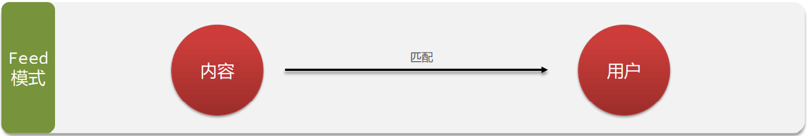


**Feed流的模式** 

Feed流产品有两种常见模式： 

- Timeline：不做内容筛选，简单的按照内容发布时间排序，常用于好友或关注。例如朋友圈 
  - ➢ 优点：信息全面，不会有缺失。并且实现也相对简单 
  - ➢ 缺点：信息噪音较多，用户不一定感兴趣，内容获取效率低 
- 智能排序[Rank]：利用智能算法屏蔽掉违规的、用户不感兴趣的内容。推送用户感兴趣信息来吸引用户 

  - ➢ 优点：投喂用户感兴趣信息，用户粘度很高，容易沉迷 
  - ➢ 缺点：如果算法不精准，可能起到反作用 


## Feed流 Timeline模式


Feed流，Timeline的模式，该模式的实现方案有三种： 

1. 拉模式 
2. 推模式 
3. 推拉结合


### 拉模式

---

 	

---


### 推模式

---


---


### 推拉结合

---


---


### Feed流的实现方案

---


---


## 案例分析


###  案例要求：

点击关注后，会查询出该用户关注的其他用户的博客，按时间降序排列，滚动分页。


使用 Timeline模式 的 推模式


接口：

---


---


### Redis的类型选择


使用 SortedSet 数据类型

- key : `feed:user: + 用户id`
- member：`关注用户的博客id (被关注者发布的博客)`
- score：`博客发布的时间戳`

当一个用户发布博客时`被关注者发布的博客id`，

根据当前用户，查询所有的关注者，

得到所有关注者的id 即： `feed:user: + 用户id` 后，

保存到 Redis 当中：


### 要使用的命令


发布订阅时，向用户推送，被关在的用户会保存该博客id


- reids命令：`zadd feed:user:3 5 521 `  id为x的用户，在521时刻，发布了id为5的博客，并推送给了id为3用户。
- java命令： ` stringRedisTemplate.opsForZSet().add(key,blog.getId().toString(),System.currentTimeMillis());`


用户获取订阅的内容，可以进行分页


- reids命令：`ZREMRANGEBYSCORE follow:user:5 最大时间戳 0 withscores limit 0 3` 首次

- reids命令：`ZREMRANGEBYSCORE follow:user:5 上次最小时间戳 0 withscores limit 上次最小时间戳次数 3` 下次

- java命令： `stringRedisTemplate.opsForZSet().reverseRangeByScoreWithScores(key, 0, maxTime, offset, 2);`

  - 返回一个 `ZSetOperations.TypedTuple<String>>` 

  - ```java
    //TypedTuple接口
    
    @Nullable
    V getValue(); //成员
    
    @Nullable
    Double getScore(); //分数
    ```


---

### ===开始实现===

---


### 返回给前端实体

用于分页擦寻后 返回的数据

```java
package com.hmdp.dto;

import lombok.Data;

import java.util.List;

@Data
public class ScoreResult {

    //分页后的数据
    private List<?> list;
    //最小时间戳 用于下次请求分页
    private Long minTime;
    //最小时间戳出现的次数 用于下次请求分页的偏移量
    private Integer offset;

}
```


### [发布] 信息的发布

保存博客 并 实现推送功能


```java
/**
 * 接口
 *
 * 保存博客 并 推送
 */
@PostMapping
public Result saveBlog(@RequestBody Blog blog) {
    //保存博客 并推送Feed流
    return blogService.saveBlog(blog);
}


/**
 * 业务
 *
 * 保存博客 并 推送
 * @param blog
 * @return
 */
@Override
public Result saveBlog(Blog blog) {
    // 获取登录用户
    UserDTO user = UserHolder.getUser();
    blog.setUserId(user.getId());
    // 保存探店博文
    boolean isSuccess = save(blog);
    if (!isSuccess){
        return Result.fail("新增笔记失败！");
    }
    // 推送给关注的 用户 Feet流 推模式
    //1.获取粉丝id
    List<Follow> follows = followService.query().eq("follow_user_id", UserHolder.getUser().getId()).list();
    //2.推送到邮箱当中
    for (Follow follow: follows) {
        //3.以 SortedSet 类型存储
        String key = FEED_USER_KEY + follow.getUserId();
        stringRedisTemplate.opsForZSet().add(key,blog.getId().toString(),System.currentTimeMillis());
    }
    
    // 返回 id
    return Result.ok(blog.getId());
}
```


### [接收] 滚动分页查询的实现


```java
/**
 * 前端控制器
 * 
 * 分页查询当前用户 关注用户的博客
 *      Feed流 取
 * @param maxTime
 * @param offset
 * @return
 */
@GetMapping("/of/follow")
private Result queryOfFollow(@RequestParam("lastId") Long maxTime,
                             @RequestParam(value = "offset",defaultValue = "0") Integer offset){
    return blogService.queryOfFollow(maxTime,offset);
}


/**
 * 业务层
 * 
 * 分页查询当前用户 关注用户的博客
 * @param maxTime
 * @param offset
 * @return
 */
@Override
public Result queryOfFollow(Long maxTime, Integer offset) {
    //1.获取用户id
    Long userId = UserHolder.getUser().getId();
    //2.从Redis用户信箱中取出 关注用的发布的博客
    String key = FEED_USER_KEY + userId.toString();
    Set<ZSetOperations.TypedTuple<String>> typedTuples = stringRedisTemplate
                    .opsForZSet()
                    .reverseRangeByScoreWithScores(key, 0, maxTime, offset, 2);
    //3.判断邮件是否为空
    if (ObjectUtil.isEmpty(typedTuples)){
        return Result.ok();
    }

    //4.进行解析 博客id集合 当前页最小时间戳:minTime 最小时间戳出现的次数
    ArrayList<Long> blogIds = new ArrayList<>(typedTuples.size());
    long minTime = 0;
    int minCount = 1;
    for (ZSetOperations.TypedTuple<String> tuple : typedTuples) {
        //关注的博客id
        Long blogId = Long.valueOf(tuple.getValue());
        blogIds.add(blogId);
        //获取最小分数 和 最小分数个数
        long score = tuple.getScore().longValue();
        if (score == minTime){
            minCount ++;
        }else{
            minTime = score;
            minCount = 1;
        }
    }

    //5.根据 博客id集合 查询博客对象
    String idStr = StrUtil.join(",", blogIds);
    List<Blog> blogs = query()
            .in("id", blogIds)
            .last("order by field(id," + idStr + ")")
            .list();
    //给博客封装非数据库字段
    blogs.forEach(blog -> {
        //封装后的 blog 对象
        queryUserBlog(blog);
        // 判断用户是否点赞
        isLiked(blog);
    });

    //6.封装 ScoreResult 对象
    ScoreResult scoreResult = new ScoreResult();
    scoreResult.setList(blogs);
    scoreResult.setMinTime(minTime);
    scoreResult.setOffset(minCount);

    //7.返回个前端
    return Result.ok(scoreResult);
}
```


# Redis解决 [地理] [附近店铺]


## 分析


**附近商户搜索**


**使用GEO数据类型**

GEO就是Geolocation的简写形式，代表地理坐标。

Redis在3.2版本中加入了对GEO的支持，允许存储地理坐标信息，帮助我们根据经纬度来检索数据。


**要使用的命令**


添加地理坐标


获取相对 位置/距离


## 接口


```java
/**
 * 根据商铺类型分页查询商铺信息
 * @param typeId 商铺类型
 * @param current 页码
 * @param x 经度
 * @param y 维度
 * @return 商铺列表
 */
@GetMapping("/of/type")
public Result queryShopByType(
        @RequestParam("typeId") Integer typeId,
        @RequestParam(value = "current", defaultValue = "1") Integer current,
        @RequestParam(value = "x",required = false) Double x,
        @RequestParam(value = "y",required = false) Double y
) {
    return shopService.queryShopByType(typeId, current, x, y);
}
```


## 添加地理坐标


```java
package com.ganga;

import com.ganga.entity.Shop;
import com.ganga.service.IShopService;
import org.junit.jupiter.api.Test;
import org.springframework.boot.test.context.SpringBootTest;
import org.springframework.data.geo.Point;
import org.springframework.data.redis.connection.RedisGeoCommands;
import org.springframework.data.redis.core.StringRedisTemplate;
import org.springframework.test.context.ContextConfiguration;

import javax.annotation.Resource;
import java.util.ArrayList;
import java.util.List;
import java.util.Map;
import java.util.stream.Collectors;

import static com.ganga.utils.RedisConstants.SHOP_GEO_KEY;

@SpringBootTest
@ContextConfiguration(classes = GEOApp.class)
public class RedisGEOShopTest {

    @Resource
    private IShopService shopService;

    @Resource
    private StringRedisTemplate stringRedisTemplate;

    /**
     * 查询所有商铺 将 [店铺类型] [id] [经纬度] 存入Redis当中
     * 数据类型: GEO
     * key:     店铺类型
     * member:  店铺id
     * score:   经纬度
     */
    @Test
    void addEGORedisShop(){
        //1.获取所有店铺
        List<Shop> shopList = shopService.list();
        //2.根据店铺类型进行分组
        Map<Long, List<Shop>> collect = shopList.stream().collect(Collectors.groupingBy(Shop::getTypeId));
        //3.添加到 Redis 当中
        collect.forEach((typeId, value) -> {
            //3.1.获取店铺类型id key
            String key = SHOP_GEO_KEY + typeId.toString();
            //3.2.同种店铺封装到集合当中 [店铺] + [经纬坐标] 封装成 RedisGeoCommands.GeoLocation<String>>
            ArrayList<RedisGeoCommands.GeoLocation<String>> location = new ArrayList<>();
            value.forEach(shop -> location.add(new RedisGeoCommands.GeoLocation<>(shop.getId().toString(), new Point(shop.getX(), shop.getY()))));
            //3.3.写入 Redis 当中
            stringRedisTemplate.opsForGeo().add(key, location);
        });
    }

}
```


## 分页查询


```java
/**
 * 根据商铺类型分页查询商铺信息
 * @param typeId 商铺类型
 * @param current 页码
 * @param x 经度
 * @param y 维度
 * @return 商铺列表
 */
@Override
public Result queryShopByType(Integer typeId, Integer current, Double x, Double y) {

    //1.判断是否需要通过 [地理坐标查询] 店铺
    if (x == null || y == null){
        //不通过地理坐标查询 使用数据库查询
        Page<Shop> page = query()
                .eq("type_id", typeId)
                .page(new Page<>(current, SystemConstants.DEFAULT_PAGE_SIZE));
        return Result.ok(page.getRecords());
    }
    //使用地理坐标查询
    //2.分页参数
    int from = (current - 1) * SystemConstants.DEFAULT_PAGE_SIZE; //size = 5
    int end =  current * SystemConstants.DEFAULT_PAGE_SIZE;
    //3.从 Redis 获取 GEO 数据
    String key = SHOP_GEO_KEY + typeId.toString();
    GeoResults<RedisGeoCommands.GeoLocation<String>> search = stringRedisTemplate.opsForGeo()
            .search(
                    key, //shop:geo:店铺类型id
                    GeoReference.fromCoordinate(x, y),//圆心:用户当前坐标
                    new Distance(5000),//半径距离 默认是米
                    RedisGeoCommands //返回结果带上距离
                            .GeoSearchCommandArgs
                            .newGeoSearchArgs()
                            .includeDistance() //返回结果 包含坐标！
                            .limit(end) //这里只能 0 - end
            );
    if (search == null){
        return Result.ok(Collections.emptyList());
    }
    //4.解析数据
    List<GeoResult<RedisGeoCommands.GeoLocation<String>>> content = search.getContent();

    if (content.size() <= from) return Result.ok(Collections.emptyList());
    ArrayList<Long> ids = new ArrayList<>(content.size());
    HashMap<String, Distance> dis = new HashMap<>();
    //5.逻辑分页 + 解析 店铺id、店铺距离
    content.stream().skip(from).forEach(data ->{
        //店铺id
        String shopId = data.getContent().getName();
        ids.add(Long.valueOf(data.getContent().getName()));
        //店铺距离
        dis.put(shopId,data.getDistance());
        Distance distance = data.getDistance();
    });
    //6.根据 店铺id 查询店铺
    String join = StrUtil.join(",", ids);
    List<Shop> shops = query()
            .in("id", ids)
            .last("order by field(id," + join + ")")
            .list();
    //7.封装: shop + 地理位置
    shops.forEach(shop -> shop.setDistance(dis.get(shop.getId().toString()).getValue()));
    //8.返回给前端
    return Result.ok(shops);
}
```


## Redis存储


## 实现效果

<video src="MD图片/我的Redis笔记.assets/ego.mp4" type="video/mp4" controls></video>


# Redis解决 [签到] [BitMap]


## 案例分析


>## 要求
>
>
>
>


**如果使用数据库记录**

---


---

```mysql
CREATE TABLE `tb_sign` (
  `id` bigint(20) unsigned NOT NULL AUTO_INCREMENT COMMENT '主键',
  `user_id` bigint(20) unsigned NOT NULL COMMENT '用户id',
  `year` year(4) NOT NULL COMMENT '签到的年',
  `month` tinyint(2) NOT NULL COMMENT '签到的月',
  `date` date NOT NULL COMMENT '签到的日期',
  `is_backup` tinyint(1) unsigned DEFAULT NULL COMMENT '是否补签',
  PRIMARY KEY (`id`) USING BTREE
) ENGINE=InnoDB DEFAULT CHARSET=utf8mb4 ROW_FORMAT=COMPACT;
```

假如有1000万用户，平均每人每年签到次数为10次，

则这张表一年的数据量为 1亿条 每签到一次需要使用（8 + 8 + 1 + 1 + 3 + 1）共22 字节的内存，

一个月则最多需要600多字节


## 使用 BitMap数据结构 --位图


把每一个bit位对应当月的每一天，形成了映射关系。

用 `0` 和 `1` 标示业务状态，这种思路就称为位图


要使用的命令


## 解决方案


签到好解决，是需要使用 **`setbit sign:用户ID:年月 当月几号-1`**即可。


判断 连续签到 [从最后一次签到开始向前统计，直到遇到第一次未签到为止，计算总的签到次数，就是连续签到天数。]


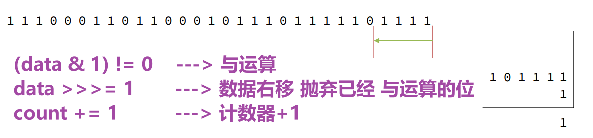

实现：

```java
int count = 0;
while(true){
    if ( (signBit & 1) == 0 ){
        //未签到
        break;
    }else{
        //计数器 +1
        count ++;
        //原数据 右移
        signBit >>>= 1;
    }
}
```


## 前端控制器


```java
/**
 * 用户签到
 * @return
 */
@PostMapping("/sign")
public Result userSign(){
    return userService.userSign();
}

/**
 * 用户今天开始 连续签到次数
 * @return
 */
@GetMapping("/sign/count")
public Result userSignCount(){
    return userService.userSignCount();
}
```


## 业务实现


```java
/**
 * 签到功能
 * @return
 */
@Override
public Result userSign() {
    //1.获取用户id
    Long id = UserHolder.getUser().getId();
    //2.1.获取当前时间
    LocalDateTime now = LocalDateTime.now();
    String format = now.format(DateTimeFormatter.ofPattern(":yyyyMM"));
    //2.2.获取偏移量 -> 当月的第几天 几号
    //[注意]：这里从 0 开始 28号 偏移量就是 27
    int offset = now.getDayOfMonth() - 1;
    //3.获取key
    String key = USER_SIGN_KEY + id + format;
    //4.写入 Redis 实现签到
    Boolean is = stringRedisTemplate.opsForValue().getBit(key, offset);
    if (BooleanUtil.isTrue(is)){
        return Result.ok("今日已经签到过咯~");
    }
    Boolean isSuccess = stringRedisTemplate.opsForValue().setBit(key, offset, true);
    //5.返回前端
    if (BooleanUtil.isFalse(isSuccess)){
        return Result.ok("签到成功！");
    }
    return Result.fail("签到失败！");
}

// sign::202211
// 0000 0000 0000 0000 0000 0000 0000 1000  <-- -1
// 4 X 7 + 1 - 1 = 28号

@Override
public Result userSignCount() {
    //1.获取用户id
    Long id = UserHolder.getUser().getId();
    //2.1.获取当前时间
    LocalDateTime now = LocalDateTime.now();
    String format = now.format(DateTimeFormatter.ofPattern(":yyyyMM"));
    //2.2.获取偏移量 -> 当月的第几天 几号
    //[注意]：这里从 1 开始  28号 偏移量就是 28
    int offset = now.getDayOfMonth();
    //3.获取key
    String key = USER_SIGN_KEY + id + format;
    //4.从 Redis 中拿到数据
    List<Long> lists = stringRedisTemplate.opsForValue().bitField(
            key,
            BitFieldSubCommands
                    .create() // get查询   unsigned()不带符号 -> 参数:偏移量
                    .get(BitFieldSubCommands.BitFieldType.unsigned(offset))
                    .valueAt(0)
    );
    //5.解析 + 健壮性判断
    if (ObjectUtils.isEmpty(lists)){
        return Result.ok(0);
    }
    Long signBit = lists.get(0);
    if (ObjectUtils.isEmpty(signBit)){
        return Result.ok(0);
    }
    //6.获取连续签到次数
    int count = 0;
    while(true){
        if ( (signBit & 1) == 0 ){
            //未签到
            break;
        }else{
            //计数器 +1
            count ++;
            //原数据 右移
            signBit >>>= 1;
        }
    }
    //7.返回前端数据
    return Result.ok(count);
}
```


# Redis解决 [统计] [UV统计]


## HyperLogLog用法


首先我们搞懂两个概念： 

- UV：全称Unique Visitor，也叫独立访客量，是指通过互联网访问、浏览这个网页的自然人。1天内同一个用户多次 访问该网站，只记录1次。
- PV：全称Page View，也叫页面访问量或点击量，用户每访问网站的一个页面，记录1次PV，用户多次打开页面，则 记录多次PV。往往用来衡量网站的流量。


UV统计在服务端做会比较麻烦，因为要判断该用户是否已经统计过了，需要将统计过的用户信息保存。

但是如果每个访 问的用户都保存到Redis中，数据量会非常恐怖


Hyperloglog(HLL)是从Loglog算法派生的概率算法，用于确定非常大的集合的基数，而不需要存储其所有值。

相关算法 原理大家可以参考：https://juejin.cn/post/6844903785744056333#heading-0 Redis中的HLL是**基于string结构**实现的，**单个HLL的内存永远小于16kb**，内存占用低的令人发指！作为代价，其测量结 果是概率性的，**有小于0.81％的误差**。不过对于UV统计来说，这完全可以忽略。


## Redis实现 UV统计


```java
package com.ganga;

import org.junit.jupiter.api.Test;
import org.springframework.beans.factory.annotation.Autowired;
import org.springframework.boot.test.context.SpringBootTest;
import org.springframework.data.redis.core.StringRedisTemplate;
import org.springframework.util.ObjectUtils;

@SpringBootTest(classes = HyperLogLog.class)
public class UVTests {

    @Autowired
    private StringRedisTemplate stringRedisTemplate;

    /**
     * Redis 实现 UV 统计
     * 生成 10万 条数据写入Redis 并统计
     */
    @Test
    void uvTest(){

        String[] array = new String[1000];
        int j = 0;
        for (int i = 0; i < 100000; i++) {
            j = i % 1000;
            array[j] = "user_id:" + i;
            if (j == 999){
                stringRedisTemplate.opsForHyperLogLog().add("uv:user",array);
            }
        }

        if (!ObjectUtils.isEmpty(array)){
            stringRedisTemplate.opsForHyperLogLog().add("uv:user",array);
        }

    }

    @Test
    void uvGetTest(){
        Long size = stringRedisTemplate.opsForHyperLogLog().size("uv:user");
        System.out.println(size);
    }

    @Test
    void uvRmTest(){
        stringRedisTemplate.delete("uv:user");
    }

}
```


---

---

---


# ===============

# Redis [高级]


---

---

---


# Redis集群哨兵分片

本章是基于CentOS7下的Redis集群教程，包括：

- 单机安装Redis
- Redis主从
- Redis分片集群


## 单机安装Redis

首先需要安装Redis所需要的依赖：

```sh
yum install -y gcc tcl
```


然后将课前资料提供的Redis安装包上传到虚拟机的任意目录：


例如，我放到了/tmp目录：


解压缩：

```sh
tar -xzf redis-6.2.4.tar.gz
```

解压后：


进入redis目录：

```sh
cd redis-6.2.4
```


运行编译命令：

```sh
make && make install
```

如果没有出错，应该就安装成功了。

然后修改redis.conf文件中的一些配置：

```properties
# 绑定地址，默认是127.0.0.1，会导致只能在本地访问。修改为0.0.0.0则可以在任意IP访问
bind 0.0.0.0
# 保护模式，关闭保护模式
protected-mode no
# 数据库数量，设置为1
databases 1
```


启动Redis：

```sh
redis-server redis.conf
```

停止redis服务：

```sh
redis-cli shutdown
```


## Redis主从集群


### 1.集群结构

我们搭建的主从集群结构如图：

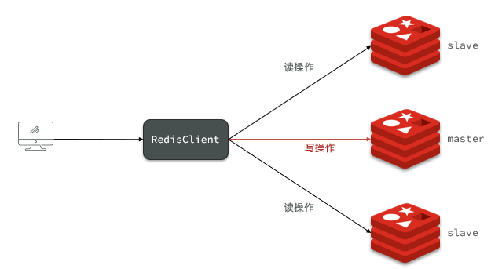

共包含三个节点，一个主节点，两个从节点。

这里我们会在同一台虚拟机中开启3个redis实例，模拟主从集群，信息如下：

|       IP        | PORT |  角色  |
| :-------------: | :--: | :----: |
| 192.168.150.101 | 7001 | master |
| 192.168.150.101 | 7002 | slave  |
| 192.168.150.101 | 7003 | slave  |

### 2.准备实例和配置

要在同一台虚拟机开启3个实例，必须准备三份不同的配置文件和目录，配置文件所在目录也就是工作目录。

1）创建目录

我们创建三个文件夹，名字分别叫7001、7002、7003：

```sh
# 进入/tmp目录
cd /tmp
# 创建目录
mkdir 7001 7002 7003
```

如图：


2）恢复原始配置

修改redis-6.2.4/redis.conf文件，将其中的持久化模式改为默认的RDB模式，AOF保持关闭状态。

```properties
# 开启RDB
# save ""
save 3600 1
save 300 100
save 60 10000

# 关闭AOF
appendonly no
```


3）拷贝配置文件到每个实例目录

然后将redis-6.2.4/redis.conf文件拷贝到三个目录中（在/tmp目录执行下列命令）：

```sh
# 方式一：逐个拷贝
cp redis-6.2.4/redis.conf 7001
cp redis-6.2.4/redis.conf 7002
cp redis-6.2.4/redis.conf 7003

# 方式二：管道组合命令，一键拷贝
echo 7001 7002 7003 | xargs -t -n 1 cp redis-6.2.4/redis.conf
```


4）修改每个实例的端口、工作目录

修改每个文件夹内的配置文件，将端口分别修改为7001、7002、7003，将rdb文件保存位置都修改为自己所在目录（在/tmp目录执行下列命令）：

```sh
sed -i -e 's/6379/7001/g' -e 's/dir .\//dir \/tmp\/7001\//g' 7001/redis.conf
sed -i -e 's/6379/7002/g' -e 's/dir .\//dir \/tmp\/7002\//g' 7002/redis.conf
sed -i -e 's/6379/7003/g' -e 's/dir .\//dir \/tmp\/7003\//g' 7003/redis.conf
```


5）修改每个实例的声明IP

虚拟机本身有多个IP，为了避免将来混乱，我们需要在redis.conf文件中指定每一个实例的绑定ip信息，格式如下：

```properties
# redis实例的声明 IP
replica-announce-ip 192.168.150.101
```


每个目录都要改，我们一键完成修改（在/tmp目录执行下列命令）：

```sh
# 逐一执行
sed -i '1a replica-announce-ip 192.168.150.101' 7001/redis.conf
sed -i '1a replica-announce-ip 192.168.150.101' 7002/redis.conf
sed -i '1a replica-announce-ip 192.168.150.101' 7003/redis.conf

# 或者一键修改
printf '%s\n' 7001 7002 7003 | xargs -I{} -t sed -i '1a replica-announce-ip 192.168.150.101' {}/redis.conf
```


### 3.启动

为了方便查看日志，我们打开3个ssh窗口，分别启动3个redis实例，启动命令：

```sh
# 第1个
redis-server 7001/redis.conf
# 第2个
redis-server 7002/redis.conf
# 第3个
redis-server 7003/redis.conf
```


启动后：


如果要一键停止，可以运行下面命令：

```sh
printf '%s\n' 7001 7002 7003 | xargs -I{} -t redis-cli -p {} shutdown
```


### 4.开启主从关系

现在三个实例还没有任何关系，要配置主从可以使用replicaof 或者slaveof（5.0以前）命令。

有临时和永久两种模式：

- 修改配置文件（永久生效）

  - 在redis.conf中添加一行配置：```slaveof <masterip> <masterport>```

- 使用redis-cli客户端连接到redis服务，执行slaveof命令（重启后失效）：

  ```sh
  slaveof <masterip> <masterport>
  ```


<strong><font color='red'>注意</font></strong>：在5.0以后新增命令replicaof，与salveof效果一致。


这里我们为了演示方便，使用方式二。

通过redis-cli命令连接7002，执行下面命令：

```sh
# 连接 7002
redis-cli -p 7002
# 执行slaveof
slaveof 192.168.150.101 7001
```


通过redis-cli命令连接7003，执行下面命令：

```sh
# 连接 7003
redis-cli -p 7003
# 执行slaveof
slaveof 192.168.150.101 7001
```


然后连接 7001节点，查看集群状态：

```sh
# 连接 7001
redis-cli -p 7001
# 查看状态
info replication
```

结果：


### 5.测试

执行下列操作以测试：

- 利用redis-cli连接7001，执行```set num 123```

- 利用redis-cli连接7002，执行```get num```，再执行```set num 666```

- 利用redis-cli连接7003，执行```get num```，再执行```set num 888```


可以发现，只有在7001这个master节点上可以执行写操作，7002和7003这两个slave节点只能执行读操作。


## 搭建哨兵集群


### 1.集群结构

这里我们搭建一个三节点形成的Sentinel集群，来监管之前的Redis主从集群。如图：


三个sentinel实例信息如下：

| 节点 |       IP        | PORT  |
| ---- | :-------------: | :---: |
| s1   | 192.168.150.101 | 27001 |
| s2   | 192.168.150.101 | 27002 |
| s3   | 192.168.150.101 | 27003 |

### 2.准备实例和配置

要在同一台虚拟机开启3个实例，必须准备三份不同的配置文件和目录，配置文件所在目录也就是工作目录。

我们创建三个文件夹，名字分别叫s1、s2、s3：

```sh
# 进入/tmp目录
cd /tmp
# 创建目录
mkdir s1 s2 s3
```

如图：


然后我们在s1目录创建一个sentinel.conf文件，添加下面的内容：

```ini
port 27001
sentinel announce-ip 192.168.150.101
sentinel monitor mymaster 192.168.150.101 7001 2
sentinel down-after-milliseconds mymaster 5000
sentinel failover-timeout mymaster 60000
dir "/tmp/s1"
```

解读：

- `port 27001`：是当前sentinel实例的端口
- `sentinel monitor mymaster 192.168.150.101 7001 2`：指定主节点信息
  - `mymaster`：主节点名称，自定义，任意写
  - `192.168.150.101 7001`：主节点的ip和端口
  - `2`：选举master时的quorum值


然后将s1/sentinel.conf文件拷贝到s2、s3两个目录中（在/tmp目录执行下列命令）：

```sh
# 方式一：逐个拷贝
cp s1/sentinel.conf s2
cp s1/sentinel.conf s3
# 方式二：管道组合命令，一键拷贝
echo s2 s3 | xargs -t -n 1 cp s1/sentinel.conf
```


修改s2、s3两个文件夹内的配置文件，将端口分别修改为27002、27003：

```sh
sed -i -e 's/27001/27002/g' -e 's/s1/s2/g' s2/sentinel.conf
sed -i -e 's/27001/27003/g' -e 's/s1/s3/g' s3/sentinel.conf
```


### 3.启动

为了方便查看日志，我们打开3个ssh窗口，分别启动3个redis实例，启动命令：

```sh
# 第1个
redis-sentinel s1/sentinel.conf
# 第2个
redis-sentinel s2/sentinel.conf
# 第3个
redis-sentinel s3/sentinel.conf
```


启动后：


### 4.测试

尝试让master节点7001宕机，查看sentinel日志：


查看7003的日志：

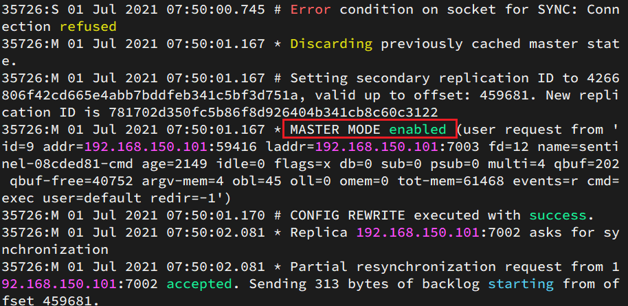

查看7002的日志：


## 搭建分片集群


### 1.集群结构

分片集群需要的节点数量较多，这里我们搭建一个最小的分片集群，包含3个master节点，每个master包含一个slave节点，结构如下：


这里我们会在同一台虚拟机中开启6个redis实例，模拟分片集群，信息如下：

|       IP        | PORT |  角色  |
| :-------------: | :--: | :----: |
| 192.168.150.101 | 7001 | master |
| 192.168.150.101 | 7002 | master |
| 192.168.150.101 | 7003 | master |
| 192.168.150.101 | 8001 | slave  |
| 192.168.150.101 | 8002 | slave  |
| 192.168.150.101 | 8003 | slave  |


### 2.准备实例和配置

删除之前的7001、7002、7003这几个目录，重新创建出7001、7002、7003、8001、8002、8003目录：

```sh
# 进入/tmp目录
cd /tmp
# 删除旧的，避免配置干扰
rm -rf 7001 7002 7003
# 创建目录
mkdir 7001 7002 7003 8001 8002 8003
```


在/tmp下准备一个新的redis.conf文件，内容如下：

```ini
port 6379
# 开启集群功能
cluster-enabled yes
# 集群的配置文件名称，不需要我们创建，由redis自己维护
cluster-config-file /tmp/6379/nodes.conf
# 节点心跳失败的超时时间
cluster-node-timeout 5000
# 持久化文件存放目录
dir /tmp/6379
# 绑定地址
bind 0.0.0.0
# 让redis后台运行
daemonize yes
# 注册的实例ip
replica-announce-ip 192.168.150.101
# 保护模式
protected-mode no
# 数据库数量
databases 1
# 日志
logfile /tmp/6379/run.log
```

将这个文件拷贝到每个目录下：

```sh
# 进入/tmp目录
cd /tmp
# 执行拷贝
echo 7001 7002 7003 8001 8002 8003 | xargs -t -n 1 cp redis.conf
```


修改每个目录下的redis.conf，将其中的6379修改为与所在目录一致：

```sh
# 进入/tmp目录
cd /tmp
# 修改配置文件
printf '%s\n' 7001 7002 7003 8001 8002 8003 | xargs -I{} -t sed -i 's/6379/{}/g' {}/redis.conf
```


### 3.启动

因为已经配置了后台启动模式，所以可以直接启动服务：

```sh
# 进入/tmp目录
cd /tmp
# 一键启动所有服务
printf '%s\n' 7001 7002 7003 8001 8002 8003 | xargs -I{} -t redis-server {}/redis.conf
```

通过ps查看状态：

```sh
ps -ef | grep redis
```

发现服务都已经正常启动：


如果要关闭所有进程，可以执行命令：

```sh
ps -ef | grep redis | awk '{print $2}' | xargs kill
```

或者（推荐这种方式）：

```sh
printf '%s\n' 7001 7002 7003 8001 8002 8003 | xargs -I{} -t redis-cli -p {} shutdown
```


### 4.创建集群

虽然服务启动了，但是目前每个服务之间都是独立的，没有任何关联。

我们需要执行命令来创建集群，在Redis5.0之前创建集群比较麻烦，5.0之后集群管理命令都集成到了redis-cli中。


1）Redis5.0之前

Redis5.0之前集群命令都是用redis安装包下的src/redis-trib.rb来实现的。因为redis-trib.rb是有ruby语言编写的所以需要安装ruby环境。

 ```sh
# 安装依赖
yum -y install zlib ruby rubygems
gem install redis
 ```


然后通过命令来管理集群：

```sh
# 进入redis的src目录
cd /tmp/redis-6.2.4/src
# 创建集群
./redis-trib.rb create --replicas 1 192.168.150.101:7001 192.168.150.101:7002 192.168.150.101:7003 192.168.150.101:8001 192.168.150.101:8002 192.168.150.101:8003
```


2）Redis5.0以后

我们使用的是Redis6.2.4版本，集群管理以及集成到了redis-cli中，格式如下：

```sh
redis-cli --cluster create --cluster-replicas 1 192.168.150.101:7001 192.168.150.101:7002 192.168.150.101:7003 192.168.150.101:8001 192.168.150.101:8002 192.168.150.101:8003
```

命令说明：

- `redis-cli --cluster`或者`./redis-trib.rb`：代表集群操作命令
- `create`：代表是创建集群
- `--replicas 1`或者`--cluster-replicas 1` ：指定集群中每个master的副本个数为1，此时`节点总数 ÷ (replicas + 1)` 得到的就是master的数量。因此节点列表中的前n个就是master，其它节点都是slave节点，随机分配到不同master


运行后的样子：


这里输入yes，则集群开始创建：


通过命令可以查看集群状态：

```sh
redis-cli -p 7001 cluster nodes
```


### 5.测试

尝试连接7001节点，存储一个数据：

```sh
# 连接
redis-cli -p 7001
# 存储数据
set num 123
# 读取数据
get num
# 再次存储
set a 1
```

结果悲剧了：


集群操作时，需要给`redis-cli`加上`-c`参数才可以：

```sh
redis-cli -c -p 7001
```

这次可以了：


# Redis分布式缓存

-- 基于Redis集群解决单机Redis存在的问题


单机的Redis存在四大问题：


## 1.Redis持久化

Redis有两种持久化方案：

- RDB持久化
- AOF持久化


### 1.1.RDB持久化

RDB全称Redis Database Backup file（Redis数据备份文件），也被叫做Redis数据快照。简单来说就是把内存中的所有数据都记录到磁盘中。当Redis实例故障重启后，从磁盘读取快照文件，恢复数据。快照文件称为RDB文件，默认是保存在当前运行目录。

#### 1.1.1.执行时机

RDB持久化在四种情况下会执行：

- 执行save命令
- 执行bgsave命令
- Redis停机时
- 触发RDB条件时


**1）save命令**

执行下面的命令，可以立即执行一次RDB：

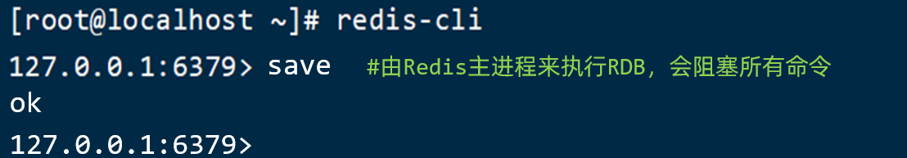

save命令会导致主进程执行RDB，这个过程中其它所有命令都会被阻塞。只有在数据迁移时可能用到。


**2）bgsave命令**

下面的命令可以异步执行RDB：


这个命令执行后会开启独立进程完成RDB，主进程可以持续处理用户请求，不受影响。


**3）停机时**

Redis停机时会执行一次save命令，实现RDB持久化。


**4）触发RDB条件**

Redis内部有触发RDB的机制，可以在redis.conf文件中找到，格式如下：

```properties
# 900秒内，如果至少有1个key被修改，则执行bgsave ， 如果是save "" 则表示禁用RDB
save 900 1  
save 300 10  
save 60 10000 
```


RDB的其它配置也可以在redis.conf文件中设置：

```properties
# 是否压缩 ,建议不开启，压缩也会消耗cpu，磁盘的话不值钱
rdbcompression yes

# RDB文件名称
dbfilename dump.rdb  

# 文件保存的路径目录
dir ./ 
```


#### 1.1.2.RDB原理

bgsave开始时会fork主进程得到子进程，子进程共享主进程的内存数据。完成fork后读取内存数据并写入 RDB 文件。

fork采用的是copy-on-write技术：

- 当主进程执行读操作时，访问共享内存；
- 当主进程执行写操作时，则会拷贝一份数据，执行写操作。


#### 1.1.3.小结

RDB方式bgsave的基本流程？

- fork主进程得到一个子进程，共享内存空间
- 子进程读取内存数据并写入新的RDB文件
- 用新RDB文件替换旧的RDB文件

RDB会在什么时候执行？save 60 1000代表什么含义？

- 默认是服务停止时
- 代表60秒内至少执行1000次修改则触发RDB

RDB的缺点？

- RDB执行间隔时间长，两次RDB之间写入数据有丢失的风险
- fork子进程、压缩、写出RDB文件都比较耗时


### 1.2.AOF持久化


#### 1.2.1.AOF原理

AOF全称为Append Only File（追加文件）。Redis处理的每一个写命令都会记录在AOF文件，可以看做是命令日志文件。


#### 1.2.2.AOF配置

AOF默认是关闭的，需要修改redis.conf配置文件来开启AOF：

```properties
# 是否开启AOF功能，默认是no
appendonly yes
# AOF文件的名称
appendfilename "appendonly.aof"
```


AOF的命令记录的频率也可以通过redis.conf文件来配：

```properties
# 表示每执行一次写命令，立即记录到AOF文件
appendfsync always 
# 写命令执行完先放入AOF缓冲区，然后表示每隔1秒将缓冲区数据写到AOF文件，是默认方案
appendfsync everysec 
# 写命令执行完先放入AOF缓冲区，由操作系统决定何时将缓冲区内容写回磁盘
appendfsync no
```


三种策略对比：


#### 1.2.3.AOF文件重写

因为是记录命令，AOF文件会比RDB文件大的多。而且AOF会记录对同一个key的多次写操作，但只有最后一次写操作才有意义。通过执行bgrewriteaof命令，可以让AOF文件执行重写功能，用最少的命令达到相同效果。


如图，AOF原本有三个命令，但是`set num 123 和 set num 666`都是对num的操作，第二次会覆盖第一次的值，因此第一个命令记录下来没有意义。

所以重写命令后，AOF文件内容就是：`mset name jack num 666`


Redis也会在触发阈值时自动去重写AOF文件。阈值也可以在redis.conf中配置：

```properties
# AOF文件比上次文件 增长超过多少百分比则触发重写
auto-aof-rewrite-percentage 100
# AOF文件体积最小多大以上才触发重写 
auto-aof-rewrite-min-size 64mb 
```


### 1.3.RDB与AOF对比

RDB和AOF各有自己的优缺点，如果对数据安全性要求较高，在实际开发中往往会**结合**两者来使用。


## 2.Redis主从

### 2.1.搭建主从架构

单节点Redis的并发能力是有上限的，要进一步提高Redis的并发能力，就需要搭建主从集群，实现读写分离。


具体搭建流程参考课前资料《Redis集群.md》：

 


### 2.2.主从数据同步原理


#### 2.2.1.全量同步

主从第一次建立连接时，会执行**全量同步**，将master节点的所有数据都拷贝给slave节点，流程：


这里有一个问题，master如何得知salve是第一次来连接呢？？

有几个概念，可以作为判断依据：

- **Replication Id**：简称replid，是数据集的标记，id一致则说明是同一数据集。每一个master都有唯一的replid，slave则会继承master节点的replid
- **offset**：偏移量，随着记录在repl_baklog中的数据增多而逐渐增大。slave完成同步时也会记录当前同步的offset。如果slave的offset小于master的offset，说明slave数据落后于master，需要更新。

因此slave做数据同步，必须向master声明自己的replication id 和offset，master才可以判断到底需要同步哪些数据。


因为slave原本也是一个master，有自己的replid和offset，当第一次变成slave，与master建立连接时，发送的replid和offset是自己的replid和offset。

master判断发现slave发送来的replid与自己的不一致，说明这是一个全新的slave，就知道要做全量同步了。

master会将自己的replid和offset都发送给这个slave，slave保存这些信息。以后slave的replid就与master一致了。

因此，**master判断一个节点是否是第一次同步的依据，就是看replid是否一致**。

如图：


完整流程描述：

- slave节点请求增量同步
- master节点判断replid，发现不一致，拒绝增量同步
- master将完整内存数据生成RDB，发送RDB到slave
- slave清空本地数据，加载master的RDB
- master将RDB期间的命令记录在repl_baklog，并持续将log中的命令发送给slave
- slave执行接收到的命令，保持与master之间的同步


#### 2.2.2.增量同步

全量同步需要先做RDB，然后将RDB文件通过网络传输个slave，成本太高了。因此除了第一次做全量同步，其它大多数时候slave与master都是做**增量同步**。

什么是增量同步？就是只更新slave与master存在差异的部分数据。如图：


那么master怎么知道slave与自己的数据差异在哪里呢?


#### 2.2.3.repl_backlog原理

master怎么知道slave与自己的数据差异在哪里呢?

这就要说到全量同步时的repl_baklog文件了。

这个文件是一个固定大小的数组，只不过数组是环形，也就是说**角标到达数组末尾后，会再次从0开始读写**，这样数组头部的数据就会被覆盖。

repl_baklog中会记录Redis处理过的命令日志及offset，包括master当前的offset，和slave已经拷贝到的offset：

 

slave与master的offset之间的差异，就是salve需要增量拷贝的数据了。

随着不断有数据写入，master的offset逐渐变大，slave也不断的拷贝，追赶master的offset：

 


直到数组被填满：

 

此时，如果有新的数据写入，就会覆盖数组中的旧数据。不过，旧的数据只要是绿色的，说明是已经被同步到slave的数据，即便被覆盖了也没什么影响。因为未同步的仅仅是红色部分。


但是，如果slave出现网络阻塞，导致master的offset远远超过了slave的offset： 

 

如果master继续写入新数据，其offset就会覆盖旧的数据，直到将slave现在的offset也覆盖：

 


棕色框中的红色部分，就是尚未同步，但是却已经被覆盖的数据。此时如果slave恢复，需要同步，却发现自己的offset都没有了，无法完成增量同步了。只能做全量同步。


### 2.3.主从同步优化

主从同步可以保证主从数据的一致性，非常重要。

可以从以下几个方面来优化Redis主从就集群：

- 在master中配置repl-diskless-sync yes启用无磁盘复制，避免全量同步时的磁盘IO。
- Redis单节点上的内存占用不要太大，减少RDB导致的过多磁盘IO
- 适当提高repl_baklog的大小，发现slave宕机时尽快实现故障恢复，尽可能避免全量同步
- 限制一个master上的slave节点数量，如果实在是太多slave，则可以采用主-从-从链式结构，减少master压力

主从从架构图：


### 2.4.小结

简述全量同步和增量同步区别？

- 全量同步：master将完整内存数据生成RDB，发送RDB到slave。后续命令则记录在repl_baklog，逐个发送给slave。
- 增量同步：slave提交自己的offset到master，master获取repl_baklog中从offset之后的命令给slave

什么时候执行全量同步？

- slave节点第一次连接master节点时
- slave节点断开时间太久，repl_baklog中的offset已经被覆盖时

什么时候执行增量同步？

- slave节点断开又恢复，并且在repl_baklog中能找到offset时


## 3.Redis哨兵

Redis提供了哨兵（Sentinel）机制来实现主从集群的自动故障恢复。

### 3.1.哨兵原理

#### 3.1.1.集群结构和作用

哨兵的结构如图：


哨兵的作用如下：

- **监控**：Sentinel 会不断检查您的master和slave是否按预期工作
- **自动故障恢复**：如果master故障，Sentinel会将一个slave提升为master。当故障实例恢复后也以新的master为主
- **通知**：Sentinel充当Redis客户端的服务发现来源，当集群发生故障转移时，会将最新信息推送给Redis的客户端


#### 3.1.2.集群监控原理

Sentinel基于心跳机制监测服务状态，每隔1秒向集群的每个实例发送ping命令：

•主观下线：如果某sentinel节点发现某实例未在规定时间响应，则认为该实例**主观下线**。

•客观下线：若超过指定数量（quorum）的sentinel都认为该实例主观下线，则该实例**客观下线**。quorum值最好超过Sentinel实例数量的一半。


#### 3.1.3.集群故障恢复原理

一旦发现master故障，sentinel需要在salve中选择一个作为新的master，选择依据是这样的：

- 首先会判断slave节点与master节点断开时间长短，如果超过指定值（down-after-milliseconds * 10）则会排除该slave节点
- 然后判断slave节点的slave-priority值，越小优先级越高，如果是0则永不参与选举
- 如果slave-prority一样，则判断slave节点的offset值，越大说明数据越新，优先级越高
- 最后是判断slave节点的运行id大小，越小优先级越高。


当选出一个新的master后，该如何实现切换呢？

流程如下：

- sentinel给备选的slave1节点发送slaveof no one命令，让该节点成为master
- sentinel给所有其它slave发送slaveof 192.168.150.101 7002 命令，让这些slave成为新master的从节点，开始从新的master上同步数据。
- 最后，sentinel将故障节点标记为slave，当故障节点恢复后会自动成为新的master的slave节点


#### 3.1.4.小结

Sentinel的三个作用是什么？

- 监控
- 故障转移
- 通知

Sentinel如何判断一个redis实例是否健康？

- 每隔1秒发送一次ping命令，如果超过一定时间没有相向则认为是主观下线
- 如果大多数sentinel都认为实例主观下线，则判定服务下线

故障转移步骤有哪些？

- 首先选定一个slave作为新的master，执行slaveof no one
- 然后让所有节点都执行slaveof 新master
- 修改故障节点配置，添加slaveof 新master


### 3.2.搭建哨兵集群

具体搭建流程参考课前资料《Redis集群.md》：

 


### 3.3.RedisTemplate

在Sentinel集群监管下的Redis主从集群，其节点会因为自动故障转移而发生变化，Redis的客户端必须感知这种变化，及时更新连接信息。Spring的RedisTemplate底层利用lettuce实现了节点的感知和自动切换。

下面，我们通过一个测试来实现RedisTemplate集成哨兵机制。

#### 3.3.1.导入Demo工程

首先，我们引入课前资料提供的Demo工程：

 


#### 3.3.2.引入依赖

在项目的pom文件中引入依赖：

```xml
<dependency>
    <groupId>org.springframework.boot</groupId>
    <artifactId>spring-boot-starter-data-redis</artifactId>
</dependency>
```


#### 3.3.3.配置Redis地址

然后在配置文件application.yml中指定redis的sentinel相关信息：

```java
spring:
  redis:
    sentinel:
      master: mymaster
      nodes:
        - 192.168.150.101:27001
        - 192.168.150.101:27002
        - 192.168.150.101:27003
```


#### 3.3.4.配置读写分离

在项目的启动类中，添加一个新的bean：

```java
@Bean
public LettuceClientConfigurationBuilderCustomizer clientConfigurationBuilderCustomizer(){
    return clientConfigurationBuilder -> clientConfigurationBuilder.readFrom(ReadFrom.REPLICA_PREFERRED);
}
```


这个bean中配置的就是读写策略，包括四种：

- MASTER：从主节点读取
- MASTER_PREFERRED：优先从master节点读取，master不可用才读取replica
- REPLICA：从slave（replica）节点读取
- REPLICA _PREFERRED：优先从slave（replica）节点读取，所有的slave都不可用才读取master


## 4.Redis分片集群


### 4.1.搭建分片集群

主从和哨兵可以解决高可用、高并发读的问题。但是依然有两个问题没有解决：

- 海量数据存储问题

- 高并发写的问题

使用分片集群可以解决上述问题，如图:


分片集群特征：

- 集群中有多个master，每个master保存不同数据

- 每个master都可以有多个slave节点

- master之间通过ping监测彼此健康状态

- 客户端请求可以访问集群任意节点，最终都会被转发到正确节点


具体搭建流程参考课前资料《Redis集群.md》：

 


### 4.2.散列插槽

#### 4.2.1.插槽原理

Redis会把每一个master节点映射到0~16383共16384个插槽（hash slot）上，查看集群信息时就能看到：

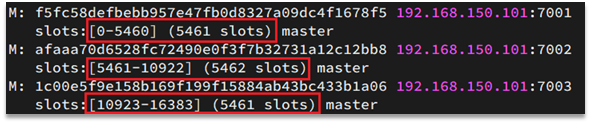


数据key不是与节点绑定，而是与插槽绑定。redis会根据key的有效部分计算插槽值，分两种情况：

- key中包含"{}"，且“{}”中至少包含1个字符，“{}”中的部分是有效部分
- key中不包含“{}”，整个key都是有效部分


例如：key是num，那么就根据num计算，如果是{itcast}num，则根据itcast计算。计算方式是利用CRC16算法得到一个hash值，然后对16384取余，得到的结果就是slot值。

 

如图，在7001这个节点执行set a 1时，对a做hash运算，对16384取余，得到的结果是15495，因此要存储到103节点。

到了7003后，执行`get num`时，对num做hash运算，对16384取余，得到的结果是2765，因此需要切换到7001节点


#### 4.2.1.小结

Redis如何判断某个key应该在哪个实例？

- 将16384个插槽分配到不同的实例
- 根据key的有效部分计算哈希值，对16384取余
- 余数作为插槽，寻找插槽所在实例即可

如何将同一类数据固定的保存在同一个Redis实例？

- 这一类数据使用相同的有效部分，例如key都以{typeId}为前缀


### 4.3.集群伸缩

redis-cli --cluster提供了很多操作集群的命令，可以通过下面方式查看：


比如，添加节点的命令：


#### 4.3.1.需求分析

需求：向集群中添加一个新的master节点，并向其中存储 num = 10

- 启动一个新的redis实例，端口为7004
- 添加7004到之前的集群，并作为一个master节点
- 给7004节点分配插槽，使得num这个key可以存储到7004实例


这里需要两个新的功能：

- 添加一个节点到集群中
- 将部分插槽分配到新插槽


#### 4.3.2.创建新的redis实例

创建一个文件夹：

```sh
mkdir 7004
```

拷贝配置文件：

```sh
cp redis.conf /7004
```

修改配置文件：

```sh
sed /s/6379/7004/g 7004/redis.conf
```

启动

```sh
redis-server 7004/redis.conf
```


#### 4.3.3.添加新节点到redis

添加节点的语法如下：


执行命令：

```sh
redis-cli --cluster add-node  192.168.150.101:7004 192.168.150.101:7001
```


通过命令查看集群状态：

```sh
redis-cli -p 7001 cluster nodes
```


如图，7004加入了集群，并且默认是一个master节点：


但是，可以看到7004节点的插槽数量为0，因此没有任何数据可以存储到7004上


#### 4.3.4.转移插槽

我们要将num存储到7004节点，因此需要先看看num的插槽是多少：


如上图所示，num的插槽为2765.


我们可以将0~3000的插槽从7001转移到7004，命令格式如下：


具体命令如下：

建立连接：


得到下面的反馈：


询问要移动多少个插槽，我们计划是3000个：

新的问题来了：


那个node来接收这些插槽？？

显然是7004，那么7004节点的id是多少呢？


复制这个id，然后拷贝到刚才的控制台后：


这里询问，你的插槽是从哪里移动过来的？

- all：代表全部，也就是三个节点各转移一部分
- 具体的id：目标节点的id
- done：没有了


这里我们要从7001获取，因此填写7001的id：


填完后，点击done，这样插槽转移就准备好了：


确认要转移吗？输入yes：

然后，通过命令查看结果：

 

可以看到： 


目的达成。


### 4.4.故障转移

集群初识状态是这样的：


其中7001、7002、7003都是master，我们计划让7002宕机。


#### 4.4.1.自动故障转移

当集群中有一个master宕机会发生什么呢？

直接停止一个redis实例，例如7002：

```sh
redis-cli -p 7002 shutdown
```


1）首先是该实例与其它实例失去连接

2）然后是疑似宕机：


3）最后是确定下线，自动提升一个slave为新的master：


4）当7002再次启动，就会变为一个slave节点了：


#### 4.4.2.手动故障转移

利用cluster failover命令可以手动让集群中的某个master宕机，切换到执行cluster failover命令的这个slave节点，实现无感知的数据迁移。其流程如下：


这种failover命令可以指定三种模式：

- 缺省：默认的流程，如图1~6歩
- force：省略了对offset的一致性校验
- takeover：直接执行第5歩，忽略数据一致性、忽略master状态和其它master的意见


**案例需求**：在7002这个slave节点执行手动故障转移，重新夺回master地位

步骤如下：

1）利用redis-cli连接7002这个节点

2）执行cluster failover命令

如图：


效果：


### 4.5.RedisTemplate访问分片集群

RedisTemplate底层同样基于lettuce实现了分片集群的支持，而使用的步骤与哨兵模式基本一致：

1）引入redis的starter依赖

2）配置分片集群地址

3）配置读写分离

与哨兵模式相比，其中只有分片集群的配置方式略有差异，如下：

```yaml
spring:
  redis:
    cluster:
      nodes:
        - 192.168.150.101:7001
        - 192.168.150.101:7002
        - 192.168.150.101:7003
        - 192.168.150.101:8001
        - 192.168.150.101:8002
        - 192.168.150.101:8003
```


# Redis多级缓存


## 1.什么是多级缓存

传统的缓存策略一般是请求到达Tomcat后，先查询Redis，如果未命中则查询数据库，如图：


存在下面的问题：

•请求要经过Tomcat处理，Tomcat的性能成为整个系统的瓶颈

•Redis缓存失效时，会对数据库产生冲击


多级缓存就是充分利用请求处理的每个环节，分别添加缓存，减轻Tomcat压力，提升服务性能：

- 浏览器访问静态资源时，优先读取浏览器本地缓存
- 访问非静态资源（ajax查询数据）时，访问服务端
- 请求到达Nginx后，优先读取Nginx本地缓存
- 如果Nginx本地缓存未命中，则去直接查询Redis（不经过Tomcat）
- 如果Redis查询未命中，则查询Tomcat
- 请求进入Tomcat后，优先查询JVM进程缓存
- 如果JVM进程缓存未命中，则查询数据库


在多级缓存架构中，Nginx内部需要编写本地缓存查询、Redis查询、Tomcat查询的业务逻辑，因此这样的nginx服务不再是一个**反向代理服务器**，而是一个编写**业务的Web服务器了**。


因此这样的业务Nginx服务也需要搭建集群来提高并发，再有专门的nginx服务来做反向代理，如图：


另外，我们的Tomcat服务将来也会部署为集群模式：


可见，多级缓存的关键有两个：

- 一个是在nginx中编写业务，实现nginx本地缓存、Redis、Tomcat的查询

- 另一个就是在Tomcat中实现JVM进程缓存

其中Nginx编程则会用到OpenResty框架结合Lua这样的语言。


这也是今天课程的难点和重点。


## 2.JVM进程缓存


为了演示多级缓存的案例，我们先准备一个商品查询的业务。

### 2.1.导入案例

参考课前资料的：《案例导入说明.md》

 


### 2.2.初识Caffeine

缓存在日常开发中启动至关重要的作用，由于是存储在内存中，数据的读取速度是非常快的，能大量减少对数据库的访问，减少数据库的压力。我们把缓存分为两类：

- 分布式缓存，例如Redis：
  - 优点：存储容量更大、可靠性更好、可以在集群间共享
  - 缺点：访问缓存有网络开销
  - 场景：缓存数据量较大、可靠性要求较高、需要在集群间共享
- 进程本地缓存，例如HashMap、GuavaCache：
  - 优点：读取本地内存，没有网络开销，速度更快
  - 缺点：存储容量有限、可靠性较低、无法共享
  - 场景：性能要求较高，缓存数据量较小

我们今天会利用Caffeine框架来实现JVM进程缓存。


**Caffeine**是一个基于Java8开发的，提供了近乎最佳命中率的高性能的本地缓存库。目前Spring内部的缓存使用的就是Caffeine。GitHub地址：https://github.com/ben-manes/caffeine

Caffeine的性能非常好，下图是官方给出的性能对比：


可以看到Caffeine的性能遥遥领先！

缓存使用的基本API：

```java
@Test
void testBasicOps() {
    // 构建cache对象
    Cache<String, String> cache = Caffeine.newBuilder().build();

    // 存数据
    cache.put("gf", "迪丽热巴");

    // 取数据
    String gf = cache.getIfPresent("gf");
    System.out.println("gf = " + gf);

    // 取数据，包含两个参数：
    // 参数一：缓存的key
    // 参数二：Lambda表达式，表达式参数就是缓存的key，方法体是查询数据库的逻辑
    // 优先根据key查询JVM缓存，如果未命中，则执行参数二的Lambda表达式
    String defaultGF = cache.get("defaultGF", key -> {
        // 根据key去数据库查询数据
        return "柳岩";
    });
    System.out.println("defaultGF = " + defaultGF);
}
```


Caffeine既然是缓存的一种，肯定需要有缓存的清除策略，不然的话内存总会有耗尽的时候。

Caffeine提供了三种缓存驱逐策略：

- **基于容量**：设置缓存的数量上限

  ```java
  // 创建缓存对象
  Cache<String, String> cache = Caffeine.newBuilder()
      .maximumSize(1) // 设置缓存大小上限为 1
      .build();
  ```

- **基于时间**：设置缓存的有效时间

  ```java
  // 创建缓存对象
  Cache<String, String> cache = Caffeine.newBuilder()
      // 设置缓存有效期为 10 秒，从最后一次写入开始计时 
      .expireAfterWrite(Duration.ofSeconds(10)) 
      .build();
  
  ```

- **基于引用**：设置缓存为软引用或弱引用，利用GC来回收缓存数据。性能较差，不建议使用。


> **注意**：在默认情况下，当一个缓存元素过期的时候，Caffeine不会自动立即将其清理和驱逐。而是在一次读或写操作后，或者在空闲时间完成对失效数据的驱逐。


### 2.3.实现JVM进程缓存

#### 2.3.1.需求

利用Caffeine实现下列需求：

- 给根据id查询商品的业务添加缓存，缓存未命中时查询数据库
- 给根据id查询商品库存的业务添加缓存，缓存未命中时查询数据库
- 缓存初始大小为100
- 缓存上限为10000


#### 2.3.2.实现

首先，我们需要定义两个Caffeine的缓存对象，分别保存商品、库存的缓存数据。

在item-service的`com.heima.item.config`包下定义`CaffeineConfig`类：

```java
package com.heima.item.config;

import com.github.benmanes.caffeine.cache.Cache;
import com.github.benmanes.caffeine.cache.Caffeine;
import com.heima.item.pojo.Item;
import com.heima.item.pojo.ItemStock;
import org.springframework.context.annotation.Bean;
import org.springframework.context.annotation.Configuration;

@Configuration
public class CaffeineConfig {

    @Bean
    public Cache<Long, Item> itemCache(){
        return Caffeine.newBuilder()
                .initialCapacity(100)
                .maximumSize(10_000)
                .build();
    }

    @Bean
    public Cache<Long, ItemStock> stockCache(){
        return Caffeine.newBuilder()
                .initialCapacity(100)
                .maximumSize(10_000)
                .build();
    }
}
```


然后，修改item-service中的`com.heima.item.web`包下的ItemController类，添加缓存逻辑：

```java
@RestController
@RequestMapping("item")
public class ItemController {

    @Autowired
    private IItemService itemService;
    @Autowired
    private IItemStockService stockService;

    @Autowired
    private Cache<Long, Item> itemCache;
    @Autowired
    private Cache<Long, ItemStock> stockCache;
    
    // ...其它略
    
    @GetMapping("/{id}")
    public Item findById(@PathVariable("id") Long id) {
        return itemCache.get(id, key -> itemService.query()
                .ne("status", 3).eq("id", key)
                .one()
        );
    }

    @GetMapping("/stock/{id}")
    public ItemStock findStockById(@PathVariable("id") Long id) {
        return stockCache.get(id, key -> stockService.getById(key));
    }
}
```


## 3.Lua语法入门

Nginx编程需要用到Lua语言，因此我们必须先入门Lua的基本语法。

### 3.1.初识Lua

Lua 是一种轻量小巧的脚本语言，用标准C语言编写并以源代码形式开放， 其设计目的是为了嵌入应用程序中，从而为应用程序提供灵活的扩展和定制功能。官网：https://www.lua.org/


Lua经常嵌入到C语言开发的程序中，例如游戏开发、游戏插件等。

Nginx本身也是C语言开发，因此也允许基于Lua做拓展。


### 3.1.HelloWorld

CentOS7默认已经安装了Lua语言环境，所以可以直接运行Lua代码。

1）在Linux虚拟机的任意目录下，新建一个hello.lua文件


2）添加下面的内容

```lua
print("Hello World!")  
```


3）运行


### 3.2.变量和循环

学习任何语言必然离不开变量，而变量的声明必须先知道数据的类型。

#### 3.2.1.Lua的数据类型

Lua中支持的常见数据类型包括：


另外，Lua提供了type()函数来判断一个变量的数据类型：


#### 3.2.2.声明变量

Lua声明变量的时候无需指定数据类型，而是用local来声明变量为局部变量：

```lua
-- 声明字符串，可以用单引号或双引号，
local str = 'hello'
-- 字符串拼接可以使用 ..
local str2 = 'hello' .. 'world'
-- 声明数字
local num = 21
-- 声明布尔类型
local flag = true
```


Lua中的table类型既可以作为数组，又可以作为Java中的map来使用。数组就是特殊的table，key是数组角标而已：

```lua
-- 声明数组 ，key为角标的 table
local arr = {'java', 'python', 'lua'}
-- 声明table，类似java的map
local map =  {name='Jack', age=21}
```

Lua中的数组角标是从1开始，访问的时候与Java中类似：

```lua
-- 访问数组，lua数组的角标从1开始
print(arr[1])
```

Lua中的table可以用key来访问：

```lua
-- 访问table
print(map['name'])
print(map.name)
```


#### 3.2.3.循环

对于table，我们可以利用for循环来遍历。不过数组和普通table遍历略有差异。

遍历数组：

```lua
-- 声明数组 key为索引的 table
local arr = {'java', 'python', 'lua'}
-- 遍历数组
for index,value in ipairs(arr) do
    print(index, value) 
end
```

遍历普通table

```lua
-- 声明map，也就是table
local map = {name='Jack', age=21}
-- 遍历table
for key,value in pairs(map) do
   print(key, value) 
end
```


### 3.3.条件控制、函数

Lua中的条件控制和函数声明与Java类似。

#### 3.3.1.函数

定义函数的语法：

```lua
function 函数名( argument1, argument2..., argumentn)
    -- 函数体
    return 返回值
end
```


例如，定义一个函数，用来打印数组：

```lua
function printArr(arr)
    for index, value in ipairs(arr) do
        print(value)
    end
end
```


#### 3.3.2.条件控制

类似Java的条件控制，例如if、else语法：

```lua
if(布尔表达式)
then
   --[ 布尔表达式为 true 时执行该语句块 --]
else
   --[ 布尔表达式为 false 时执行该语句块 --]
end

```


与java不同，布尔表达式中的逻辑运算是基于英文单词：


#### 3.3.3.案例

需求：自定义一个函数，可以打印table，当参数为nil时，打印错误信息


```lua
function printArr(arr)
    if not arr then
        print('数组不能为空！')
    end
    for index, value in ipairs(arr) do
        print(value)
    end
end
```


## 4.实现多级缓存

多级缓存的实现离不开Nginx编程，而Nginx编程又离不开OpenResty。

### 4.1.安装OpenResty

OpenResty® 是一个基于 Nginx的高性能 Web 平台，用于方便地搭建能够处理超高并发、扩展性极高的动态 Web 应用、Web 服务和动态网关。具备下列特点：

- 具备Nginx的完整功能
- 基于Lua语言进行扩展，集成了大量精良的 Lua 库、第三方模块
- 允许使用Lua**自定义业务逻辑**、**自定义库**

官方网站： https://openresty.org/cn/


##### **1）安装开发库**

首先要安装OpenResty的依赖开发库，执行命令：

```sh
yum install -y pcre-devel openssl-devel gcc --skip-broken
```


##### **2）安装OpenResty仓库**

你可以在你的 CentOS 系统中添加 `openresty` 仓库，这样就可以便于未来安装或更新我们的软件包（通过 `yum check-update` 命令）。运行下面的命令就可以添加我们的仓库：

```
yum-config-manager --add-repo https://openresty.org/package/centos/openresty.repo
```


如果提示说命令不存在，则运行：

```
yum install -y yum-utils 
```

然后再重复上面的命令


##### **3）安装OpenResty**

然后就可以像下面这样安装软件包，比如 `openresty`：

```bash
yum install -y openresty
```


##### **4）安装opm工具**

opm是OpenResty的一个管理工具，可以帮助我们安装一个第三方的Lua模块。

如果你想安装命令行工具 `opm`，那么可以像下面这样安装 `openresty-opm` 包：

```bash
yum install -y openresty-opm
```


##### **5）目录结构**

默认情况下，OpenResty安装的目录是：/usr/local/openresty

 

看到里面的nginx目录了吗，OpenResty就是在Nginx基础上集成了一些Lua模块。


##### **6）配置nginx的环境变量**

打开配置文件：

```sh
vi /etc/profile
```

在最下面加入两行：

```sh
export NGINX_HOME=/usr/local/openresty/nginx
export PATH=${NGINX_HOME}/sbin:$PATH
```

NGINX_HOME：后面是OpenResty安装目录下的nginx的目录

然后让配置生效：

```
source /etc/profile
```


#### 2.启动和运行

OpenResty底层是基于Nginx的，查看OpenResty目录的nginx目录，结构与windows中安装的nginx基本一致：


所以运行方式与nginx基本一致：

```sh
# 启动nginx
nginx
# 重新加载配置
nginx -s reload
# 停止
nginx -s stop
```


nginx的默认配置文件注释太多，影响后续我们的编辑，这里将nginx.conf中的注释部分删除，保留有效部分。

修改`/usr/local/openresty/nginx/conf/nginx.conf`文件，内容如下：

```nginx
#user  nobody;
worker_processes  1;
error_log  logs/error.log;

events {
    worker_connections  1024;
}

http {
    include       mime.types;
    default_type  application/octet-stream;
    sendfile        on;
    keepalive_timeout  65;

    server {
        listen       8081;
        server_name  localhost;
        location / {
            root   html;
            index  index.html index.htm;
        }
        error_page   500 502 503 504  /50x.html;
        location = /50x.html {
            root   html;
        }
    }
}
```


在Linux的控制台输入命令以启动nginx：

```sh
nginx
```


然后访问页面：http://192.168.150.101:8081，注意ip地址替换为你自己的虚拟机IP：


#### 3.备注

加载OpenResty的lua模块：

```nginx
#lua 模块
lua_package_path "/usr/local/openresty/lualib/?.lua;;";
#c模块     
lua_package_cpath "/usr/local/openresty/lualib/?.so;;";  
```


common.lua

```lua
-- 封装函数，发送http请求，并解析响应
local function read_http(path, params)
    local resp = ngx.location.capture(path,{
        method = ngx.HTTP_GET,
        args = params,
    })
    if not resp then
        -- 记录错误信息，返回404
        ngx.log(ngx.ERR, "http not found, path: ", path , ", args: ", args)
        ngx.exit(404)
    end
    return resp.body
end
-- 将方法导出
local _M = {  
    read_http = read_http
}  
return _M
```


释放Redis连接API：

```lua
-- 关闭redis连接的工具方法，其实是放入连接池
local function close_redis(red)
    local pool_max_idle_time = 10000 -- 连接的空闲时间，单位是毫秒
    local pool_size = 100 --连接池大小
    local ok, err = red:set_keepalive(pool_max_idle_time, pool_size)
    if not ok then
        ngx.log(ngx.ERR, "放入redis连接池失败: ", err)
    end
end
```

读取Redis数据的API：

```lua
-- 查询redis的方法 ip和port是redis地址，key是查询的key
local function read_redis(ip, port, key)
    -- 获取一个连接
    local ok, err = red:connect(ip, port)
    if not ok then
        ngx.log(ngx.ERR, "连接redis失败 : ", err)
        return nil
    end
    -- 查询redis
    local resp, err = red:get(key)
    -- 查询失败处理
    if not resp then
        ngx.log(ngx.ERR, "查询Redis失败: ", err, ", key = " , key)
    end
    --得到的数据为空处理
    if resp == ngx.null then
        resp = nil
        ngx.log(ngx.ERR, "查询Redis数据为空, key = ", key)
    end
    close_redis(red)
    return resp
end
```


开启共享词典：

```nginx
# 共享字典，也就是本地缓存，名称叫做：item_cache，大小150m
lua_shared_dict item_cache 150m; 
```


### 4.2.OpenResty快速入门

我们希望达到的多级缓存架构如图：


其中：

- windows上的nginx用来做反向代理服务，将前端的查询商品的ajax请求代理到OpenResty集群

- OpenResty集群用来编写多级缓存业务


#### 4.2.1.反向代理流程

现在，商品详情页使用的是假的商品数据。不过在浏览器中，可以看到页面有发起ajax请求查询真实商品数据。

这个请求如下：


请求地址是localhost，端口是80，就被windows上安装的Nginx服务给接收到了。然后代理给了OpenResty集群：


我们需要在OpenResty中编写业务，查询商品数据并返回到浏览器。

但是这次，我们先在OpenResty接收请求，返回假的商品数据。


#### 4.2.2.OpenResty监听请求

OpenResty的很多功能都依赖于其目录下的Lua库，需要在nginx.conf中指定依赖库的目录，并导入依赖：

1）添加对OpenResty的Lua模块的加载

修改`/usr/local/openresty/nginx/conf/nginx.conf`文件，在其中的http下面，添加下面代码：

```nginx
#lua 模块
lua_package_path "/usr/local/openresty/lualib/?.lua;;";
#c模块     
lua_package_cpath "/usr/local/openresty/lualib/?.so;;";  
```


2）监听/api/item路径

修改`/usr/local/openresty/nginx/conf/nginx.conf`文件，在nginx.conf的server下面，添加对/api/item这个路径的监听：

```nginx
location  /api/item {
    # 默认的响应类型
    default_type application/json;
    # 响应结果由lua/item.lua文件来决定
    content_by_lua_file lua/item.lua;
}
```


这个监听，就类似于SpringMVC中的`@GetMapping("/api/item")`做路径映射。

而`content_by_lua_file lua/item.lua`则相当于调用item.lua这个文件，执行其中的业务，把结果返回给用户。相当于java中调用service。


#### 4.2.3.编写item.lua

1）在`/usr/loca/openresty/nginx`目录创建文件夹：lua


2）在`/usr/loca/openresty/nginx/lua`文件夹下，新建文件：item.lua


3）编写item.lua，返回假数据

item.lua中，利用ngx.say()函数返回数据到Response中

```lua
ngx.say('{"id":10001,"name":"SALSA AIR","title":"RIMOWA 21寸托运箱拉杆箱 SALSA AIR系列果绿色 820.70.36.4","price":17900,"image":"https://m.360buyimg.com/mobilecms/s720x720_jfs/t6934/364/1195375010/84676/e9f2c55f/597ece38N0ddcbc77.jpg!q70.jpg.webp","category":"拉杆箱","brand":"RIMOWA","spec":"","status":1,"createTime":"2019-04-30T16:00:00.000+00:00","updateTime":"2019-04-30T16:00:00.000+00:00","stock":2999,"sold":31290}')
```


4）重新加载配置

```sh
nginx -s reload
```


刷新商品页面：http://localhost/item.html?id=1001，即可看到效果：


### 4.3.请求参数处理

上一节中，我们在OpenResty接收前端请求，但是返回的是假数据。


要返回真实数据，必须根据前端传递来的商品id，查询商品信息才可以。

那么如何获取前端传递的商品参数呢？

#### 4.3.1.获取参数的API

OpenResty中提供了一些API用来获取不同类型的前端请求参数：


#### 4.3.2.获取参数并返回

在前端发起的ajax请求如图：


可以看到商品id是以路径占位符方式传递的，因此可以利用正则表达式匹配的方式来获取ID


1）获取商品id

修改`/usr/loca/openresty/nginx/nginx.conf`文件中监听/api/item的代码，利用正则表达式获取ID：

```nginx
location ~ /api/item/(\d+) {
    # 默认的响应类型
    default_type application/json;
    # 响应结果由lua/item.lua文件来决定
    content_by_lua_file lua/item.lua;
}
```


2）拼接ID并返回

修改`/usr/loca/openresty/nginx/lua/item.lua`文件，获取id并拼接到结果中返回：

```lua
-- 获取商品id
local id = ngx.var[1]
-- 拼接并返回
ngx.say('{"id":' .. id .. ',"name":"SALSA AIR","title":"RIMOWA 21寸托运箱拉杆箱 SALSA AIR系列果绿色 820.70.36.4","price":17900,"image":"https://m.360buyimg.com/mobilecms/s720x720_jfs/t6934/364/1195375010/84676/e9f2c55f/597ece38N0ddcbc77.jpg!q70.jpg.webp","category":"拉杆箱","brand":"RIMOWA","spec":"","status":1,"createTime":"2019-04-30T16:00:00.000+00:00","updateTime":"2019-04-30T16:00:00.000+00:00","stock":2999,"sold":31290}')
```


3）重新加载并测试

运行命令以重新加载OpenResty配置：

```sh
nginx -s reload
```


刷新页面可以看到结果中已经带上了ID：

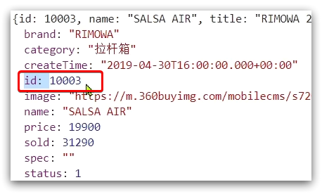 


### 4.4.查询Tomcat

拿到商品ID后，本应去缓存中查询商品信息，不过目前我们还未建立nginx、redis缓存。因此，这里我们先根据商品id去tomcat查询商品信息。我们实现如图部分：


需要注意的是，我们的OpenResty是在虚拟机，Tomcat是在Windows电脑上。两者IP一定不要搞错了。


#### 4.4.1.发送http请求的API

nginx提供了内部API用以发送http请求：

```lua
local resp = ngx.location.capture("/path",{
    method = ngx.HTTP_GET,   -- 请求方式
    args = {a=1,b=2},  -- get方式传参数
})
```

返回的响应内容包括：

- resp.status：响应状态码
- resp.header：响应头，是一个table
- resp.body：响应体，就是响应数据

注意：这里的path是路径，并不包含IP和端口。这个请求会被nginx内部的server监听并处理。

但是我们希望这个请求发送到Tomcat服务器，所以还需要编写一个server来对这个路径做反向代理：

```nginx
 location /path {
     # 这里是windows电脑的ip和Java服务端口，需要确保windows防火墙处于关闭状态
     proxy_pass http://192.168.150.1:8081; 
 }
```


原理如图：


#### 4.4.2.封装http工具

下面，我们封装一个发送Http请求的工具，基于ngx.location.capture来实现查询tomcat。


1）添加反向代理，到windows的Java服务

因为item-service中的接口都是/item开头，所以我们监听/item路径，代理到windows上的tomcat服务。

修改 `/usr/local/openresty/nginx/conf/nginx.conf`文件，添加一个location：

```nginx
location /item {
    proxy_pass http://192.168.150.1:8081;
}
```


以后，只要我们调用`ngx.location.capture("/item")`，就一定能发送请求到windows的tomcat服务。


2）封装工具类

之前我们说过，OpenResty启动时会加载以下两个目录中的工具文件：


所以，自定义的http工具也需要放到这个目录下。


在`/usr/local/openresty/lualib`目录下，新建一个common.lua文件：

```sh
vi /usr/local/openresty/lualib/common.lua
```

内容如下:

```lua
-- 封装函数，发送http请求，并解析响应
local function read_http(path, params)
    local resp = ngx.location.capture(path,{
        method = ngx.HTTP_GET,
        args = params,
    })
    if not resp then
        -- 记录错误信息，返回404
        ngx.log(ngx.ERR, "http请求查询失败, path: ", path , ", args: ", args)
        ngx.exit(404)
    end
    return resp.body
end
-- 将方法导出
local _M = {  
    read_http = read_http
}  
return _M
```


这个工具将read_http函数封装到_M这个table类型的变量中，并且返回，这类似于导出。

使用的时候，可以利用`require('common')`来导入该函数库，这里的common是函数库的文件名。


3）实现商品查询

最后，我们修改`/usr/local/openresty/lua/item.lua`文件，利用刚刚封装的函数库实现对tomcat的查询：

```lua
-- 引入自定义common工具模块，返回值是common中返回的 _M
local common = require("common")
-- 从 common中获取read_http这个函数
local read_http = common.read_http
-- 获取路径参数
local id = ngx.var[1]
-- 根据id查询商品
local itemJSON = read_http("/item/".. id, nil)
-- 根据id查询商品库存
local itemStockJSON = read_http("/item/stock/".. id, nil)
```


这里查询到的结果是json字符串，并且包含商品、库存两个json字符串，页面最终需要的是把两个json拼接为一个json：


这就需要我们先把JSON变为lua的table，完成数据整合后，再转为JSON。


#### 4.4.3.CJSON工具类

OpenResty提供了一个cjson的模块用来处理JSON的序列化和反序列化。

官方地址： https://github.com/openresty/lua-cjson/

1）引入cjson模块：

```lua
local cjson = require "cjson"
```


2）序列化：

```lua
local obj = {
    name = 'jack',
    age = 21
}
-- 把 table 序列化为 json
local json = cjson.encode(obj)
```


3）反序列化：

```lua
local json = '{"name": "jack", "age": 21}'
-- 反序列化 json为 table
local obj = cjson.decode(json);
print(obj.name)
```


#### 4.4.4.实现Tomcat查询

下面，我们修改之前的item.lua中的业务，添加json处理功能：

```lua
-- 导入common函数库
local common = require('common')
local read_http = common.read_http
-- 导入cjson库
local cjson = require('cjson')

-- 获取路径参数
local id = ngx.var[1]
-- 根据id查询商品
local itemJSON = read_http("/item/".. id, nil)
-- 根据id查询商品库存
local itemStockJSON = read_http("/item/stock/".. id, nil)

-- JSON转化为lua的table
local item = cjson.decode(itemJSON)
local stock = cjson.decode(stockJSON)

-- 组合数据
item.stock = stock.stock
item.sold = stock.sold

-- 把item序列化为json 返回结果
ngx.say(cjson.encode(item))
```


#### 4.4.5.基于ID负载均衡

刚才的代码中，我们的tomcat是单机部署。而实际开发中，tomcat一定是集群模式：

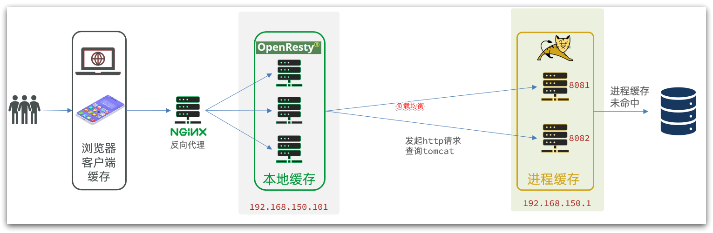

因此，OpenResty需要对tomcat集群做负载均衡。

而默认的负载均衡规则是轮询模式，当我们查询/item/10001时：

- 第一次会访问8081端口的tomcat服务，在该服务内部就形成了JVM进程缓存
- 第二次会访问8082端口的tomcat服务，该服务内部没有JVM缓存（因为JVM缓存无法共享），会查询数据库
- ...

你看，因为轮询的原因，第一次查询8081形成的JVM缓存并未生效，直到下一次再次访问到8081时才可以生效，缓存命中率太低了。


怎么办？

如果能让同一个商品，每次查询时都访问同一个tomcat服务，那么JVM缓存就一定能生效了。

也就是说，我们需要根据商品id做负载均衡，而不是轮询。


##### 1）原理

nginx提供了基于请求路径做负载均衡的算法：

nginx根据请求路径做hash运算，把得到的数值对tomcat服务的数量取余，余数是几，就访问第几个服务，实现负载均衡。


例如：

- 我们的请求路径是 /item/10001
- tomcat总数为2台（8081、8082）
- 对请求路径/item/1001做hash运算求余的结果为1
- 则访问第一个tomcat服务，也就是8081

只要id不变，每次hash运算结果也不会变，那就可以保证同一个商品，一直访问同一个tomcat服务，确保JVM缓存生效。


##### 2）实现

修改`/usr/local/openresty/nginx/conf/nginx.conf`文件，实现基于ID做负载均衡。

首先，定义tomcat集群，并设置基于路径做负载均衡：

```nginx 
upstream tomcat-cluster {
    hash $request_uri;
    server 192.168.150.1:8081;
    server 192.168.150.1:8082;
}
```

然后，修改对tomcat服务的反向代理，目标指向tomcat集群：

```nginx
location /item {
    proxy_pass http://tomcat-cluster;
}
```

重新加载OpenResty

```sh
nginx -s reload
```


##### 3）测试

启动两台tomcat服务：


同时启动：

 

清空日志后，再次访问页面，可以看到不同id的商品，访问到了不同的tomcat服务：


### 4.5.Redis缓存预热

Redis缓存会面临冷启动问题：

**冷启动**：服务刚刚启动时，Redis中并没有缓存，如果所有商品数据都在第一次查询时添加缓存，可能会给数据库带来较大压力。

**缓存预热**：在实际开发中，我们可以利用大数据统计用户访问的热点数据，在项目启动时将这些热点数据提前查询并保存到Redis中。


我们数据量较少，并且没有数据统计相关功能，目前可以在启动时将所有数据都放入缓存中。


1）利用Docker安装Redis

```sh
docker run --name redis -p 6379:6379 -d redis redis-server --appendonly yes
```


2）在item-service服务中引入Redis依赖

```xml
<dependency>
    <groupId>org.springframework.boot</groupId>
    <artifactId>spring-boot-starter-data-redis</artifactId>
</dependency>
```


3）配置Redis地址

```yaml
spring:
  redis:
    host: 192.168.150.101
```


4）编写初始化类

缓存预热需要在项目启动时完成，并且必须是拿到RedisTemplate之后。

这里我们利用InitializingBean接口来实现，因为InitializingBean可以在对象被Spring创建并且成员变量全部注入后执行。

```java
package com.heima.item.config;

import com.fasterxml.jackson.core.JsonProcessingException;
import com.fasterxml.jackson.databind.ObjectMapper;
import com.heima.item.pojo.Item;
import com.heima.item.pojo.ItemStock;
import com.heima.item.service.IItemService;
import com.heima.item.service.IItemStockService;
import org.springframework.beans.factory.InitializingBean;
import org.springframework.beans.factory.annotation.Autowired;
import org.springframework.data.redis.core.StringRedisTemplate;
import org.springframework.stereotype.Component;

import java.util.List;

@Component
public class RedisHandler implements InitializingBean {

    @Autowired
    private StringRedisTemplate redisTemplate;

    @Autowired
    private IItemService itemService;
    @Autowired
    private IItemStockService stockService;

    private static final ObjectMapper MAPPER = new ObjectMapper();

    @Override
    public void afterPropertiesSet() throws Exception {
        // 初始化缓存
        // 1.查询商品信息
        List<Item> itemList = itemService.list();
        // 2.放入缓存
        for (Item item : itemList) {
            // 2.1.item序列化为JSON
            String json = MAPPER.writeValueAsString(item);
            // 2.2.存入redis
            redisTemplate.opsForValue().set("item:id:" + item.getId(), json);
        }

        // 3.查询商品库存信息
        List<ItemStock> stockList = stockService.list();
        // 4.放入缓存
        for (ItemStock stock : stockList) {
            // 2.1.item序列化为JSON
            String json = MAPPER.writeValueAsString(stock);
            // 2.2.存入redis
            redisTemplate.opsForValue().set("item:stock:id:" + stock.getId(), json);
        }
    }
}
```


### 4.6.查询Redis缓存

现在，Redis缓存已经准备就绪，我们可以再OpenResty中实现查询Redis的逻辑了。如下图红框所示：


当请求进入OpenResty之后：

- 优先查询Redis缓存
- 如果Redis缓存未命中，再查询Tomcat


#### 4.6.1.封装Redis工具

OpenResty提供了操作Redis的模块，我们只要引入该模块就能直接使用。但是为了方便，我们将Redis操作封装到之前的common.lua工具库中。

修改`/usr/local/openresty/lualib/common.lua`文件：

1）引入Redis模块，并初始化Redis对象

```lua
-- 导入redis
local redis = require('resty.redis')
-- 初始化redis
local red = redis:new()
red:set_timeouts(1000, 1000, 1000)
```


2）封装函数，用来释放Redis连接，其实是放入连接池

```lua
-- 关闭redis连接的工具方法，其实是放入连接池
local function close_redis(red)
    local pool_max_idle_time = 10000 -- 连接的空闲时间，单位是毫秒
    local pool_size = 100 --连接池大小
    local ok, err = red:set_keepalive(pool_max_idle_time, pool_size)
    if not ok then
        ngx.log(ngx.ERR, "放入redis连接池失败: ", err)
    end
end
```


3）封装函数，根据key查询Redis数据

```lua
-- 查询redis的方法 ip和port是redis地址，key是查询的key
local function read_redis(ip, port, key)
    -- 获取一个连接
    local ok, err = red:connect(ip, port)
    if not ok then
        ngx.log(ngx.ERR, "连接redis失败 : ", err)
        return nil
    end
    -- 查询redis
    local resp, err = red:get(key)
    -- 查询失败处理
    if not resp then
        ngx.log(ngx.ERR, "查询Redis失败: ", err, ", key = " , key)
    end
    --得到的数据为空处理
    if resp == ngx.null then
        resp = nil
        ngx.log(ngx.ERR, "查询Redis数据为空, key = ", key)
    end
    close_redis(red)
    return resp
end
```


4）导出

```lua
-- 将方法导出
local _M = {  
    read_http = read_http,
    read_redis = read_redis
}  
return _M
```


完整的common.lua：

```lua
-- 导入redis
local redis = require('resty.redis')
-- 初始化redis
local red = redis:new()
red:set_timeouts(1000, 1000, 1000)

-- 关闭redis连接的工具方法，其实是放入连接池
local function close_redis(red)
    local pool_max_idle_time = 10000 -- 连接的空闲时间，单位是毫秒
    local pool_size = 100 --连接池大小
    local ok, err = red:set_keepalive(pool_max_idle_time, pool_size)
    if not ok then
        ngx.log(ngx.ERR, "放入redis连接池失败: ", err)
    end
end

-- 查询redis的方法 ip和port是redis地址，key是查询的key
local function read_redis(ip, port, key)
    -- 获取一个连接
    local ok, err = red:connect(ip, port)
    if not ok then
        ngx.log(ngx.ERR, "连接redis失败 : ", err)
        return nil
    end
    -- 查询redis
    local resp, err = red:get(key)
    -- 查询失败处理
    if not resp then
        ngx.log(ngx.ERR, "查询Redis失败: ", err, ", key = " , key)
    end
    --得到的数据为空处理
    if resp == ngx.null then
        resp = nil
        ngx.log(ngx.ERR, "查询Redis数据为空, key = ", key)
    end
    close_redis(red)
    return resp
end

-- 封装函数，发送http请求，并解析响应
local function read_http(path, params)
    local resp = ngx.location.capture(path,{
        method = ngx.HTTP_GET,
        args = params,
    })
    if not resp then
        -- 记录错误信息，返回404
        ngx.log(ngx.ERR, "http查询失败, path: ", path , ", args: ", args)
        ngx.exit(404)
    end
    return resp.body
end
-- 将方法导出
local _M = {  
    read_http = read_http,
    read_redis = read_redis
}  
return _M
```


#### 4.6.2.实现Redis查询

接下来，我们就可以去修改item.lua文件，实现对Redis的查询了。

查询逻辑是：

- 根据id查询Redis
- 如果查询失败则继续查询Tomcat
- 将查询结果返回

1）修改`/usr/local/openresty/lua/item.lua`文件，添加一个查询函数：

```lua
-- 导入common函数库
local common = require('common')
local read_http = common.read_http
local read_redis = common.read_redis
-- 封装查询函数
function read_data(key, path, params)
    -- 查询本地缓存
    local val = read_redis("127.0.0.1", 6379, key)
    -- 判断查询结果
    if not val then
        ngx.log(ngx.ERR, "redis查询失败，尝试查询http， key: ", key)
        -- redis查询失败，去查询http
        val = read_http(path, params)
    end
    -- 返回数据
    return val
end
```


2）而后修改商品查询、库存查询的业务：


3）完整的item.lua代码：

```lua
-- 导入common函数库
local common = require('common')
local read_http = common.read_http
local read_redis = common.read_redis
-- 导入cjson库
local cjson = require('cjson')

-- 封装查询函数
function read_data(key, path, params)
    -- 查询本地缓存
    local val = read_redis("127.0.0.1", 6379, key)
    -- 判断查询结果
    if not val then
        ngx.log(ngx.ERR, "redis查询失败，尝试查询http， key: ", key)
        -- redis查询失败，去查询http
        val = read_http(path, params)
    end
    -- 返回数据
    return val
end

-- 获取路径参数
local id = ngx.var[1]

-- 查询商品信息
local itemJSON = read_data("item:id:" .. id,  "/item/" .. id, nil)
-- 查询库存信息
local stockJSON = read_data("item:stock:id:" .. id, "/item/stock/" .. id, nil)

-- JSON转化为lua的table
local item = cjson.decode(itemJSON)
local stock = cjson.decode(stockJSON)
-- 组合数据
item.stock = stock.stock
item.sold = stock.sold

-- 把item序列化为json 返回结果
ngx.say(cjson.encode(item))
```


### 4.7.Nginx本地缓存

现在，整个多级缓存中只差最后一环，也就是nginx的本地缓存了。如图：


#### 4.7.1.本地缓存API

OpenResty为Nginx提供了**shard dict**的功能，可以在nginx的多个worker之间共享数据，实现缓存功能。

1）开启共享字典，在nginx.conf的http下添加配置：

```nginx
 # 共享字典，也就是本地缓存，名称叫做：item_cache，大小150m
 lua_shared_dict item_cache 150m; 
```


2）操作共享字典：

```lua
-- 获取本地缓存对象
local item_cache = ngx.shared.item_cache
-- 存储, 指定key、value、过期时间，单位s，默认为0代表永不过期
item_cache:set('key', 'value', 1000)
-- 读取
local val = item_cache:get('key')
```


#### 4.7.2.实现本地缓存查询

1）修改`/usr/local/openresty/lua/item.lua`文件，修改read_data查询函数，添加本地缓存逻辑：

```lua
-- 导入共享词典，本地缓存
local item_cache = ngx.shared.item_cache

-- 封装查询函数
function read_data(key, expire, path, params)
    -- 查询本地缓存
    local val = item_cache:get(key)
    if not val then
        ngx.log(ngx.ERR, "本地缓存查询失败，尝试查询Redis， key: ", key)
        -- 查询redis
        val = read_redis("127.0.0.1", 6379, key)
        -- 判断查询结果
        if not val then
            ngx.log(ngx.ERR, "redis查询失败，尝试查询http， key: ", key)
            -- redis查询失败，去查询http
            val = read_http(path, params)
        end
    end
    -- 查询成功，把数据写入本地缓存
    item_cache:set(key, val, expire)
    -- 返回数据
    return val
end
```


2）修改item.lua中查询商品和库存的业务，实现最新的read_data函数：


其实就是多了缓存时间参数，过期后nginx缓存会自动删除，下次访问即可更新缓存。

这里给商品基本信息设置超时时间为30分钟，库存为1分钟。

因为库存更新频率较高，如果缓存时间过长，可能与数据库差异较大。


3）完整的item.lua文件：

```lua
-- 导入common函数库
local common = require('common')
local read_http = common.read_http
local read_redis = common.read_redis
-- 导入cjson库
local cjson = require('cjson')
-- 导入共享词典，本地缓存
local item_cache = ngx.shared.item_cache

-- 封装查询函数
function read_data(key, expire, path, params)
    -- 查询本地缓存
    local val = item_cache:get(key)
    if not val then
        ngx.log(ngx.ERR, "本地缓存查询失败，尝试查询Redis， key: ", key)
        -- 查询redis
        val = read_redis("127.0.0.1", 6379, key)
        -- 判断查询结果
        if not val then
            ngx.log(ngx.ERR, "redis查询失败，尝试查询http， key: ", key)
            -- redis查询失败，去查询http
            val = read_http(path, params)
        end
    end
    -- 查询成功，把数据写入本地缓存
    item_cache:set(key, val, expire)
    -- 返回数据
    return val
end

-- 获取路径参数
local id = ngx.var[1]

-- 查询商品信息
local itemJSON = read_data("item:id:" .. id, 1800,  "/item/" .. id, nil)
-- 查询库存信息
local stockJSON = read_data("item:stock:id:" .. id, 60, "/item/stock/" .. id, nil)

-- JSON转化为lua的table
local item = cjson.decode(itemJSON)
local stock = cjson.decode(stockJSON)
-- 组合数据
item.stock = stock.stock
item.sold = stock.sold

-- 把item序列化为json 返回结果
ngx.say(cjson.encode(item))
```


## 5.缓存同步

大多数情况下，浏览器查询到的都是缓存数据，如果缓存数据与数据库数据存在较大差异，可能会产生比较严重的后果。

所以我们必须保证数据库数据、缓存数据的一致性，这就是缓存与数据库的同步。


### 5.1.数据同步策略

缓存数据同步的常见方式有三种：

**设置有效期**：给缓存设置有效期，到期后自动删除。再次查询时更新

- 优势：简单、方便
- 缺点：时效性差，缓存过期之前可能不一致
- 场景：更新频率较低，时效性要求低的业务

**同步双写**：在修改数据库的同时，直接修改缓存

- 优势：时效性强，缓存与数据库强一致
- 缺点：有代码侵入，耦合度高；
- 场景：对一致性、时效性要求较高的缓存数据

**异步通知：**修改数据库时发送事件通知，相关服务监听到通知后修改缓存数据

- 优势：低耦合，可以同时通知多个缓存服务
- 缺点：时效性一般，可能存在中间不一致状态
- 场景：时效性要求一般，有多个服务需要同步


而异步实现又可以基于MQ或者Canal来实现：

1）基于MQ的异步通知：


解读：

- 商品服务完成对数据的修改后，只需要发送一条消息到MQ中。
- 缓存服务监听MQ消息，然后完成对缓存的更新

依然有少量的代码侵入。


2）基于Canal的通知


解读：

- 商品服务完成商品修改后，业务直接结束，没有任何代码侵入
- Canal监听MySQL变化，当发现变化后，立即通知缓存服务
- 缓存服务接收到canal通知，更新缓存

代码零侵入


### 5.2.安装Canal

#### 5.2.1.认识Canal

**Canal [kə'næl]**，译意为水道/管道/沟渠，canal是阿里巴巴旗下的一款开源项目，基于Java开发。基于数据库增量日志解析，提供增量数据订阅&消费。GitHub的地址：https://github.com/alibaba/canal

Canal是基于mysql的主从同步来实现的，MySQL主从同步的原理如下：


- 1）MySQL master 将数据变更写入二进制日志( binary log），其中记录的数据叫做binary log events
- 2）MySQL slave 将 master 的 binary log events拷贝到它的中继日志(relay log)
- 3）MySQL slave 重放 relay log 中事件，将数据变更反映它自己的数据


而Canal就是把自己伪装成MySQL的一个slave节点，从而监听master的binary log变化。再把得到的变化信息通知给Canal的客户端，进而完成对其它数据库的同步。


#### 5.2.2.安装Canal

安装和配置Canal参考课前资料文档：

 


### 5.3.监听Canal

Canal提供了各种语言的客户端，当Canal监听到binlog变化时，会通知Canal的客户端。


我们可以利用Canal提供的Java客户端，监听Canal通知消息。当收到变化的消息时，完成对缓存的更新。


不过这里我们会使用GitHub上的第三方开源的canal-starter客户端。地址：https://github.com/NormanGyllenhaal/canal-client

与SpringBoot完美整合，自动装配，比官方客户端要简单好用很多。


#### 5.3.1.引入依赖：

```xml
<dependency>
    <groupId>top.javatool</groupId>
    <artifactId>canal-spring-boot-starter</artifactId>
    <version>1.2.1-RELEASE</version>
</dependency>
```


#### 5.3.2.编写配置：

```yaml
canal:
  destination: heima # canal的集群名字，要与安装canal时设置的名称一致
  server: 192.168.150.101:11111 # canal服务地址
```


#### 5.3.3.修改Item实体类

通过@Id、@Column、等注解完成Item与数据库表字段的映射：

```java
package com.heima.item.pojo;

import com.baomidou.mybatisplus.annotation.IdType;
import com.baomidou.mybatisplus.annotation.TableField;
import com.baomidou.mybatisplus.annotation.TableId;
import com.baomidou.mybatisplus.annotation.TableName;
import lombok.Data;
import org.springframework.data.annotation.Id;
import org.springframework.data.annotation.Transient;

import javax.persistence.Column;
import java.util.Date;

@Data
@TableName("tb_item")
public class Item {
    @TableId(type = IdType.AUTO)
    @Id
    private Long id;//商品id
    @Column(name = "name")
    private String name;//商品名称
    private String title;//商品标题
    private Long price;//价格（分）
    private String image;//商品图片
    private String category;//分类名称
    private String brand;//品牌名称
    private String spec;//规格
    private Integer status;//商品状态 1-正常，2-下架
    private Date createTime;//创建时间
    private Date updateTime;//更新时间
    @TableField(exist = false)
    @Transient
    private Integer stock;
    @TableField(exist = false)
    @Transient
    private Integer sold;
}
```


#### 5.3.4.编写监听器

通过实现`EntryHandler<T>`接口编写监听器，监听Canal消息。注意两点：

- 实现类通过`@CanalTable("tb_item")`指定监听的表信息
- EntryHandler的泛型是与表对应的实体类


```java
package com.heima.item.canal;

import com.github.benmanes.caffeine.cache.Cache;
import com.heima.item.config.RedisHandler;
import com.heima.item.pojo.Item;
import org.springframework.beans.factory.annotation.Autowired;
import org.springframework.stereotype.Component;
import top.javatool.canal.client.annotation.CanalTable;
import top.javatool.canal.client.handler.EntryHandler;

@CanalTable("tb_item")
@Component
public class ItemHandler implements EntryHandler<Item> {

    @Autowired
    private RedisHandler redisHandler;
    @Autowired
    private Cache<Long, Item> itemCache;

    @Override
    public void insert(Item item) {
        // 写数据到JVM进程缓存
        itemCache.put(item.getId(), item);
        // 写数据到redis
        redisHandler.saveItem(item);
    }

    @Override
    public void update(Item before, Item after) {
        // 写数据到JVM进程缓存
        itemCache.put(after.getId(), after);
        // 写数据到redis
        redisHandler.saveItem(after);
    }

    @Override
    public void delete(Item item) {
        // 删除数据到JVM进程缓存
        itemCache.invalidate(item.getId());
        // 删除数据到redis
        redisHandler.deleteItemById(item.getId());
    }
}
```


在这里对Redis的操作都封装到了RedisHandler这个对象中，是我们之前做缓存预热时编写的一个类，内容如下：

```java
package com.heima.item.config;

import com.fasterxml.jackson.core.JsonProcessingException;
import com.fasterxml.jackson.databind.ObjectMapper;
import com.heima.item.pojo.Item;
import com.heima.item.pojo.ItemStock;
import com.heima.item.service.IItemService;
import com.heima.item.service.IItemStockService;
import org.springframework.beans.factory.InitializingBean;
import org.springframework.beans.factory.annotation.Autowired;
import org.springframework.data.redis.core.StringRedisTemplate;
import org.springframework.stereotype.Component;

import java.util.List;

@Component
public class RedisHandler implements InitializingBean {

    @Autowired
    private StringRedisTemplate redisTemplate;

    @Autowired
    private IItemService itemService;
    @Autowired
    private IItemStockService stockService;

    private static final ObjectMapper MAPPER = new ObjectMapper();

    @Override
    public void afterPropertiesSet() throws Exception {
        // 初始化缓存
        // 1.查询商品信息
        List<Item> itemList = itemService.list();
        // 2.放入缓存
        for (Item item : itemList) {
            // 2.1.item序列化为JSON
            String json = MAPPER.writeValueAsString(item);
            // 2.2.存入redis
            redisTemplate.opsForValue().set("item:id:" + item.getId(), json);
        }

        // 3.查询商品库存信息
        List<ItemStock> stockList = stockService.list();
        // 4.放入缓存
        for (ItemStock stock : stockList) {
            // 2.1.item序列化为JSON
            String json = MAPPER.writeValueAsString(stock);
            // 2.2.存入redis
            redisTemplate.opsForValue().set("item:stock:id:" + stock.getId(), json);
        }
    }

    public void saveItem(Item item) {
        try {
            String json = MAPPER.writeValueAsString(item);
            redisTemplate.opsForValue().set("item:id:" + item.getId(), json);
        } catch (JsonProcessingException e) {
            throw new RuntimeException(e);
        }
    }

    public void deleteItemById(Long id) {
        redisTemplate.delete("item:id:" + id);
    }
}
```


# Redis最佳实践


>* Redis键值设计
>* 批处理优化
>* 服务端优化
>* 集群最佳实践

## 1、Redis键值设计

### 1.1、优雅的key结构

Redis的Key虽然可以自定义，但最好遵循下面的几个最佳实践约定：

- 遵循基本格式：[业务名称]:[数据名]:[id]
- 长度不超过44字节
- 不包含特殊字符

例如：我们的登录业务，保存用户信息，其key可以设计成如下格式：


这样设计的好处：

- 可读性强
- 避免key冲突
- 方便管理
- 更节省内存： key是string类型，底层编码包含int、embstr和raw三种。embstr在小于44字节使用，采用连续内存空间，内存占用更小。当字节数大于44字节时，会转为raw模式存储，在raw模式下，内存空间不是连续的，而是采用一个指针指向了另外一段内存空间，在这段空间里存储SDS内容，这样空间不连续，访问的时候性能也就会收到影响，还有可能产生内存碎片


### 1.2、拒绝BigKey

BigKey通常以Key的大小和Key中成员的数量来综合判定，例如：

- Key本身的数据量过大：一个String类型的Key，它的值为5 MB
- Key中的成员数过多：一个ZSET类型的Key，它的成员数量为10,000个
- Key中成员的数据量过大：一个Hash类型的Key，它的成员数量虽然只有1,000个但这些成员的Value（值）总大小为100 MB

那么如何判断元素的大小呢？redis也给我们提供了命令


推荐值：

- 单个key的value小于10KB
- 对于集合类型的key，建议元素数量小于1000

#### 1.2.1、BigKey的危害

- 网络阻塞
  - 对BigKey执行读请求时，少量的QPS就可能导致带宽使用率被占满，导致Redis实例，乃至所在物理机变慢
- 数据倾斜
  - BigKey所在的Redis实例内存使用率远超其他实例，无法使数据分片的内存资源达到均衡
- Redis阻塞
  - 对元素较多的hash、list、zset等做运算会耗时较旧，使主线程被阻塞
- CPU压力
  - 对BigKey的数据序列化和反序列化会导致CPU的使用率飙升，影响Redis实例和本机其它应用

#### 1.2.2、如何发现BigKey

##### ①redis-cli --bigkeys

利用redis-cli提供的--bigkeys参数，可以遍历分析所有key，并返回Key的整体统计信息与每个数据的Top1的big key

命令：`redis-cli -a 密码 --bigkeys`

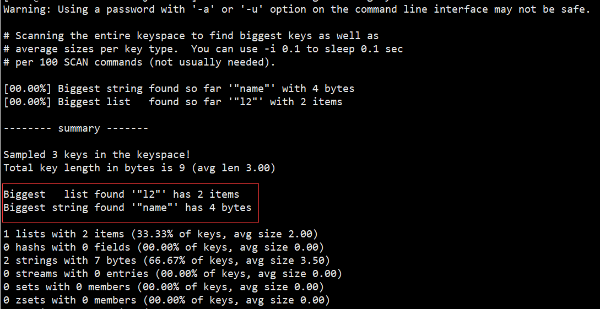

##### ②scan扫描

自己编程，利用scan扫描Redis中的所有key，利用strlen、hlen等命令判断key的长度（此处不建议使用MEMORY USAGE）


scan 命令调用完后每次会返回2个元素，第一个是下一次迭代的光标，第一次光标会设置为0，当最后一次scan 返回的光标等于0时，表示整个scan遍历结束了，第二个返回的是List，一个匹配的key的数组

```java
import com.heima.jedis.util.JedisConnectionFactory;
import org.junit.jupiter.api.AfterEach;
import org.junit.jupiter.api.BeforeEach;
import org.junit.jupiter.api.Test;
import redis.clients.jedis.Jedis;
import redis.clients.jedis.ScanResult;

import java.util.HashMap;
import java.util.List;
import java.util.Map;

public class JedisTest {
    private Jedis jedis;

    @BeforeEach
    void setUp() {
        // 1.建立连接
        // jedis = new Jedis("192.168.150.101", 6379);
        jedis = JedisConnectionFactory.getJedis();
        // 2.设置密码
        jedis.auth("123321");
        // 3.选择库
        jedis.select(0);
    }

    final static int STR_MAX_LEN = 10 * 1024;
    final static int HASH_MAX_LEN = 500;

    @Test
    void testScan() {
        int maxLen = 0;
        long len = 0;

        String cursor = "0";
        do {
            // 扫描并获取一部分key
            ScanResult<String> result = jedis.scan(cursor);
            // 记录cursor
            cursor = result.getCursor();
            List<String> list = result.getResult();
            if (list == null || list.isEmpty()) {
                break;
            }
            // 遍历
            for (String key : list) {
                // 判断key的类型
                String type = jedis.type(key);
                switch (type) {
                    case "string":
                        len = jedis.strlen(key);
                        maxLen = STR_MAX_LEN;
                        break;
                    case "hash":
                        len = jedis.hlen(key);
                        maxLen = HASH_MAX_LEN;
                        break;
                    case "list":
                        len = jedis.llen(key);
                        maxLen = HASH_MAX_LEN;
                        break;
                    case "set":
                        len = jedis.scard(key);
                        maxLen = HASH_MAX_LEN;
                        break;
                    case "zset":
                        len = jedis.zcard(key);
                        maxLen = HASH_MAX_LEN;
                        break;
                    default:
                        break;
                }
                if (len >= maxLen) {
                    System.out.printf("Found big key : %s, type: %s, length or size: %d %n", key, type, len);
                }
            }
        } while (!cursor.equals("0"));
    }
    
    @AfterEach
    void tearDown() {
        if (jedis != null) {
            jedis.close();
        }
    }

}
```

##### ③第三方工具

- 利用第三方工具，如 Redis-Rdb-Tools 分析RDB快照文件，全面分析内存使用情况
- https://github.com/sripathikrishnan/redis-rdb-tools

##### ④网络监控

- 自定义工具，监控进出Redis的网络数据，超出预警值时主动告警
- 一般阿里云搭建的云服务器就有相关监控页面

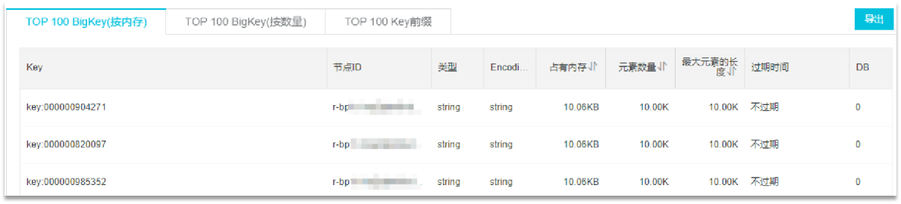

#### 1.2.3、如何删除BigKey

BigKey内存占用较多，即便时删除这样的key也需要耗费很长时间，导致Redis主线程阻塞，引发一系列问题。

- redis 3.0 及以下版本
  - 如果是集合类型，则遍历BigKey的元素，先逐个删除子元素，最后删除BigKey


- Redis 4.0以后
  - Redis在4.0后提供了异步删除的命令：unlink

### 1.3、恰当的数据类型

#### 例1：比如存储一个User对象，我们有三种存储方式：

##### ①方式一：json字符串

| user:1 | {"name": "Jack", "age": 21} |
| :----: | :-------------------------: |

优点：实现简单粗暴

缺点：数据耦合，不够灵活

##### ②方式二：字段打散

| user:1:name | Jack |
| :---------: | :--: |
| user:1:age  |  21  |

优点：可以灵活访问对象任意字段

缺点：占用空间大、没办法做统一控制

##### ③方式三：hash（推荐）

<table>
	<tr>
		<td rowspan="2">user:1</td>
        <td>name</td>
        <td>jack</td>
	</tr>
	<tr>
		<td>age</td>
		<td>21</td>
	</tr>
</table>


优点：底层使用ziplist，空间占用小，可以灵活访问对象的任意字段

缺点：代码相对复杂

#### 例2：假如有hash类型的key，其中有100万对field和value，field是自增id，这个key存在什么问题？如何优化？

<table>
	<tr style="color:red">
		<td>key</td>
        <td>field</td>
        <td>value</td>
	</tr>
	<tr>
		<td rowspan="3">someKey</td>
		<td>id:0</td>
        <td>value0</td>
	</tr>
    <tr>
		<td>.....</td>
        <td>.....</td>
	</tr>
    <tr>
        <td>id:999999</td>
        <td>value999999</td>
    </tr>
</table>


存在的问题：

- hash的entry数量超过500时，会使用哈希表而不是ZipList，内存占用较多
  - 
- 可以通过hash-max-ziplist-entries配置entry上限。但是如果entry过多就会导致BigKey问题

##### 方案一

拆分为string类型

<table>
	<tr style="color:red">
		<td>key</td>
        <td>value</td>
	</tr>
	<tr>
		<td>id:0</td>
        <td>value0</td>
	</tr>
    <tr>
		<td>.....</td>
        <td>.....</td>
	</tr>
    <tr>
        <td>id:999999</td>
        <td>value999999</td>
    </tr>
</table>


存在的问题：

- string结构底层没有太多内存优化，内存占用较多


- 想要批量获取这些数据比较麻烦

##### 方案二

拆分为小的hash，将 id / 100 作为key， 将id % 100 作为field，这样每100个元素为一个Hash

<table>
	<tr style="color:red">
		<td>key</td>
        <td>field</td>
        <td>value</td>
	</tr>
	<tr>
        <td rowspan="3">key:0</td>
		<td>id:00</td>
        <td>value0</td>
	</tr>
    <tr>
		<td>.....</td>
        <td>.....</td>
	</tr>
    <tr>
        <td>id:99</td>
        <td>value99</td>
    </tr>
    <tr>
        <td rowspan="3">key:1</td>
		<td>id:00</td>
        <td>value100</td>
	</tr>
    <tr>
		<td>.....</td>
        <td>.....</td>
	</tr>
    <tr>
        <td>id:99</td>
        <td>value199</td>
    </tr>
    <tr>
    	<td colspan="3">....</td>
    </tr>
    <tr>
        <td rowspan="3">key:9999</td>
		<td>id:00</td>
        <td>value999900</td>
	</tr>
    <tr>
		<td>.....</td>
        <td>.....</td>
	</tr>
    <tr>
        <td>id:99</td>
        <td>value999999</td>
    </tr>
</table>


```java
package com.heima.test;

import com.heima.jedis.util.JedisConnectionFactory;
import org.junit.jupiter.api.AfterEach;
import org.junit.jupiter.api.BeforeEach;
import org.junit.jupiter.api.Test;
import redis.clients.jedis.Jedis;
import redis.clients.jedis.Pipeline;
import redis.clients.jedis.ScanResult;

import java.util.HashMap;
import java.util.List;
import java.util.Map;

public class JedisTest {
    private Jedis jedis;

    @BeforeEach
    void setUp() {
        // 1.建立连接
        // jedis = new Jedis("192.168.150.101", 6379);
        jedis = JedisConnectionFactory.getJedis();
        // 2.设置密码
        jedis.auth("123321");
        // 3.选择库
        jedis.select(0);
    }

    @Test
    void testSetBigKey() {
        Map<String, String> map = new HashMap<>();
        for (int i = 1; i <= 650; i++) {
            map.put("hello_" + i, "world!");
        }
        jedis.hmset("m2", map);
    }

    @Test
    void testBigHash() {
        Map<String, String> map = new HashMap<>();
        for (int i = 1; i <= 100000; i++) {
            map.put("key_" + i, "value_" + i);
        }
        jedis.hmset("test:big:hash", map);
    }

    @Test
    void testBigString() {
        for (int i = 1; i <= 100000; i++) {
            jedis.set("test:str:key_" + i, "value_" + i);
        }
    }

    @Test
    void testSmallHash() {
        int hashSize = 100;
        Map<String, String> map = new HashMap<>(hashSize);
        for (int i = 1; i <= 100000; i++) {
            int k = (i - 1) / hashSize;
            int v = i % hashSize;
            map.put("key_" + v, "value_" + v);
            if (v == 0) {
                jedis.hmset("test:small:hash_" + k, map);
            }
        }
    }

    @AfterEach
    void tearDown() {
        if (jedis != null) {
            jedis.close();
        }
    }
}
```

### 1.4、总结

- Key的最佳实践
  - 固定格式：[业务名]:[数据名]:[id]
  - 足够简短：不超过44字节
  - 不包含特殊字符
- Value的最佳实践：
  - 合理的拆分数据，拒绝BigKey
  - 选择合适数据结构
  - Hash结构的entry数量不要超过1000
  - 设置合理的超时时间

## 2、批处理优化

### 2.1、Pipeline

#### 2.1.1、我们的客户端与redis服务器是这样交互的

单个命令的执行流程

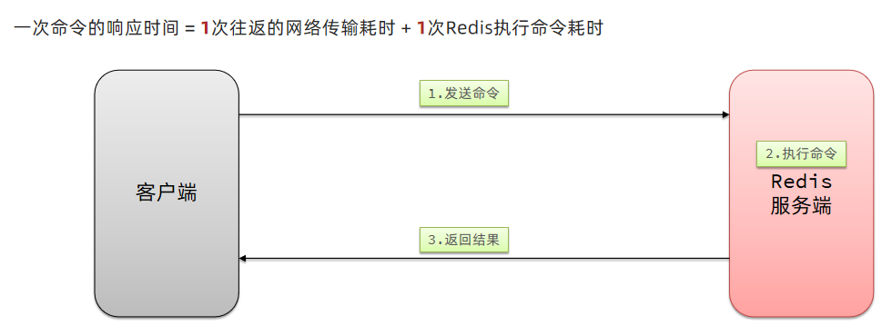

N条命令的执行流程

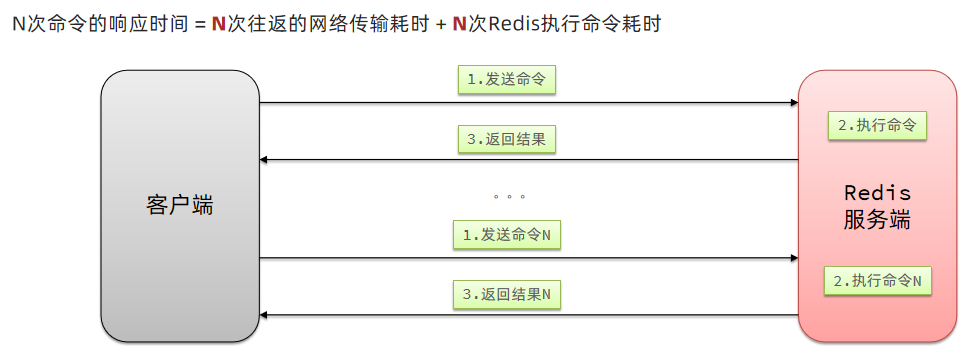

redis处理指令是很快的，主要花费的时候在于网络传输。于是乎很容易想到将多条指令批量的传输给redis


#### 2.1.2、MSet

Redis提供了很多Mxxx这样的命令，可以实现批量插入数据，例如：

- mset
- hmset

利用mset批量插入10万条数据

```java
@Test
void testMxx() {
    String[] arr = new String[2000];
    int j;
    long b = System.currentTimeMillis();
    for (int i = 1; i <= 100000; i++) {
        j = (i % 1000) << 1;
        arr[j] = "test:key_" + i;
        arr[j + 1] = "value_" + i;
        if (j == 0) {
            jedis.mset(arr);
        }
    }
    long e = System.currentTimeMillis();
    System.out.println("time: " + (e - b));
}
```

#### 2.1.3、Pipeline

MSET虽然可以批处理，但是却只能操作部分数据类型，因此如果有对复杂数据类型的批处理需要，建议使用Pipeline

```java
@Test
void testPipeline() {
    // 创建管道
    Pipeline pipeline = jedis.pipelined();
    long b = System.currentTimeMillis();
    for (int i = 1; i <= 100000; i++) {
        // 放入命令到管道
        pipeline.set("test:key_" + i, "value_" + i);
        if (i % 1000 == 0) {
            // 每放入1000条命令，批量执行
            pipeline.sync();
        }
    }
    long e = System.currentTimeMillis();
    System.out.println("time: " + (e - b));
}
```

### 2.2、集群下的批处理

如MSET或Pipeline这样的批处理需要在一次请求中携带多条命令，而此时如果Redis是一个集群，那批处理命令的多个key必须落在一个插槽中，否则就会导致执行失败。大家可以想一想这样的要求其实很难实现，因为我们在批处理时，可能一次要插入很多条数据，这些数据很有可能不会都落在相同的节点上，这就会导致报错了

这个时候，我们可以找到4种解决方案


第一种方案：串行执行，所以这种方式没有什么意义，当然，执行起来就很简单了，缺点就是耗时过久。

第二种方案：串行slot，简单来说，就是执行前，客户端先计算一下对应的key的slot，一样slot的key就放到一个组里边，不同的，就放到不同的组里边，然后对每个组执行pipeline的批处理，他就能串行执行各个组的命令，这种做法比第一种方法耗时要少，但是缺点呢，相对来说复杂一点，所以这种方案还需要优化一下

第三种方案：并行slot，相较于第二种方案，在分组完成后串行执行，第三种方案，就变成了并行执行各个命令，所以他的耗时就非常短，但是实现呢，也更加复杂。

第四种：hash_tag，redis计算key的slot的时候，其实是根据key的有效部分来计算的，通过这种方式就能一次处理所有的key，这种方式耗时最短，实现也简单，但是如果通过操作key的有效部分，那么就会导致所有的key都落在一个节点上，产生数据倾斜的问题，所以我们推荐使用第三种方式。

#### 2.2.1 串行化执行代码实践

```java
public class JedisClusterTest {

    private JedisCluster jedisCluster;

    @BeforeEach
    void setUp() {
        // 配置连接池
        JedisPoolConfig poolConfig = new JedisPoolConfig();
        poolConfig.setMaxTotal(8);
        poolConfig.setMaxIdle(8);
        poolConfig.setMinIdle(0);
        poolConfig.setMaxWaitMillis(1000);
        HashSet<HostAndPort> nodes = new HashSet<>();
        nodes.add(new HostAndPort("192.168.150.101", 7001));
        nodes.add(new HostAndPort("192.168.150.101", 7002));
        nodes.add(new HostAndPort("192.168.150.101", 7003));
        nodes.add(new HostAndPort("192.168.150.101", 8001));
        nodes.add(new HostAndPort("192.168.150.101", 8002));
        nodes.add(new HostAndPort("192.168.150.101", 8003));
        jedisCluster = new JedisCluster(nodes, poolConfig);
    }

    @Test
    void testMSet() {
        jedisCluster.mset("name", "Jack", "age", "21", "sex", "male");

    }

    @Test
    void testMSet2() {
        Map<String, String> map = new HashMap<>(3);
        map.put("name", "Jack");
        map.put("age", "21");
        map.put("sex", "Male");
        //对Map数据进行分组。根据相同的slot放在一个分组
        //key就是slot，value就是一个组
        Map<Integer, List<Map.Entry<String, String>>> result = map.entrySet()
                .stream()
                .collect(Collectors.groupingBy(
                        entry -> ClusterSlotHashUtil.calculateSlot(entry.getKey()))
                );
        //串行的去执行mset的逻辑
        for (List<Map.Entry<String, String>> list : result.values()) {
            String[] arr = new String[list.size() * 2];
            int j = 0;
            for (int i = 0; i < list.size(); i++) {
                j = i<<2;
                Map.Entry<String, String> e = list.get(0);
                arr[j] = e.getKey();
                arr[j + 1] = e.getValue();
            }
            jedisCluster.mset(arr);
        }
    }

    @AfterEach
    void tearDown() {
        if (jedisCluster != null) {
            jedisCluster.close();
        }
    }
}
```

2.2.2 Spring集群环境下批处理代码

```java
   @Test
    void testMSetInCluster() {
        Map<String, String> map = new HashMap<>(3);
        map.put("name", "Rose");
        map.put("age", "21");
        map.put("sex", "Female");
        stringRedisTemplate.opsForValue().multiSet(map);


        List<String> strings = stringRedisTemplate.opsForValue().multiGet(Arrays.asList("name", "age", "sex"));
        strings.forEach(System.out::println);

    }
```

**原理分析**

在RedisAdvancedClusterAsyncCommandsImpl 类中

首先根据slotHash算出来一个partitioned的map，map中的key就是slot，而他的value就是对应的对应相同slot的key对应的数据

通过 RedisFuture<String> mset = super.mset(op);进行异步的消息发送

```Java
@Override
public RedisFuture<String> mset(Map<K, V> map) {

    Map<Integer, List<K>> partitioned = SlotHash.partition(codec, map.keySet());

    if (partitioned.size() < 2) {
        return super.mset(map);
    }

    Map<Integer, RedisFuture<String>> executions = new HashMap<>();

    for (Map.Entry<Integer, List<K>> entry : partitioned.entrySet()) {

        Map<K, V> op = new HashMap<>();
        entry.getValue().forEach(k -> op.put(k, map.get(k)));

        RedisFuture<String> mset = super.mset(op);
        executions.put(entry.getKey(), mset);
    }

    return MultiNodeExecution.firstOfAsync(executions);
}
```

## 3、服务器端优化-持久化配置

Redis的持久化虽然可以保证数据安全，但也会带来很多额外的开销，因此持久化请遵循下列建议：

* 用来做缓存的Redis实例尽量不要开启持久化功能
* 建议关闭RDB持久化功能，使用AOF持久化
* 利用脚本定期在slave节点做RDB，实现数据备份
* 设置合理的rewrite阈值，避免频繁的bgrewrite
* 配置no-appendfsync-on-rewrite = yes，禁止在rewrite期间做aof，避免因AOF引起的阻塞
* 部署有关建议：
  * Redis实例的物理机要预留足够内存，应对fork和rewrite
  * 单个Redis实例内存上限不要太大，例如4G或8G。可以加快fork的速度、减少主从同步、数据迁移压力
  * 不要与CPU密集型应用部署在一起
  * 不要与高硬盘负载应用一起部署。例如：数据库、消息队列

## 4、服务器端优化-慢查询优化

### 4.1 什么是慢查询

并不是很慢的查询才是慢查询，而是：在Redis执行时耗时超过某个阈值的命令，称为慢查询。

慢查询的危害：由于Redis是单线程的，所以当客户端发出指令后，他们都会进入到redis底层的queue来执行，如果此时有一些慢查询的数据，就会导致大量请求阻塞，从而引起报错，所以我们需要解决慢查询问题。


慢查询的阈值可以通过配置指定：

slowlog-log-slower-than：慢查询阈值，单位是微秒。默认是10000，建议1000

慢查询会被放入慢查询日志中，日志的长度有上限，可以通过配置指定：

slowlog-max-len：慢查询日志（本质是一个队列）的长度。默认是128，建议1000


修改这两个配置可以使用：config set命令：


### 4.2 如何查看慢查询

知道了以上内容之后，那么咱们如何去查看慢查询日志列表呢：

* slowlog len：查询慢查询日志长度
* slowlog get [n]：读取n条慢查询日志
* slowlog reset：清空慢查询列表


## 5、服务器端优化-命令及安全配置

 安全可以说是服务器端一个非常重要的话题，如果安全出现了问题，那么一旦这个漏洞被一些坏人知道了之后，并且进行攻击，那么这就会给咱们的系统带来很多的损失，所以我们这节课就来解决这个问题。

Redis会绑定在0.0.0.0:6379，这样将会将Redis服务暴露到公网上，而Redis如果没有做身份认证，会出现严重的安全漏洞.
漏洞重现方式：https://cloud.tencent.com/developer/article/1039000

为什么会出现不需要密码也能够登录呢，主要是Redis考虑到每次登录都比较麻烦，所以Redis就有一种ssh免秘钥登录的方式，生成一对公钥和私钥，私钥放在本地，公钥放在redis端，当我们登录时服务器，再登录时候，他会去解析公钥和私钥，如果没有问题，则不需要利用redis的登录也能访问，这种做法本身也很常见，但是这里有一个前提，前提就是公钥必须保存在服务器上，才行，但是Redis的漏洞在于在不登录的情况下，也能把秘钥送到Linux服务器，从而产生漏洞

漏洞出现的核心的原因有以下几点：

* Redis未设置密码
* 利用了Redis的config set命令动态修改Redis配置
* 使用了Root账号权限启动Redis

所以：如何解决呢？我们可以采用如下几种方案

为了避免这样的漏洞，这里给出一些建议：

* Redis一定要设置密码
* 禁止线上使用下面命令：keys、flushall、flushdb、config set等命令。可以利用rename-command禁用。
* bind：限制网卡，禁止外网网卡访问
* 开启防火墙
* 不要使用Root账户启动Redis
* 尽量不是有默认的端口

## 6、服务器端优化-Redis内存划分和内存配置

当Redis内存不足时，可能导致Key频繁被删除、响应时间变长、QPS不稳定等问题。当内存使用率达到90%以上时就需要我们警惕，并快速定位到内存占用的原因。

**有关碎片问题分析**

Redis底层分配并不是这个key有多大，他就会分配多大，而是有他自己的分配策略，比如8,16,20等等，假定当前key只需要10个字节，此时分配8肯定不够，那么他就会分配16个字节，多出来的6个字节就不能被使用，这就是我们常说的 碎片问题

**进程内存问题分析：**

这片内存，通常我们都可以忽略不计

**缓冲区内存问题分析：**

一般包括客户端缓冲区、AOF缓冲区、复制缓冲区等。客户端缓冲区又包括输入缓冲区和输出缓冲区两种。这部分内存占用波动较大，所以这片内存也是我们需要重点分析的内存问题。

| **内存占用** | **说明**                                                     |
| ------------ | ------------------------------------------------------------ |
| 数据内存     | 是Redis最主要的部分，存储Redis的键值信息。主要问题是BigKey问题、内存碎片问题 |
| 进程内存     | Redis主进程本身运⾏肯定需要占⽤内存，如代码、常量池等等；这部分内存⼤约⼏兆，在⼤多数⽣产环境中与Redis数据占⽤的内存相⽐可以忽略。 |
| 缓冲区内存   | 一般包括客户端缓冲区、AOF缓冲区、复制缓冲区等。客户端缓冲区又包括输入缓冲区和输出缓冲区两种。这部分内存占用波动较大，不当使用BigKey，可能导致内存溢出。 |

于是我们就需要通过一些命令，可以查看到Redis目前的内存分配状态：

* info memory：查看内存分配的情况


* memory xxx：查看key的主要占用情况

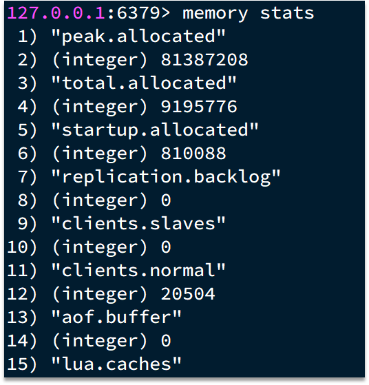

接下来我们看到了这些配置，最关键的缓存区内存如何定位和解决呢？

内存缓冲区常见的有三种：

* 复制缓冲区：主从复制的repl_backlog_buf，如果太小可能导致频繁的全量复制，影响性能。通过replbacklog-size来设置，默认1mb
* AOF缓冲区：AOF刷盘之前的缓存区域，AOF执行rewrite的缓冲区。无法设置容量上限
* 客户端缓冲区：分为输入缓冲区和输出缓冲区，输入缓冲区最大1G且不能设置。输出缓冲区可以设置

以上复制缓冲区和AOF缓冲区 不会有问题，最关键就是客户端缓冲区的问题

客户端缓冲区：指的就是我们发送命令时，客户端用来缓存命令的一个缓冲区，也就是我们向redis输入数据的输入端缓冲区和redis向客户端返回数据的响应缓存区，输入缓冲区最大1G且不能设置，所以这一块我们根本不用担心，如果超过了这个空间，redis会直接断开，因为本来此时此刻就代表着redis处理不过来了，我们需要担心的就是输出端缓冲区


我们在使用redis过程中，处理大量的big value，那么会导致我们的输出结果过多，如果输出缓存区过大，会导致redis直接断开，而默认配置的情况下， 其实他是没有大小的，这就比较坑了，内存可能一下子被占满，会直接导致咱们的redis断开，所以解决方案有两个

1、设置一个大小

2、增加我们带宽的大小，避免我们出现大量数据从而直接超过了redis的承受能力


## 7、服务器端集群优化-集群还是主从

集群虽然具备高可用特性，能实现自动故障恢复，但是如果使用不当，也会存在一些问题：

* 集群完整性问题
* 集群带宽问题
* 数据倾斜问题
* 客户端性能问题
* 命令的集群兼容性问题
* lua和事务问题

 **问题1、在Redis的默认配置中，如果发现任意一个插槽不可用，则整个集群都会停止对外服务：** 

大家可以设想一下，如果有几个slot不能使用，那么此时整个集群都不能用了，我们在开发中，其实最重要的是可用性，所以需要把如下配置修改成no，即有slot不能使用时，我们的redis集群还是可以对外提供服务

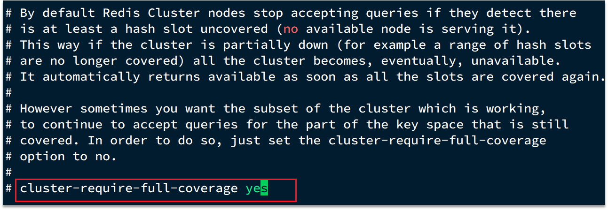

**问题2、集群带宽问题**

集群节点之间会不断的互相Ping来确定集群中其它节点的状态。每次Ping携带的信息至少包括：

* 插槽信息
* 集群状态信息

集群中节点越多，集群状态信息数据量也越大，10个节点的相关信息可能达到1kb，此时每次集群互通需要的带宽会非常高，这样会导致集群中大量的带宽都会被ping信息所占用，这是一个非常可怕的问题，所以我们需要去解决这样的问题

**解决途径：**

* 避免大集群，集群节点数不要太多，最好少于1000，如果业务庞大，则建立多个集群。
* 避免在单个物理机中运行太多Redis实例
* 配置合适的cluster-node-timeout值

**问题3、命令的集群兼容性问题**

有关这个问题咱们已经探讨过了，当我们使用批处理的命令时，redis要求我们的key必须落在相同的slot上，然后大量的key同时操作时，是无法完成的，所以客户端必须要对这样的数据进行处理，这些方案我们之前已经探讨过了，所以不再这个地方赘述了。

**问题4、lua和事务的问题**

lua和事务都是要保证原子性问题，如果你的key不在一个节点，那么是无法保证lua的执行和事务的特性的，所以在集群模式是没有办法执行lua和事务的


**那我们到底是集群还是主从**

单体Redis（主从Redis）已经能达到万级别的QPS，并且也具备很强的高可用特性。如果主从能满足业务需求的情况下，所以如果不是在万不得已的情况下，尽量不搭建Redis集群

## 8、结束语

亲爱的小伙帮们辛苦啦，咱们有关redis的最佳实践到这里就讲解完毕了，期待小伙们学业有成~~~~


| 白头 | asldkf |
| ---- | ------ |
|      |        |


# TODO:


