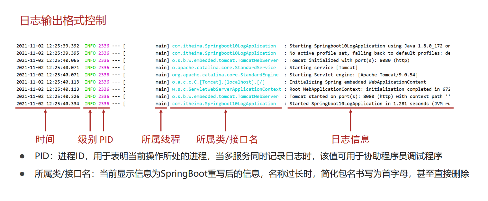
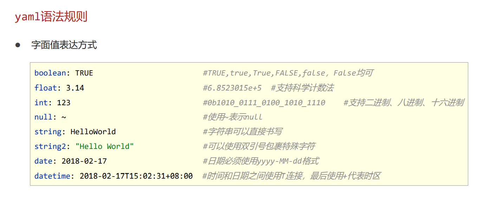
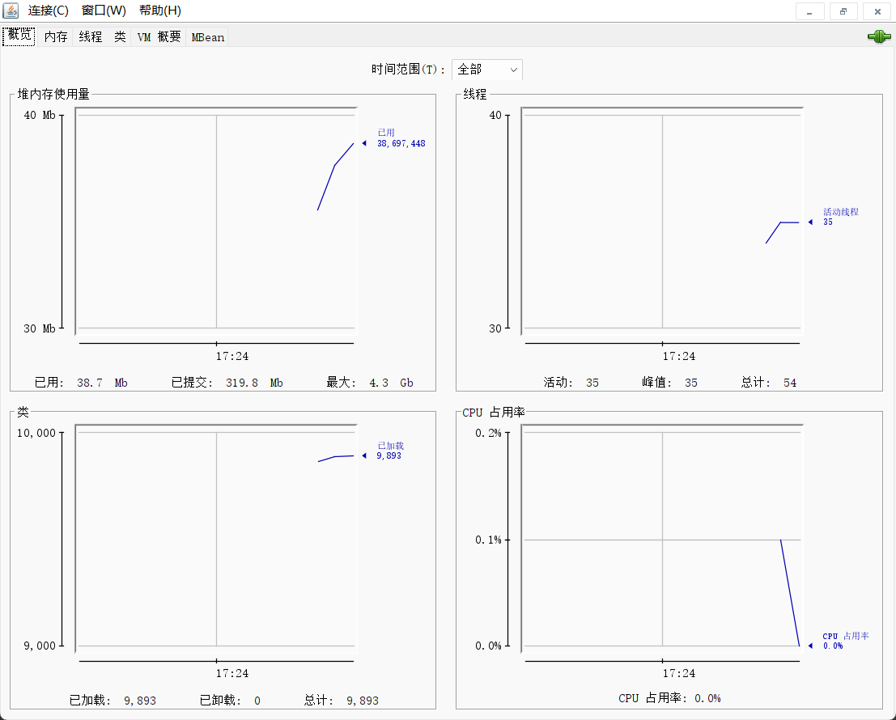
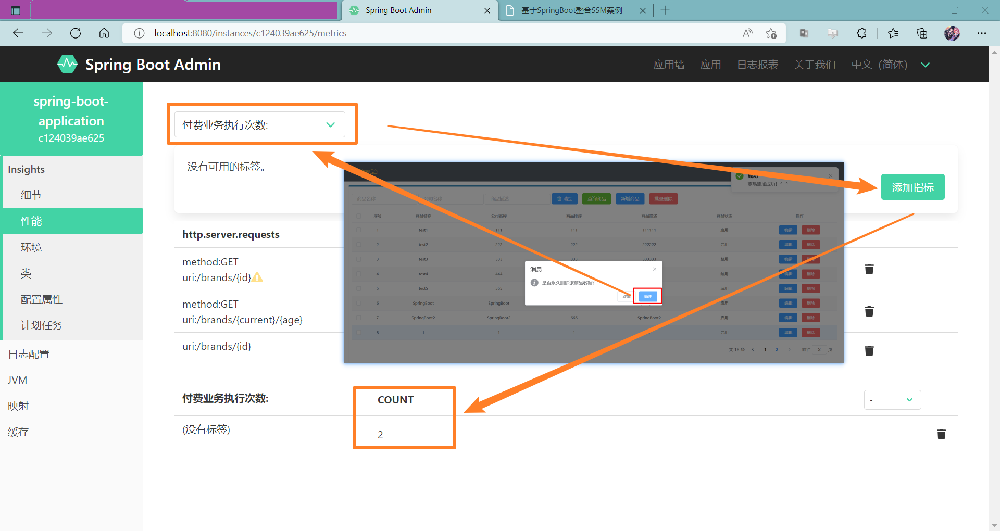

# SpringBoot2 复习笔记


[TOC]


## 运维相关


### 工程打包与运行

spring-boot-maven-plugin 打包器

```xml
<build>
    <plugins>
        <plugin>
            <groupId>org.springframework.boot</groupId>
            <artifactId>spring-boot-maven-plugin</artifactId>
        </plugin>
    </plugins>
</build>
```


命令行启动常见问题及解决方案


### 临时参数与属性


程序入口参数


关闭程序程序入口 | 开发期调试配置

```java
@SpringBootApplication
public class ProApplication {

    public static void main(String[] args) {

        //方式一: 通过cmd运行时加入：java -jar 工程文件jar包.jar --server.port=66 --参数k=参数v
        //方式二：在开发环境 idea 中 [运行/调试配置] 中配置 配置 [程序参数]

        //方式三:

        //切断外界的临时参数的传入，提高安全性
        //SpringApplication.run(SSMPApplication.class/*, args*/);
        //或者传入非main的args 而是 传入内部要调试的传数

        System.out.println("==========");
        SpringApplication.run(ProApplication.class,test());

    }

    /**
     * 调试临时参数
     * @return 临时参数
     */
    private static String[] test(){

        //调试临时参数
        String[] args = new String[]{
                //端口号
                "--server.port=666"
                //......
        };

        return args;
    }

}
```


### 配置文件分级

 

不同文件类型级别：`.properties` > `.yaml`

同文件类型级别:

1. resource 目录下的配置文件级别最低
2. resource目录下的config文件下的目录文件比1高
3. 工程jar包文件同级目录下的配置文件比2高
4. 工程jar包文件同级目录下的config文件下的配置文件最高


不同属性加载的优先级顺序


参看: 
[连接:https://docs.spring.io/spring-boot/docs/current/reference/html/spring-boot-features.html#boot-features-external-config](https://docs.spring.io/spring-boot/docs/current/reference/html/spring-boot-features.html#boot-features-external-config)


自定义配置文件


### 多环境开发


#### 基于yaml的多环境开发

application.yml

```yaml
# 多环境开发 --基于yaml
# 格式：
#
#
#
# 公共环境:
# spring
#   profiles
#     active: 环境一
#
#
# # 内部实现方式:
# ---
# spring
#  profiles: 环境一
#
# #环境一相关配置
#
# ---    # 多环境用---分开
# spring
#  profiles: 环境二
#
# #环境二相关配置
#
# ---
# spring
#  profiles: 环境三
#
# #环境三相关配置
#
##### 或使用
#---
# spring:
#  config:
#    activate:
#      on-profile: 推荐格式
#


# 公共环境:

# 配置数据源连接池
spring:
  # 要使用那个环境
  profiles:
    active: outfile # 内部: pro dev test 推荐格式 外部: outfile
  # 配置数据源连接池
  datasource:
    druid:
      driver-class-name: com.mysql.cj.jdbc.Driver
      url: jdbc:mysql:///springboot_db?useSSL=false&serverTimezone=UTC
      username: root
      password: ganga
  # banner
  main:
    banner-mode: console
  banner:
    image:
      location: icon.png


# 配置mybatis-plus 相关配置
mybatis-plus:
  global-config:
    db-config:
      table-prefix: tb_ # 设置表前缀
      id-type: auto # 设置id为数据库自增

  configuration: # 设置日志 输出在控制台上
    log-impl: org.apache.ibatis.logging.stdout.StdOutImpl

# 下面是多环境 用---分开
---
# 生产环境
spring:
  profiles: pro
  banner:
    image:
      location: logo.png # 会替换掉公共环境的该属性

# 配置生产环境端口号
server:
  port: 88 # 80 端口

# 配置......

# 控制台日志：The following 1 profile is active: "pro"

---
# 开发环境
spring:
  profiles: dev

# 配置开发环境端口号
server:
  port: 99

# 配置......

# 控制台日志：The following 1 profile is active: "dev"


---
# 测试环境
spring:
  profiles: test

# 配置测试环境端口号
server:
  port: 1010

# 配置......

# 控制台日志：The following 1 profile is active: "test"

---
spring:
  config:
    activate:
      on-profile: 推荐格式
```

application-outfile.yml

```yaml
# 多环境外部配置文件

server:
  port: 8888

# 其他配置...
```


#### 基于properties文件的多环境开发

基于properties的多文件开发就一种 

```properties
# 开发环境配置

# spring.config.activate.on-profile= #不需要写


server.port=6666

# 其他配置
```


#### 基于Maven的多环境开发 和 分组开发

springboot 是依赖于 maven的


Maven中设置多环境属性

`pro.xml`

```xml
<!-- 多环境开发 -->
<profiles>

    <!-- 生产环境 -->
    <profile>
        <id>pro_env</id>
        <properties><!--这对应application-pro.yml 的 pro-->
            <profile.active>pro</profile.active>
        </properties>
    </profile>

    <!-- 开发环境 -->
    <profile>
        <id>dev_env</id>
        <properties>
            <profile.active>dev</profile.active>
        </properties>
        <!-- 将该环境设置为默认环境 -->
        <activation>
            <activeByDefault>true</activeByDefault>
        </activation>
    </profile>

    <!-- 测试环境 -->
    <profile>
        <id>test_env</id>
        <properties>
            <profile.active>test</profile.active>
        </properties>
    </profile>

</profiles>
```


SpringBoot中引用Maven属性

application.yml

```yaml
# 多环境开发 --基于yaml

# 多环境开发 分组管理

## 选择环境 方式一: include
#spring:
#  profiles:
#    active: dev
#    include: devBD,devRedis,devMVC
#    # The following 3 profiles are active: "devBD", "devRedis", "devMVC", "dev"
#    # Tomcat started on port(s): 6666 (http) with context path '/test'
#    # 先加载include里面的 按顺序的加载 然后加载active  | 后加载的会覆盖 相同配置后加载执行
#    # 所以active环境配置里比较优先


## 选择环境 方式二：group
#spring:
#  profiles:
#    active: dev
#    group:
#      "dev": devBD,devRedis,devMVC
#      "pro": proBD,proMVC,proRedis
#      # The following 4 profiles are active: "dev", "devBD", "devRedis", "devMVC"
#      # Tomcat started on port(s): 9999 (http) with context path '/test'
#      # 先加载active 后加载分组 分组是按顺序加载的 | 后加载的会覆盖 相同配置后加载执行
#      # 所以分组最后一个比较优先


# Maven与SpringBoot多环境兼容
spring:
  profiles:
    active: @profile.active@


# 1. 当Maven与SpringBoot同时对多环境进行控制时，以Mavn为主，
#     SpringBoot使用@..@占位符读取Maven对应的配置属性值
#
# 2. 基于SpringBoot读取Maven配置属性的前提下，如果在Idea下测试
#     工程时pom.xml每次更新需要手动compile方可生效
```


---

---


### 日志文件


#### 日志级别

- TRACE：运行堆栈信息，使用率低 

- DEBUG：程序员调试代码使用 

- INFO：记录运维过程数据 

- WARN：记录运维过程报警数据 

- ERROR：记录错误堆栈信息 

- FATAL：灾难信息，合并计入ERROR


Demo

```java
import org.slf4j.LoggerFactory;
import org.springframework.stereotype.Repository;

@Repository
public class TestDao {

    public static final Logger log = LoggerFactory.getLogger(TestDao.class);

    //测试
    public void me(){
        System.out.println("=======================");
        System.out.println("=====com.ganga.dao=====");
        //记录日志
        log.trace("trace...");//最低级别, 一般没人用
        log.debug("debug...");
        log.info("info...");
        log.warn("warn...");
        log.debug("debug...");
        log.error("error..."); //高级别
        System.out.println("=======================");
    }

}
```


---

---


application.yml

```yaml
server:
  port: 80

# 日志配置
spring:
  profiles:
    active: config04


---
spring:
  config:
    activate:
      on-profile: config01

  # 开启debug
debug: true

---
spring:
  config:
    activate:
      on-profile: config02

# 配置日志级别  推选使用方式
logging:
  level:
    root: warn
    # root是根目录及其以下的所有日志

---
spring:
  config:
    activate:
      on-profile: config03

# 配置指定包日志级别
logging:
  level:
    com.ganga.controller: trace
    # 刚刚指定的是root根目录下所有的 现在设置为com.ganga.controller包下的日志


---
spring:
  config:
    activate:
      on-profile: config04

# 分组配置配置日志级别  推选使用
logging:
  # 自定义设置分组 分组名: 包名
  group:
    ebank: com.ganga.controller,com.ganga.service,com.ganga.dao
    edao: com.ganga.dao
  # 分组名: 分组级别
  level:
    ebank: debug
    edao: trace
```


Test01

```java
public String me(){
    System.out.println("SpringBoot2...");
    System.out.println("========Test01=========");

    //记录日志
    log.trace("trace...");//最低级别, 一般没人用
    log.debug("debug...");
    log.info("info...");
    log.warn("warn...");
    log.debug("debug...");
    log.error("error..."); //高级别
    //log.fatal(); //灾难性级别 理论上记录 springboot将其融入到了error级别

    //启用那个等级的日志 ，就会记录那个级别 及其 更高级别的日志

    //默认级别是 INFO 级别
    //SpringBoot2...
    //2022-05-11 16:03:58.760  INFO 13912 --- [p-nio-80-exec-4] com.ganga.controller.Test01Controller    : info...
    //2022-05-11 16:03:58.760  WARN 13912 --- [p-nio-80-exec-4] com.ganga.controller.Test01Controller    : warn...
    //2022-05-11 16:03:58.760 ERROR 13912 --- [p-nio-80-exec-4] com.ganga.controller.Test01Controller    : error...

    testDao.me();

    return "SpringBoot2...";
}
```


Test02

```java
//http://localhost/test02/run
@RequestMapping("/run")
@ResponseBody
public String me(){
    System.out.println("SpringBoot2...");
    System.out.println("========Test02=========");

    //记录日志
    log.trace("trace...");//最低级别, 一般没人用
    log.debug("debug...");
    log.info("info...");
    log.warn("warn...");
    log.debug("debug...");
    log.error("error..."); //高级别
    //log.fatal(); //灾难性级别 理论上记录 springboot将其融入到了error级别

    testDao.me();

    return "SpringBoot2...";
}
```


Test03

```java
//http://localhost/test03/run
@RequestMapping("/run")
@ResponseBody
public String me(){
    System.out.println("SpringBoot2...");
    System.out.println("========Test03=========");

    //记录日志
    log.trace("trace...");//最低级别, 一般没人用
    log.debug("debug...");
    log.info("info...");
    log.warn("warn...");
    log.debug("debug...");
    log.error("error..."); //高级别
    //log.fatal(); //灾难性级别 理论上记录 springboot将其融入到了error级别

    testDao.me();

    return "SpringBoot2...";
}
```


#### 自定义创建 Logger对象

```java
public static final Logger log = LoggerFactory.getLogger(TestDao.class);
```


#### SpringBoot 整合及配置Logger

springboot默认使用的日志技术就是Logging


日志输出格式




application.yml

```yaml
server:
  port: 80

# 日志配置
logging:

  # 自定义设置分组 分组名: 包名
  group:
    ebank: com.ganga.controller,com.ganga.service,com.ganga.dao
    edao: com.ganga.dao

  # 分组设置日志级别  分组名: 分组级别
  level:
    ebank: debug
    edao: trace

  #配置日志格式
  pattern:
    # 要用 "" 引号包裹！
    console: "%d %clr(%5p) --- [%16t] %clr(%-40.40c){cyan} : %clr(%m){blue} %n"
    # %d-->日期  %p-->日志级别  %t-->进程名  %c-->包和类名  %m-->日志消息  %n-->换行
    # %clr(%m){blue} 日志消息 颜色是blue  不设置{} 默认是绿色
    # %5p 日志级别设置为 5个占位
    # %-40.40c 包和类名设置为左对齐 占位40

    # 其中console:是吧日志设置在控制上的

```


#### 使用lombok 提供的注解 @slf4g

该类当中就创建了一个名为 log的Logger对象了 

```java
package com.ganga.controller;

import com.ganga.dao.TestDao;
import lombok.extern.slf4j.Slf4j;
import org.springframework.beans.factory.annotation.Autowired;
import org.springframework.stereotype.Controller;
import org.springframework.web.bind.annotation.RequestMapping;
import org.springframework.web.bind.annotation.ResponseBody;

//使用lombok注解
@Slf4j //获得的对象名就是 ：log  下面直接用log.debug()...就行了
@Controller
@RequestMapping("/test")
public class TestController {

    @Autowired
    private TestDao testDao;

    //http://localhost/test/run
    @RequestMapping("/run")
    @ResponseBody
    public String me(){
        System.out.println("SpringBoot2...");
        System.out.println("========Test03=========");

        //记录日志
        log.trace("trace...");//最低级别, 一般没人用
        log.debug("debug...");
        log.info("info...");
        log.warn("warn...");
        log.debug("debug...");
        log.error("error..."); //高级别
        //log.fatal(); //灾难性级别 理论上记录 springboot将其融入到了error级别

        testDao.me();

        return "SpringBoot2...";
    }

}
```


#### 日志文件

application.yml 配置

```yaml
server:
  port: 80

# 日志配置
logging:

  # 自定义设置分组 分组名: 包名
  group:
    ebank: com.ganga.controller,com.ganga.service,com.ganga.dao
    edao: com.ganga.dao

  # 分组设置日志级别  分组名: 分组级别
  level:
    ebank: debug
    edao: trace

  #配置日志格式
  pattern:
    # 要用 "" 引号包裹！
    console: "%d %clr(%5p) --- [%16t] %clr(%-40.40c){cyan} : %clr(%m){blue} %n"
    # %d-->日期  %p-->日志级别  %t-->进程名  %c-->包和类名  %m-->日志消息  %n-->换行
    # %clr(%m){blue} 日志消息 颜色是blue  不设置{} 默认是绿色
    # %5p 日志级别设置为 5个占位
    # %-40.40c 包和类名设置为左对齐 占位40
    # 其中console:是吧日志设置在控制上的

  # 设置日志文件
  # 方式一：只设置日志文件名
  file:
    name: server.log

  # 方式二：多个文件当超过最大配置时 规定的格式进行创建新日志文件
  logback:
    rollingpolicy:
      file-name-pattern: server.%d{yyyy-MM-dd}.%i.log
      max-file-size: 4KB

```


文件位置在整个项目文件夹当中


## 开发相关


### 热部署

坐标

```xml
<!-- SpringBoot 热部署插件坐标 -->
<dependency>
    <groupId>org.springframework.boot</groupId>
    <artifactId>spring-boot-devtools</artifactId>
</dependency>
```

application.yml 配置文件

```yaml
# 配置端口号
server:
  # 自定义配置热部署范围 resources目录下的文件
  devtools:
    restart:
      exclude: static/**,public/**,config/application.yml
#      enabled: false #关闭热部署  #存在问题 更高级别的config也要关闭
```


### 配置高级


#### @EnableConfigurationProperties注解


@EnableConfigurationProperties注解支持宽松绑定

而@Value不支持宽松绑定


application.yml

```yml
ganga:
#  ipAddress: 192.168.0.1     # 驼峰命名
#  ipaddress: 192.168.0.2
#  ip_address: 192.168.0.3    # unline
#  ip-address: 192.168.0.4    # 烤肉串模式
#  IPADDRESS: 192.168.0.5
#  IP_ADDRESS: 192.168.0.6    # 常量
#  Ip_A_DD-RE_ss: 192.168.0.7
  ip-address: 192.168.0.10    # springboot 推选使用 烤肉串模式
  port: 6666
  prefix: /ganga


# 这里可以不区分大小写 而 注解里prefix=“mydatasource”里面不能使用大写字母
myDataSource:
  driver: com.mysql.jdbc.Driver
  URL: jdbc:mysql:///xxx?xxx=xxx&xxx=xxx
  name: ganga
  password: 666
```


Application.java

```java
package com.ganga;

import com.ganga.config.MyDataSource;
import com.ganga.config.ServerConfig;
import org.springframework.boot.SpringApplication;
import org.springframework.boot.autoconfigure.SpringBootApplication;
import org.springframework.boot.context.properties.EnableConfigurationProperties;
import org.springframework.context.ConfigurableApplicationContext;

@SpringBootApplication
//EnableConfigurationProperties 指定要使用配置类 并 放入Sprng容器当中
//注意:这里添加了这个注解后 里面类已经放入了Spring容器里了 原有类在添加@Component会报错
//但是@ConfigurationProperties(prefix = "ganga") /... 依然不能少
@EnableConfigurationProperties({
        ServerConfig.class,MyDataSource.class
})
public class ConfigurationApplication {

    public static void main(String[] args) {

        ConfigurableApplicationContext cac = SpringApplication.run(ConfigurationApplication.class, args);

        ServerConfig bean = cac.getBean(ServerConfig.class);
        System.out.println(bean);
        //ServerConfig(Address=192.168.0.1, port=6666, prefix=/ganga)

        MyDataSource bean1 = cac.getBean(MyDataSource.class);
        System.out.println(bean1);
        //MyDataSource(driver=com.mysql.jdbc.Driver, url=jdbc:mysql:///xxx?xxx=xxx&xxx=xxx, name=ganga, password=666)

    }

}
```


config01

```java
package com.ganga.config;

import lombok.Data;
import org.springframework.boot.context.properties.ConfigurationProperties;
import org.springframework.stereotype.Component;

@Data
//@Component //在使用EnableConfigurationProperties指定后 已经注入 这了在注入会报错
@ConfigurationProperties(prefix = "ganga") ////这里不能用大写 ！！！
public class ServerConfig {

    private String ipAddress;
    private int port;
    private String prefix;

}
```


config02

```java
package com.ganga.config;

import lombok.Data;
import org.springframework.boot.context.properties.ConfigurationProperties;
import org.springframework.stereotype.Component;

@Data
//放入容器当中
//@Component //在使用EnableConfigurationProperties指定后 已经注入 这了在注入会报错
@ConfigurationProperties(prefix = "mydatasource") //这里不能用大写 ！！！
public class MyDataSource {

    private String driver;
    private String url;
    private String name;
    private String password;

}
```


@Value不支持宽松绑定

```java
@SpringBootTest
class ValueTests {

    //@Value("${ganga.ipAddress}")
    @Value("${ganga.ip-address}")
    private String ip;

    @Test
    void contextLoads() {

        System.out.println(ip);

    }

}
```


#### Java新数据类型 及 配置


```java
//设置为小时
@DurationUnit(ChronoUnit.HOURS)
private Duration serverTimeOut02;

//设置为MB
@DataSizeUnit(DataUnit.MEGABYTES)
private DataSize logSize02;
```


Application.java

```java
@SpringBootApplication
@EnableConfigurationProperties({
        ServerConfig.class
})
public class DurationDataSizeApplication {

    public static void main(String[] args) {
        SpringApplication.run(DurationDataSizeApplication.class, args);
    }

}
```


application.yml

```yaml
ganga:
  id-address: 192.168.0.1
  port: 8080
  timeout: 1200

  server-timeout-01: 1200
  log-size-01: 1024

  server-timeout-02: 6
  log-size-02: 10
```


config

```java
package com.ganga.config;

import lombok.Data;
import org.springframework.boot.context.properties.ConfigurationProperties;
import org.springframework.boot.convert.DataSizeUnit;
import org.springframework.boot.convert.DurationUnit;
import org.springframework.util.unit.DataSize;
import org.springframework.util.unit.DataUnit;

import java.time.Duration;
import java.time.temporal.ChronoUnit;

@Data
@ConfigurationProperties(prefix = "ganga")
public class ServerConfig {

    private String ipAddress;
    private int port;
    private long timeOut;

    //jdk8: 引入时间存储数据
    private Duration serverTimeOut01;

    //jdk8: 引入空间存储数据
    private DataSize logSize01;

    //设置为小时
    @DurationUnit(ChronoUnit.HOURS)
    private Duration serverTimeOut02;

    //设置为MB
    @DataSizeUnit(DataUnit.MEGABYTES)
    private DataSize logSize02;

}
```


#### 数据校验

开启数据校验有助于系统安全性，J2EE规范中**JSR303规范**定义了一组有关数据校验相关的API




pom坐标

```xml
<!-- 第一步: 导入JSR303规范接口坐标 -->
<dependency>
    <groupId>javax.validation</groupId>
    <artifactId>validation-api</artifactId>
</dependency>
<!-- 第一步: 导入基于JSR303gHibernate校验框架坐标 -->
<dependency>
    <groupId>org.hibernate.validator</groupId>
    <artifactId>hibernate-validator</artifactId>
</dependency>
```

application.yml

```yaml
ganga:
  id-address: 192.168.0.1
  port: 201
  timeout: 1200

  server-timeout-01: 1200
  log-size-01: 1024

  server-timeout-02: 6
  log-size-02: 10
```

Application.java

```java
@SpringBootApplication
@EnableConfigurationProperties({
        ServerConfig.class
})
public class DataValidationApplication {

    public static void main(String[] args) {
        SpringApplication
            .run(DataValidationApplication.class);
    }
}
```

config

```java
package com.ganga.config;

import lombok.Data;
import lombok.NonNull;
import org.hibernate.validator.constraints.Length;
import org.springframework.boot.context.properties.ConfigurationProperties;
import org.springframework.boot.convert.DataSizeUnit;
import org.springframework.boot.convert.DurationUnit;
import org.springframework.util.unit.DataSize;
import org.springframework.util.unit.DataUnit;
import org.springframework.validation.annotation.Validated;

import javax.validation.constraints.Max;
import javax.validation.constraints.Min;
import java.time.Duration;
import java.time.temporal.ChronoUnit;

@Data
@ConfigurationProperties(prefix = "ganga")

//第二步：给类添加@Validated注解
@Validated
public class ServerConfig {

    //第三步：给数据添加校验注解
    @Length(max = 12,min = 6,message = "ip地址最大12字符 最小6字符")
    private String ipAddress;
    @Max(value = 8888,message = "端口号最大值不能超过8888")
    @Min(value = 202, message = "端口号最小值不能小于202")
    private int port;
    //@NonNull
    private long timeOut;

    //jdk8: 引入时间存储数据
    private Duration serverTimeOut01;

    //jdk8: 引入空间存储数据
    private DataSize logSize01;

    //设置为小时
    @DurationUnit(ChronoUnit.HOURS)
    private Duration serverTimeOut02;

    //设置为MB
    @DataSizeUnit(DataUnit.MEGABYTES)
    private DataSize logSize02;


}
```


### 测试高级


#### 加载测试专用属性

1. @SpringBootTest(properties = {"server.port=8888","ganga.hobby=原神"})
2. @SpringBootTest(args = {"--server.port=6666","--ganga.hobby=这就尴尬了"})

根据配置文件的优先级   程序入口args 要大于 properties

```java
//根据优先级 args 程序参数入口的属性值 要大于配置文件级别
@SpringBootTest(properties = "server.port=6666",args = "--server.port=9999")
@ContextConfiguration(classes = Test01Application.class)
public class Test04_PriorityTest {

    @Value("${server.port}")
    private int port;

    @Test
    void PriorityTest(){
        System.out.println("port===>" + port);
    }


}
```

优势：比多环境开发中的测试环境影响范围更小，仅对当前测试类有效


#### 加载测试专用配置

加载测试临时属性应用于小范围测试环境

config - bean

```java
package com.ganga.config;

//测试时,有时会需要添加临时第三方的bean 使用测试类里加上Inport注解

import org.springframework.context.annotation.Bean;
import org.springframework.context.annotation.Configuration;

@Configuration
public class BeanConfig {

    @Bean
    public String msg(){
        return "String Bean msg...";
    }

}
```


使用@Import注解 在类上 就可以这个bean了

```java
package com.ganga;

import com.ganga.config.BeanConfig;
import org.junit.jupiter.api.Test;
import org.springframework.beans.factory.annotation.Autowired;
import org.springframework.boot.test.context.SpringBootTest;
import org.springframework.context.annotation.Import;

@SpringBootTest
@Import({BeanConfig.class}) //导入临时配置类 加载bean
class TestBeanTest {

    @Autowired
    private String msg; //这个bean是配置注入的

    @Test
    void contextLoads() {
        System.out.println(msg);
    }

}
```


#### Web环境模拟测试

开启Web环境测试使用

@SpringBootTest()的

- webEnvironment = SpringBootTest.WebEnvironment.RANDOM_PORT      开启 随机端口
- webEnvironment = SpringBootTest.WebEnvironment.DEFINED_PORT      开启 配置端口
- webEnvironment = SpringBootTest.WebEnvironment.NONE                       默认值 关闭

```java
package com.ganga;

import com.ganga.controller.TestController;
import org.junit.jupiter.api.Test;
import org.springframework.beans.factory.annotation.Autowired;
import org.springframework.boot.test.context.SpringBootTest;

//@SpringBootTest(webEnvironment = SpringBootTest.WebEnvironment.NONE) //默认就是none 不开启
//@SpringBootTest(webEnvironment = SpringBootTest.WebEnvironment.DEFINED_PORT) //根据配置文件进行加载端口 开启web环境
@SpringBootTest(webEnvironment = SpringBootTest.WebEnvironment.RANDOM_PORT) //开启web环境 并 随机不占用端口 推选使用这个
class WebEnvironmentTest {
    @Test
    void contextLoads(@Autowired TestController testController) {
        testController.me();
    }
}
```


#### Web服务层代码测试


```java
package com.ganga;

import org.junit.jupiter.api.Test;
import org.springframework.beans.factory.annotation.Autowired;
import org.springframework.boot.test.autoconfigure.web.servlet.AutoConfigureMockMvc;
import org.springframework.boot.test.context.SpringBootTest;
import org.springframework.test.web.servlet.MockMvc;
import org.springframework.test.web.servlet.ResultActions;
import org.springframework.test.web.servlet.ResultMatcher;
import org.springframework.test.web.servlet.request.MockHttpServletRequestBuilder;
import org.springframework.test.web.servlet.request.MockMvcRequestBuilders;
import org.springframework.test.web.servlet.result.ContentResultMatchers;
import org.springframework.test.web.servlet.result.HeaderResultMatchers;
import org.springframework.test.web.servlet.result.MockMvcResultMatchers;
import org.springframework.test.web.servlet.result.StatusResultMatchers;

//开启web测试环境 随机端口
@SpringBootTest(webEnvironment = SpringBootTest.WebEnvironment.RANDOM_PORT)
//注入模拟mvc对象
@AutoConfigureMockMvc
class WebTests {

    //测试响应状态
    //注入MockMvc对象 如果类前没有加@AutoConfiguraMockMvc 则容器中没有MockMvc对象
    @Test  
    void statusTest(@Autowired MockMvc mockMvc) throws Exception {

        //定义执行请求方式 和请求路径
        MockHttpServletRequestBuilder builder = MockMvcRequestBuilders.delete(/*"/brands"*/"/brand");
        //执行虚拟请求
        ResultActions perform = mockMvc.perform(builder);//执行这个 请求

        //匹配请求状态 是否是预期值
        //定义状态匹配器
        StatusResultMatchers status = MockMvcResultMatchers.status();
        ResultMatcher is = status.isOk()/*.is(200)*/;
        //本次执行结果:perform 与 预期结果：is 做对比
        perform.andExpect(is); //黑盒测试

        /*java.lang.AssertionError: Status expected:<200> but was:<404>
        * 预期:200
        * 实际:404
        *  */
    }


    //测试响应体
    @Test
    public void content(@Autowired MockMvc mockMvc) throws Exception {

        MockHttpServletRequestBuilder builder = MockMvcRequestBuilders.delete("/brands");
        ResultActions perform = mockMvc.perform(builder);

        ContentResultMatchers matcher = MockMvcResultMatchers.content();
        //把响应体数据 准换为字符串进行比较
        ResultMatcher is = matcher.string("SpringBoot2 getById is running..." /*"SpringBoot getById is running..."*/);

        perform.andExpect(is);


        /*  java.lang.AssertionError: Response content expected:<SpringBoot2 getById is running...> but was:<SpringBoot getById is running...>
            预期:SpringBoot2 getById is running...
            实际:SpringBoot getById is running...
        */

    }

    //测试响应体 json数据
    @Test
    public void contentJsonTest(@Autowired MockMvc mockMvc) throws Exception {

        MockHttpServletRequestBuilder builder = MockMvcRequestBuilders.get("/brands");
        ResultActions perform = mockMvc.perform(builder);

        ContentResultMatchers matcher = MockMvcResultMatchers.content();
        ResultMatcher is = matcher.json("{\n" +
                "    \"id\": 1,\n" +
                "    \"brandName\": \"SpringBoot2 setBrandName\",\n" +
                "    \"companyName\": \"SpringBoot setCompanyName\",\n" +
                "    \"ordered\": 1,\n" +
                "    \"description\": \"SpringBoot setDescription\"\n" +
                "}");

        perform.andExpect(is);

        /* java.lang.AssertionError: brandName
           Expected: SpringBoot2 setBrandName
           got: SpringBoot setBrandName
       */
    }


    //测试响应头
    @Test
    public void headerTest(@Autowired MockMvc mockMvc) throws Exception {

        MockHttpServletRequestBuilder builder = MockMvcRequestBuilders.get("/brands");
        ResultActions perform = mockMvc.perform(builder);

        HeaderResultMatchers matcher = MockMvcResultMatchers.header();
        //string(参数一,参数二)  参数一：响应头名称  参数二：对应响应头的值
        ResultMatcher is = matcher.string("content-Type", "application/json");
        perform.andExpect(is);

    }


    //模拟实际开发中...
    @Test
    public void getByIdTest(@Autowired MockMvc mockMvc) throws Exception {

        //模拟请求
        MockHttpServletRequestBuilder builder = MockMvcRequestBuilders.get("/brands");
        ResultActions perform = mockMvc.perform(builder);

        //测试请求状态是否预期
        StatusResultMatchers status = MockMvcResultMatchers.status();
        ResultMatcher is = status.isOk();
        perform.andExpect(is);

        //测试响应头是否预期
        HeaderResultMatchers header = MockMvcResultMatchers.header();
        ResultMatcher type = header.string("content-Type", "application/json");
        perform.andExpect(type);

        //测试响应数据是否预期
        ContentResultMatchers content = MockMvcResultMatchers.content();
        ResultMatcher json = content.json("{\n" +
                "    \"id\": 1,\n" +
                "    \"brandName\": \"SpringBoot setBrandName\",\n" +
                "    \"companyName\": \"SpringBoot setCompanyName\",\n" +
                "    \"ordered\": 1,\n" +
                "    \"description\": \"SpringBoot setDescription\"\n" +
                "}");
        perform.andExpect(json);

        //测试......是否预期

        //测试的越多 精准  测试多少取决于公司...

    }


}
```


测试的越多 精准  测试多少取决于公司 取决于( $ _ $ )...


#### 业务层测试回滚

两个注解

- @Transactional     开启事务
- @Rollback             回滚


```java
package com.ganga.service;

import com.ganga.pojo.Brand;
import com.ganga.server.impl.BrandService;
import org.junit.jupiter.api.Test;
import org.springframework.beans.factory.annotation.Autowired;
import org.springframework.boot.test.context.SpringBootTest;
import org.springframework.test.annotation.Rollback;
import org.springframework.transaction.annotation.Transactional;

@SpringBootTest
@Transactional //测试时 只添加@Transactional不添加@Rollback 默认回滚
@Rollback(value = false) //@Rollback手动设置是否回滚 true默认回滚  false不会滚
//@Rollback为true时 就不用写了 为false这两个注解都不用写了
public class BrandServiceTest {

    @Test
    void testSave(@Autowired BrandService brandService){
        Brand brand = new Brand();
        brand.setBrandName("SpringBoot2");
        brand.setCompanyName("SpringBoot2");
        brand.setOrdered(666);
        brand.setDescription("SpringBoot2");
        brand.setStatus(1);

        boolean save = brandService.save(brand);
        System.out.println(save);
    }


}
```


#### 测试用例数据设定

测试用例数据通常采用随机值进行测试，使用SpringBoot提供的随机数为其赋值


◆ ${random.int}表示随机整数 

◆ ${random.int(10)}表示10以内的随机数 

◆ ${random.int(10,20)}表示10到20的随机数 

◆ 其中()可以是任意字符，例如[]，!!均可


application.yml

```yaml
# 测试
testcase:
  student:
    id: ${random.int}
    id2: ${random.int(10)} #10以内的正整数
    id3: ${random.int(10,25)} #10到25以内的整数
    id4: ${random.int@2,12@} #任意两个相同的都可以做分隔符 敏感的不行 如-就不能
    id5: ${random.int!3,5!}
    name: ${random.value}
    name2: 尴尬${random.value}酱 #前后面可以加东西
    uuid: ${random.uuid}
    time: ${random.long}
```


test.config

```java
@Data
@Component
@ConfigurationProperties(prefix = "testcase.student")
public class TestCase {

    //会自动注入
    private int id;
    private int id2;
    private int id3;
    private int id4;
    private int id5;
    private String name;
    private String name2;
    private String uuid;
    private long time;

}
```


test.service

```java
package com.ganga.service;

import com.ganga.pojo.Brand;
import com.ganga.server.impl.BrandService;
import org.junit.jupiter.api.Test;
import org.springframework.beans.factory.annotation.Autowired;
import org.springframework.boot.test.context.SpringBootTest;
import org.springframework.test.annotation.Rollback;
import org.springframework.transaction.annotation.Transactional;

@SpringBootTest
@Transactional
public class BrandServiceTest {

    @Test
    void testSave(@Autowired BrandService brandService){
        Brand brand = new Brand();
        brand.setBrandName("SpringBoot2");
        brand.setCompanyName("SpringBoot2");
        brand.setOrdered(666);
        brand.setDescription("SpringBoot2");
        brand.setStatus(1);

        boolean save = brandService.save(brand);
        System.out.println(save);
    }


}
```


---

---


## 整合第三方技术


### =====基础整合技术=====

### 整个Junit

SpringBoot整合了Junit

pom

```xml
<dependencies>
    <!-- 如果创建工程的时候没有选择任何技术-->
    <!-- 那就会导入SpringBoot基础的包 -->
    <!-- spring-boot-starter -->
    <!-- springboot几乎所有技术都间接依赖了这个包 -->
    <dependency>
        <groupId>org.springframework.boot</groupId>
        <artifactId>spring-boot-starter</artifactId>
    </dependency>
    <!-- 因为这个工程是个Maven工程 Maven工程离不开测试 -->
    <!-- 所以test测试包 在创建boot工程时 就会创建 -->
    <dependency>
        <groupId>org.springframework.boot</groupId>
        <artifactId>spring-boot-starter-test</artifactId>
        <scope>test</scope>
    </dependency>
</dependencies>
```


### 整合MyBatis

SpringBoot整合了MyBatis

pom

```xml
<!-- xxx-spring-boot-starter 是xxx项目包 与 springboot整合的包 -->
<!-- spring-boot-starter-xxx 是springboot的项目包 与 xxx的引用 -->
<dependency>
    <!-- mybatis -->
    <groupId>org.mybatis.spring.boot</groupId>
    <artifactId>mybatis-spring-boot-starter</artifactId>
    <version>2.2.2</version>
</dependency>

<!-- 持久化技术 -->
<dependency>
    <groupId>mysql</groupId>
    <artifactId>mysql-connector-java</artifactId>
    <scope>runtime</scope>
</dependency>
```

application.yml

```yaml
# 配置数据库连接信息
spring:
  datasource:
    driver-class-name: com.mysql.cj.jdbc.Driver
    url: jdbc:mysql:///springboot_db?useSSL=false&serverTimezone=UTC
    username: root
    password: ganga


mybatis:
  configuration:
    map-underscore-to-camel-case: true # 解决SpringBoot 整合 MyBatis 实体类与表字段不匹配问题
    #更多配置.....
```


### 整合MyBatisPlus

SpringBoot原生并没有整个MyBatisPlus 

但有对应的starter

pom坐标

```xml
<!-- 手动导入mybatis-plus -->
<dependency>
    <groupId>com.baomidou</groupId>
    <artifactId>mybatis-plus-boot-starter</artifactId>
    <version>3.5.1</version>
</dependency>

<!-- 持久化技术 -->
<dependency>
    <groupId>mysql</groupId>
    <artifactId>mysql-connector-java</artifactId>
    <scope>runtime</scope>
</dependency>
```

application.yml

```yaml
# 配置mybatis-plus 相关配置
mybatis-plus:
  global-config:
    db-config:
      table-prefix: tb_ # 设置表前缀
      id-type: auto # 设置id为数据库自增

  configuration: # 设置日志 输出在控制台上
    log-impl: org.apache.ibatis.logging.stdout.StdOutImpl
```

config 分页配置

```java
package com.ganga.config;

import com.baomidou.mybatisplus.extension.plugins.MybatisPlusInterceptor;
import com.baomidou.mybatisplus.extension.plugins.inner.PaginationInnerInterceptor;
import org.springframework.context.annotation.Bean;
import org.springframework.context.annotation.Configuration;

/**
 * MP 配置类
 */
@Configuration
public class MPConfig {

    //引入第三方bean
    @Bean
    public MybatisPlusInterceptor setMybatisPlusInterceptor(){
        //创建MyBatisPlusInterceptor对象
        MybatisPlusInterceptor interceptor = new MybatisPlusInterceptor();
        //添加内部的拦截器 PaginationInterceptor 分页器拦截器
        interceptor.addInnerInterceptor(new PaginationInnerInterceptor());
        //interceptor.addInnerInterceptor(new a()); 添加更多的内部拦截器...

        return interceptor;
    }

}
```


### 整合Druid

SpringBoot原生没有整合Druid  单Druid有对应的Starter

```xml
<!-- 导入Druid-spring-boot-start坐标 -->
<dependency>
    <groupId>com.alibaba</groupId>
    <artifactId>druid-spring-boot-starter</artifactId>
    <version>1.2.9</version>
</dependency>
```

application.yml

```yaml
# 配置数据库连接信息 并 整个druid连接池
# 方式一: 通用配置 设置数据源
#spring:
#  datasource:
#    driver-class-name: com.mysql.cj.jdbc.Driver
#    url: jdbc:mysql:///springboot_db?useSSL=false&serverTimezone=UTC
#    username: root
#    password: ganga
#    type: com.alibaba.druid.pool.DruidDataSource

# 方式二: 推选 整合druid方式
spring:
  datasource:
    druid:
      driver-class-name: com.mysql.cj.jdbc.Driver
      url: jdbc:mysql:///springboot_db?useSSL=false&serverTimezone=UTC
      username: root
      password: ganga

# ===========更多============
```


### =====整合服务器方案=====

### 内置Tomcat服务器

SpringBoot整合 内置了Tomcat服务器


### 整合Jetty服务器

SpringBoot整合了Jetty服务器  但是要先关闭Tomcat服务器

```xml
<!-- spring-boot-starter-web 默认使用Tomcat服务器 -->
<dependency>
    <groupId>org.springframework.boot</groupId>
    <artifactId>spring-boot-starter-web</artifactId>
    <exclusions>
        <!-- 排除掉默认的 Tomcat内置服务器 -->
        <exclusion>
            <groupId>org.springframework.boot</groupId>
            <artifactId>spring-boot-starter-tomcat</artifactId>
        </exclusion>
    </exclusions>
</dependency>
<!-- SpringBoot 内置了三种服务器可以选择 -->
<dependency>
    <groupId>org.springframework.boot</groupId>
    <artifactId>spring-boot-starter-jetty</artifactId>
</dependency>
```


### ====数据层解决方案====


### 内置数据源

SpringBoot提供了3中内置数据源供使用 默认时是 hikari 数据源


```yaml
spring:
  # 默认使用hikari数据源
  datasource:
    driver-class-name: org.h2.Driver
    url: jdbc:h2:~/test
    username: ganga
    password: 123456
```


### 内置数据库

SpringBoot提供了3种内嵌数据库供开发者选择，提高开发测试效率 

◆ H2 

◆ HSQL 

◆ Derby

H2内嵌数据库

pom.xml  注意要导入两个坐标

```xml
<!-- jpa依赖项 -->
<dependency>
    <groupId>org.springframework.boot</groupId>
    <artifactId>spring-boot-starter-data-jpa</artifactId>
</dependency>
<!-- h2数据库 -->
<dependency>
    <groupId>com.h2database</groupId>
    <artifactId>h2</artifactId>
    <scope>runtime</scope>
</dependency>
```

application.yml

```yaml
spring:
  # 默认使用hikari数据源
  datasource:
    driver-class-name: org.h2.Driver # 可以省略
    url: jdbc:h2:~/test
    username: ganga
    password: 123456 #默认密码123456
  # 开启h2的管理
  h2:
    console:
      enabled: true
      path: /h2 # 访问路径
# 注意: 当测试完成 或 发布时 一定要把这了给关掉 很危险！
```


### 整合Redis

[下载连接](https://github.com/tporadowski/redis/releases)    

服务端启动命令: `redis-server.exe redis.windows.conf`

服务端启动命令: `redis-cli.exe`

pom.xml

```xml
<dependency>
    <groupId>org.springframework.boot</groupId>
    <artifactId>spring-boot-starter-data-redis</artifactId>
</dependency>
```


默认是 lettcus 如果想用jedis只需要导入坐标 配置中开启 即可

```xml
<!-- 使用jedis技术实现客户端 要导入 jedis坐标 -->
<dependency>
    <groupId>redis.clients</groupId>
    <artifactId>jedis</artifactId>
    <!-- springboot 整合有jedis版本序列 -->
</dependency>
```

application.yml

```yaml
spring:
  redis:
    host: localhost
    port: 6379
    # client-type: lettuce # 设置实现技术 默认是lettuce
    client-type: jedis

    lettuce:
      pool: # lettuce 设置属性
        max-active: 16 # lettuce最大连接数量
    jedis:
      pool: # jedis 设置属性
        max-active: 16 # jedis最大连接数量
```


RedisTemplate

```java
package com.ganga;

import org.junit.jupiter.api.Test;
import org.springframework.beans.factory.annotation.Autowired;
import org.springframework.boot.test.context.SpringBootTest;
import org.springframework.data.redis.core.HashOperations;
import org.springframework.data.redis.core.RedisTemplate;
import org.springframework.data.redis.core.ValueOperations;

@SpringBootTest
class RedisTests {

    /**
     * 注入 RedisTemplate 对象
     */
    @Autowired
    private RedisTemplate redisTemplate;

    @Test
    void setTest() {
        //opsFor...() 选择要操作的方式
        ValueOperations operations = redisTemplate.opsForValue();
        operations.set("my_name","尴尬酱");
    }

    @Test
    void getTest(){
        ValueOperations operations = redisTemplate.opsForValue();
        Object myName = operations.get("my_name");
        System.out.println(myName);
    }


    @Test
    void hsetTest(){
        HashOperations hashOperations = redisTemplate.opsForHash();
        hashOperations.put("stu1","name","尴尬酱");
        hashOperations.put("stu1","age",9);
        hashOperations.put("stu1","hobby","动漫");
    }

    @Test
    void hgetTest(){
        HashOperations hashOperations = redisTemplate.opsForHash();
        Object obj1 = hashOperations.get("stu1", "name");
        Object obj2 = hashOperations.get("stu1", "age");
        Object obj3 = hashOperations.get("stu1", "hobby");
        System.out.println(obj1);
        System.out.println(obj2);
        System.out.println(obj3);
    }

}
```

RedisTemplate<>是有泛型了 下面对String类型操作


StringRedisTemplate

```java
package com.ganga;

import org.junit.jupiter.api.Test;
import org.springframework.beans.factory.annotation.Autowired;
import org.springframework.boot.test.context.SpringBootTest;
import org.springframework.data.redis.core.StringRedisTemplate;
import org.springframework.data.redis.core.ValueOperations;

@SpringBootTest
public class StringRedisTests {

    @Autowired
    private StringRedisTemplate stringRedisTemplate;

    @Test
    void setTest(){
        ValueOperations<String, String> ops = stringRedisTemplate.opsForValue();
        ops.set("尴尬了","尴尬");
    }

    @Test
    void getTest(){
        ValueOperations<String, String> ops = stringRedisTemplate.opsForValue();
        String s1 = ops.get("mylist");
        String s2 = ops.get("尴尬了");
        System.out.println(s1);
        System.out.println(s2);
    }

}
```


### 整合MongoDB

SpringBoot整合了MongoDB

pom.xml

```xml
<!-- MongoDB整合springboot依赖坐标  starter-->
<dependency>
    <groupId>org.springframework.boot</groupId>
    <artifactId>spring-boot-starter-data-mongodb</artifactId>
</dependency>
```

application.xml

```yaml
spring:
  config:
    activate:
      on-profile: test

  data:
    mongodb:
      # 连接主机地址
      host: localhost
      # 要连接的数据库
      database: mydata
      # 端口号
      port: 27017
      # 或者直接指定一个uri
      # uri: mongodb://localhost/mydata
```


三层演示:

pojo

```java
package com.ganga.pojo;

import lombok.AllArgsConstructor;
import lombok.Data;
import lombok.NoArgsConstructor;
import org.springframework.data.annotation.Id;
import org.springframework.data.mongodb.core.index.Indexed;
import org.springframework.data.mongodb.core.mapping.Document;
import org.springframework.data.mongodb.core.mapping.Field;

import java.io.Serializable;
import java.time.LocalDateTime;
import java.util.Date;

//指定文档名
@Document(collection = "comment")
//@CompoundIndex(def = "{'userid': 1, 'nickname': -1}") //符合索引
@Data
@NoArgsConstructor
@AllArgsConstructor
public class Comment implements Serializable {

    @Id//指定主键
    private String id; //主键
    @Field("content") //该属性对应mongodb的字段的名字，如果一致，则无需该注解
    private String content; //吐槽内容
    private Date publishtime; //发布日期
    @Indexed//添加了一个单字段的索引
    private String userid; //发布人ID
    private String nickname; //昵称
    private LocalDateTime createdatetime; //评论的日期时间
    private Integer likenum; //点赞数
    private Integer replynum; //回复数
    private String state; //状态
    private String parentid; //上级ID
    private String articleid;

}
```

dao

```java
package com.ganga.dao;

import com.ganga.pojo.Comment;
import org.springframework.data.domain.Page;
import org.springframework.data.domain.Pageable;
import org.springframework.data.mongodb.repository.MongoRepository;

// 继承 MongoRepository 泛型是<T,ID>  T:实体类对象  ID:主键类型
// 会自动代理注入 bean:  org.springframework.data.mongodb.repository.support.SimpleMongoRepository@696fad31
public interface CommentRepository extends MongoRepository<Comment,String> {

    /**
     * 根据父id，查询子评论的分页列表
     * @param parentid 条件
     * @param pageable
     * @return
     */
    Page<Comment> findByParentid(String parentid, Pageable pageable);

}
```

service

```java
package com.ganga.service;

import com.ganga.dao.CommentRepository;
import com.ganga.pojo.Comment;
import org.springframework.beans.factory.annotation.Autowired;
import org.springframework.data.domain.Page;
import org.springframework.data.domain.PageRequest;
import org.springframework.data.mongodb.core.MongoTemplate;
import org.springframework.data.mongodb.core.query.Criteria;
import org.springframework.data.mongodb.core.query.Query;
import org.springframework.data.mongodb.core.query.Update;
import org.springframework.stereotype.Service;

import java.util.List;

@Service
public class CommentService {

    @Autowired
    private CommentRepository commentRepository;

    @Autowired
    private MongoTemplate mongoTemplate;

    /**
     * 保存一个评论
     * @param comment
     */
    public void saveComment(Comment comment){
        //如果需要自定义主键，可以在这里指定主键；如果不指定主键，MongoDB会自动生成主键
        //设置一些默认初始值。。。
        //调用dao
        commentRepository.save(comment);
    }

    /**
     * 更新评论
     * @param comment
     */
    public void updateComment(Comment comment){
        //调用dao
        commentRepository.save(comment);
    }

    /**
     * 根据id删除数据
     * @param id
     */
    public void deleteByIdComment(String id){
        //调用dao
        commentRepository.deleteById(id);
    }

    /**
     * 查询所有评论
     * @return
     */
    public List<Comment> findAllComments(){
        //调用dao
        List<Comment> comments = commentRepository.findAll();
        return comments;
    }

    /**
     * 通过id查询评论
     * @param id
     * @return
     */
    public Comment findByIdComment(String id){
        //调用dao
        Comment comment = commentRepository.findById(id).get();
        //注意: 调用 findById(id)后再调用get()方法 返回实体类！
        return comment;
    }


    /**
     * 根据id 点赞数 +1
     * 这了使用MongoTemplate 效率过于 根据id去Update文档
     * @param id
     */
    public void updateCommentLikenum(String id){

        //设置条件
        Query query= Query.query(Criteria.where("_id").is(id));

        //更新数据
        Update update = new Update(); //update.set("key","value"); //局部更新，相当于$set
        update.inc("likenum");    //递增$inc

        //调用模板对象
        mongoTemplate.updateFirst(query,update,"comment");

    }


    /**
     * 根据父id查询分页列表
     * @param parentid 条件
     * @param page 第几页
     * @param size 每页最大数据
     * @return page对象
     */
    public Page<Comment> findPages(String parentid, int page , int size){

        return commentRepository.findByParentid(parentid, PageRequest.of(page-1,size));

    }

}
```

controller

略


演示 MongoTemplate

```java
package com.ganga;

import com.ganga.pojo.Book;
import org.junit.jupiter.api.Test;
import org.springframework.beans.factory.annotation.Autowired;
import org.springframework.boot.test.context.SpringBootTest;
import org.springframework.data.mongodb.core.MongoTemplate;

import java.util.List;

@SpringBootTest
class MongoTemplateTests {

    @Autowired
    private MongoTemplate mongoTemplate;

    @Test
    void saveTest01() {

        Book book = new Book();
        //不指定主键
        book.setName("SpringBoot");
        book.setType("SpringBoot");
        book.setDescription("SpringBoot");

        mongoTemplate.save(book);
        //会生成一个 _class字段 java类型：com.ganga.pojo.Book
    }

    @Test
    void saveTest02() {

        Book book = new Book();
        book.setId("2");//指定主键
        book.setName("SpringBoot2");
        book.setType("SpringBoot2");
        book.setDescription("SpringBoot2");

        mongoTemplate.save(book);

    }


    @Test
    void findAll(){
        List<Book> books = mongoTemplate.findAll(Book.class);
        for (Book book : books) {
            System.out.println(book);
        }
        /** id有可能是 Object Bson类型 最好自己设置 id主键
         * Book(id=628511642b12577d4aa75b91, name=SpringBoot, type=SpringBoot, description=SpringBoot)
         * Book(id=2, name=SpringBoot2, type=SpringBoot2, description=SpringBoot2)
         */
    }

}
```


### 整合ElasticSearch

```xml
<!-- SpringBoot 2.6.x 已经整合了 ES 高级客户端 -->
<dependency>
    <groupId>org.springframework.boot</groupId>
    <artifactId>spring-boot-starter-data-elasticsearch</artifactId>
</dependency>
```


演示 RestHighLevelClient     Es高级客户端对象

```java
package com.ganga;

import com.alibaba.fastjson.JSON;
import com.ganga.pojo.Brand;
import com.ganga.server.BrandService;
import org.elasticsearch.action.admin.indices.delete.DeleteIndexRequest;
import org.elasticsearch.action.bulk.BulkRequest;
import org.elasticsearch.action.delete.DeleteRequest;
import org.elasticsearch.action.get.GetRequest;
import org.elasticsearch.action.get.GetResponse;
import org.elasticsearch.action.index.IndexRequest;
import org.elasticsearch.action.search.SearchRequest;
import org.elasticsearch.action.search.SearchResponse;
import org.elasticsearch.client.RequestOptions;
import org.elasticsearch.client.RestHighLevelClient;
import org.elasticsearch.client.indices.CreateIndexRequest;
import org.elasticsearch.common.xcontent.XContentType;
import org.elasticsearch.index.query.QueryBuilder;
import org.elasticsearch.index.query.QueryBuilders;
import org.elasticsearch.search.SearchHit;
import org.elasticsearch.search.SearchHits;
import org.elasticsearch.search.builder.SearchSourceBuilder;
import org.junit.jupiter.api.Test;
import org.springframework.beans.factory.annotation.Autowired;
import org.springframework.boot.test.context.SpringBootTest;

import java.io.IOException;
import java.util.List;

@SpringBootTest
public class AutoESTests {

    //SpringBoot 2.6.x版本 已经可以 自动注入 RestHighLevelClient 高级客户端对象了
    @Autowired
    private RestHighLevelClient client;

    /**
     * 添加索引
     * @throws IOException
     */
    @Test
    void autoTest() throws IOException {
        //客户端操作
        org.elasticsearch.client.indices.CreateIndexRequest request = new CreateIndexRequest("bookk");

        //获取操作索引的客户端对象，调用创建索引操作
        client.indices().create(request, RequestOptions.DEFAULT);
    }

    /**
     * 删除索引
     * @throws IOException
     */
    @Test
    void delTest() throws IOException {
        DeleteIndexRequest deleteIndexRequest = new DeleteIndexRequest("brands");
        client.indices().delete(deleteIndexRequest,RequestOptions.DEFAULT);
    }


    /**
     * 创建索引 设置属性 设置分词器
     */
    @Test
    void indexTest() throws IOException {

        CreateIndexRequest request = new CreateIndexRequest("brands");

        String json = "{\n" +
                "  \"mappings\": {\n" +
                "    \"properties\": {\n" +
                "      \"id\": {\n" +
                "        \"type\": \"keyword\"\n" +
                "      },\n" +
                "      \"brandName\": {\n" +
                "        \"type\": \"text\",\n" +
                "        \"analyzer\": \"ik_max_word\",\n" +
                "        \"copy_to\": \"all\"\n" +
                "      },\n" +
                "      \"companyName\": {\n" +
                "        \"type\": \"text\",\n" +
                "        \"analyzer\": \"ik_max_word\",\n" +
                "        \"copy_to\": \"all\"\n" +
                "      },\n" +
                "      \"ordered\": {\n" +
                "        \"type\": \"keyword\"\n" +
                "      },\n" +
                "      \"description\":{\n" +
                "        \"type\": \"text\",\n" +
                "        \"analyzer\": \"ik_max_word\",\n" +
                "        \"copy_to\": \"all\"\n" +
                "      },\n" +
                "      \"status\":{\n" +
                "        \"type\": \"keyword\"\n" +
                "      },\n" +
                "      \"all\": {\n" +
                "        \"type\": \"text\",\n" +
                "        \"analyzer\": \"ik_max_word\"\n" +
                "      }\n" +
                "    }\n" +
                "  }\n" +
                "}";
        //给这个对象添加 source方法
        request.source(json, XContentType.JSON);

        client.indices().create(request,RequestOptions.DEFAULT);

    }

    /**
     * 该文档添加数据 单个文档
     */
    @Test
    void createDocTest(@Autowired BrandService brandService){

        //先从数据库中查询相应数据
        Brand brand = brandService.getById(1);
        System.out.println(brand);

        //放入ES
        IndexRequest request = new IndexRequest("brands").id(brand.getId());

        //使用source 放入数据
        String json = JSON.toJSONString(brand);
        System.out.println(json);
        request.source(json,XContentType.JSON);

        //这里异常不影响 版本问题
        try {
            client.index(request,RequestOptions.DEFAULT);
        } catch (IOException e) {
            e.printStackTrace();
        }

    }


    /**
     * 添加所有文档 批处理
     */
    @Test
    void createDocAllTest(@Autowired BrandService brandService){

        List<Brand> brands = brandService.list();
        System.out.println(brands);
        BulkRequest request = new BulkRequest();

        for (Brand brand : brands) {
            IndexRequest ir = new IndexRequest("brands").id(brand.getId());
            ir.source(JSON.toJSONString(brand),XContentType.JSON);
            request.add(ir);
        }

        try {
            //bulk方法
            client.bulk(request,RequestOptions.DEFAULT);
        } catch (IOException e) {
            e.printStackTrace();
        }

    }

    /**
     * 根据id删除文档
     */
    @Test
    void deleteByIdTest(){

        DeleteRequest request = new DeleteRequest("brands").id("17");

        try {
            //delete方法
            client.delete(request,RequestOptions.DEFAULT);
        } catch (IOException e) {
            e.printStackTrace();
        }
    }


    /**
     * 查询文档 通过id查询
     */
    @Test
    void getDoc() throws IOException {


        GetRequest request = new GetRequest("brands").id("3");

        //使用get方法
        GetResponse response = client.get(request, RequestOptions.DEFAULT);
        //getSourceAsString方法 返回的是json字符串
        String json = response.getSourceAsString();

        System.out.println(json);

        Brand brand = JSON.parseObject(json, Brand.class);
        System.out.println(brand);
    }


    /**
     * 查询文档 通过条件查询
     */
    @Test
    void getDocSearch() throws IOException {


        SearchRequest request = new SearchRequest("brands");

        SearchSourceBuilder builder = new SearchSourceBuilder();
        //builder.query(QueryBuilders.matchPhraseQuery("brandName","崩坏"));
        builder.query(QueryBuilders.matchQuery("all","技术"));

        request.source(builder);

        SearchResponse search = client.search(request, RequestOptions.DEFAULT);

        SearchHits hits = search.getHits();
        for (SearchHit hit : hits) {
            String x = hit.getSourceAsString();
            System.out.println(x);
        }
    }


}
```


三层演示

pojo

```java
package com.ganga.pojo;

import lombok.AllArgsConstructor;
import lombok.Data;
import lombok.NoArgsConstructor;
import org.springframework.data.elasticsearch.annotations.Document;

@Data
@NoArgsConstructor
@AllArgsConstructor
@Document(indexName = "brands")
public class Brand {

    private String id;
    private String brandName;
    private String companyName;
    private Integer ordered;
    private String description;
    private Integer status;

}
```

dao

```java
package com.ganga.dao;

import com.ganga.pojo.Brand;
import org.springframework.data.elasticsearch.repository.ElasticsearchRepository;

// 继承 ElasticsearchRepository 泛型是<T,ID>  T:实体类对象  ID:主键类型
// 会自动代理注入 bean:
public interface BrandRepository extends ElasticsearchRepository<Brand,String> {
}
```

service

```java
package com.ganga.server;

import com.ganga.dao.BrandRepository;
import com.ganga.pojo.Brand;
import org.springframework.beans.factory.annotation.Autowired;
import org.springframework.stereotype.Service;

@Service
public class BrandEsService{

    @Autowired
    private BrandRepository brandRepository;

    /**
     * 通过id查询
     * @param id
     * @return
     */
    public Brand getById(String id){
        return brandRepository.findById(id).get();
    }

    /**
     * 查询所有
     * @return
     */
    public Iterable<Brand> getAll(){
        return brandRepository.findAll();
    }

    /**
     * 保存
     * @param brand
     */
    public void save(Brand brand){
        Brand save = brandRepository.save(brand);
    }

    /**
     * 根据id删除数据
     * @param id
     */
    public void deleteById(String id){
        brandRepository.deleteById(id);
    }


}
```

controller

略


### ====整合缓存方案====


### 内置默认Simple缓存

pom.xml

```xml
<!-- 使用springboot 提供的缓存 -->
<!-- 第一步: 导入对应的坐标 -->
<dependency>
    <groupId>org.springframework.boot</groupId>
    <artifactId>spring-boot-starter-cache</artifactId>
</dependency>
```

Application.java

```java
@SpringBootApplication
//第二步: 在容器中开启缓存
@EnableCaching
public class SpringCacheApplication {

    public static void main(String[] args) {
        SpringApplication.run(SpringCacheApplication.class, args);
    }

}
```

BrandService

```java
package com.ganga.server.impl;

import com.ganga.dao.BrandDao;
import com.ganga.pojo.Brand;
import com.ganga.server.BrandService;
import org.springframework.beans.factory.annotation.Autowired;
import org.springframework.cache.annotation.Cacheable;
import org.springframework.stereotype.Service;

import java.util.HashMap;

//这里演示缓存 方法是自己写的
@Service
public class BrandServiceImpl implements BrandService {

    @Autowired
    private BrandDao brandDao;


    @Override
    //第三步: 实在要放入的缓存
    @Cacheable(value = "cacheSpace", key = "#id")
    public Brand getById(int id) {

        System.out.println("===============");
        Brand brand = brandDao.selectById(id);
        System.out.println("===============");

        return brand;
    }
    /**
     *
     * value设置缓存位置
     *
     * key = "#参数"
     *
     * 原理：
     *      调用该方法 传入参数
     *         从该缓存中找传入参数是否纯在
     *         不存在：执行该方法 并返回 同时将返回的对象放入缓存
     *         存在：  如果存在 不执行该方法里的逻辑 而是从缓存中拿到数据 当做返回值返回
     */


}
```

MsgService

```java
package com.ganga.server.impl;

import com.ganga.pojo.MsgCode;
import com.ganga.server.MsgService;
import com.ganga.utils.CodeUtils;
import org.springframework.beans.factory.annotation.Autowired;
import org.springframework.cache.annotation.CachePut;
import org.springframework.stereotype.Service;

@Service
public class MsgServiceImpl implements MsgService {

    @Autowired
    private CodeUtils codeUtils;


    @Override
    //CachePut只放不取 而 Cacheable放入数据 有的话不会执行方法内部 直接返回缓存中的数据
    @CachePut(value = "msgCacheSpace",key = "#tel")
    public String getAndSave(String tel) {

        //生成 并 返回这个验证码
        return codeUtils.generator(tel);
    }


    @Override
    public boolean check(MsgCode msgCode) {
        //用户输入的验证码
        String code = msgCode.getCode();
        //缓存中的验证码
        String cacheCode = codeUtils.getCacheCode(msgCode.getTal());
        //判断并返回
        return code.equals(cacheCode); //cacheCode可能为null 放在后面
    }


}
```

utils.CodeUtils

```java
package com.ganga.utils;

import org.springframework.cache.annotation.Cacheable;
import org.springframework.stereotype.Component;

@Component
public class CodeUtils {

    private String [] patch = {"000000","00000","0000","000","00","0",""};

    // 生成验证码
    public String generator(String tele){
        int hash = tele.hashCode();
        int encryption = 20206666;
        long result = hash ^ encryption;
        long nowTime = System.currentTimeMillis();
        result = result ^ nowTime;
        long code = result % 1000000;
        code = code < 0 ? -code : code;
        String codeStr = code + "";
        int len = codeStr.length();
        return patch[len] + codeStr;
    }

    /**
     * 根据key 取 缓存中的验证码
     * 如果没有 缓存一个 tal = null
     * @param tel
     * @return
     */
    @Cacheable(value = "msgCacheSpace", key = "#tel")
    public String getCacheCode(String tel){
        return null;
    }

}
```


### 整合Ehcache缓存

```xml
<!-- 使用springboot缓存技术 -->
<dependency>
    <groupId>org.springframework.boot</groupId>
    <artifactId>spring-boot-starter-cache</artifactId>
</dependency>
<!-- 导入ehcache坐标 -->
<dependency>
    <groupId>net.sf.ehcache</groupId>
    <artifactId>ehcache</artifactId>
</dependency>
```

application.xml

```yaml
spring:
  cache:
    type: ehcache # 指定使用的缓存技术 默认是Simple可以不写
    ehcache:
      config: classpath:ehcache.xml # 给ehcache设置配置文件位置
```

ehcache.xml

```xml
<?xml version="1.0" encoding="UTF-8"?>
<ehcache xmlns:xsi="http://www.w3.org/2001/XMLSchema-instance"
         xsi:noNamespaceSchemaLocation="http://ehcache.org/ehcache.xsd"
         updateCheck="false">
    <diskStore path="D:\ehcache" />

    <!--默认缓存策略 -->
    <!-- external：是否永久存在，设置为true则不会被清除，此时与timeout冲突，通常设置为false-->
    <!-- diskPersistent：是否启用磁盘持久化-->
    <!-- maxElementsInMemory：最大缓存数量-->
    <!-- overflowToDisk：超过最大缓存数量是否持久化到磁盘-->
    <!-- timeToIdleSeconds：最大不活动间隔，设置过长缓存容易溢出，设置过短无效果，可用于记录时效性数据，例如验证码-->
    <!-- timeToLiveSeconds：最大存活时间-->
    <!-- memoryStoreEvictionPolicy：缓存清除策略-->

    <!-- 默认缓存空间 一般不用 -->
    <defaultCache
        eternal="false"
        diskPersistent="false"
        maxElementsInMemory="1000"
        overflowToDisk="false"
        timeToIdleSeconds="60"
        timeToLiveSeconds="60"
        memoryStoreEvictionPolicy="LRU" />

    <!-- 验证码缓存空间 -->
    <cache
        name="msgCacheSpace"
        eternal="false"
        diskPersistent="false"
        maxElementsInMemory="1000"
        overflowToDisk="false"
        timeToIdleSeconds="10"
        timeToLiveSeconds="10"
        memoryStoreEvictionPolicy="LRU" />

    <!-- brand缓存空间 -->
    <cache
            name="cacheSpace"
            eternal="false"
            diskPersistent="false"
            maxElementsInMemory="1000"
            overflowToDisk="false"
            timeToIdleSeconds="1800"
            timeToLiveSeconds="3600"
            memoryStoreEvictionPolicy="LRU" />
</ehcache>
```

Application.java

```java
@SpringBootApplication

//在容器中开启缓存
@EnableCaching
public class EhcacheApplication {
    public static void main(String[] args) {
        SpringApplication.run(EhcacheApplication.class, args);
    }
}
```

BrandService

```java
@Override
//要放入的缓存 及要取的数据
@Cacheable(value = "cacheSpace", key = "#id")
public Brand getById(int id) {
    return brandDao.selectById(id);
}
```


MsgService

```java
package com.ganga.server.impl;

import com.ganga.pojo.MsgCode;
import com.ganga.server.MsgService;
import com.ganga.utils.CodeUtils;
import org.springframework.beans.factory.annotation.Autowired;
import org.springframework.cache.annotation.CachePut;
import org.springframework.stereotype.Service;

@Service
public class MsgServiceImpl implements MsgService {

    @Autowired
    private CodeUtils codeUtils;


    @Override
    //CachePut 只放不取 而 Cacheable放入数据 有的话 不会执行方法内部 直接返回缓存中的数据
    @CachePut(value = "msgCacheSpace",key = "#tel")
    public String getAndSave(String tel) {

        //生成 并 返回这个验证码
        return codeUtils.generator(tel);
    }


    @Override
    public boolean check(MsgCode msgCode) {
        //用户输入的验证码
        String code = msgCode.getCode();
        //缓存中的验证码
        String cacheCode = codeUtils.getCacheCode(msgCode.getTal());
        //判断并返回
        return code.equals(cacheCode); //cacheCode可能为null 放在后面
    }


    //int num = (int) ((Math.random() * 9 + 1)*100000);

}
```


### 整合Redis缓存

```xml
<!-- 导入SpringBoot整合Redis坐标 -->
<dependency>
    <groupId>org.springframework.boot</groupId>
    <artifactId>spring-boot-starter-data-redis</artifactId>
</dependency>
```

application.yml

```yaml
spring:
  #配置缓存
  cache:
    type: redis # 指定使用的缓存技术 默认是Simple可以不写
    # spring.cache.redis.xxx 是springboot 整合 redis 缓存用的配置
    redis:
      cache-null-values: true # 是否删除为null的key 默认值为true
      use-key-prefix: true    # 是否允许存储空值 默认值是true 一般都要为true 提高key不重复
      key-prefix: msg_        # 追加自定义前缀名  一般都要追加 提高key不重复
      time-to-live: 10s       # 10s 有效时长
  # spring.redis.xxx 是springboot 整合 redis 连接客户端用的配置
  redis:
    port: 6379
    host: localhost
    
  # 这是配置redis 数据库的 这里不配置！！！！！
  redis:
    host: localhost
    port: 6379
    lettuce:
      pool: # lettuce 设置属性
        max-active: 16 # lettuce最大连接数量
```

Application.java

```java
package com.ganga;
import org.springframework.boot.SpringApplication;
import org.springframework.boot.autoconfigure.SpringBootApplication;
import org.springframework.cache.annotation.EnableCaching;

@SpringBootApplication
//在容器中开启缓存
@EnableCaching
public class RedisApplication {
    public static void main(String[] args) {
        SpringApplication.run(RedisApplication.class, args);
    }
}
```

。。。其他都不变 使用都一样


### 整合Memcache

SpringBoot没有整合Memcache 需要手动配置

```xml
<!-- 使用springboot缓存技术 -->
<dependency>
    <groupId>org.springframework.boot</groupId>
    <artifactId>spring-boot-starter-cache</artifactId>
</dependency>
<!-- 导入memcached坐标 -->
<dependency>
    <groupId>com.googlecode.xmemcached</groupId>
    <artifactId>xmemcached</artifactId>
    <version>2.4.6</version>
</dependency>
```

```yaml
# 自定义配置memcached
memcached:
  servers: localhost:11211
  poolSize: 10
  opTimeout: 5000
```

配置config

导入配置参数

```java
package com.ganga.config;

import lombok.Data;
import org.springframework.boot.context.properties.ConfigurationProperties;
import org.springframework.stereotype.Component;

@Data
@Component
@ConfigurationProperties(prefix = "memcached")
public class XMemcachedProperties {

    //配置连接地址和端口号
    private String servers;

    //设置最大连接数量
    private Integer poolSize;

    //设置超时时间
    private Long opTimeout;

}
```

配置客户端放入容器

```java
package com.ganga.config;

import net.rubyeye.xmemcached.MemcachedClient;
import net.rubyeye.xmemcached.MemcachedClientBuilder;
import net.rubyeye.xmemcached.XMemcachedClientBuilder;
import org.springframework.beans.factory.annotation.Autowired;
import org.springframework.context.annotation.Bean;
import org.springframework.context.annotation.Configuration;

import java.io.IOException;

/**
 * 手动创建memcached 客户端
 */
@Configuration
public class XMemcachedConfig {

    @Autowired
    private XMemcachedProperties properties;

    @Bean
    public MemcachedClient getXMemcachedClient() throws IOException {

        MemcachedClientBuilder builder = new XMemcachedClientBuilder(properties.getServers());//构造传入地址 和 端口号
        builder.setConnectionPoolSize(properties.getPoolSize());//最大缓存数
        builder.setOpTimeout(properties.getOpTimeout());//缓存存活时间
		//更多配置......
        MemcachedClient memcachedClient = builder.build();
        return memcachedClient;
    }

}
```

使用 service.MsgService

```java
package com.ganga.server.impl;

import com.ganga.pojo.MsgCode;
import com.ganga.server.MsgService;
import com.ganga.utils.CodeUtils;
import net.rubyeye.xmemcached.MemcachedClient;
import net.rubyeye.xmemcached.exception.MemcachedException;
import org.springframework.beans.factory.annotation.Autowired;
import org.springframework.cache.annotation.CachePut;
import org.springframework.stereotype.Service;

import java.util.concurrent.TimeoutException;

@Service
public class MsgServiceImpl implements MsgService {

    @Autowired
    private CodeUtils codeUtils;


    //注入memcached客户端
    @Autowired
    private MemcachedClient memcachedClient;


    @Override
    public String getAndSave(String tel) {

        String code = codeUtils.generator(tel);
        System.out.println(code);
        
        try { //存入缓存中
            memcachedClient.set(tel, 20, code);
        } catch (Exception e) {
            e.printStackTrace();
        }

        //生成 并 返回这个验证码
        return code;
    }


    @Override
    public boolean check(MsgCode msgCode) {
        //用户输入的验证码
        String code = msgCode.getCode();
        System.out.println("user===>" + code);
        //缓存中的验证码
        String cacheCode = null;
        try {
            cacheCode = memcachedClient.get(msgCode.getTal());
        } catch (Exception e) {
            e.printStackTrace();
        }
        System.out.println("cache===>" + cacheCode);
        //判断并返回
        return code.equals(cacheCode); //cacheCode可能为null 放在后面
    }


    //int num = (int) ((Math.random() * 9 + 1)*100000);

}
```


### 整合Jetcache缓存


pom.xml

```xml
<!-- 第一步 导入阿里 jetcache坐标 远程技术Redis -->
<dependency>
    <groupId>com.alicp.jetcache</groupId>
    <artifactId>jetcache-starter-redis</artifactId>
    <version>2.6.0</version>
</dependency>
```

application.yml

```yaml
# 自定义配置jetcache
jetcache:    #前缀是jetcache
  statIntervalMinutes: 1 #每一分钟统计一次缓存数据 到控制台
  local:
    default:
      type: linkedhashmap
      keyConvertor: fastjson  #key的序列化转化的协议
      valueEncoder: java
      valueDecoder: java
      limit: 50
      expireAfterWriteInMillis: 100000  #缓存的时间，全局  默认值
    env2:
      type: linkedhashmap
      keyConvertor: fastjson  #key的序列化转化的协议
      valueEncoder: java
      valueDecoder: java
      limit: 50
      expireAfterWriteInMillis: 100000  #缓存的时间，全局  默认值

  remote:    #使用远程技术
    default: #默认环境
      keyConvertor: fastjson
      valueEncoder: java
      valueDecoder: java
      type: redis     #指定默认远程技术 redis
      host: localhost #远程连接地址 这里演示采用的是localhost
      port: 6379      #指定端口号
      poolConfig:     #这个一定要配置一个 有坑
        maxTotal: 30  #最大连接数

    env1: #env1环境
      keyConvertor: fastjson
      valueEncoder: java
      valueDecoder: java
      type: redis     #指定默认远程技术 redis
      host: localhost #远程连接地址 这里演示采用的是localhost
      port: 6379      #指定端口号
      poolConfig: #这个一定要配置一个 有坑
        maxTotal: 30  #最大连接数
        
        
# =========更多配置=========
#jetcache:
#  statIntervalMinutes: 15  #统一间隔
#  areaInCacheName: false  #设置不把areaName作为key的前置
#  hiddenPackages: com.ganga  #如果@Cached和@CreateCache的name是自动生成的，会默认的将包
#  #名和方法名作为前缀，为了不让name太长，该设置时将制定的包名截掉
#
#  local: #本地缓存
#    default:
#      type: linkedhashmap  #本地缓存类型
#      limit: 100
#      keyConvertor: fastjson  #key的序列化转化的协议
#      expireAfterWriteInMillis: 100000  #缓存的时间，全局  默认值
#
#  remote: #远程缓存
#    default:
#      type: redis  #缓存数据库类型
#      keyConvertor: fastjson
#      valueEncoder: java
#      valueDecoder: java
#      poolConfig:
#        minIdle: 5
#        maxIdle: 20
#        maxTotal: 50
#      host: 127.0.0.1
#      port: 6379
```


Application.java

```java
package com.ganga;

import com.alicp.jetcache.anno.config.EnableCreateCacheAnnotation;
import com.alicp.jetcache.anno.config.EnableMethodCache;
import org.springframework.boot.SpringApplication;
import org.springframework.boot.autoconfigure.SpringBootApplication;


@SpringBootApplication
//启用阿里的jetcache 缓存技术
@EnableCreateCacheAnnotation
//启用缓存方法 基于@EnableCreateCacheAnnotation
@EnableMethodCache(basePackages = "com.ganga")
public class JetCacheApplication {

    public static void main(String[] args) {
        SpringApplication.run(JetCacheApplication.class, args);
    }

}
```

MsgService.java

```java
package com.ganga.server.impl;

import com.alicp.jetcache.Cache;
import com.alicp.jetcache.anno.CacheType;
import com.alicp.jetcache.anno.CreateCache;
import com.ganga.pojo.MsgCode;
import com.ganga.server.MsgService;
import com.ganga.utils.CodeUtils;

import org.springframework.beans.factory.annotation.Autowired;
import org.springframework.stereotype.Service;

import java.util.concurrent.TimeUnit;


@Service
public class MsgServiceImpl implements MsgService {

    @Autowired
    private CodeUtils codeUtils;

    /**
     * cacheType = CacheType.REMOTE 设置缓存是远程缓存 默认就是远程缓存
     *
     * CacheType.REMOTE 远程缓存
     * CacheType.Local  本地缓存
     * CacheType.BOTH   远程与本地同时
     *
     */
    //创建一个缓存空间
    @CreateCache(area = "env1",name = "msg_",expire = 20,timeUnit = TimeUnit.SECONDS,cacheType = CacheType.REMOTE)
    private Cache<String,String> msgCache;
    // mame缓存空间名称 expire失效时间默认单位秒 timeUnit失效时间单位
    // area指定所使用的环境 不写是默认环境

    @Override
    public String getAndSave(String tel) {

        String code = codeUtils.generator(tel);
        msgCache.put(tel,code);

        return code;
    }


    @Override
    public boolean check(MsgCode msgCode) {
        //从缓存中获取验证码
        String code = msgCache.get(msgCode.getTal());
        System.out.println(code);
        //比较并返回
        return msgCode.getCode().equals(code);
    }

}
```

BrandService.java

```java
package com.ganga.server.impl;

import com.alicp.jetcache.Cache;
import com.alicp.jetcache.anno.*;
import com.ganga.dao.BrandDao;
import com.ganga.pojo.Brand;
import com.ganga.server.BrandService;
import org.springframework.beans.factory.annotation.Autowired;
import org.springframework.stereotype.Service;

import java.util.concurrent.TimeUnit;


//这里演示缓存 方法是自己写的
@Service
public class BrandServiceImpl implements BrandService {

    @Autowired
    private BrandDao brandDao;

    @CreateCache(area = "env2",name = "test_",expire = 10,timeUnit = TimeUnit.MINUTES,cacheType = CacheType.LOCAL)
    private Cache<Integer,Brand> brandCache;

    /**
     * 不使用缓存方法 演示
     * @param id
     * @return
     */
    @Override
    public Brand getByIdDemo01(int id) {
        Brand brand = brandCache.get(id);
        System.out.println(brand);
        if (brand == null){
            brand = brandDao.selectById(id);
            System.out.println("====>" + brand);
            brandCache.put(id,brand);
        }
        return brand;
    }


    /**
     * 使用缓存方法  @Cached
     * @param id
     * @return
     */
    @Override
    //@Cached 多一个 key="#xxx" xxx就是缓存的k 别忘了前面加个#号
    @Cached(name = "brand_",key = "#id",expire = 10,cacheType = CacheType.REMOTE,timeUnit = TimeUnit.MINUTES)
    //@CacheRefresh 设置每10分钟查询更新缓存数据
    @CacheRefresh(refresh = 10,timeUnit = TimeUnit.MINUTES)
    public Brand getByIdDemo02(int id) {
        return brandDao.selectById(id);
    }

    @Override
    public boolean save(Brand brand) {
        return brandDao.insert(brand) > 0;
    }

    /**
     * 更新数据 同时更新缓存 使用@CacheUpdate注解
     * @param brand
     * @return
     */
    @Override
    @CacheUpdate(name="brand_", key="#brand.id", value="#brand")
    public boolean updateById(Brand brand) {
        return brandDao.updateById(brand) > 0;
    }

    /**
     * 删除数据 同时删除对应缓存中的数据使用@CacheInvalidate注解
     * @param id
     * @return
     */
    @Override
    @CacheInvalidate(name="brand_", key = "#id")
    public boolean deleteById(int id) {
        return brandDao.deleteById(id) > 0;
    }

}
```


### 整合J2cache二级缓存

```xml
<!-- j2cache核心包坐标 -->
<dependency>
    <groupId>net.oschina.j2cache</groupId>
    <artifactId>j2cache-core</artifactId>
    <version>2.8.5-release</version>
    <!-- 排除 酸辣粉4j slf4j-simple 日志 -->
    <exclusions>
        <exclusion>
            <groupId>org.slf4j</groupId>
            <artifactId>slf4j-simple</artifactId>
        </exclusion>
    </exclusions>
</dependency>

<!-- j2cache整合boot 的starter坐标 -->
<dependency>
    <groupId>net.oschina.j2cache</groupId>
    <artifactId>j2cache-spring-boot2-starter</artifactId>
    <version>2.8.0-release</version>
</dependency>

<!-- 因为一级缓存用的是ehcache 所以需要导入 -->
<dependency>
    <groupId>net.sf.ehcache</groupId>
    <artifactId>ehcache</artifactId>
</dependency>
```

SpringBoot整合J2cache 就一个配置

```yaml
# SpringBoot整合j2cache 只用一个配置项
# 指定j2cache配置文件位置
j2cache:
  config-location: j2cache.properties
```

j2cache.properties

```properties
# 设置一级缓存
j2cache.L1.provider_class = ehcache
ehcache.configXml = ehcache.xml

# 设置二级缓存
j2cache.L2.provider_class = net.oschina.j2cache.cache.support.redis.SpringRedisProvider
j2cache.L2.config_section = redis
redis.hosts = localhost:6379
redis.mode = single
redis.namespace = ganga

# 配置1级缓存数据到2级缓存的广播方式：  可以使用redis提供的消息订阅模式，也可以使用jgroups多播实现
j2cache.broadcast = net.oschina.j2cache.cache.support.redis.SpringRedisPubSubPolicy

# 是否开启二级缓存
j2cache.l2-cache-open = true
```

ehcache.xml

```xml
<?xml version="1.0" encoding="UTF-8"?>
<ehcache xmlns:xsi="http://www.w3.org/2001/XMLSchema-instance"
         xsi:noNamespaceSchemaLocation="http://ehcache.org/ehcache.xsd"
         updateCheck="false">
    <diskStore path="D:\ehcache" />

    <!--默认缓存策略 -->
    <!-- external：是否永久存在，设置为true则不会被清除，此时与timeout冲突，通常设置为false-->
    <!-- diskPersistent：是否启用磁盘持久化-->
    <!-- maxElementsInMemory：最大缓存数量-->
    <!-- overflowToDisk：超过最大缓存数量是否持久化到磁盘-->
    <!-- timeToIdleSeconds：最大不活动间隔，设置过长缓存容易溢出，设置过短无效果，可用于记录时效性数据，例如验证码-->
    <!-- timeToLiveSeconds：最大存活时间-->
    <!-- memoryStoreEvictionPolicy：缓存清除策略-->

    <!-- 默认缓存空间 一般不用 -->
    <defaultCache
        eternal="false"
        diskPersistent="false"
        maxElementsInMemory="1000"
        overflowToDisk="false"
        timeToIdleSeconds="60"
        timeToLiveSeconds="60"
        memoryStoreEvictionPolicy="LRU" />

    <!-- 验证码缓存空间 -->
    <cache
        name="msgCacheSpace"
        eternal="false"
        diskPersistent="false"
        maxElementsInMemory="1000"
        overflowToDisk="false"
        timeToIdleSeconds="10"
        timeToLiveSeconds="30"
        memoryStoreEvictionPolicy="LRU" />

    <!-- brand缓存空间 -->
    <cache
            name="cacheSpace"
            eternal="false"
            diskPersistent="false"
            maxElementsInMemory="1000"
            overflowToDisk="false"
            timeToIdleSeconds="1800"
            timeToLiveSeconds="3600"
            memoryStoreEvictionPolicy="LRU" />
</ehcache>
```

使用:  MsgService

```java
package com.ganga.server.impl;

import com.ganga.pojo.MsgCode;
import com.ganga.server.MsgService;
import com.ganga.utils.CodeUtils;
import net.oschina.j2cache.CacheChannel;
import org.springframework.beans.factory.annotation.Autowired;
import org.springframework.stereotype.Service;


@Service
public class MsgServiceImpl implements MsgService {

    @Autowired
    private CodeUtils codeUtils;

    //注入缓存对象
    @Autowired
    private CacheChannel cacheChannel;

    @Override
    public String getAndSave(String tel) {
        //获取加密验证码
        String code = codeUtils.generator(tel);
        //放入缓存对象
        cacheChannel.set("msgCacheSpace",tel,code);
        return code;
    }


    @Override
    public boolean check(MsgCode msgCode) {
        //获取用户输入的验证码
        String code = msgCode.getCode();
        //获取缓存中对应的验证码
        String codeCache = cacheChannel.get("msgCacheSpace", msgCode.getTal()).asString();
        //判断并返回
        return code.equals(codeCache);
    }


}
```


### =====整合任务方案=====


### 整合Quartz任务

SpringBoot整合了Quartz


pom.xml

```xml
<!-- springboot整合quartz -->
<dependency>
    <groupId>org.springframework.boot</groupId>
    <artifactId>spring-boot-starter-quartz</artifactId>
</dependency>
```

 task.MyTask  继承 QuartzJobBean  具体执行的工作

```java
package com.ganga.task;

import org.quartz.JobExecutionContext;
import org.quartz.JobExecutionException;
import org.springframework.scheduling.quartz.QuartzJobBean;

/**
 * 工作Job 任务
 * 继承 QuartzJobBean
 */
public class MyTask extends QuartzJobBean {
    /*

    * 任务的具体方法 Job
    * */
    @Override
    protected void executeInternal(JobExecutionContext context)
        throws JobExecutionException {
        //具体任务
        System.out.println("quartz task running ...");
    }

}
```

config.QuartzConfig   创建两个bean

```java
package com.ganga.config;

import com.ganga.task.MyTask;
import org.quartz.*;
import org.springframework.context.annotation.Bean;
import org.springframework.context.annotation.Configuration;

/**
 * 这个类是配置类 主要工作注入两Bean,同时声明调度器
 *      JobDetail 工作明细
 *      Trigger   触发器
 *      Scheduler
 */
@Configuration
public class QuartzConfig {

    //工作明细 JobDetail
    @Bean
    public JobDetail getJobDetail(){
        return JobBuilder.
                newJob(MyTask.class).//指定工作 Job
                storeDurably(). //用于持久化的
                build();//最终创建
    }

    //触发器 Trigger
    @Bean
    public Trigger getTrigger(){

        //创建调度器 Scheduler
        ScheduleBuilder schedule = CronScheduleBuilder.cronSchedule("0/3 * * * * ?");

        return TriggerBuilder.
                newTrigger().
                withSchedule(schedule).//绑定调度器
                forJob(getJobDetail()).//指定指定工作 就是调用上面的方法
                build();//最终创建
    }

}
```


### 原生SpringTask任务

```yaml
# 配置SpringTask
spring:
  task:
    scheduling:
      # 配置线程前缀 一般用于调试
      thread-name-prefix: Test_task_
      # 线程最最大数量
      pool:
        size: 20
      shutdown:
        # 线程池关闭时等待所有任务完成
        await-termination: false
        # 调度线程关闭前最大等待时间，确保最后一定关闭
        await-termination-period: 10s
```

@EnableScheduling

```java
package com.ganga;

import org.springframework.boot.SpringApplication;
import org.springframework.boot.autoconfigure.SpringBootApplication;
import org.springframework.scheduling.annotation.EnableScheduling;

//不需要导入坐标

//第一步: 开启任务
@EnableScheduling
@SpringBootApplication
public class SpringTaskApplication {

    public static void main(String[] args) {
        SpringApplication.run(SpringTaskApplication.class, args);
    }

}
```

@Scheduled

```java
package com.ganga.task;

import org.springframework.scheduling.annotation.Scheduled;
import org.springframework.stereotype.Component;

@Component
public class MyTask {

    //绑定任务
    @Scheduled(cron = "0/2 * * * * ?")
    public void printStr(){
        System.out.println(Thread.currentThread().getName() + ": Spring Task Running ... ");
    }

    /**
     * SpringTask 使用很简单
     *  第一步: 开启任务 @Scheduling
     *  第二步: 在任务方法前绑定 @Scheduled
     *
     * 不过要注意:
     *  1. @Scheduled 里面使用 Cron表达式绑定触发时间
     *  2. @Scheduled 基于Spring容器 说在类必须是个bean
     *
     */

}
```


[Cron表达式](https://help.aliyun.com/document_detail/64769.html)


### =====整合邮件方案=====

### 原生SpringMail邮箱

```xml
<dependency>
    <groupId>org.springframework.boot</groupId>
    <artifactId>spring-boot-starter-mail</artifactId>
</dependency>
```

application.yml

```yaml
# SpringMail配置
spring:
  profiles:
    active: formqq
---
spring:
  profiles: formqq
  mail:
    host: smtp.qq.com
    username: xxxxxx@qq.com
    password: xxxxxx
---
spring:
  profiles: form163
  mail:
    host: smtp.163.com
    username: xxxxxx
    password: xxxxxx
```

注入JavaMailSender对象

简单的消息  SimpleMailMessage

```java
package com.ganga.mail.impl;

import com.ganga.mail.MailService;
import org.springframework.beans.factory.annotation.Autowired;
import org.springframework.mail.SimpleMailMessage;
import org.springframework.mail.javamail.JavaMailSender;
import org.springframework.stereotype.Service;

@Service
public class MailServiceImpl implements MailService {

    //注入邮箱发送对象
    @Autowired
    private JavaMailSender javaMailSender;

    /**
     * 发送消息
     * @param from 消息来源
     * @param to   消息目标
     * @param subject 消息标题
     * @param text    消息正文
     */
    @Override
    public void sendMail(String from, String to, String subject, String text) {

        //发送简单的消息
        SimpleMailMessage message = new SimpleMailMessage();
        message.setFrom(from);
        message.setTo(to);
        message.setSubject(subject);
        message.setText(text);

        javaMailSender.send(message);
    }
    
}
```

复杂的消息 MimeMessage &  MimeMessageHelper

```java
package com.ganga.mail;

import org.springframework.beans.factory.annotation.Autowired;
import org.springframework.mail.javamail.JavaMailSender;
import org.springframework.mail.javamail.MimeMessageHelper;
import org.springframework.stereotype.Component;

import javax.mail.internet.MimeMessage;
import java.io.File;

@Component
public class AnnexMail {

    @Autowired
    private JavaMailSender javaMailSender;

    //测试数据
    private String from = "xxxxx@qq.com"+"(小可爱)"; //发件人
    private String to = "xxxxx@qq.com"; //收件人
    private String subject = "文件标题^_^subject"; //文件标题
    private String text = "发送文件正文 -- 测试"; //文件正文
    //支持html格式的解析
    private String html0 = "<br> <h3> SpringBoot整合SpringMail 测试内容 </h3><br>";
    private String html1 = "<a href=\"https://gitee.com/embarrassing-sauce/my-code/raw/master/img/Ximg/imgs.jpg\">这就尴尬了呢 [超链接]</a> <br>";
    private String html2 = " <br>";
    private String html3 = " <br>";
    private String html4 = " <br>";
    private String html5 = " <br>";
    private String html6 = " <br>";
    private String html7 = " <br>";
    private String html8 = "<a href=\"https://www.17imoe.com/98115.html\">点开有福利哦,[尴尬 胡桃坏笑]</a> <br><br><br>";
    //还支持附件文件
    private File file1 = new File("D:\\桌面文件\\弥豆子.png");
    private File file2 = new File("D:\\桌面文件\\壁纸\\手机动漫壁纸.zip");
    private File file3 = new File("D:\\桌面文件\\源码.png");

    /**
     * 发送文件 并测试
     */
    public void sendMail(){

        try {
            MimeMessage mimeMessage = javaMailSender.createMimeMessage();
            MimeMessageHelper helper = new MimeMessageHelper(mimeMessage,true);

            helper.setFrom(this.from);
            helper.setTo(this.to);
            helper.setSubject(this.subject);
            helper.setText(this.text + this.html0 + this.html1 +this.html2 +this.html3 +this.html4 +this.html5 +this.html6 +this.html7 +this.html8,
                          true);//看源码 重载一个 true 识别html
            //发送附件
            helper.addAttachment("可爱的弥豆子.png",file1);//第一参数是文件名 要带是后缀啊！
            helper.addAttachment(file2.getName(),file2);//直接获取源文件名 自带后缀
            helper.addAttachment(file3.getName(),file3);

            //发送邮件
            javaMailSender.send(mimeMessage);
        } catch (Exception e) {
            e.printStackTrace();
        }
    }
}
```


### =====整合消息方案=====

### 消息的介绍

消息 

⚫ 同步消息 

⚫ 异步消息


JMS


AMQP


MQTT


消息框架技术：


### 整合ActiveMQ

访问服务器`http://127.0.0.1:8161/` [超链接](http://127.0.0.1:8161/)

服务端口：61616，管理后台端口：8161

SpringBoot整合了ActiveMQ

pom.xml

```xml
<!-- 第一步: 导入activemq 对应的starter -->
<dependency>
    <groupId>org.springframework.boot</groupId>
    <artifactId>spring-boot-starter-activemq</artifactId>
</dependency>
```

application.yml

```yaml
server:
  port: 80
spring:
  # activemq的配置
  activemq:
    broker-url: tcp://localhost:61616 #指定连接地址及端口号
  # jms的配置
  jms:
    template:
      default-destination: msg.default # 默认的消息队列位置名称
```


只需要注入 JmsMessagingTemplate 对象

放入消息队列当中

- messagingTemplate.Send();
- messagingTemplate.convertAndSend("order.msg.uid",uid);
-  @SendTo(value=" ")

取出消息队列中的消息消费

- 使用  messagingTemplate.receiveAndConvert(String.class); 
- 使用  @JmsListener(destination = " ") 

---

dame01:

MessageService

```java
package com.ganga.demo01.servier.impl;

import com.ganga.demo01.servier.MessageService;
import org.springframework.beans.factory.annotation.Autowired;
import org.springframework.jms.core.JmsMessagingTemplate;
import org.springframework.stereotype.Service;


/**
 * 订单消息处理
 */
@Service
public class MessageServiceImpl implements MessageService {

    //注入 消息队列模板
    @Autowired
    private JmsMessagingTemplate messagingTemplate;

    /**
     * 获取待发送订单消息
     * 放入到消息队列当中
     * @param uid 订单
     */
    @Override
    public void sendMessage(String uid){
        //一些订单日志记录
        System.out.println("将订单消息放入消息队列 uid:" + uid);
        //放入消息队列
        messagingTemplate.convertAndSend("order.msg.uid",uid);
    }

    /**
     * 处理发送订单消息
     * 从消息队列中获取消息
     */
    /*@Override
    public String doMessage(){
        //从消息队列中获取消息
        String uid = messagingTemplate.receiveAndConvert(String.class);
        System.out.println("从模拟的消息队列中获取消息 uid:" + uid);
        System.out.println("完成信息发送业务...\t");
        return "完成信息发送业务";
    }*/

}
```

OrderService

```java
package com.ganga.demo01.servier.impl;


import com.ganga.demo01.servier.MessageService;
import com.ganga.demo01.servier.OrderService;
import org.springframework.beans.factory.annotation.Autowired;
import org.springframework.stereotype.Service;

@Service
public class OrderServiceImpl implements OrderService {

    @Autowired
    private MessageService messageService;

    /**
     * 订单业务
     * @param uid
     */
    @Override
    public void doOrder(String uid) {

        //订单日志...
        System.out.println("订单业务开始...");
        //各种业务逻辑的调用...
        System.out.println("订单业务结束...");

        //发消息业务
        messageService.sendMessage(uid);//处理消息
    }

}
```

MsgListener

```java
package com.ganga.demo01.listener;

import org.springframework.jms.annotation.JmsListener;
import org.springframework.messaging.handler.annotation.SendTo;
import org.springframework.stereotype.Component;

@Component
public class MsgListener {

    /**
     * 监听处理消息
     * 并放入下一消息队列区域
     * @return
     */
    @JmsListener(destination = "order.msg.uid")
    @SendTo("order.msg.xxx.uid")
    public String receive(String uid){
        //处理消息逻辑...
        System.out.println();
        System.out.println("order.msg.uid");
        System.out.println("...已监听到该消息队列...");
        System.out.println("已从消息队列中获取 并 处理了消息...uid:"+uid);
        System.out.println("消息业务完成...uid:"+uid);
        System.out.println();
        return uid;
    }


    //监听 order。msg.xxx.uid
    @JmsListener(destination = "order.msg.xxx.uid")
    public void receiveX(String uid){
        //处理消息逻辑...
        System.out.println();
        System.out.println("order.msg.xxx.uid");
        System.out.println("...已监听到该消息队列...");
        System.out.println("已从消息队列中获取 并 处理了消息...uid:"+uid);
        System.out.println("消息业务完成...uid:"+uid);
        System.out.println();
    }

}
```

Test    **`POST http://127.0.0.1/orders/1`**

```text

订单业务开始...
订单业务结束...
将订单消息放入消息队列 uid:1

order.msg.uid
...已监听到该消息队列...
已从消息队列中获取 并 处理了消息...uid:1
消息业务完成...uid:1


order.msg.xxx.uid
...已监听到该消息队列...
已从消息队列中获取 并 处理了消息...uid:1
消息业务完成...uid:1
```


---

dame02

MsgService

```java
package com.ganga.demo02.service.impl;

import com.ganga.demo02.service.MsgService;
import org.springframework.beans.factory.annotation.Autowired;
import org.springframework.jms.annotation.JmsListener;
import org.springframework.jms.core.JmsMessagingTemplate;
import org.springframework.messaging.handler.annotation.SendTo;
import org.springframework.stereotype.Service;

@Service
public class MsgServiceImpl implements MsgService {

    @Autowired
    private JmsMessagingTemplate messagingTemplate;

    @Override
    public void sendMsg(String uid) {

        System.out.println("正在放入消息队列 uid:" + uid);
        System.out.println("等待消息监听...");
        System.out.println();
        //放入消息队列
        messagingTemplate.convertAndSend("msg.service.uid",uid);

    }


    /**
     * 监听处理消息
     * 并放入下一消息队列区域
     * @return
     */
    @JmsListener(destination = "msg.service.uid")
    @SendTo(value = "msg.service.x1.uid")
    public String doMsg01(String uid) {

        //处理消息逻辑...
        System.out.println();
        System.out.println("msg.service.uid");
        System.out.println("...已监听到该消息队列...");
        System.out.println("已从消息队列中获取 并 处理了消息...uid:"+uid);
        System.out.println("消息业务完成...uid:"+uid);
        System.out.println();

        return uid;//返回的这个参数 就是放入下一消息区域的消息
    }

    @JmsListener(destination = "msg.service.x1.uid")
    public void doMsg02(String uid){
        //处理消息逻辑...
        System.out.println();
        System.out.println("msg.service.x1.uid");
        System.out.println("...已监听到该消息队列...");
        System.out.println("已从消息队列中获取 并 处理了消息...uid:"+uid);
        System.out.println("消息业务完成...uid:"+uid);
        System.out.println();
    }

}
```


---

---


### 整合RabbitMQ


RabbitMQ基于Erlang语言编写，需要安装Erlang

Erlang   :  [https://www.erlang.org/downloads](https://www.erlang.org/downloads)


```
ERLANG_HOME
```


RabbitMQ

```
查看已安装的插件列表
rabbitmq-plugins.bat list

开启服务管理插件
rabbitmq-plugins.bat enable rabbitmq_management

启动服务: rabbitmq-service.bat start
关闭服务: rabbitmq-service.bat stop
查看服务状态: rabbitmqctl status

访问服务器
http://localhost:15672/

服务端口：5672

管理后台端口：15672

默认用户名&密码：guest

新添加root用户：rabbitmqctl add_user 用户名 密码
rabbitmqctl add_user root root

查看已有用户 ：rabbitmqctl list_users

赋予administrator权限： rabbitmqctl set_user_tags 用户名 administrator
rabbitmqctl set_user_tags 用户名 administrator
```


pom.xml

```xml
<!-- 导入整合RabbitMQ坐标 有点特殊starter-amqp-->
<dependency>
    <groupId>org.springframework.boot</groupId>
    <artifactId>spring-boot-starter-amqp</artifactId>
</dependency>
```

application.yml

```yml
# 基本配置
spring:
  rabbitmq:
    host: localhost
    port: 5672
```

连接模式：


---

**1：direct exchange**

config

```java
package com.ganga.direct.config;

import org.springframework.amqp.core.Binding;
import org.springframework.amqp.core.BindingBuilder;
import org.springframework.amqp.core.DirectExchange;
import org.springframework.amqp.core.Queue;
import org.springframework.context.annotation.Bean;
import org.springframework.context.annotation.Configuration;


@Configuration
public class DirectExchangeConfig {

    @Bean
    public Queue directQueue(){
        // durable:是否持久化,默认false
        // exclusive:是否当前连接专用，默认false，连接关闭后队列即被删除
        // autoDelete:是否自动删除，当生产者或消费者不再使用此队列，自动删除
        return new Queue("simple_direct_uid",true,false,false);
    }
    @Bean
    public Queue directQueue2(){
        return new Queue("simple_direct2_uid");
    }

    @Bean
    public DirectExchange directExchange(){
        return new DirectExchange("directExchange");
    }

    @Bean
    public Binding bindingDirect(){
        return BindingBuilder.bind(directQueue()).to(directExchange()).with("direct");
    }

    @Bean
    public Binding bindingDirect2(){
        return BindingBuilder.bind(directQueue2()).to(directExchange()).with("direct2");
    }


}
```

service

```java
package com.ganga.direct.service.impl;

import com.ganga.direct.service.MsgService;
import org.springframework.amqp.core.AmqpTemplate;
import org.springframework.beans.factory.annotation.Autowired;
import org.springframework.stereotype.Service;

@Service
public class MsgServiceImpl implements MsgService {

    @Autowired
    private AmqpTemplate amqpTemplate;

    @Override
    public void sendMsg(String uid) {

        System.out.println("正在放入消息队列 uid:" + uid);
        System.out.println("等待消息监听...");
        System.out.println();
        //放入消息队列
        amqpTemplate.convertAndSend("directExchange","direct",uid);
    }

}
```

controller

```java
package com.ganga.direct.controller;

import com.ganga.direct.service.MsgService;
import org.springframework.beans.factory.annotation.Autowired;
import org.springframework.web.bind.annotation.PathVariable;
import org.springframework.web.bind.annotation.PostMapping;
import org.springframework.web.bind.annotation.RequestMapping;
import org.springframework.web.bind.annotation.RestController;

//@RestController
//@RequestMapping("/direct/msg")
public class MsgController {

    @Autowired
    private MsgService msgService;

    @PostMapping("{uid}")
    public String sendMessage(@PathVariable String uid){
        msgService.sendMsg(uid);
        return "消息发送成功...订单号:"+uid;
    }

}
```

listener

```java
package com.ganga.direct.listener;

import org.springframework.amqp.rabbit.annotation.RabbitListener;
import org.springframework.stereotype.Component;

@Component
public class MsgListener {

    /**
     * 监听 queues={"",""} 消息队列中的消息
     * @param uid
     */
    @RabbitListener(queues = {"simple_direct_uid"})
    public void msgListener(String uid){
        //处理消息逻辑...
        System.out.println();
        System.out.println("----- simple_direct_uid ------");
        System.out.println("------- 已监听 监听器001 -------");
        System.out.println("已从消息队列中获取 并 处理了消息...uid:"+uid);
        System.out.println("消息业务完成...uid:"+uid);
        System.out.println();
    }

    /**
     * 监听 queues={"",""} 消息队列中的消息
     * @param uid
     */
    @RabbitListener(queues = {"simple_direct_uid"})
    public void msgListener2(String uid){
        //处理消息逻辑...
        System.out.println();
        System.out.println("----- simple_direct_uid ------");
        System.out.println("------- 已监听 监听器002 -------");
        System.out.println("已从消息队列中获取 并 处理了消息...uid:"+uid);
        System.out.println("消息业务完成...uid:"+uid);
        System.out.println();
    }
    //使用多消息监听器对消息队列监听进行消息轮循处理(direct)
    /** 两个监听器同时监听一个消息队列
     *  直连模式 DirectExchange模式下  交替使用
     *
     * 正在放入消息队列 uid:AAA
     * 等待消息监听...
     *
     *
     * ----- simple_direct_uid ------
     * ------- 已监听 监听器002 -------
     * 已从消息队列中获取 并 处理了消息...uid:AAA
     * 消息业务完成...uid:AAA
     *
     * 正在放入消息队列 uid:BBB
     * 等待消息监听...
     *
     *
     * ----- simple_direct_uid ------
     * ------- 已监听 监听器001 -------
     * 已从消息队列中获取 并 处理了消息...uid:BBB
     * 消息业务完成...uid:BBB
     *
     * 正在放入消息队列 uid:CCC
     * 等待消息监听...
     *
     *
     * ----- simple_direct_uid ------
     * ------- 已监听 监听器002 -------
     * 已从消息队列中获取 并 处理了消息...uid:CCC
     * 消息业务完成...uid:CCC
     *
     * 正在放入消息队列 uid:DDD
     * 等待消息监听...
     *
     *
     * ----- simple_direct_uid ------
     * ------- 已监听 监听器001 -------
     * 已从消息队列中获取 并 处理了消息...uid:DDD
     * 消息业务完成...uid:DDD
     */

}
```


---

---

**2:  topic exchange**

绑定键匹配规则


config

```java
package com.ganga.topic.config;

import org.springframework.amqp.core.Binding;
import org.springframework.amqp.core.BindingBuilder;
import org.springframework.amqp.core.Queue;
import org.springframework.amqp.core.TopicExchange;
import org.springframework.context.annotation.Bean;
import org.springframework.context.annotation.Configuration;

@Configuration
public class TopicExchangeConfig {

    @Bean
    public Queue queueTopic(){
        return new Queue("topic_queue_uid");
    }
    @Bean
    public Queue queueTopic2(){
        return new Queue("topic_queue2_uid");
    }

    @Bean
    public TopicExchange topicExchange(){
        return new TopicExchange("topicExchange");
    }

    @Bean
    public Binding topicBinding(){
        return BindingBuilder
            .bind(queueTopic()).to(topicExchange()).with("topic.user.*");
    }
    @Bean
    public Binding topicBinding2(){
        return BindingBuilder
            .bind(queueTopic2()).to(topicExchange()).with("#.uid");
    }
}
```

service

```java
package com.ganga.topic.service.impl;


import com.ganga.topic.service.MsgTopicService;
import org.springframework.amqp.core.AmqpTemplate;
import org.springframework.beans.factory.annotation.Autowired;
import org.springframework.stereotype.Service;

@Service
public class MsgServiceImpl implements MsgTopicService {

    @Autowired
    private AmqpTemplate amqpTemplate;

    @Override
    public void sendMsg01(String uid) {
        System.out.println();
        System.out.println("正在放入消息队列 uid:" + uid);
        System.out.println("等待消息监听...");
        System.out.println();
        //放入消息队列
        amqpTemplate.convertAndSend("topicExchange","topic.user.xxx",uid);
    }

    @Override
    public void sendMsg02(String uid) {
        System.out.println();
        System.out.println("正在放入消息队列 uid:" + uid);
        System.out.println("等待消息监听...");
        System.out.println();
        //放入消息队列
        amqpTemplate.convertAndSend("topicExchange","xxx.xxx.uid",uid);
    }

    @Override
    public void sendMsg03(String uid) {
        System.out.println();
        System.out.println("正在放入消息队列 uid:" + uid);
        System.out.println("等待消息监听...");
        System.out.println();
        //放入消息队列
        amqpTemplate.convertAndSend("topicExchange","topic.user.uid",uid);
    }

}
```

listener

```java
package com.ganga.topic.listener;

import org.springframework.amqp.rabbit.annotation.RabbitListener;
import org.springframework.stereotype.Component;

@Component
public class UserMsgListener {

    @RabbitListener(queues = "topic_queue_uid")
    public void userMsgListener(String uid) {
        String name = Thread.currentThread().getName() + " : ";
        //处理消息逻辑...
        System.out.println();
        System.out.println(name + "----- topic_queue_uid ------");
        System.out.println(name + "------- 已监听 监听器001 -------");
        System.out.println(name + "已从消息队列中获取 并 处理了消息...uid:" + uid);
        System.out.println(name + "业务AAAAAAA完成...uid:" + uid);
        System.out.println();
    }

    @RabbitListener(queues = "topic_queue2_uid")
    public void userMsgListener2(String uid) {
        String name = Thread.currentThread().getName() + " : ";
        //处理消息逻辑...
        System.out.println();
        System.out.println(name + "----- topic_queue2_uid ------");
        System.out.println(name + "------- 已监听 监听器001 -------");
        System.out.println(name + "已从消息队列中获取 并 处理了消息...uid:" + uid);
        System.out.println(name + "业务BBBBBBB完成...uid:" + uid);
    }


}
```

controller

```java
package com.ganga.topic.controller;

import com.ganga.direct.service.MsgService;
import com.ganga.topic.service.MsgTopicService;
import org.springframework.beans.factory.annotation.Autowired;
import org.springframework.web.bind.annotation.*;

@RestController
@RequestMapping("/topic/msg")
public class MsgController {

    @Autowired
    private MsgTopicService msgTopicService;

    @PostMapping("{uid}")
    public String sendMessage(@PathVariable String uid){
        msgTopicService.sendMsg01(uid);
        return "消息发送成功...订单号:"+uid;
    }

    /**
     * 正在放入消息队列 uid:AAA
     * 等待消息监听...
     *
     *
     * org.springframework.amqp.rabbit.RabbitListenerEndpointContainer#1-1 : ----- topic_queue_uid ------
     * org.springframework.amqp.rabbit.RabbitListenerEndpointContainer#1-1 : ------- 已监听 监听器001 -------
     * org.springframework.amqp.rabbit.RabbitListenerEndpointContainer#1-1 : 已从消息队列中获取 并 处理了消息...uid:AAA
     * org.springframework.amqp.rabbit.RabbitListenerEndpointContainer#1-1 : 业务AAAAAAA完成...uid:AAA
     *
     */

    @GetMapping("{uid}")
    public String sendMessage2(@PathVariable String uid){
        msgTopicService.sendMsg02(uid);
        return "消息发送成功...订单号:"+uid;
    }

    /**
     * 正在放入消息队列 uid:AAA
     * 等待消息监听...
     *
     *
     * org.springframework.amqp.rabbit.RabbitListenerEndpointContainer#0-1 : ----- topic_queue2_uid ------
     * org.springframework.amqp.rabbit.RabbitListenerEndpointContainer#0-1 : ------- 已监听 监听器001 -------
     * org.springframework.amqp.rabbit.RabbitListenerEndpointContainer#0-1 : 已从消息队列中获取 并 处理了消息...uid:AAA
     * org.springframework.amqp.rabbit.RabbitListenerEndpointContainer#0-1 : 业务BBBBBBB完成...uid:AAA
     *
     */


    @PutMapping("{uid}")
    public String sendMessage3(@PathVariable String uid){
        msgTopicService.sendMsg03(uid);
        return "消息发送成功...订单号:"+uid;
    }
    /**
     *org.springframework.amqp.rabbit.RabbitListenerEndpointContainer#1-1 : ----- topic_queue_uid ------
     * org.springframework.amqp.rabbit.RabbitListenerEndpointContainer#1-1 : ------- 已监听 监听器001 -------
     *
     * org.springframework.amqp.rabbit.RabbitListenerEndpointContainer#1-1 : 已从消息队列中获取 并 处理了消息...uid:XXX
     * org.springframework.amqp.rabbit.RabbitListenerEndpointContainer#1-1 : 业务AAAAAAA完成...uid:XXX
     *
     * org.springframework.amqp.rabbit.RabbitListenerEndpointContainer#0-1 : ----- topic_queue2_uid ------
     * org.springframework.amqp.rabbit.RabbitListenerEndpointContainer#0-1 : ------- 已监听 监听器001 -------
     * org.springframework.amqp.rabbit.RabbitListenerEndpointContainer#0-1 : 已从消息队列中获取 并 处理了消息...uid:XXX
     * org.springframework.amqp.rabbit.RabbitListenerEndpointContainer#0-1 : 业务BBBBBBB完成...uid:XXX
     */

}

```


---

TODO:


---


### 整合RoctetMQ


环境变量


```
path: 
D:\RocketMQ\bin
```

```
ROCKETMQ_HOME
D:\RocketMQ
```

```
NAMESRV_ADDR
127.0.0.1:9876
```


命名服务器 和 业务服务器


启动 命名服务器 和 业务服务器


测试 tools.cmd

- 服务器功能测试：生产者

  ```
  tools org.apache.rocketmq.example.quickstart.Producer
  ```

- 服务器功能测试：消费者

  ```
  tools org.apache.rocketmq.example.quickstart.Consumer
  ```

---

---

pom坐标

```xml
<!-- 导入rocketmq对应的starter坐标 -->
<dependency>
    <groupId>org.apache.rocketmq</groupId>
    <artifactId>rocketmq-spring-boot-starter</artifactId>
    <version>2.2.2</version> <!-- 要指定版本号！ -->
</dependency>
```

application.yml

```yaml
# RocketMQ 基本配置
rocketmq:
  name-server: localhost:9876  #配置命名服务器
  producer:
    group: order_user #生产者分组
```

生产消息  -- 同步消息

```java
@Service
public class MsgServiceImpl implements MsgService {

    @Autowired
    private RocketMQTemplate rocketMQTemplate;

    /**
     * 同步消息
     */
    @Override
    public void sendMsg(String uid) {

        System.out.println("正在放入消息队列 uid:" + uid);
        System.out.println("等待消息监听...");
        System.out.println();

        //放入消息队列
        rocketMQTemplate.convertAndSend("order_msg_uid",uid);
    }
}
```

生产消息  -- 异步消息

```java
@Service
public class MsgServiceImpl implements MsgService {

    @Autowired
    private RocketMQTemplate rocketMQTemplate;	
	/**
     * 异步消息
     * @param uid
     */
    @Override
    public void sendMsg(String uid) {

        System.out.println("正在放入消息队列 uid:" + uid);
        System.out.println("等待消息监听...");
        System.out.println();

        //放入消息队列
        SendCallback message = new SendCallback() {
            @Override //消息成功放入队列后的回调函数
            public void onSuccess(SendResult sendResult) {
                System.out.println("消息 [成功] 放入队列后的回调函数...");
            }
            @Override //消息失败放入队列后的回调函数
            public void onException(Throwable throwable) {
                System.out.println("消息 [失败] 放入队列后的回调函数...");
            }
        };
        rocketMQTemplate.asyncSend("order_msg_uid",uid,message);

    }

}
```

消费消息 

```java
package com.ganga.listener;

import org.apache.rocketmq.spring.annotation.RocketMQMessageListener;
import org.apache.rocketmq.spring.core.RocketMQListener;
import org.springframework.stereotype.Component;

/**
 * 类前@RocketMQMessageListener() 必要的两个参数 topic consumerGroup
 *      topic消息的key 也就是要监听那个消息
 *      consumerGroup指定那个组中的消息
 *      
 * 该类实现 RocketMQListener<>接口 
 *      泛型是该消息的类型
 *      实现的方法
 *          参数是 消息内容
 *          方法体 具体要消费消息的业务逻辑
 * 
 */
@Component //topic消息的key  consumerGroup指定那个组中的消息
@RocketMQMessageListener(topic = "order_msg_uid",consumerGroup = "order_user")
public class MsgListener implements RocketMQListener<String> {

    /**
     * 参数类型 --> 实现RocketMQListener<>的泛型
     * uid 是消息的
     * @param uid
     */
    @Override
    public void onMessage(String uid) {

        System.out.println("----- 消息已监听 ------");
        System.out.println("已从消息队列中获取 并 处理了消息...uid:" + uid);
        System.out.println("消息业务完成...uid:" + uid);
        System.out.println();
    }
}
```


### 整合Kafka

下载：[https://kafka.apache.org/downloads](https://kafka.apache.org/downloads)

windows命令：

---

---

- 启动zookeeper       默认端口：2181

  ```
  zookeeper-server-start.bat ..\..\config\zookeeper.properties
  ```

- 启动kafka              默认端口：9092

  ```
  kafka-server-start.bat ..\..\config\server.properties
  ```

---

---

- 创建 topic

  ```
  旧版本
  kafka-topics.bat --create --zookeeper localhost:2181 --replication-factor 1 --partitions 1 --topic ganga_demo
  
  新版本
  kafka-topics.bat --create --bootstrap-server localhost:9092 --replication-factor 1 --partitions 1 --topic ganga_demo
  ```

- 查看 topic

  ```
  旧版本
  kafka-topics.bat --zookeeper 127.0.0.1:2181 --list
  
  新版本
  kafka-topics.bat --bootstrap-server localhost:9092 --list
  ```

- 创建 topic

  ```
  旧版本
  kafka-topics.bat --delete --zookeeper localhost:2181 --topic ganga_demo
  
  新版本
  kafka-topics.bat --delete -bootstrap-server localhost:9092 --topic ganga_demo
  ```

---

---

- 生产者功能测试

  ```
  kafka-console-producer.bat --broker-list localhost:9092 --topic ganga_demo
  ```

- 消费者功能测试

  ```
  afka-console-consumer.bat --bootstrap-server localhost:9092 --topic ganga_demo --from-beginning
  ```

---

---


pom.xml 

```xml
<!-- 导入kafka -->
<dependency>
    <groupId>org.springframework.kafka</groupId>
    <artifactId>spring-kafka</artifactId>
</dependency> <!-- 要指定版本号！ -->
```

application.yml

```yml
# 基本的必要配置
spring:
  kafka:
    bootstrap-servers: localhost:9092 # kafka 服务端地址及端口号
    consumer:
      group-id: order_msg # 指定一个消费者 组
```

生产者

```java
package com.ganga.service.impl;

import com.ganga.service.MsgService;
import org.springframework.beans.factory.annotation.Autowired;
import org.springframework.kafka.core.KafkaTemplate;
import org.springframework.stereotype.Service;

@Service
public class MsgServiceImpl implements MsgService {

    //注入 KafkaTemplate 对象
    @Autowired
    private KafkaTemplate<String,String> kafkaTemplate;

    /**
     * 异步消息
     * @param uid
     */
    @Override
    public void sendMsg(String uid) {

        System.out.println("正在放入消息队列 uid:" + uid);
        System.out.println("等待消息监听...");
        System.out.println();

        //放入消息队列
        kafkaTemplate.send("order_topic_uid",uid);
    }

}
```

消费者

```java
package com.ganga.listener;

import org.apache.kafka.clients.consumer.ConsumerRecord;
import org.springframework.kafka.annotation.KafkaListener;
import org.springframework.stereotype.Component;

@Component
public class MsgListener {

    /**
     * 使用@KafkaListener 至少指定一个 topics 确定监听的哪个消息
     *
     * @param consumerRecord 参数需要一个 ConsumerRecord 可以获取信息的各种 参数 和 值
     */
    @KafkaListener(topics = {"order_topic_uid"})
    public void onMessage(ConsumerRecord<String,String> consumerRecord){

        //获取消息的内容
        String uid = consumerRecord.value();
        System.out.println(consumerRecord.timestamp());

        System.out.println("----- 消息已监听 ------");
        System.out.println("已从消息队列中获取 并 处理了消息...uid:" + uid);
        System.out.println("消息业务完成...uid:" + uid);
        System.out.println();
    }

}
```


----

---


### =====监控相关======

监控的意义


监控的实现


---

---


### 整合SpringBootAdmin


监控服务器 Admin


pom.xml      [自行导入坐标 version和springboot版本对应就行]

```xml
<!-- 导入spring-boot-admin-starter-server -->
<dependency>
    <groupId>de.codecentric</groupId>
    <artifactId>spring-boot-admin-starter-server</artifactId>
    <version>2.6.6</version>
</dependency>
```

application.xml

```properties
server.port=8080
```

Application.java

```java
package com.ganga;

import de.codecentric.boot.admin.server.config.EnableAdminServer;
import org.springframework.boot.SpringApplication;
import org.springframework.boot.autoconfigure.SpringBootApplication;

@SpringBootApplication
@EnableAdminServer //开启监控服务器
public class AdminServerApplication {

    public static void main(String[] args) {
        SpringApplication.run(AdminServerApplication.class, args);
    }

}
```


业务服务器


pom.xml      [自行导入坐标 version和springboot版本对应就行]

```xml
<dependency>
    <groupId>de.codecentric</groupId>
    <artifactId>spring-boot-admin-starter-client</artifactId>
    <version>2.6.6</version>
</dependency>
```

application.yml

```yaml
spring: 
  boot:
    admin:
      client: # 配置监控服务器 url
        url: http://localhost:8080

# 配置要监听的信息
management:
  endpoint:
    health:
      show-details: always # 配置健康可监控  never总不
  endpoints:
    web:
      exposure:
        include: "*"
  # *标识监控所有  注意要加 "" 号
```


Application.java  不需要加关于 监控的注解


---

---

监控页面


---

---


### 监控原理


生成了一些 以 /actuator开头的服务


请求一下


监控的请求 /actuator/端点名称


自定义监控配置

```yaml
# 配置要监听的信息
management:
  endpoint:
    health:
      show-details: always
    info:
      enabled: false
    beans:
      enabled: true
  endpoints:
    web:
      exposure:
        include: health,info,beans,loggers
    enabled-by-default: true
```


jconsole  JAVA提供的监控器





### 自定义 Info 和 Health


info

```java
package com.ganga.actuator;

import org.springframework.boot.actuate.info.Info;
import org.springframework.boot.actuate.info.InfoContributor;
import org.springframework.stereotype.Component;

import java.util.Date;
import java.util.HashMap;
import java.util.Map;

/**
 * 实现 InfoContributor 接口
 */
@Component
public class AppInfoConfig implements InfoContributor {


    /**
     * 实现contribute方法
     * 
     * @param builder
     */
    @Override
    public void contribute(Info.Builder builder) {

        //添加一条消息
        builder.withDetail("appName","brands_ssm");
        
        Map<String,Object> infos = new HashMap<>();
        Date date = new Date(System.currentTimeMillis());
        infos.put("runTime",date);
        infos.put("author","尴尬酱");
        infos.put("信息","信息内容");

        //添加一个map 多个消息
        builder.withDetails(infos);
    }
}
```


health

```java
package com.ganga.actuator;

import org.springframework.boot.actuate.health.AbstractHealthIndicator;
import org.springframework.boot.actuate.health.Health;
import org.springframework.boot.actuate.health.Status;
import org.springframework.stereotype.Component;

import java.util.Date;

/**
 * 继承 AbstractHealthIndicator 抽象方法
 */
@Component
public class AppHealthConfig extends AbstractHealthIndicator {

    /**
     * 实现 doHealthCheck方法
     * 
     * @param builder
     * @throws Exception
     */
    @Override
    protected void doHealthCheck(Health.Builder builder) throws Exception {

        //具体的逻辑
        boolean condition = false;

        if (condition){
            builder.withDetail("尴尬","尴尬了");
            builder.withDetail("runTim",new Date(System.currentTimeMillis()));
            builder.withDetail("brands","ssm");
            builder.status(Status.UP); //设置状态为正常
        }else{
            builder.withDetail("务器开了吗？","没开玩个锤子");
            builder.status(Status.DOWN); //设置状态为错误
        }


    }
}
```

效果：

 


---

---


### 自定义  metrics

```java
@Service
public class BrandServiceImpl 
    extends ServiceImpl<BrandMapper, Brand> 
    implements IBrandService {

    @Autowired
    private BrandMapper brandMapper;

    //付费次数计数
    private Counter counter;

    public BrandServiceImpl(MeterRegistry meterRegistry){
        counter = meterRegistry.counter("付费业务执行次数:");
    }

    /**
     * 重写
     * @param id
     * @return
     */
    public boolean deleteById(Integer id) {
        boolean b = brandMapper.deleteById(id) > 0;
        if (b){
            //执行一次计数
            counter.increment();
        }
        return b;
    }
}
```





---

---

### =====   TODO:   ======


