## 分布式事务


### 简述


#### 本地事务

本地事务，也就是传统的**单机事务**。在传统数据库事务中，必须要满足四个原则：


#### 分布式事务

**分布式事务**，就是指不是在单个服务或单个数据库架构下，产生的事务，例如：

- 跨数据源的分布式事务
- 跨服务的分布式事务
- 综合情况


在数据库水平拆分、服务垂直拆分之后，一个业务操作通常要跨多个数据库、服务才能完成。例如电商行业中比较常见的下单付款案例，包括下面几个行为：

- 创建新订单
- 扣减商品库存
- 从用户账户余额扣除金额


完成上面的操作需要访问三个不同的微服务和三个不同的数据库。


订单的创建、库存的扣减、账户扣款在每一个服务和数据库内是一个本地事务，可以保证ACID原则。

但是当我们把三件事情看做一个"业务"，要满足保证“业务”的原子性，要么所有操作全部成功，要么全部失败，不允许出现部分成功部分失败的现象，这就是**分布式系统下的事务**了。

此时ACID难以满足，这是分布式事务要解决的问题。


**分布式服务的事务问题**

在分布式系统下，一个业务跨越多个服务或数据源，每个服务都是一个分支事务，要保证所有分支事务最终状态一致 ，这样的事务就是分布式事务。

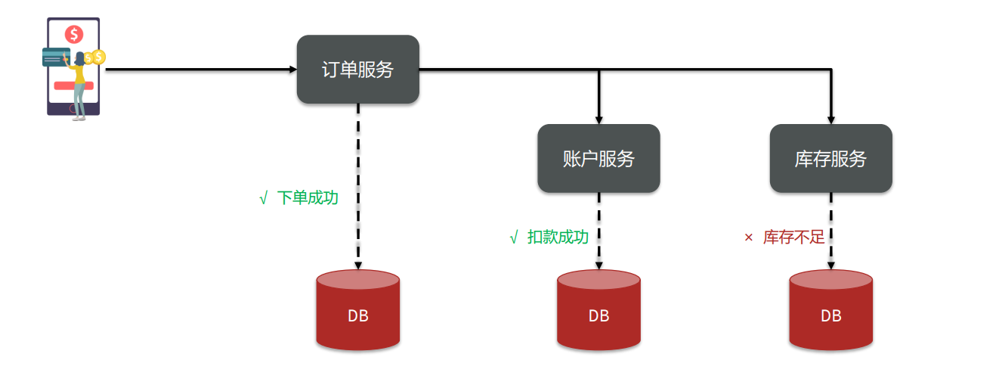


### 理论基础


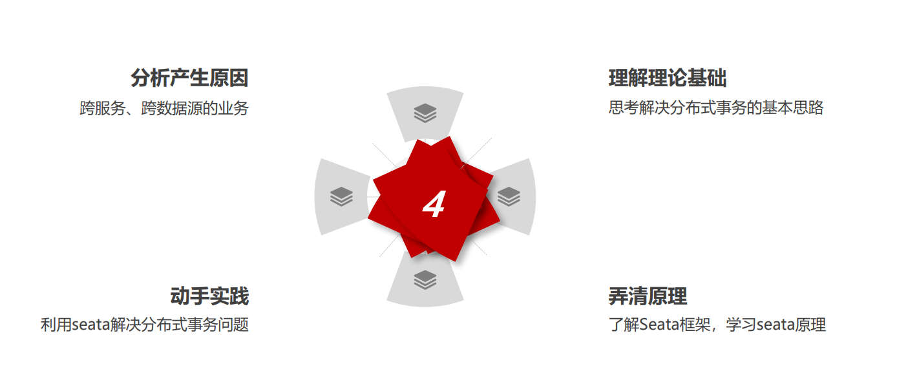


#### CAP定理

 1998年，加州大学的计算机科学家 Eric Brewer 提出，分布式系统有三个指标： 

- **Consistency（一致性）**

- **Availability（可用性）**

- **Partition tolerance （分区容错性）**


Eric Brewer 说，分布式系统无法同时满足这三个指标。 这个结论就叫做 CAP 定理。

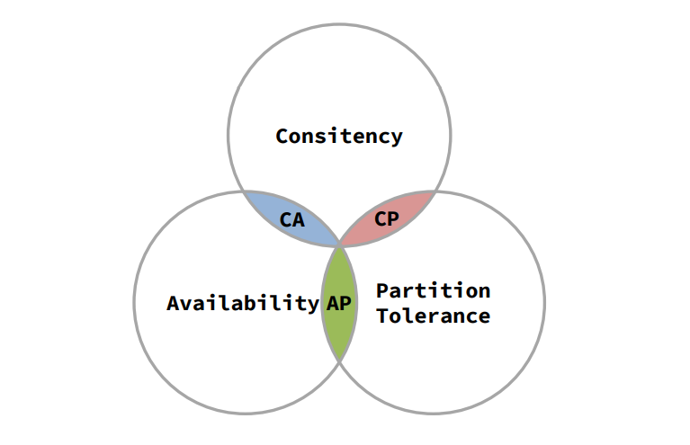


**Consistency（一致性）**


**Availability（可用性）**

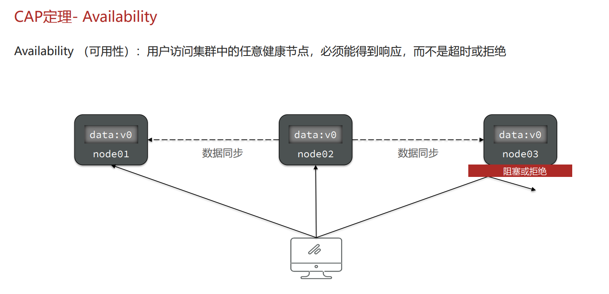


**Partition tolerance （分区容错性）**


简述CAP定理内容？ 

- **分布式系统节点通过网络连接，一定会出现分区问题（P）**
- 当分区出现时，系统的一致性（**C**）和可用性（**A**）就无法 同时满足 


思考：elasticsearch集群是CP还是AP？ 

- ES集群出现分区时，故障节点会被剔除集群，数据分片会 重新分配到其它节点，保证数据一致。
- 因此是低可用性，高一致性，属于CP


#### BASE理论 

BASE理论是对CAP的一种解决思路，包含三个思想： 

- BA[**基本可用**]：分布式系统在出现故障时，允许损失部分可用性，即保证核心可用。
- S [**软状态**]：在一定时间内，允许出现中间状态，比如临时的不一致状态。
- E [**最终一致性**]：虽然无法保证强一致性，但是在软状态结束后，最终达到数据一致。 


|          词           |     意     |
| :-------------------: | :--------: |
|  Basically Available  |  基本可用  |
|      Soft State       |   软状态   |
| Eventually Consistent | 最终一致性 |


而分布式事务最大的问题是各个子事务的一致性问题，因此可以借鉴CAP定理和BASE理论：

- **AP模式：**各子事务分别执行和提交，允许出现结果不一致，然后采用弥补措施恢复数据即可，**实现最终一致**。
- **CP模式：**各个子事务执行后互相等待，同时提交，同时回滚，达成**强一致**。但事务等待过程中，处于**弱可用状态**。


#### 分布式事务模型

解决分布式事务，各个子系统之间必须能感知到彼此的事务状态，才能保证状态一致，

因此需要一个事务协调者来协调每一个事务的参与者（子系统事务）。

这里的子系统事务，称为**分支事务**；有关联的各个分支事务在一起称为**全局事务**

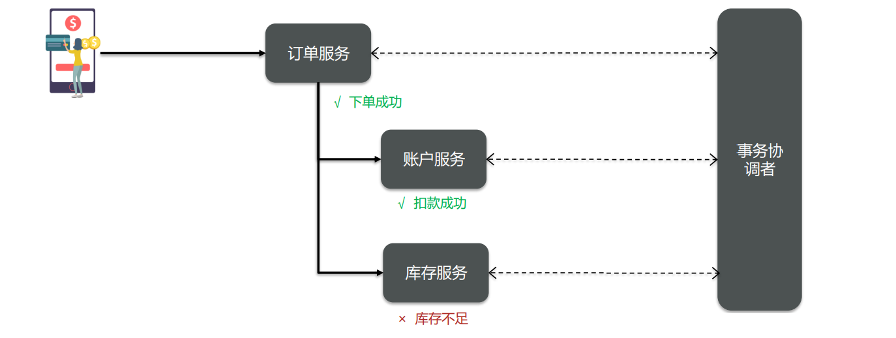


简述BASE理论三个思想： 

- **基本可用** • **软状态** • **最终一致**


解决分布式事务的思想和模型： 

- **全局事务**：整个分布式事务 
- **分支事务**：分布式事务中包含的每个子系统的事务 
- **最终一致思想**：各分支事务分别执行并提交，如果有不一致 的情况，再想办法恢复数据
- **强一致思想**：各分支事务执行完业务不要提交，等待彼此结 果。而后统一提交或回滚


### Seata框架


#### 🔖Seata介绍

Seata是2019年1月份蚂蚁金服和阿里巴巴共同开源的分布式事务解决方案。致力于提供高性能和简单易用的分布式 事务服务，为用户打造一站式的分布式解决方案。 

官网地址：http://seata.io/，其中的文档、播客中提供了大量的使用说明、源码分析。


#### 🔖Seata架构

Seata事务管理中有三个重要的角色：

- **TC - 事务协调者**：维护全局和分支事务的状态，协调全局事务提交或回滚。
- **TM - 事务管理器**：定义全局事务的范围、开始全局事务、提交或回滚全局事务。
- **RM - 资源管理器**：管理分支事务处理的资源，与TC交谈以注册分支事务和报告分支事务 的状态，并驱动分支事务提交或回滚


|           词            |   简   |       意       |
| :---------------------: | :----: | :------------: |
| Transaction Coordinator | **TC** | **事务协调者** |
|   Transaction Manager   | **TM** | **事务管理器** |
|    Resource Manager     | **RM** | **资源管理器** |


#### 🔖Seata部署


首先我们要下载`seata-server`包，地址在[http](http://seata.io/zh-cn/blog/download.html)[://seata.io/zh-cn/blog/download](http://seata.io/zh-cn/blog/download.html)[.](http://seata.io/zh-cn/blog/download.html)[html](http://seata.io/zh-cn/blog/download.html) 

在非中文目录解压缩这个`zip`包，其目录结构如下

修改conf目录下的`registry.conf`文件，新版本是`application.yaml`

`registry.conf`:

```yaml
registry {
  # tc服务的注册中心类，这里选择nacos，也可以是eureka、zookeeper等
  type = "nacos"

  nacos {
    # seata tc 服务注册到 nacos的服务名称，可以自定义
    application = "seata-tc-server"
    serverAddr = "127.0.0.1:8848"
    group = "DEFAULT_GROUP"
    namespace = ""
    cluster = "SH"
    username = "nacos"
    password = "nacos"
  }
}

config {
  # 读取tc服务端的配置文件的方式，这里是从nacos配置中心读取，这样如果tc是集群，可以共享配置
  type = "nacos"
  # 配置nacos地址等信息
  nacos {
    serverAddr = "127.0.0.1:8848"
    namespace = ""
    group = "SEATA_GROUP"
    username = "nacos"
    password = "nacos"
    dataId = "seataServer.properties"
  }
}
```

`application.yaml`

```yaml
seata:
  # 服务注册中心
  registry:
    # support: nacos 、 eureka 、 redis 、 zk  、 consul 、 etcd3 、 sofa
    type: nacos
    # preferred-networks: 30.240.*
    nacos:
      application: seata-tc-server
      server-addr: 127.0.0.1:8848
      group: "DEFAULT_GROUP"
      namespace: ""
      cluster: SH
      username: nacos
      password: nacos
      context-path:
      ##if use MSE Nacos with auth, mutex with username/password attribute
      #access-key:
      #secret-key:

  # 配置中心
  config:
    # support: nacos 、 consul 、 apollo 、 zk  、 etcd3
    type: nacos
    nacos:
      server-addr: 127.0.0.1:8848
      namespace: ""
      group: SEATA_GROUP
      username: nacos
      password: nacos
      context-path:
      ##if use MSE Nacos with auth, mutex with username/password attribute
      #access-key:
      #secret-key:
      data-id: seataServer.properties
  security:
    secretKey: SeataSecretKey0c382ef121d778043159209298fd40bf3850a017
    tokenValidityInMilliseconds: 1800000
    ignore:
      urls: /,/**/*.css,/**/*.js,/**/*.html,/**/*.map,/**/*.svg,/**/*.png,/**/*.ico,/console-fe/public/**,/api/v1/auth/login

```


在nacos添加配置

特别注意，为了让tc服务的集群可以共享配置，我们选择了nacos作为统一配置中心。因此服务端配置文件seataServer.properties文件需要在nacos中配好。

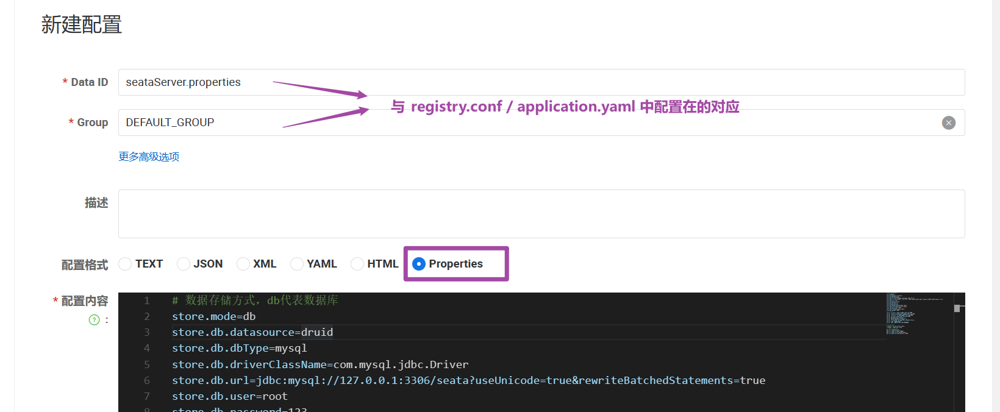


```properties
# 数据存储方式，db代表数据库
store.mode=db
store.db.datasource=druid
store.db.dbType=mysql
store.db.driverClassName=com.mysql.jdbc.Driver
store.db.url=jdbc:mysql://127.0.0.1:3306/seata?useUnicode=true&rewriteBatchedStatements=true
store.db.user=root
store.db.password=123
store.db.minConn=5
store.db.maxConn=30
store.db.globalTable=global_table
store.db.branchTable=branch_table
store.db.queryLimit=100
store.db.lockTable=lock_table
store.db.maxWait=5000
# 事务、日志等配置
server.recovery.committingRetryPeriod=1000
server.recovery.asynCommittingRetryPeriod=1000
server.recovery.rollbackingRetryPeriod=1000
server.recovery.timeoutRetryPeriod=1000
server.maxCommitRetryTimeout=-1
server.maxRollbackRetryTimeout=-1
server.rollbackRetryTimeoutUnlockEnable=false
server.undo.logSaveDays=7
server.undo.logDeletePeriod=86400000

# 客户端与服务端传输方式
transport.serialization=seata
transport.compressor=none
# 关闭metrics功能，提高性能
metrics.enabled=false
metrics.registryType=compact
metrics.exporterList=prometheus
metrics.exporterPrometheusPort=9898
```

其中的`数据库地址`、`用户名`、`密码`都需要修改成你自己的数据库信息。


**创建数据库表**

特别注意：tc服务在管理分布式事务时，需要记录事务相关数据到数据库中，你需要提前创建好这些表。

新建一个名为`seata的数据库`/`刚刚配置的库`

这些表主要记录`全局事务`、`分支事务`、`全局锁信息`：

```mysql
SET NAMES utf8mb4;
SET FOREIGN_KEY_CHECKS = 0;

-- ----------------------------
-- 分支事务表
-- ----------------------------
DROP TABLE IF EXISTS `branch_table`;
CREATE TABLE `branch_table`  (
  `branch_id` bigint(20) NOT NULL,
  `xid` varchar(128) CHARACTER SET utf8 COLLATE utf8_general_ci NOT NULL,
  `transaction_id` bigint(20) NULL DEFAULT NULL,
  `resource_group_id` varchar(32) CHARACTER SET utf8 COLLATE utf8_general_ci NULL DEFAULT NULL,
  `resource_id` varchar(256) CHARACTER SET utf8 COLLATE utf8_general_ci NULL DEFAULT NULL,
  `branch_type` varchar(8) CHARACTER SET utf8 COLLATE utf8_general_ci NULL DEFAULT NULL,
  `status` tinyint(4) NULL DEFAULT NULL,
  `client_id` varchar(64) CHARACTER SET utf8 COLLATE utf8_general_ci NULL DEFAULT NULL,
  `application_data` varchar(2000) CHARACTER SET utf8 COLLATE utf8_general_ci NULL DEFAULT NULL,
  `gmt_create` datetime(6) NULL DEFAULT NULL,
  `gmt_modified` datetime(6) NULL DEFAULT NULL,
  PRIMARY KEY (`branch_id`) USING BTREE,
  INDEX `idx_xid`(`xid`) USING BTREE
) ENGINE = InnoDB CHARACTER SET = utf8 COLLATE = utf8_general_ci ROW_FORMAT = Compact;

-- ----------------------------
-- 全局事务表
-- ----------------------------
DROP TABLE IF EXISTS `global_table`;
CREATE TABLE `global_table`  (
  `xid` varchar(128) CHARACTER SET utf8 COLLATE utf8_general_ci NOT NULL,
  `transaction_id` bigint(20) NULL DEFAULT NULL,
  `status` tinyint(4) NOT NULL,
  `application_id` varchar(32) CHARACTER SET utf8 COLLATE utf8_general_ci NULL DEFAULT NULL,
  `transaction_service_group` varchar(32) CHARACTER SET utf8 COLLATE utf8_general_ci NULL DEFAULT NULL,
  `transaction_name` varchar(128) CHARACTER SET utf8 COLLATE utf8_general_ci NULL DEFAULT NULL,
  `timeout` int(11) NULL DEFAULT NULL,
  `begin_time` bigint(20) NULL DEFAULT NULL,
  `application_data` varchar(2000) CHARACTER SET utf8 COLLATE utf8_general_ci NULL DEFAULT NULL,
  `gmt_create` datetime NULL DEFAULT NULL,
  `gmt_modified` datetime NULL DEFAULT NULL,
  PRIMARY KEY (`xid`) USING BTREE,
  INDEX `idx_gmt_modified_status`(`gmt_modified`, `status`) USING BTREE,
  INDEX `idx_transaction_id`(`transaction_id`) USING BTREE
) ENGINE = InnoDB CHARACTER SET = utf8 COLLATE = utf8_general_ci ROW_FORMAT = Compact;

SET FOREIGN_KEY_CHECKS = 1;
```


**启动TC服务**

进入bin目录，运行其中的seata-server.bat即可

启动成功后，seata-server应该已经注册到nacos注册中心了。

打开浏览器，访问nacos地址：http://localhost:8848，然后进入服务列表页面，可以看到seata-tc-server的信息：


#### 🔖Seata整合

**微服务集成seata**


引入依赖 `pom.xml`

```xml
<dependency>
    <groupId>com.alibaba.cloud</groupId>
    <artifactId>spring-cloud-starter-alibaba-seata</artifactId>
    <exclusions>
        <!--版本较低，1.3.0，因此排除-->
        <exclusion>
            <artifactId>seata-spring-boot-starter</artifactId>
            <groupId>io.seata</groupId>
        </exclusion>
    </exclusions>
</dependency>
<!--seata starter 采用1.4.2版本-->
<dependency>
    <groupId>io.seata</groupId>
    <artifactId>seata-spring-boot-starter</artifactId>
    <version>${seata.version}</version>
</dependency>
```

修改配置文件 `application.yaml`

```yaml
seata:
  registry: # TC服务注册中心的配置，微服务根据这些信息去注册中心获取tc服务地址
    # 参考tc服务自己的registry.conf中的配置
    type: nacos
    nacos: # tc
      server-addr: 127.0.0.1:8848
      namespace: ""
      group: DEFAULT_GROUP
      application: seata-tc-server # tc服务在nacos中的服务名称
      cluster: SH
  tx-service-group: seata-demo # 事务组，根据这个获取tc服务的cluster名称
  service:
    vgroup-mapping: # 事务组与TC服务cluster的映射关系
      seata-demo: SH
```

**注意：**

nacos服务名称组成包括`namespace`+`group`+`serviceName`+`cluster` 

seata客户端获取`tc的cluster`名称方式是以`tx-group-service`的值为`key到vgroupMapping`中查找

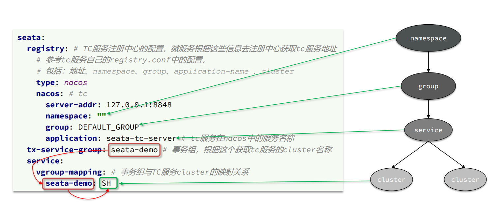


#### 🔢Seata模式⤵️


#### 1️⃣XA模式


**XA模式原理**

`XA规范`是 X/Open 组织定义的分布式事务处理（DTP，Distributed Transaction Processing）标准，`XA规范`描述了全局的 `TM`与局部的`RM`之间的接口，几乎所有主流的数据库都对`XA规范`提供了支持。


**成功**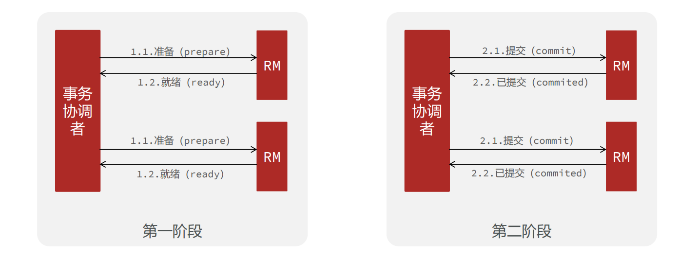

**失败**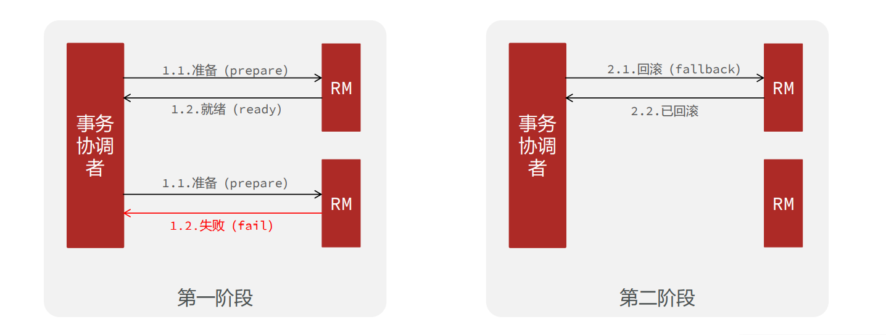

---


**seata的XA模式**

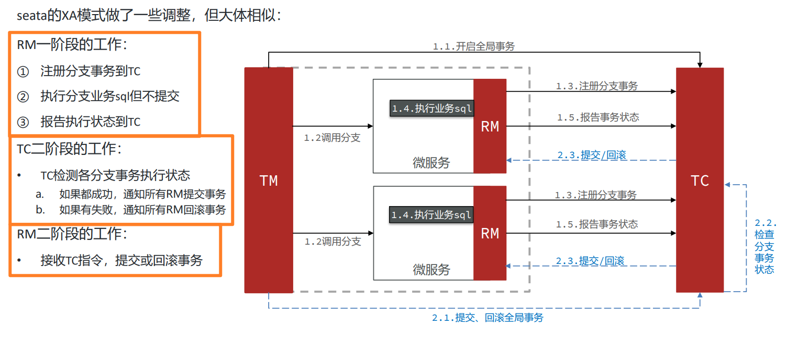

---

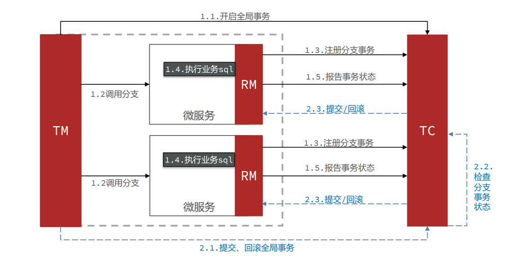

---


XA模式的优点

- 事务的强一致性，满足ACID原则。
- 常用数据库都支持，实现简单，并且没有代码侵入 

XA模式的缺点

- 因为一阶段需要锁定数据库资源，等待二阶段结束才释放，性能较差
- 依赖关系型数据库实现事务


**实现XA模式**

Seata的starter已经完成了XA模式的自动装配，实现非常简单，步骤如下：

1. 修改application.yml文件（每个参与事务的微服务），开启XA模式：

```yaml
seata:
  data-source-proxy-mode: XA # 开启数据源代理的XA模式
```

2. 给发起全局事务的入口方法添加`@GlobalTransactional`注解，本例中是OrderServiceImpl中的create方法：

```java
@Override
@GlobalTransactional
public Long create(Order order) {
	// 创建订单
	orderMapper.insert(order);
	// 扣余额 ...略
	// 扣减库存 ...略
	return order.getId();
}
```

3. 重启服务并测试


---


#### 2️⃣AT模式

**AT模式原理**

AT模式同样是分阶段提交的事务模型，不过缺弥补了XA模型中资源锁定周期过长的缺陷。

**阶段一RM的工作**：

1. 注册分支事务
2. 记录undo-log（数据快照）
3. 执行业务sql并提交
4. 报告事务状态 

**阶段二提交时RM的工作**：

- 删除undo-log即可 

**阶段二回滚时RM的工作**：

- 根据undo-log恢复数据到更新前

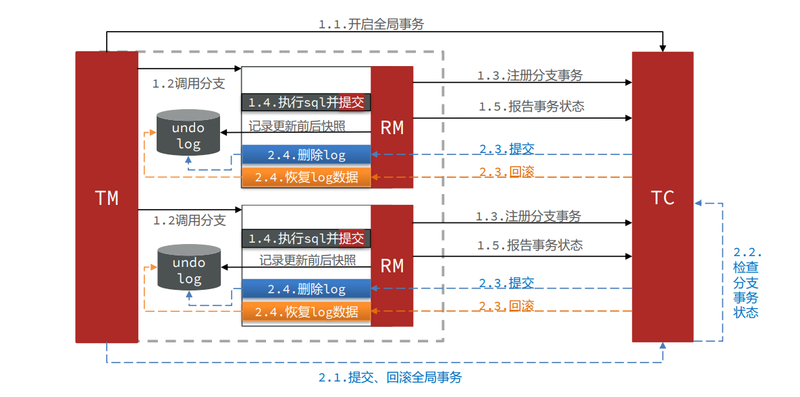

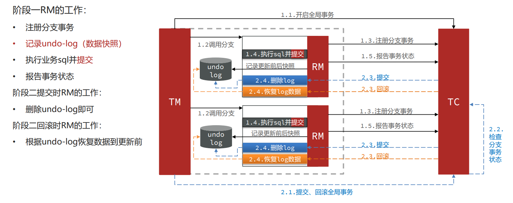

例如，一个分支业务的SQL是这样的：update tb_account set money = money - 10 where id = 1

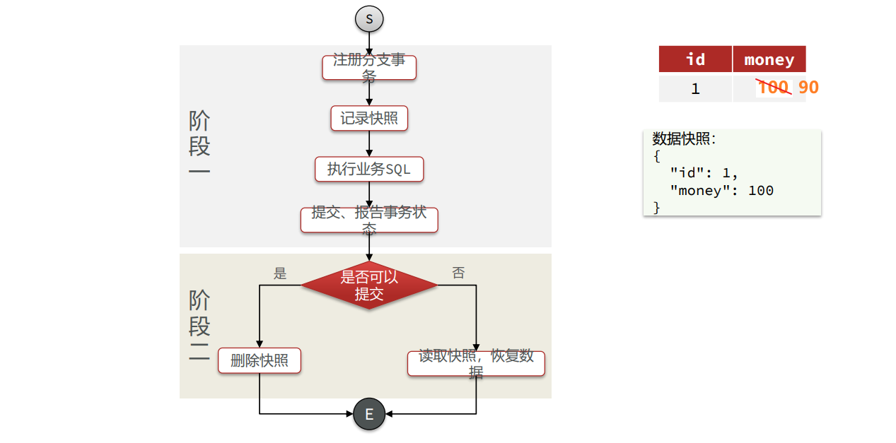

AT模式与XA模式最大的区别

- XA模式一阶段不提交事务，锁定资源；AT模式一阶段直接 提交，不锁定资源。
- XA模式依赖数据库机制实现回滚；AT模式利用数据快照实 现数据回滚
- XA模式强一致；AT模式最终一致


**出现脏写问题**

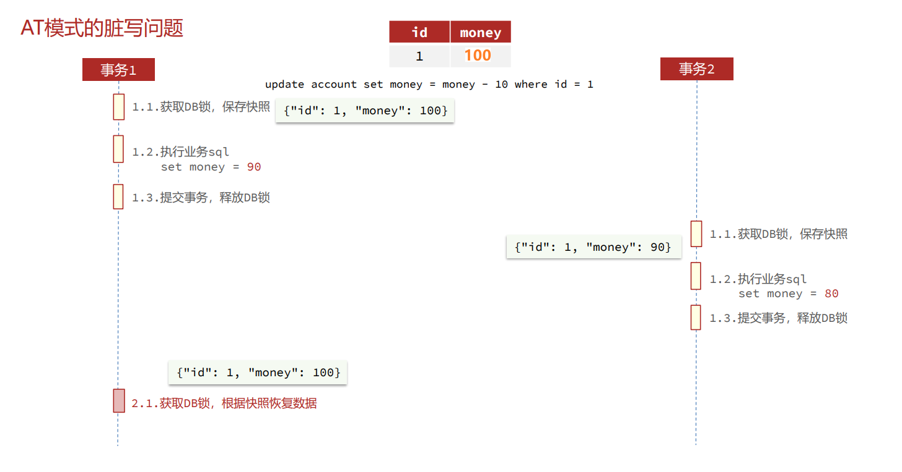

**解决脏写问题**

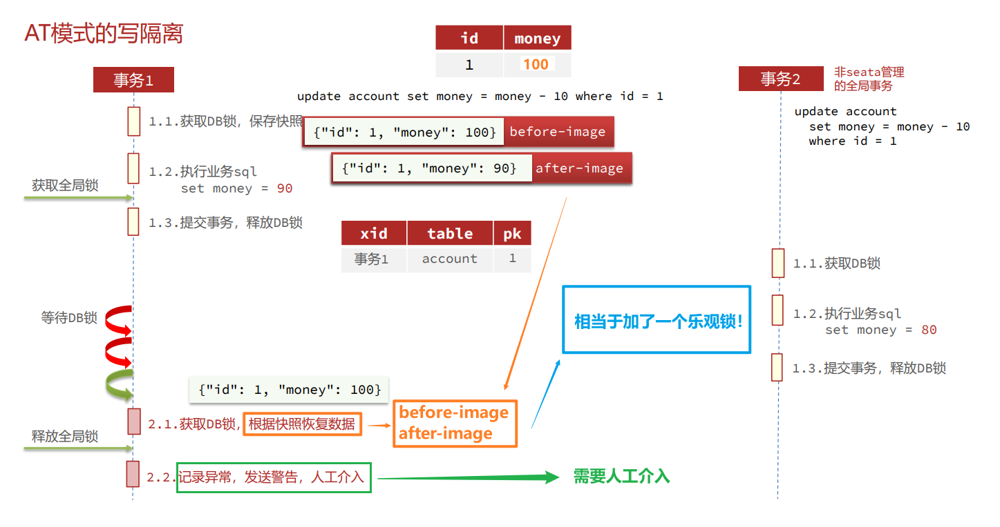


AT模式的优点：

- 一阶段完成直接提交事务，释放数据库资源，性能比较好 

- 利用全局锁实现读写隔离 
- 没有代码侵入，框架自动完成回滚和提交 

AT模式的缺点：

- 两阶段之间属于软状态，属于最终一致
- 框架的快照功能会影响性能，但比XA模式要好很多


**实现AT模式**

AT模式中的快照生成、回滚等动作都是由框架自动完成，没有任何代码侵入，因此实现非常简单。

由于需要生成快照信息，AT模式需要两张数据库表``undo_log`和`lock_table`

`lock_table`导入到`TC服务`关联的数据库

`undo_log`表导入到`微服务`关联的数据库

```sql
SET NAMES utf8mb4;
SET FOREIGN_KEY_CHECKS = 0;

-- ----------------------------
-- Table structure for undo_log
-- ----------------------------
DROP TABLE IF EXISTS `undo_log`;
CREATE TABLE `undo_log`  (
  `branch_id` bigint(20) NOT NULL COMMENT 'branch transaction id',
  `xid` varchar(100) CHARACTER SET utf8 COLLATE utf8_general_ci NOT NULL COMMENT 'global transaction id',
  `context` varchar(128) CHARACTER SET utf8 COLLATE utf8_general_ci NOT NULL COMMENT 'undo_log context,such as serialization',
  `rollback_info` longblob NOT NULL COMMENT 'rollback info',
  `log_status` int(11) NOT NULL COMMENT '0:normal status,1:defense status',
  `log_created` datetime(6) NOT NULL COMMENT 'create datetime',
  `log_modified` datetime(6) NOT NULL COMMENT 'modify datetime',
  UNIQUE INDEX `ux_undo_log`(`xid`, `branch_id`) USING BTREE
) ENGINE = InnoDB CHARACTER SET = utf8 COLLATE = utf8_general_ci COMMENT = 'AT transaction mode undo table' ROW_FORMAT = Compact;


-- ----------------------------
-- Table structure for lock_table
-- ----------------------------
DROP TABLE IF EXISTS `lock_table`;
CREATE TABLE `lock_table`  (
  `row_key` varchar(128) CHARACTER SET utf8 COLLATE utf8_general_ci NOT NULL,
  `xid` varchar(96) CHARACTER SET utf8 COLLATE utf8_general_ci NULL DEFAULT NULL,
  `transaction_id` bigint(20) NULL DEFAULT NULL,
  `branch_id` bigint(20) NOT NULL,
  `resource_id` varchar(256) CHARACTER SET utf8 COLLATE utf8_general_ci NULL DEFAULT NULL,
  `table_name` varchar(32) CHARACTER SET utf8 COLLATE utf8_general_ci NULL DEFAULT NULL,
  `pk` varchar(36) CHARACTER SET utf8 COLLATE utf8_general_ci NULL DEFAULT NULL,
  `gmt_create` datetime NULL DEFAULT NULL,
  `gmt_modified` datetime NULL DEFAULT NULL,
  PRIMARY KEY (`row_key`) USING BTREE,
  INDEX `idx_branch_id`(`branch_id`) USING BTREE
) ENGINE = InnoDB CHARACTER SET = utf8 COLLATE = utf8_general_ci ROW_FORMAT = Compact;


SET FOREIGN_KEY_CHECKS = 1;
```


修改application.yml文件，将事务模式修改为AT模式即可： 

```yaml
 seata: 
   data-source-proxy-mode: AT # 开启数据源代理的AT模式
```


重启服务并测试


---


#### 3️⃣TCC模式


TCC模式与AT模式非常相似，每阶段都是独立事务，不同的是TCC通过人工编码来实现数据恢复。

需要实现三个方法 ：

- Try：资源的检测和预留
- Confirm：完成资源操作业务；要求 Try 成功 Confirm 一定要能成功。
- Cancel：预留资源释放，可以理解为try的反向操作。


例如：

---

**阶段一（ Try ）**：检查余额是否充足，如果充足则冻结金额增加30元，可用余额扣除30

初识余额：


余额充足，可以冻结：


此时，总金额 = 冻结金额 + 可用金额，数量依然是100不变。事务直接提交无需等待其它事务。

---


**阶段二（Confirm)**：假如要提交（Confirm），则冻结金额扣减30

确认可以提交，不过之前可用金额已经扣减过了，这里只要清除冻结金额就好了：


此时，总金额 = 冻结金额 + 可用金额 = 0 + 70  = 70元

---


**阶段二(Canncel)**：如果要回滚（Cancel），则冻结金额扣减30，可用余额增加30

需要回滚，那么就要释放冻结金额，恢复可用金额：


---

---


**TCC的工作模型图：**

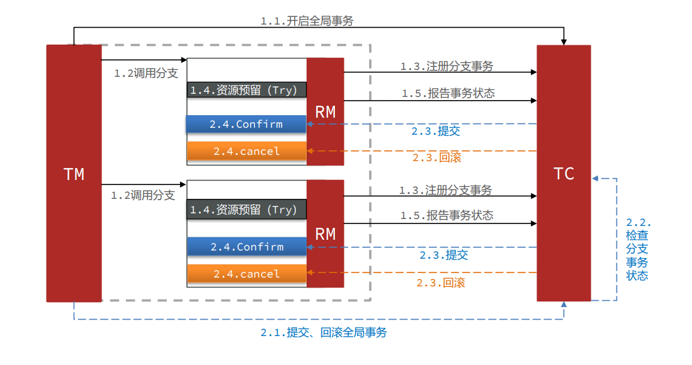

TCC模式的每个阶段

- Try：资源检查和预留
- Confirm：业务执行和提交
- Cancel：预留资源的释放 

TCC的优点

- 一阶段完成直接提交事务，释放数据库资源，性能好
- 相比AT模型，无需生成快照，无需使用全局锁，性能最强
- 不依赖数据库事务，而是依赖补偿操作，可以用于非事务型数据库 

TCC的缺点

- 有代码侵入，需要人为编写try、Confirm和Cancel接口，太麻烦
- 软状态，事务是最终一致
- 需要考虑Confirm和Cancel的失败情况，做好幂等处理
- 业余局限


---


**利用TCC实现分布式事务**

需求如下： 

- 修改account-service，编写try、confirm、cancel逻辑
- try业务：添加冻结金额，扣减可用金额
- confirm业务：删除冻结金额
- cancel业务：删除冻结金额，恢复可用金额
- 保证confirm、cancel接口的幂等性
- 允许空回滚
- 拒绝业务悬挂


TCC的空回滚和业务悬挂


`空回滚`：当某分支事务的try阶段阻塞时，可能导致全局事务超时而触发二阶段的cancel操作。在未执行try操作时先执行了 cancel操作，这时cancel不能做回滚，就是空回滚。

`业务悬挂`：对于已经空回滚的业务，如果以 后继续执行try，就永远不可能 confirm或cancel，这就是业务 悬挂。应当阻止执行空回滚后的 try操作，避免悬挂

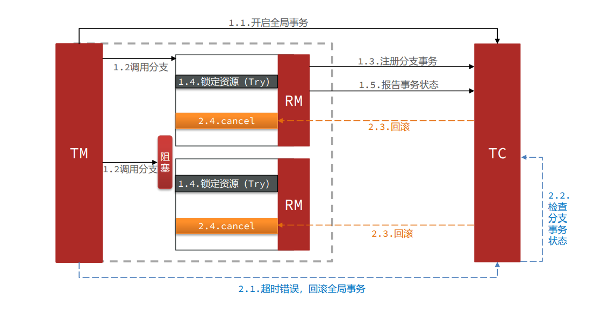

---


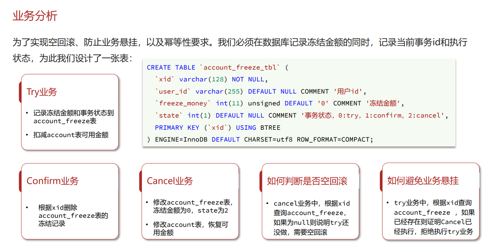

```mysql
CREATE TABLE `account_freeze_tbl` (
	`xid` varchar(128) NOT NULL,
	`user_id` varchar(255) DEFAULT NULL COMMENT '用户id',
	`freeze_money` int(11) unsigned DEFAULT '0' COMMENT '冻结金额',
	`state` int(1) DEFAULT NULL COMMENT '事务状态，0:try，1:confirm，2:cancel',
    PRIMARY KEY (`xid`) USING BTREE
) ENGINE=InnoDB DEFAULT CHARSET=utf8 ROW_FORMAT=COMPACT;
```


**声明TCC接口**

TCC的Try、Confirm、Cancel方法都需要在接口中基于注解来声明，语法如下：

在account-service项目中的`com.ganga.account.service`包中新建一个接口，声明TCC三个接口：

```java
package com.ganga.account.service;

import io.seata.rm.tcc.api.BusinessActionContext;
import io.seata.rm.tcc.api.BusinessActionContextParameter;
import io.seata.rm.tcc.api.LocalTCC;
import io.seata.rm.tcc.api.TwoPhaseBusinessAction;

@LocalTCC
public interface AccountTCCService {

    @TwoPhaseBusinessAction(name = "deduct", commitMethod = "confirm", rollbackMethod = "cancel")
    void deduct(@BusinessActionContextParameter(paramName = "userId") String userId,
                @BusinessActionContextParameter(paramName = "money")int money);

    boolean confirm(BusinessActionContext ctx);

    boolean cancel(BusinessActionContext ctx);
}
```


编写实现类

在account-service服务中的`com.ganga.account.service.impl`包下新建一个类，实现TCC业务：

```java
@Service
@Slf4j
public class AccountTCCServiceImpl implements AccountTCCService {

    @Autowired
    private AccountMapper accountMapper;
    @Autowired
    private AccountFreezeMapper freezeMapper;

    @Override
    @Transactional
    public void deduct(String userId, int money) {
        // 0.获取事务id
        String xid = RootContext.getXID();
        // 1.扣减可用余额
        accountMapper.deduct(userId, money);
        // 2.记录冻结金额，事务状态
        AccountFreeze freeze = new AccountFreeze();
        freeze.setUserId(userId);
        freeze.setFreezeMoney(money);
        freeze.setState(AccountFreeze.State.TRY);
        freeze.setXid(xid);
        freezeMapper.insert(freeze);
    }

    @Override
    public boolean confirm(BusinessActionContext ctx) {
        // 1.获取事务id
        String xid = ctx.getXid();
        // 2.根据id删除冻结记录
        int count = freezeMapper.deleteById(xid);
        return count == 1;
    }

    @Override
    public boolean cancel(BusinessActionContext ctx) {
        // 0.查询冻结记录
        String xid = ctx.getXid();
        AccountFreeze freeze = freezeMapper.selectById(xid);

        // 1.恢复可用余额
        accountMapper.refund(freeze.getUserId(), freeze.getFreezeMoney());
        // 2.将冻结金额清零，状态改为CANCEL
        freeze.setFreezeMoney(0);
        freeze.setState(AccountFreeze.State.CANCEL);
        int count = freezeMapper.updateById(freeze);
        return count == 1;
    }
}
```


---


#### 4️⃣SAGA模式

Saga 模式是 Seata 即将开源的长事务解决方案，将由蚂蚁金服主要贡献。

其理论基础是 `Hector` & `Kenneth`在1987年发表的论文[Sagas](https://microservices.io/patterns/data/saga.html)。

Seata官网对于Saga的指南：https://seata.io/zh-cn/docs/user/saga.html


**原理**

在`Saga模式`下，分布式事务内有多个参与者，每一个参与者都是一个冲正补偿服务，需要用户根据业务场景实现其正向操作和逆向回滚操作。

分布式事务执行过程中，依次执行各参与者的正向操作，如果所有正向操作均执行成功，那么分布式事务提交。如果任何一个正向操作执行失败，那么分布式事务会去退回去执行前面各参与者的逆向回滚操作，回滚已提交的参与者，使分布式事务回到初始状态。

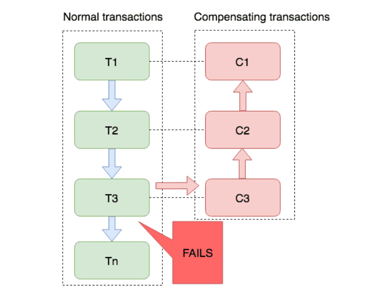

Saga模式是SEATA提供的长事务解决方案。也分为两个阶段：

- 一阶段：直接提交本地事务
- 二阶段：成功则什么都不做；失败则通过编写补偿业务来回滚


Saga模式优点：

- 事务参与者可以基于事件驱动实现异步调用，吞吐高
- 一阶段直接提交事务，无锁，性能好
- 不用编写TCC中的三个阶段，实现简单 

Saga模式缺点：

- 软状态持续时间不确定，时效性差
- 没有锁，没有事务隔离，会有脏写


#### 🆚四种模式对比

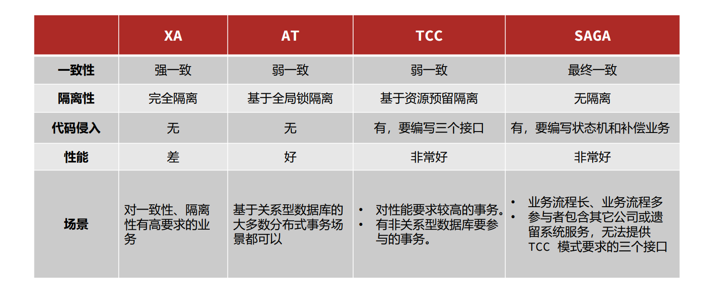


#### 🆘Seata高可用


 

**TC的异地多机房容灾架构**

TC服务作为Seata的核心服务，一定要保证高可用和异地容灾。

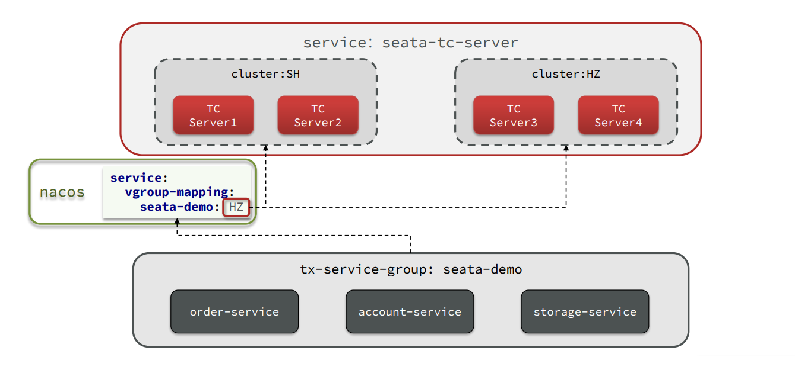


---


**1️⃣模拟异地容灾的TC集群**


计划启动两台seata的tc服务节点：

| 节点名称 | ip地址    | 端口号 | 集群名称 |
| -------- | --------- | ------ | -------- |
| seata    | 127.0.0.1 | 8091   | SH       |
| seata2   | 127.0.0.1 | 8092   | HZ       |

之前我们已经启动了一台seata服务，端口是8091，集群名为SH。

现在，将seata目录复制一份，起名为seata2

修改`seata2/conf/registry.conf`或`seata2/conf/application.yaml`内容如下：

```yaml
registry {
  # tc服务的注册中心类，这里选择nacos，也可以是eureka、zookeeper等
  type = "nacos"

  nacos {
    # seata tc 服务注册到 nacos的服务名称，可以自定义
    application = "seata-tc-server"
    serverAddr = "127.0.0.1:8848"
    group = "DEFAULT_GROUP"
    namespace = ""
    cluster = "HZ"
    username = "nacos"
    password = "nacos"
  }
}

config {
  # 读取tc服务端的配置文件的方式，这里是从nacos配置中心读取，这样如果tc是集群，可以共享配置
  type = "nacos"
  # 配置nacos地址等信息
  nacos {
    serverAddr = "127.0.0.1:8848"
    namespace = ""
    group = "SEATA_GROUP"
    username = "nacos"
    password = "nacos"
    dataId = "seataServer.properties"
  }
}
```


进入seata2/bin目录，然后运行命令：

```powershell
seata-server.bat -p 8092
```

打开nacos控制台，查看服务列表：


点进详情查看：


**2️⃣将事务组映射配置到nacos**

接下来，我们需要将tx-service-group与cluster的映射关系都配置到nacos配置中心。

新建一个配置：


配置的内容如下：

```properties
# 事务组映射关系
service.vgroupMapping.seata-demo=SH

service.enableDegrade=false
service.disableGlobalTransaction=false
# 与TC服务的通信配置
transport.type=TCP
transport.server=NIO
transport.heartbeat=true
transport.enableClientBatchSendRequest=false
transport.threadFactory.bossThreadPrefix=NettyBoss
transport.threadFactory.workerThreadPrefix=NettyServerNIOWorker
transport.threadFactory.serverExecutorThreadPrefix=NettyServerBizHandler
transport.threadFactory.shareBossWorker=false
transport.threadFactory.clientSelectorThreadPrefix=NettyClientSelector
transport.threadFactory.clientSelectorThreadSize=1
transport.threadFactory.clientWorkerThreadPrefix=NettyClientWorkerThread
transport.threadFactory.bossThreadSize=1
transport.threadFactory.workerThreadSize=default
transport.shutdown.wait=3
# RM配置
client.rm.asyncCommitBufferLimit=10000
client.rm.lock.retryInterval=10
client.rm.lock.retryTimes=30
client.rm.lock.retryPolicyBranchRollbackOnConflict=true
client.rm.reportRetryCount=5
client.rm.tableMetaCheckEnable=false
client.rm.tableMetaCheckerInterval=60000
client.rm.sqlParserType=druid
client.rm.reportSuccessEnable=false
client.rm.sagaBranchRegisterEnable=false
# TM配置
client.tm.commitRetryCount=5
client.tm.rollbackRetryCount=5
client.tm.defaultGlobalTransactionTimeout=60000
client.tm.degradeCheck=false
client.tm.degradeCheckAllowTimes=10
client.tm.degradeCheckPeriod=2000

# undo日志配置
client.undo.dataValidation=true
client.undo.logSerialization=jackson
client.undo.onlyCareUpdateColumns=true
client.undo.logTable=undo_log
client.undo.compress.enable=true
client.undo.compress.type=zip
client.undo.compress.threshold=64k
client.log.exceptionRate=100
```


**3️⃣微服务读取nacos配置**

接下来，需要修改每一个微服务的application.yml文件，让微服务读取nacos中的client.properties文件：

```yaml
seata:
  config:
    type: nacos
    nacos:
      server-addr: 127.0.0.1:8848
      username: nacos
      password: nacos
      group: SEATA_GROUP
      data-id: client.properties
```


**3️⃣重启微服务**，现在微服务到底是连接tc的SH集群，还是tc的HZ集群，都统一由nacos的client.properties来决定了。


